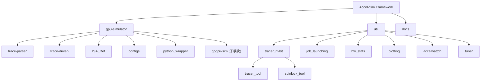

# Accel-Sim Framework

## 变更记录 (Changelog)

| 日期 | 变更内容 |
|------|----------|
| 2026-04-03 | 初始生成：项目文档体系建立，覆盖根级与 5 个模块 |

---

## 项目愿景

Accel-Sim 是一个可扩展的 GPU 架构模拟框架，用于 NVIDIA GPU 性能建模与微架构研究。该项目由 Purdue University 与 UBC 等高校联合开发，发表于 ISCA 2020。框架支持从 Kepler (SM3.x) 到 Ampere (SM8.x) 的多代 NVIDIA GPU 架构，通过 SASS 指令级追踪驱动仿真实现高保真的性能预测。

框架还集成了 AccelWattch 功耗建模工具（MICRO 2021），提供周期级的功耗估算能力。

**核心论文引用**：
- Accel-Sim (ISCA 2020): Mahmoud Khairy et al.
- AccelWattch (MICRO 2021): Vijay Kandiah et al.

---

## 架构总览

Accel-Sim 采用"追踪-仿真-分析"三段式流水线架构：

1. **追踪阶段** -- 使用 NVBit 工具在真实 GPU 上捕获 CUDA 应用的 SASS 指令流
2. **仿真阶段** -- 通过 trace-driven 前端将指令追踪馈入 GPGPU-Sim 4.0 性能模型
3. **分析阶段** -- 与硬件性能计数器进行关联比对，生成相关性报告

---

## 模块结构图 (Mermaid)



---

## 模块索引

| 模块路径 | 语言 | 职责 |
|----------|------|------|
| [gpu-simulator](./gpu-simulator/CLAUDE.md) | C++17 | 核心仿真引擎，包含 trace-driven 前端、trace-parser、ISA 定义和 GPGPU-Sim 4.0 性能模型集成 |
| [util/tracer_nvbit](./util/tracer_nvbit/CLAUDE.md) | CUDA/C++ | NVBit 追踪工具，用于在真实 GPU 上生成 SASS 指令追踪 |
| [util/job_launching](./util/job_launching/CLAUDE.md) | Python | 仿真任务调度与管理框架（启动、监控、统计收集） |
| [util/plotting](./util/plotting/CLAUDE.md) | Python | 关联性分析与可视化，生成仿真-硬件对比图表 |
| [util/tuner](./util/tuner/CLAUDE.md) | Python/C++ | 自动化配置调优工具，通过微基准测试生成匹配硬件的配置文件 |
| util/hw_stats | Python/Shell | 硬件性能统计采集（nvprof/nsight 封装） |
| util/accelwattch | Python/Shell | AccelWattch 功耗建模的辅助脚本与硬件功耗验证工具 |

---

## 运行与开发

### 环境依赖

- Linux 发行版（推荐 Ubuntu 24.04）
- CUDA Toolkit（推荐 12.8+）
- 构建工具：`build-essential`, `bison`, `flex`, `zlib1g-dev`, `libboost-all-dev`, `libxml2-dev`
- Python 3 + `pyyaml`, `plotly`, `psutil`
- Docker（可选，提供预配置镜像 `ghcr.io/accel-sim/accel-sim-framework:ubuntu-24.04-cuda-12.8`）

### 快速开始

```bash
# 1. 环境初始化（会自动拉取 gpgpu-sim 子模块）
export CUDA_INSTALL_PATH=/usr/local/cuda
source ./gpu-simulator/setup_environment.sh

# 2. 构建仿真器
make -j -C ./gpu-simulator/
# 或使用 CMake
cmake -S ./gpu-simulator/ -B ./gpu-simulator/build
cmake --build ./gpu-simulator/build -j8

# 3. 获取预录追踪
./get-accel-sim-traces.py

# 4. 运行仿真
./util/job_launching/run_simulations.py -B rodinia_2.0-ft -C QV100-SASS \
    -T ./hw_run/traces/device-0/<cuda-version>/ -N myTest

# 5. 监控与收集统计
./util/job_launching/monitor_func_test.py -v -N myTest
./util/job_launching/get_stats.py -N myTest | tee stats.csv
```

### Docker 快速测试

```bash
docker run -v `pwd`:/accel-sim:rw \
    ghcr.io/accel-sim/accel-sim-framework:ubuntu-24.04-cuda-12.8 \
    /bin/bash short-tests.sh
```

### 构建系统

- 支持 **Make** 和 **CMake** 两种构建方式
- 环境变量 `ACCELSIM_CONFIG` 控制 debug/release 构建（默认 release）
- C++ 标准：C++17
- 产出可执行文件：`gpu-simulator/bin/<config>/accel-sim.out`
- Python 绑定：通过 pybind11 生成 `accel_sim` Python 模块

---

## 测试策略

- **CI 流水线**（GitHub Actions）包含 5 个作业：
  1. `check-format` -- clang-format 代码格式检查
  2. `SASS-Simulation` -- SASS 追踪驱动仿真回归测试（QV100 + A100 配置）
  3. `PTX-Simulation` -- PTX 执行驱动仿真回归测试
  4. `Tracer-Tool` -- 追踪工具端到端测试（生成追踪 -> 运行仿真 -> 验证结果）
  5. `SASS-Simulation-Docker` -- Docker 容器内的仿真测试
- 功能测试基准集：`rodinia_2.0-ft`（轻量级，用于快速验证）
- 性能验证：`GPU_Microbenchmark` 微基准测试 + 硬件关联分析
- 快速本地测试：`./short-tests.sh`

---

## 编码规范

- C++ 代码使用 clang-format 格式化（配置文件：`gpu-simulator/.clang-format`）
- 格式化命令：`./gpu-simulator/format-code.sh`
- Tracer 工具格式化：`./util/tracer_nvbit/tracer_tool/format-code.sh`
- Python 脚本无统一格式化工具要求
- Git 主分支：`dev`

---

## AI 使用指引

- **项目结构**：`gpu-simulator/` 是核心 C++ 仿真引擎，`util/` 包含所有 Python/Shell 辅助工具
- **gpgpu-sim 子模块**：`gpu-simulator/gpgpu-sim/` 是一个独立的 git 仓库（gpgpu-sim_distribution），通过 `setup_environment.sh` 自动拉取
- **extern 依赖**：`gpu-simulator/extern/pybind11/` 用于 Python 绑定，自动拉取
- **配置体系**：GPU 配置在 `gpu-simulator/gpgpu-sim/configs/tested-cfgs/` 和 `gpu-simulator/configs/tested-cfgs/`；配置组合定义在 `util/job_launching/configs/define-standard-cfgs.yml`
- **应用定义**：基准测试应用在 `util/job_launching/apps/define-all-apps.yml`
- **ISA 扩展**：添加新 GPU 架构需要在 `gpu-simulator/ISA_Def/` 中新增 opcode 文件
- **支持的架构**：Kepler (SM3.x), Pascal (SM6.x), Volta (SM7.0), Turing (SM7.5), Ampere (SM8.x)
- **数据目录**：`hw_run/` 包含硬件追踪数据和运行结果（体积大，已在 .gitignore 中）；`sim_run_*/` 是仿真运行输出目录
