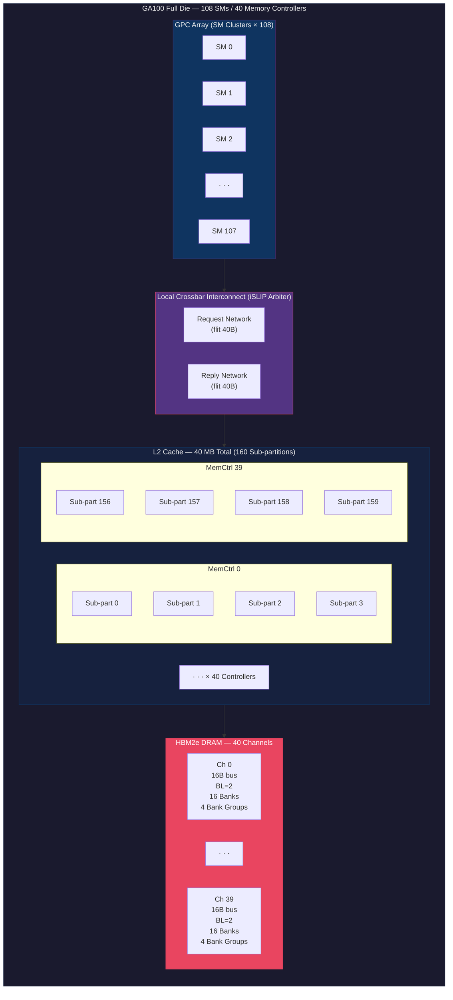
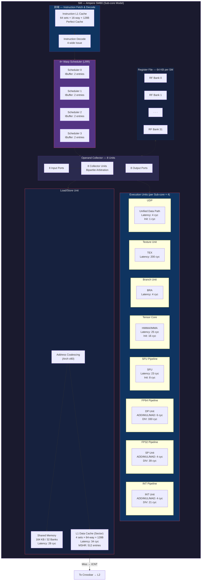
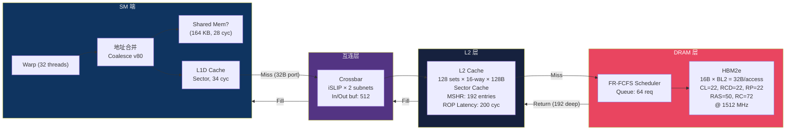
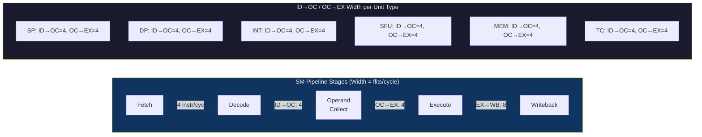
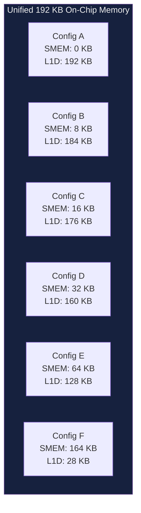
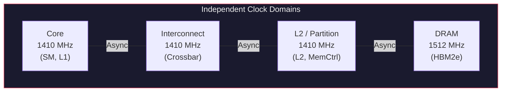
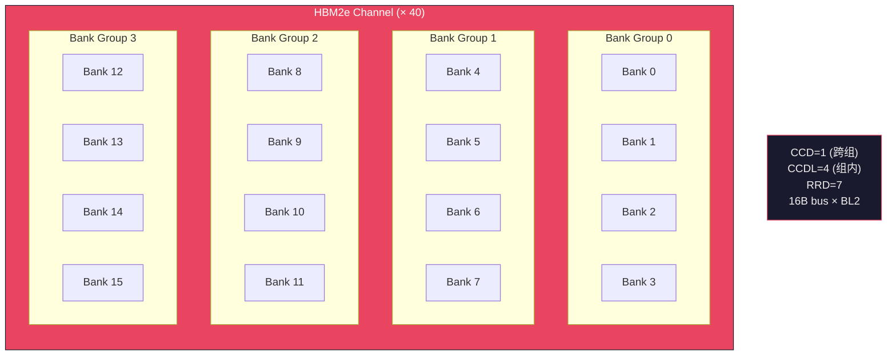

# NVIDIA A100 (GA100) — GPGPU-Sim 4.0 仿真架构图

> 基于 `SM80_A100` 配置文件中的实际参数绘制，反映 GPGPU-Sim 4.0 trace-driven 模式下的建模粒度。

---

## 1. 芯片全局拓扑

---

## 2. SM (Streaming Multiprocessor) 内部微架构

---

## 3. 内存层次与数据通路

---

## 4. SM 流水线阶段与带宽

---

## 5. 自适应 L1/Shared Memory 分配

---

## 6. 时钟域

---

## 7. DRAM Bank 组织

---

## 参数速查表

| 参数 | 值 |
|------|-----|
| Compute Capability | 8.0 (Ampere) |
| SM 数量 | 108 |
| Warp Scheduler / SM | 4 (LRR) |
| 最大并发 Kernel | 128 |
| Register File / SM | 64 KB (32 banks) |
| Shared Memory / SM | 最大 164 KB (32 banks, 28 cyc) |
| L1D Cache / SM | Sector, 最大 192 KB, 34 cyc |
| L2 Cache 总量 | 40 MB (160 sub-partitions) |
| 内存控制器 | 40 × FR-FCFS |
| HBM2e 通道 | 40 (16B bus, BL=2, 16 banks/ch) |
| 互连 | Full Crossbar, iSLIP, 2 subnets |
| Core / ICNT / L2 时钟 | 1410 MHz |
| DRAM 时钟 | 1512 MHz |
| Tensor Core / SM | 4 units (latency 25 cyc) |
| FP32 Units / SM | 4 |
| FP64 Units / SM | 4 |
| INT Units / SM | 4 |
| SFU Units / SM | 4 |
