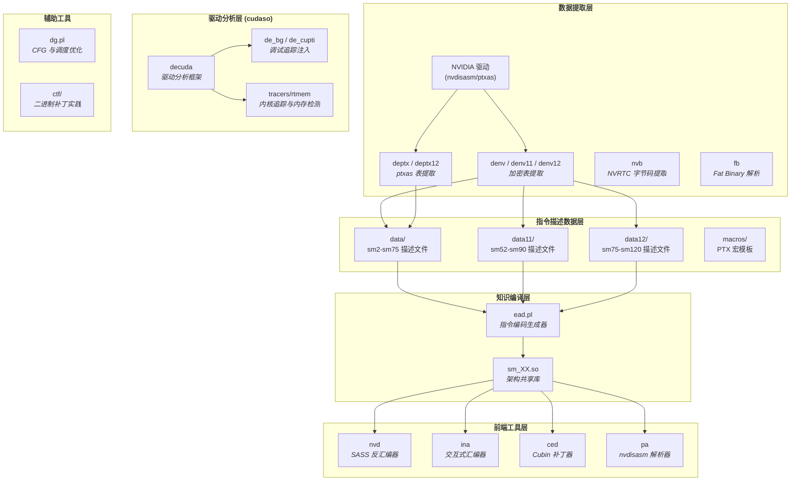

**denvdis** 是一套面向 NVIDIA GPU **SASS**（Streaming Assembly）指令集的逆向工程工具集，其核心使命是从 NVIDIA 闭源驱动中提取加密的指令描述表，解析 SASS 指令编码，并构建完整的反汇编、汇编与二进制补丁能力。项目覆盖了从 Fermi（sm_20）到 Blackwell（sm_120）共二十余种 GPU 微架构，是目前公开领域中对 NVIDIA SASS 指令编码最深入的分析实现之一。整个工具链采用 C++20 与 Perl 混合架构，以共享库（`sm_XX.so`）作为指令编码知识的载体，实现了数据提取与指令解码的完全解耦。
Sources: [README.md](README.md#L1-L46), [sm_version.txt](sm_version.txt#L1-L28)

## 项目架构全景

工具集的设计遵循一条清晰的**数据流水线**：从驱动二进制中提取加密描述表 → 解密为文本格式 → 由生成器编译为架构共享库 → 供前端工具（反汇编器、汇编器、补丁器）动态加载使用。下方 Mermaid 图展示了这一端到端架构：

Sources: [Makefile](Makefile#L1-L29), [test/Makefile](test/Makefile#L1-L162)

## 核心工具速览

项目的前端工具集中在 `test/` 目录下，它们共享同一套由 `libced.a` 静态库提供的基础设施（ELF 解析、SASS 渲染、BF16 支持等），并动态加载架构共享库来获取指令编码知识：

| 工具 | 功能定位 | 核心能力 | 关键选项 |
|------|----------|----------|----------|
| **nvd** | SASS 反汇编器 | ELF/CUBIN 解析、指令解码、字段展示 | `-O` 编码字段、`-S` 调度表、`-p` 谓词、`-T` 寄存器追踪、`-c` nvdisasm 兼容 |
| **ina** | 交互式 SASS 汇编器 | 指令编码、表单过滤、二进制输出 | 支持 readline 自动补全、`-o` 保存二进制 |
| **ced** | 类 sed 的 Cubin 补丁器 | 内联指令替换、偏移寻址、函数定位 | 支持 `s`(替换)、`S`(交换)、`f`(函数跳转) |
| **pa** | nvdisasm 输出解析器 | SASS 文本解析、编码验证 | 支持"Strange Loop"往返验证、`-V` 指令验证 |

所有工具默认从当前目录加载 `sm_XX.so`，可通过 `SM_DIR` 环境变量指定路径。
Sources: [README.md](README.md#L9-L46), [test/nvd.cc](test/nvd.cc#L1-L20), [test/ina.cc](test/ina.cc#L1-L14), [test/ced.cc](test/ced.cc#L1-L15), [test/pa.cc](test/pa.cc#L1-L62)

## 数据流水线：从加密描述到共享库

NVIDIA 的 `nvdisasm` 二进制内部包含了完整的 SASS 指令描述表（Machine Description），但这些数据被自定义加密算法保护。`denv` 系列工具的核心突破在于逆向了这一加密机制：它使用一组 64 个种子值构成的 salt 表，配合基于线性同余生成器（LCG，乘数 `1103515245`，增量 `12345`）的流密码，逐字节异或解密驱动 `.data` 段中的特定偏移区域。`denv`、`denv11`、`denv12` 三个版本分别对应不同 CUDA 工具链版本（v10、v11、v12）的驱动格式差异——后者增加了 LZ4 压缩层。

解密后的描述文件是文本格式，包含完整的架构定义：处理器标识、重定位器、指令格式、位掩码、枚举映射、调度表和谓词条件等。以 `data/sm75_1.txt`（Turing 架构）为例，文件头部的 `ARCHITECTURE "Volta"` 声明了目标架构，随后定义了数十种重定位类型（`R_CUDA_*`）和上万行指令编码规则。
Sources: [denv.cc](denv.cc#L1-L188), [denv11.cc](denv11.cc#L1-L50), [denv12.cc](denv12.cc#L1-L60), [data/sm75_1.txt](data/sm75_1.txt#L1-L50)

解密后的文本描述文件由 **ead.pl** 处理——这是一个约 6000 行的 Perl 脚本，承担着整个工具链中最关键的"知识编译"角色。它解析描述文件中的指令格式定义，构建**决策树**用于解码（`-B` 选项），生成**位掩码**用于编码（`-m` 选项），提取**调度表**（`-g` 选项）和**谓词条件**（`-p` 选项），最终输出 C++ 源码（`sm_XX.cc`），经编译后成为架构共享库 `sm_XX.so`。这些共享库导出指令表、渲染函数、枚举映射等符号，供前端工具通过 `dlopen` 动态加载。
Sources: [scripts/ead.pl](scripts/ead.pl#L1-L80), [test/Makefile](test/Makefile#L106-L161)

## GPU 架构覆盖矩阵

项目通过三个数据目录组织不同时代的架构描述文件，每个架构包含 2-3 个描述文件（分别对应指令编码、枚举/表和谓词等不同维度的信息）：

| 数据目录 | 覆盖架构 | CUDA 版本 | 描述文件数量 |
|----------|----------|-----------|-------------|
| `data/` | sm_2 ~ sm_75 (Fermi → Turing) | v10 | 27 个文件 |
| `data11/` | sm_52 ~ sm_90 (Maxwell → Hopper) | v11 | 20 个文件 |
| `data12/` | sm_75 ~ sm_120 (Turing → Blackwell) | v12 | 27 个文件 |
| `data7/` | sm_10 (Tesla) | 早期 | 1 个文件 |

值得注意的是，`data12` 中的 Blackwell 架构（sm_100/sm_101/sm_103/sm_120）由于 NVIDIA 在 CUDA 12.7-12.8 后移除了属性信息，这些架构的共享库需要借助 `ead.pl` 的 `-U` 选项从 sm_90 的属性文件（`90.props`）中继承指令属性数据。
Sources: [sm_version.txt](sm_version.txt#L1-L28), [test/Makefile](test/Makefile#L146-L161), [scripts/include/nv_types.h](scripts/include/nv_types.h#L22-L23)

## 指令编码知识体系

SASS 指令的编码描述是项目的核心数据结构。每条指令由以下要素组成：

- **指令名称与格式行号**（`nv_instr`），标识指令在描述文件中的位置
- **位掩码**（`NV_mask`），定义指令 128 位编码中哪些位段有特定含义
- **枚举映射**（`NV_ENUM`/`NV_RENUM`），将位段的数值映射到助记符或反向映射
- **调度表**（`NV_tab`），二维矩阵描述指令的延迟属性
- **谓词条件**（`NV_Preds`），定义指令在何种编码条件下生效
- **属性描述**（`NV_Prop`），标注操作数类型（整型、浮点、地址等）

工具运行时，通过 `CElf<NV_renderer>` 模板类加载 CUBIN/ELF 文件，识别 ELF 头中的 `e_machine = 190`（CUDA 架构标识）和标志位中的 SM 版本号，然后动态加载对应的 `sm_XX.so` 共享库来获取该架构的完整指令编码知识。
Sources: [test/celf.h](test/celf.h#L1-L62), [test/nv_rend.h](test/nv_rend.h#L1-L80), [scripts/include/nv_types.h](scripts/include/nv_types.h#L16-L200)

## CUDA 驱动分析框架（cudaso）

`cudaso/` 目录包含了一套独立的 CUDA 驱动分析框架，用于在 x64 主机侧分析 NVIDIA 驱动的内部结构。该框架以 `decuda_base` 为基类（封装了 ELF 解析、符号表读取、重定位处理等通用逻辑），派生出多个专项分析器：

- **decuda** — 主分析器，解析驱动中的接口表（UUID → 地址映射）、API 网关、调试表和标志位表
- **de_bg** — 调试日志分析器，提取 API 调用序列和 TLG（Trace Log）数据结构
- **de_cupti** — CUPTI 回调分析器，提取 profiling 订阅点和扩展回调
- **de_ptx** — ptxas 加密表提取器，从编译器二进制中获取延迟调度数据
- **de_ptx** — PTX 汇编器加密表提取，通过 IDA 脚本辅助定位关键数据区域

框架还包含运行时组件：`rtmem` 提供进程内存布局检测，`tracers/` 目录存放了针对 Ampere、Ada、Hopper、Turing、Blackwell 等架构的内核追踪 ELF 文件，以及 `simple_api.h` 定义了简洁的 C 接口用于注入调试追踪点。
Sources: [cudaso/decuda.h](cudoso/decuda.h#L1-L82), [cudoso/decuda_base.h](cudoso/decuda_base.h#L1-L113), [cudaso/de_bg.h](cudoso/de_bg.h#L1-L43), [cudaso/de_cupti.h](cudoso/de_cupti.h#L1-L29), [cudaso/de_ptx.h](cudoso/de_ptx.h#L1-L26), [cudaso/simple_api.h](cudoso/simple_api.h#L1-L27)

## 辅助工具与脚本

工具集还提供了多个辅助工具，覆盖了从编译器内部数据分析到 CTF 安全竞赛的广泛场景：

- **fb** — Fat Binary 格式解析器，支持 NVIDIA 自定义 LZSS 压缩算法和 ZSTD 压缩的解压，可从 fatbin 文件中提取/替换嵌套的 PTX 和 ELF 组件
- **nvb** — NVRTC 内置字节码提取器，通过 `dlopen` 加载 `libnvrtc-builtins.so`，暴力枚举架构编号提取 LLVM bitcode 和头文件
- **dg.pl** — Cubin 高级分析工具，构建控制流图（CFG）、分析延迟调度表、检测指令重排优化机会、追踪寄存器复用（reuse cache）
- **ctf/** — CTF 竞赛工具集，包含 Cubin 补丁脚本（`patch_cubin.pl`）、CUDA 逆向示例和性能分析工具
- **macros/** — 476 个 PTX 宏模板文件，定义了 CUDA 运行时的内置函数实现（如整数除法、类型转换等）
Sources: [fb/fb.cc](fb/fb.cc#L1-L145), [nvb.cc](nvb.cc#L1-L72), [scripts/dg.pl](scripts/dg.pl#L1-L80), [ctf/patch_cubin.pl](ctf/patch_cubin.pl#L1-L27)

## 阅读指引

本项目的文档按 Diátaxis 方法论组织为**快速入门**和**深入解析**两大板块。作为初学者，建议按以下顺序阅读：

1. **快速入门板块**：从本页开始，了解全局架构 → 阅读 [编译构建与环境配置](2-bian-yi-gou-jian-yu-huan-jing-pei-zhi) 搭建环境 → 通过 [工具链全览](3-gong-ju-lian-quan-lan-cong-qu-dong-ti-qu-dao-er-jin-zhi-fen-xi) 掌握工具使用方法
2. **深入解析 → 核心数据提取流水线**：理解数据如何从驱动流出 → 了解 [描述文件格式](5-sass-zhi-ling-miao-shu-wen-jian-ge-shi-yu-jia-gou-shu-ju-mu-lu-data-data11-data12) → 掌握 [ead.pl 生成器](6-ead-pl-zhi-ling-bian-ma-sheng-cheng-qi-cong-miao-shu-wen-jian-dao-sm_xx-so-gong-xiang-ku) 的工作原理
3. **深入解析 → SASS 反汇编器 nvd**：这是项目最核心的工具，依次了解 [架构与 ELF 解析](8-nvd-fan-hui-bian-qi-jia-gou-yu-elf-cubin-jie-xi) → [编码字段机制](9-sass-zhi-ling-bian-ma-zi-duan-yu-yan-ma-ji-zhi) → [延迟与谓词](10-yan-chi-diao-du-biao-fen-xi-yu-zhi-ling-wei-ci-xi-tong) → [寄存器追踪](11-ji-cun-qi-zhui-zong-yu-lut-cao-zuo-jie-ma)
4. **其余章节**：根据兴趣选择性深入，例如 [CTF 实践](22-ctf-gong-ju-yu-cubin-er-jin-zhi-bu-ding-shi-jian) 适合动手练习，[架构演进](23-gpu-jia-gou-yan-jin-cong-fermi-sm_2-dao-blackwell-sm_120-de-zhi-chi-ju-zhen) 提供宏观视角