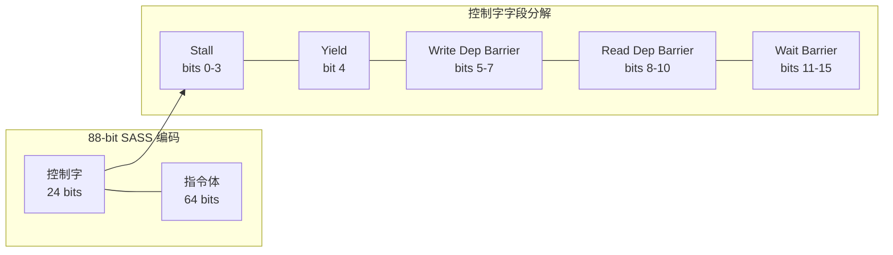
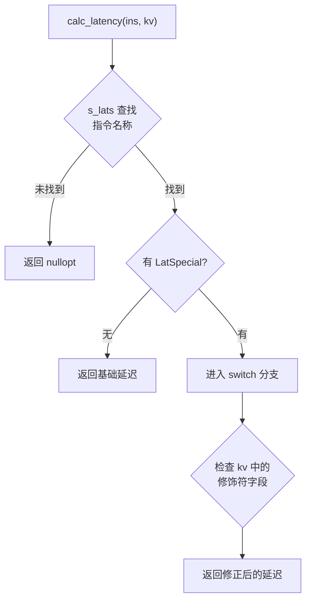
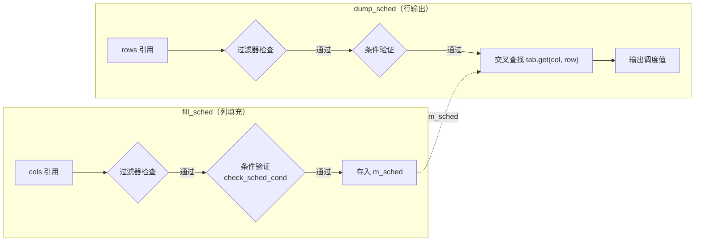
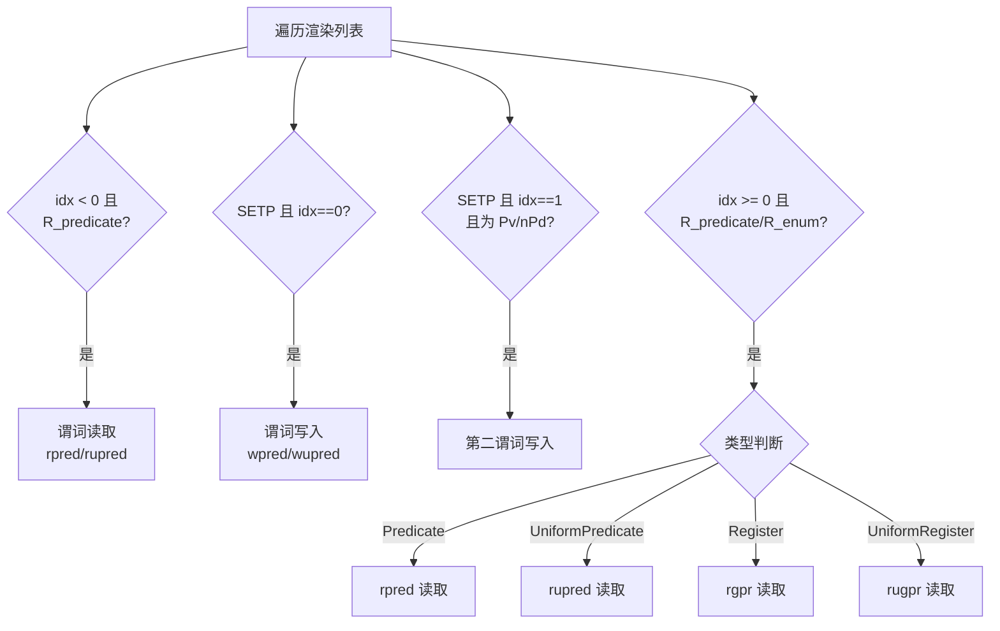
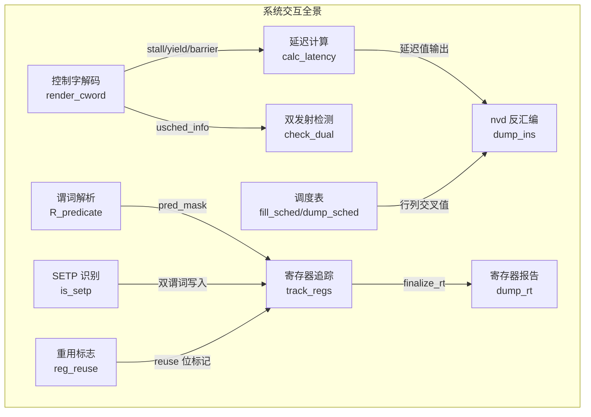

本文档深入剖析 denvdis 工具集中 SASS 指令的两个核心运行时机制：**延迟调度表**（Latency Scheduling Table）控制指令发射时机与依赖屏障，**指令谓词系统**（Predicate System）实现条件执行与寄存器追踪。二者共同构成了 NVIDIA GPU 指令调度的底层骨架——延迟表决定"何时执行"，谓词系统决定"是否执行"。

## 控制字编码：88 位指令的调度基石

在 sm_75 及以后的架构中，SASS 指令采用 **88 位编码**：高 24 位为控制字（control word），低 64 位为指令本体。控制字携带了该指令与前后指令之间的调度元数据，由 `NV_renderer::render_cword` 方法解码输出。

各字段含义如下：**Stall**（4 位）指定下一条指令发射前需要等待的时钟周期数，0x0 表示单发射模式，0x4 附近值用于双发射；**Yield**（1 位）标识当前 warp 是否主动让出调度槽；**Write Dep Barrier**（3 位）指定写入依赖屏障编号，7 表示不设置；**Read Dep Barrier**（3 位）指定读取依赖屏障编号；**Wait Barrier**（5 位）以位掩码形式指定需要等待的屏障集合。`render_cword` 将这些字段格式化为 `B%s:R%c:W%c:%c:S%x` 的可读形式。

Sources: [nv_rend.cc](test/nv_rend.cc#L385-L403), [nv_types.h](scripts/include/nv_types.h#L548-L558)

### 64 位架构的控制字差异

在 Fermi/Kepler 等 64 位编码架构（`nv64` 结构体）中，控制字的组织方式截然不同：每 8 条指令共享一个 64 位的**控制四字**（control quadword），其中每条指令分得 8 位控制码。最高 6 位与最低 2 位组合为 opcode，中间 56 位按 8 位边界分配给后续 7 条指令。`NV_base_decoder` 中的注释揭示了其语义：bit 0-3 为 stall 周期数，bit 4/5/7 分别对应 shared memory、global memory 和 texture cache 依赖屏障。

Sources: [nv_types.h](scripts/include/nv_types.h#L367-L394), [nv_types.h](scripts/include/nv_types.h#L430-L546)

## 延迟计算引擎：从指令到时钟周期

延迟计算的核心逻辑位于 `NV_renderer::calc_latency` 方法中，它接收一个指令描述符 `nv_instr` 和已提取的键值对 `NV_extracted`，返回该指令的执行延迟周期数。整个系统采用**两级查找**架构：第一级通过指令名称在 `s_lats` 散列表中快速定位基础延迟和特殊处理编号；第二级根据 `LatSpecial` 枚举进入专用的后处理分支。

### 延迟数据生成流水线

延迟数据并非手工维护，而是由 `scripts/pal.pl` 脚本从 NVIDIA 驱动中的延迟调度描述文件自动提取并生成 C++ 代码（`-C` 选项）。该脚本解析原始延迟文件，统计每条指令的延迟值，将具有单一延迟值的指令直接映射为 `{name, {base_latency, 0}}`，对延迟随操作数修饰符变化的指令则生成状态码 `{name, {base_latency, LatSpecial_N}}`，最终输出到 `lat.inc`。

Sources: [pal.pl](scripts/pal.pl#L1-L50), [lat.inc](test/lat.inc#L96-L200)

### LatSpecial 状态机：修饰符驱动的延迟修正

`lat.inc` 定义的 `LatSpecial` 枚举（Spec1 到 Spec34）覆盖了所有需要根据操作数修饰符修正延迟的场景。下表列出关键的延迟修正模式：

| 枚举值 | 修正逻辑 | 典型延迟范围 |
|--------|----------|-------------|
| Spec1 | 非 64 位操作数 | 基础 3，修正为 13 |
| Spec5 | HMMA 矩阵乘（size × dstfmt × sp 组合） | 15 ~ 46 |
| Spec15 | SYNCS 同步屏障（ARRIVE/CAS/FLUSH 等） | 10 ~ 32 |
| Spec21 | MUFU 超越函数（EX2/RCP/RSQ/TANH） | 8 ~ 24 |
| Spec32 | IMMA 整数矩阵乘（size × sp 组合） | 20 ~ 30 |
| Spec34 | IMUL/IMUL32I 宽位操作 | 9 ~ 12 |

以 HMMA（半精度矩阵乘累加）为例，其延迟从 15（1688.F16 格式）到 46（SP.F32.16816.E8M10 格式）不等。`calc_latency` 中的 Spec5 分支首先检查 `sp`、`dstfmt`、`size` 三个键值，通过布尔组合确定最终的延迟值。这种**基于提取字段的条件分支**模式在整个状态机中反复出现。

Sources: [nv_lat.cc](test/nv_lat.cc#L71-L291), [lat.inc](test/lat.inc#L1-L95)

### 辅助验证：check_lat_set

`NV_renderer::check_lat_set` 提供了延迟表的**覆盖率验证**功能：它遍历所有已解码指令，检查每条指令是否在 `s_lats` 中有对应条目。未覆盖的指令报告为 `LMissed`，已注册但未遇到的指令报告为 `LUnk`。这一机制在新增架构支持时尤为关键——确保延迟表不会遗漏新增指令。

Sources: [nv_lat.cc](test/nv_lat.cc#L9-L28)

## 调度表系统：行列交叉的延迟矩阵

调度表（Scheduling Table）是 SASS 指令描述中的核心数据结构，由 `NV_tab` 类型表示。每个调度表包含行列名称（`NV_gnames`）、连接方式（`connection`）以及二维值矩阵。在 `nv_instr` 结构体中，`rows` 和 `cols` 两个 `NV_tabrefs` 字段分别指向行和列的引用列表，每条引用包含目标表指针、过滤器函数和索引。

### fill_sched 与 dump_sched：两阶段调度解析

调度表的填充过程分为两个阶段：

1. **列填充**（`fill_sched`）：遍历当前指令的 `cols` 引用，对每条引用执行过滤器检查和条件验证（`check_sched_cond`），将匹配的列索引及条件集合存入 `m_sched` 映射表
2. **行转储**（`dump_sched`）：遍历当前指令的 `rows` 引用，在 `m_sched` 中查找已填充的列数据，通过 `NV_tab::get(col, row)` 获取交叉单元格的值并输出

`check_sched_cond` 是条件验证的核心：它检查指令的提取键值对是否满足调度表行/列的**前置条件列表**（`NV_cond_list`），每个条件项是字段名到验证函数的映射。条件检查结果通过 `NV_Tabset`（即 `unordered_map<string_view, int>`）缓存，同一条件列表在同一指令内只计算一次。

Sources: [nv_rend.cc](test/nv_rend.cc#L2554-L2663), [nv_types.h](scripts/include/nv_types.h#L190-L214)

### 调度表绑定与指令分类

`nv_instr` 结构体中的调度相关字段形成了完整的分类体系：`scbd`（NV_Scbd 枚举）标识指令的屏障角色（SOURCE_RD/SOURCE_WR/SINK 等），`scbd_type`（NV_Scbd_Type 枚举）分类屏障类型（BARRIER_INST/MEM_INST/BB_ENDING_INST），`min_wait` 指定最小等待周期。在 `nvd.cc` 的反汇编主循环中，`fill_sched` 仅在指令不是基本块结束指令（`BB_ENDING_INST`）且非分支指令时才执行——基本块边界会清空调度状态。

Sources: [nv_types.h](scripts/include/nv_types.h#L100-L113), [nv_types.h](scripts/include/nv_types.h#L216-L244), [nvd.cc](test/nvd.cc#L566-L569)

## 指令谓词系统：条件执行的编码与追踪

NVIDIA GPU 的谓词寄存器允许每条指令基于谓词值条件执行。在 SASS 反汇编框架中，谓词系统覆盖**四大寄存器域**：通用谓词（P0-P6）、均匀谓词（UP0-UP6）、通用寄存器（GPR）和均匀通用寄存器（UGPR）。PT（P7）和 UPT（UP7）是恒真谓词，不被追踪。

### 谓词的编码与渲染

在指令的渲染列表（`NV_rlist`）中，谓词以 `R_predicate` 类型出现，始终位于 `R_opcode` 之前。渲染逻辑在 `NV_renderer::render` 的 `R_predicate` 分支中处理：首先通过 `find_ea` 查找谓词的枚举属性，确认其类型为 "Predicate" 或 "UniformPredicate"；然后检查 `@not` 修饰（取反谓词）；最后将谓词名和修饰符拼接到输出。

`has_not` 方法检查形如 `name@not` 的键是否存在于提取值中且非零，实现谓词取反的检测。`always_false` 方法则检测 `@PT` 配合 `@not` 的组合——即一条永远不会执行的指令（死代码），用于在寄存器追踪时跳过此类指令。

Sources: [nv_rend.cc](test/nv_rend.cc#L1662-L1699), [nv_rend.cc](test/nv_rend.cc#L2318-L2343)

### SETP 指令族：谓词的写入端

SETP/FSETP/DSETP/PSETP/HSETP2/ISETP 等比较-设置谓词指令是谓词寄存器的**主要生产者**。`nv_instr` 结构体的 `setp` 字段（0/1/2）预标识了指令是否属于 SETP 族：值为 1 表示普通 SETP（写入单个谓词），值为 2 表示双谓词 SETP（如 `DSETP.MAX.AND P2, P3, R2, R12, PT`，同时写入 Pu 和 Pv）。

在 `track_regs` 中，SETP 的谓词写入追踪使用特殊的索引逻辑：第一个谓词在 `idx == 0` 时处理，第二个谓词在 `idx == 1` 时处理。第二谓词的字段名必须是 `nPd`（旧版 MD）或 `Pv`/`UPv`（新架构），否则不被识别为写入目标。

Sources: [nv_rend.cc](test/nv_rend.cc#L1325-L1389), [nv_types.h](scripts/include/nv_types.h#L222-L223)

### 寄存器追踪：track_regs 的完整流程

`NV_renderer::track_regs` 是整个谓词与寄存器追踪的核心方法。它遍历指令的渲染列表，对每个渲染项执行以下分类处理：

追踪结果存储在 `reg_pad` 结构体的四个映射表中：`pred`（谓词读/写历史）、`upred`（均匀谓词）、`gpr`（通用寄存器，带类型信息）、`ugpr`（均匀通用寄存器）。每条历史记录（`reg_history`）使用 16 位 `RH` 类型编码了丰富的元数据：

| 位域 | 含义 |
|------|------|
| bit 15 (0x8000) | 写操作标志，0=读，1=写 |
| bit 14 (0x4000) | 均匀谓词标志 |
| bits 11-13 | 谓词寄存器索引 + 1（0=无谓词关联） |
| bit 10 | 特殊寄存器加载标志（S2R 族） |
| bit 9 | 重用标志 |
| bit 8 | 复合操作的一部分 |
| bit 7 | 复合操作列表 |
| bits 4-6 | 宽操作索引（支持最大 256 位操作） |
| bits 0-2 | NVP_ops 操作数类型 + 1 |

`finalize_rt` 在整个 section 解析完成后对四组历史记录按偏移量排序，确保同一偏移处的写操作排在读操作之前——这是处理 `IMAD RZ, RZ` 类指令（先写后读同一寄存器）所必需的。

Sources: [nv_rend.cc](test/nv_rend.cc#L1223-L1460), [nv_rend.h](test/nv_rend.h#L82-L126), [nv_rend.cc](test/nv_rend.cc#L903-L932)

### 谓词掩码的传播机制

`reg_pad::pred_mask` 字段实现了谓词到后续寄存器操作的**自动传播**。在 `track_regs` 开始时，如果当前指令是 S2R/CS2R/S2UR 族（`is_s2xx`），`pred_mask` 被设置为 `(1 << 10)` 标志；当遇到前置谓词（R_predicate，idx < 0）时，`pred_mask` 更新为 `(1 + pred_index) << 11`（普通谓词）或 `0x4000 | (1 + pred_index) << 11`（均匀谓词）。此后所有 `_add` 调用都会将 `pred_mask` 或入历史记录的 `kind` 字段，使得每条寄存器操作都自动关联其控制谓词。

Sources: [nv_rend.cc](test/nv_rend.cc#L1305-L1342), [nv_rend.h](test/nv_rend.h#L181-L210)

## 双发射检测与 usched_info

在 sm_75+ 的 88 位编码架构中，相邻两条指令可以被**双发射**（dual-issue），以 `{ }` 花括号包裹的形式输出。双发射的检测由 `NV_renderer::check_dual` 实现：它检查提取键值对中的 `usched_info` 字段，当值为 `0x10`（即 floxy2 编码）时，标记当前指令为双发射的第一条。

`usched_info` 是控制字尾部的枚举字段，属于延迟调度信息的一部分。在 `render` 方法的尾部处理逻辑中（`in_tail` 状态），`usched_info` 以 `?enum_name` 的格式输出——`?` 前缀表明这是非默认值的调度参数。同样以尾部格式输出的还有 `req_bit_set`（`&req={位掩码}`）、`src_rel_sb`（`&rd=0xnum`）和 `dst_wr_sb`（`&wr=0xnum`）。

Sources: [nv_rend.cc](test/nv_rend.cc#L2665-L2671), [nv_rend.cc](test/nv_rend.cc#L2158-L2193), [nvd.cc](test/nvd.cc#L527-L575)

## 寄存器重用标记系统

自 Volta 架构起，SASS 指令引入了**寄存器重用缓存**（Reuse Cache）机制。`reg_reuse` 结构体追踪 `reuse_src_a` 到 `reuse_src_h` 五个源操作数的重用标志，以及 sm_100+ 新增的 `keep_a` 和 `keep_b` 保持标志。`apply` 方法在每条指令处理前重置标志并从提取键值对中重新填充。

重用标志通过 `reg_pad::check_reuse` 方法在寄存器读取时自动检查——如果当前操作数索引匹配重用掩码，历史记录的 `kind` 字段会或入 `reg_history::reuse`（bit 9）标记。在 `dump_trset` 的输出中，带有 `reuse` 标记的记录会附加 "reuse" 字样，帮助分析者识别寄存器数据来自重用缓存而非寄存器文件。

Sources: [nv_rend.h](test/nv_rend.h#L62-L80), [nv_rend.cc](test/nv_rend.cc#L1147-L1179)

## 架构演进与集成视图

延迟调度表与谓词系统在不同 GPU 架构间呈现显著的演进趋势。Fermi（sm_20）使用 64 位编码和隐式谓词位；Maxwell/Pascal 过渡到 88 位显式控制字；Volta 引入均匀谓词和寄存器重用；Hopper/Ada 增加了 UTC 协处理器的谓词域；Blackwell（sm_100+）进一步引入 `keep` 标志和 64 位均匀操作。

延迟调度与谓词追踪通过 `nvd` 的主反汇编循环（`try_dis`）紧密集成：每条指令先通过 `calc_latency` 计算延迟（`-l` 选项），再通过 `track_regs` 追踪寄存器（`-T` 选项），最后通过 `fill_sched` / `dump_sched` 输出调度表（`-S` 选项）。`always_false` 检测在追踪前执行，跳过死代码指令的寄存器记录。

Sources: [nvd.cc](test/nvd.cc#L457-L580)

## 延伸阅读

- **指令编码字段的底层定义**：[SASS 指令编码字段与掩码机制](9-sass-zhi-ling-bian-ma-zi-duan-yu-yan-ma-ji-zhi)
- **寄存器追踪的下游应用**：[寄存器追踪与 LUT 操作解码](11-ji-cun-qi-zhui-zong-yu-lut-cao-zuo-jie-ma)
- **调度优化的完整工具链**：[dg.pl Cubin 分析：CFG 构建、指令调度优化与寄存器复用](21-dg-pl-cubin-fen-xi-cfg-gou-jian-zhi-ling-diao-du-you-hua-yu-ji-cun-qi-fu-yong)
- **架构支持矩阵**：[GPU 架构演进：从 Fermi（sm_2）到 Blackwell（sm_120）的支持矩阵](23-gpu-jia-gou-yan-jin-cong-fermi-sm_2-dao-blackwell-sm_120-de-zhi-chi-ju-zhen)