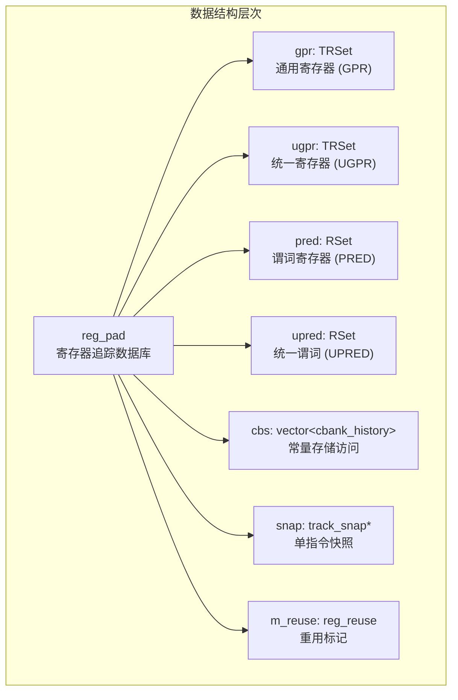
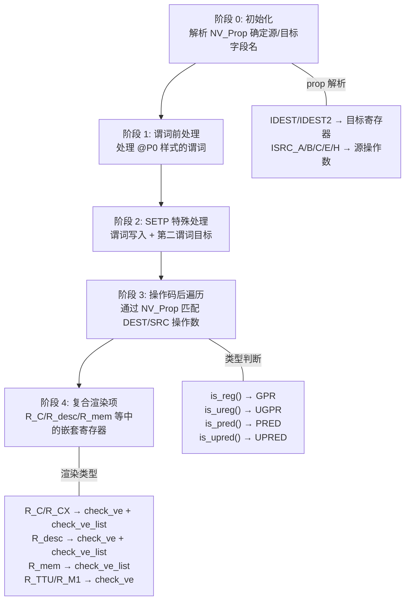
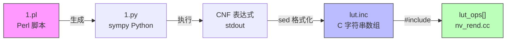

本文档深入解析 nvd 反汇编器中两大核心机制：**寄存器追踪系统**（通过 `-T` 选项启用）和 **LUT（Look-Up Table）逻辑操作解码**。前者在反汇编过程中为每条 SASS 指令建立全生命周期寄存器访问档案，后者将 `LOP3` 系列指令中 8 位立即数还原为人类可读的布尔逻辑表达式。两者共同服务于 SASS 二进制的深度逆向工程分析。

Sources: [nvd.cc](test/nvd.cc#L898-L899), [nv_rend.h](test/nv_rend.h#L62-L164)

## 寄存器追踪系统架构

寄存器追踪是一个数据流分析过程——反汇编器遍历每个 section 中的每条指令，从指令描述（`NV_Prop`）和渲染模板（render list）中提取寄存器操作数信息，最终生成全 section 范围内每个寄存器的完整读写历史。该系统由三个核心数据结构构成：**reg_pad**（寄存器数据库）、**reg_history**（单次访问记录）和 **track_snap**（单指令快照），形成了一个层次化的追踪体系。



**reg_pad** 作为追踪容器，管理四类寄存器集合和一组常量存储历史。GPR 和 UGPR 使用 `TRSet`（带类型信息的映射），而谓词寄存器使用 `RSet`（无类型映射）。`track_snap` 为当前正在处理的指令提供即时快照，记录该指令涉及的读写、重用等语义。`reg_reuse` 管理源操作数重用标记——这是 Volta+ 架构引入的优化特性，指示寄存器分配器可以延长源操作数的生命周期。

Sources: [nv_rend.h](test/nv_rend.h#L174-L294)

### reg_history 访问记录的编码

每条 `reg_history` 记录通过一个 16 位 `RH` 字段（`kind`）编码了丰富的语义信息，其位域布局如下：

| 位范围 | 含义 | 说明 |
|--------|------|------|
| bit 15 (0x8000) | 读/写方向 | 置位表示**写**操作 |
| bit 14 (0x4000) | 谓词类型标记 | 置位表示**统一谓词** (UP)，否则为普通谓词 (P) |
| bit 13–11 | 谓词寄存器索引 + 1 | 0 表示无关联谓词；非零值减 1 得到实际谓词索引 |
| bit 10 | 特殊寄存器来源 | 来自 `S2R`（Special Register to Register）指令 |
| bit 9 (reuse) | 重用标记 | 该操作数被标记为 `reuse_src_X` |
| bit 8 (comp) | 复合操作数组成部分 | 寄存器在复合渲染项内部 |
| bit 7 (in_list) | 列表中的元素 | 复合操作数的列表成员 |
| bit 6–4 | 宽操作索引 | 对于 >32 位的宽寄存器，指示具体的 32 位子寄存器编号 |
| bit 3–0 | NV_Props 操作类型 | 0 为无属性，否则为 `NVP_ops + 1` |

这种压缩编码使得每条历史记录仅需 16 字节（偏移量 + kind）即可表达完整的访问语义。`typed_reg_history` 在此基础上增加了 `NVP_type` 字段，用于标识寄存器的数据类型（整数、浮点、地址等）。

Sources: [nv_rend.h](test/nv_rend.h#L82-L130)

### track_snap 指令级快照

`track_snap` 捕获**单条指令**的寄存器访问摘要，以支持实时语义分析。其数据结构设计为：

- **gpr**: `unordered_map<unsigned short, unsigned char>`，键为寄存器索引（UGPR 添加 0x8000 前缀），值编码为：
  - `0x80` = 写操作
  - `0x40` = 重用标记
  - `0x20` = 读操作（即使同时有写）
  - 低 4 位 = `ISRC_XX` 源操作数索引
- **pr / upr**: 长度为 7 的字符数组，分别跟踪普通谓词和统一谓词的读（`1`）与写（`2`）状态

快照机制使得外部消费者可以在指令处理过程中查询"这条指令是否同时读写同一个寄存器"等数据依赖问题，这对于后续的 [dg.pl Cubin 分析](21-dg-pl-cubin-fen-xi-cfg-gou-jian-zhi-ling-diao-du-you-hua-yu-ji-cun-qi-fu-yong) 中的数据流图构建至关重要。

Sources: [nv_rend.h](test/nv_rend.h#L138-L164)

### 寄存器重用与保持机制

`reg_reuse` 结构管理 **reuse** 和 **keep** 两组标记。reuse 标记源于 `reuse_src_a/b/c/e/h` 属性字段，对应指令描述中的五个源操作数位置；keep 标记（`keep_a/b`）从 Blackwell（sm_100）开始引入，用于防止寄存器分配器过早回收目标寄存器。其工作流程为：

1. `apply()` 方法遍历指令的所有枚举属性（`eas`），匹配 `reuse_src_*` 和 `keep_*` 前缀
2. 通过键值对查找当前指令提取结果（`NV_extracted`），确定标记是否有效
3. 生成 `mask`（实际值）和 `mask2`（存在性掩码），用于后续 `check_reuse()` 判定

Sources: [nv_rend.cc](test/nv_rend.cc#L1147-L1179), [nv_rend.h](test/nv_rend.h#L62-L80)

## track_regs 追踪算法详解

`track_regs()` 是寄存器追踪的核心驱动函数，它遍历指令的渲染列表（render list），根据每个渲染元素的类型和指令属性信息，将寄存器访问记录插入 `reg_pad` 数据库。算法分为五个阶段。



**阶段 0（初始化）** 遍历指令的 `NV_Props` 集合，建立操作数字段名到源/目标角色的映射。例如，对于 `IMAD` 指令，`IDEST` 映射到 `Rd`，`ISRC_A` 映射到 `Ra`，`ISRC_B` 映射到 `Rb`，`ISRC_C` 映射到 `Rc`。同时提取各操作数的数据类型（`NVP_type`）。

**阶段 1（谓词前处理）** 处理操作码之前的谓词寄存器——即 `@P0` 或 `@UP3` 格式的指令谓词。系统将其记录为读操作，并设置 `pred_mask` 供后续所有记录使用，使每条寄存器访问都关联到其守卫谓词。

**阶段 2（SETP 处理）** 处理比较-设置谓词指令的特殊情况。`DSETP`/`PSETP` 类指令可以同时写入两个谓词寄存器（如 `P2, P3`），算法通过检测 `Pv`/`UPv`/`nPd` 等字段名来识别这种双目标写入。

**阶段 3（操作数遍历）** 是算法的主体。对于操作码之后的每个枚举或谓词渲染项，算法首先通过 `find_ea()` 查找对应的属性描述符，然后根据 `ename` 判断寄存器类型（`Register` → GPR, `UniformRegister` → UGPR, `Predicate` → PRED, `UniformPredicate` → UPRED），再通过字段名匹配确定操作数角色（目标 vs. 源 A/B/C/E/H），最终调用对应的写入或读取记录方法。宽操作数（>32 位）通过 `*_multi` 辅助函数展开为多个 32 位子寄存器访问。

**阶段 4（复合渲染项）** 处理内存操作、纹理采样等复杂操作数结构中的嵌套寄存器引用。通过 `check_ve`/`check_ve_list` lambda 递归检查复合项内的每个 `ve_base` 元素，并标记 `comp` 和 `in_list` 位。

Sources: [nv_rend.cc](test/nv_rend.cc#L1223-L1648)

### 宽操作数展开

GPU 寄存器是 32 位宽的，但许多操作涉及 64 位、128 位甚至 256 位数据。追踪系统通过 `ISRC_*_SIZE` 预测器计算操作数位宽，然后使用 `reg_history::windex()` 编码子寄存器索引。例如，一个 128 位目标写入会产生 4 条 `wgpr` 记录，`windex` 分别为 0、1、2、3。`SRC_I` 类型可达 256 位（8 个子寄存器），这也是 `windex` 使用 3 位编码的原因。

Sources: [nv_rend.cc](test/nv_rend.cc#L1394-L1433), [nv_rend.h](test/nv_rend.h#L120-L125)

## 追踪后处理与输出

### finalize_rt 排序

寄存器追踪发生在渲染列表的从左到右遍历过程中，这意味着对于同一条指令内的同一偏移量，操作数的处理顺序可能与逻辑语义顺序不一致。例如 `IMAD RZ, RZ` 会先记录目标写、再记录源读——因为目标操作数在渲染列表中先出现。`finalize_rt()` 对每个寄存器的历史向量按偏移量排序，同偏移量内读操作排在写操作之前（`0x8000` 位为 0 的排在为 1 的之前），确保输出反映正确的语义顺序。

Sources: [nv_rend.cc](test/nv_rend.cc#L903-L932)

### dump_rt 输出格式

`dump_rt()` 在 section 反汇编完成后输出完整的寄存器追踪报告。输出格式按寄存器类别分组，每组显示寄存器索引和访问次数，然后列出每次访问的详细信息：

```
;;; 42 GPR
 ;  R0 15:
 ;   10 2                   # offset 0x10, kind 0x2 (ISRC_A source read)
 ;   20 <- 0                # offset 0x20, write, no predicate
 ;   30 402 P2              # offset 0x30, read, guarded by predicate P2
 ;   40 <- 0 reuse FLOAT    # offset 0x40, write, reuse flag, type FLOAT
;;; 3 PRED
 ;  P0 8:
 ;   50 <- 0                # offset 0x50, write (from SETP)
```

写操作以 `<-` 标记；谓词守卫显示为 `PX`（普通谓词）或 `UPX`（统一谓词）；类型信息附加在行尾（如 `INTEGER`、`FLOAT`、`SHARED_ADDRESS` 等）。

Sources: [nv_rend.cc](test/nv_rend.cc#L934-L1010)

### 命令行集成

寄存器追踪通过 `-T` 选项启用。在 `try_dis()` 中，每个 section 开始时初始化或清空 `reg_pad`，然后在每条指令的反汇编循环中调用 `track_regs()`。反汇编完成后，`finalize_rt()` 排序并 `dump_rt()` 输出。注意，谓词始终为假（`!@PT`）的指令会被跳过，不参与追踪——这是通过 `always_false()` 检测实现的优化。

Sources: [nvd.cc](test/nvd.cc#L452-L580), [nvd.cc](test/nvd.cc#L918-L919)

## LUT 操作解码

### LOP3 指令与 256 入口真值表

NVIDIA GPU 的 `LOP3`（Logical Operation 3-input）系列指令接受三个源操作数（a, b, c）和一个 8 位立即数作为 **Look-Up Table (LUT)** 选择码。该立即数的每一位对应三输入的一种组合：

| 位 | 组合条件 | 置位含义 |
|----|----------|----------|
| bit 0 | `~a & ~b & ~c` | 所有输入为 0 时输出 1 |
| bit 1 | `~a & ~b & c` | 仅 c 为 1 时输出 1 |
| bit 2 | `~a & b & ~c` | 仅 b 为 1 时输出 1 |
| bit 3 | `~a & b & c` | b 和 c 同时为 1 时输出 1 |
| bit 4 | `a & ~b & ~c` | 仅 a 为 1 时输出 1 |
| bit 5 | `a & ~b & c` | a 和 c 同时为 1 时输出 1 |
| bit 6 | `a & b & ~c` | a 和 b 同时为 1 时输出 1 |
| bit 7 | `a & b & c` | 所有输入为 1 时输出 1 |

8 位 LUT 值编码了 256 种可能的三输入布尔函数。例如，LUT 值 `0xCC`（二进制 `11001100`）对应 `a & ~b & ~c | a & ~b & c | a & b & ~c | a & b & c`，简化为 `a`（直接透传第一个输入）。这是 NVIDIA 官方论坛文档中描述的经典解码方式。

Sources: [lut/1.pl](test/lut/1.pl#L10-L24)

### LUT 表达式生成流水线

LUT 解码的预计算流水线由三个组件构成：

1. **`1.pl`（sympy 生成器）**：Perl 脚本遍历 LUT 值 1–254（排除 0x00 和 0xFF），为每个值生成最小项之和（Sum of Minterms）的原始表达式，然后输出 sympy Python 代码，使用 `simplify_logic(form="cnf")` 将其简化为**合取范式**（CNF）。

2. **`do.sh`（构建脚本）**：串联执行 `perl 1.pl > 1.py` 和 `python3 1.py | sed > lut.inc`，将 sympy 的简化结果格式化为 C 字符串数组。

3. **`lut.inc`（静态查找表）**：包含 254 个预计算的 CNF 字符串（索引 1–254），直接嵌入到 C++ 代码中作为 `lut_ops[]` 数组。

这种离线预计算策略避免了运行时的符号化简开销，同时保证了 LUT 注释的即时可用性。



Sources: [lut/1.pl](test/lut/1.pl#L1-L35), [lut/do.sh](test/lut/do.sh#L1-L3), [lut/lut.inc](test/lut/lut.inc#L1-L255)

### check_lut 检测算法

`check_lut()` 在渲染列表中检测 LOP3 指令的 LUT 立即数字段。算法采用三阶段状态机：

1. **state 0 → 1**：遇到 `R_opcode` 类型渲染项（操作码），进入状态 1
2. **state 1 → 2**：在操作码后的枚举项中，查找 `ename == "LUTOnly"` 且 `ignore == true` 的属性。`LUTOnly` 是 LOP3 指令的特有标记，指示后续的立即数字段是 LUT 选择码
3. **state 2 → 完成**：找到名为 `imm8` 或 `uimm8` 的值类型渲染项，提取其当前值作为 LUT 索引

如果任一阶段未满足条件，函数返回 `false`，表示当前指令不是 LOP3 或不包含 LUT 字段。`2.pl` 是备用的 pyeda 生成器，使用 `exprvar` 和 `simplify()` 替代 sympy，为开发者提供了另一种表达式简化路径。

Sources: [nv_rend.cc](test/nv_rend.cc#L1112-L1145), [lut/2.pl](test/lut/2.pl#L1-L35)

### LUT 输出集成

在 `dump_ins()` 函数中，当启用 `-c` 选项（nvdisasm 兼容输出模式）时，LUT 注释作为指令行的后缀追加。检测流程为：

```
LOP3.LUT R0, R1, R2, R3, 0xCC ;  LUT CC: a
```

其中 `0xCC` 是原始 LUT 立即数，`a` 是从 `lut_ops[]` 查找得到的简化布尔表达式。如果 LUT 值超出 254 的范围或为 0，输出 `unknown LUT XX`。这种内联注释方式使逆向工程师无需手动解码 LUT 值即可理解三输入逻辑函数的语义。

Sources: [nvd.cc](test/nvd.cc#L418-L426), [nv_rend.cc](test/nv_rend.cc#L508-L517)

## LUT CNF 表达式模式解析

`lut.inc` 中的 254 个表达式按 CNF 形式组织，呈现出系统性的模式层次。以下列出几个关键模式及其对应的常见操作：

| LUT 值 | CNF 表达式 | 语义等价 |
|--------|-----------|---------|
| 0xCC | `a` | 透传输入 a |
| 0xF0 | `b` | 透传输入 b |
| 0xAA | `c` | 透传输入 c |
| 0x0F | `~a` | 取反 a |
| 0x96 | `(c \| ~b) & (~a \| ~c)` | a XOR b → c |
| 0x3C | `(a \| ~b) & (~a \| b)` | a XOR b（无 c） |
| 0xE8 | `a \| b \| c` | 三输入或 |
| 0x80 | `a & b & c` | 三输入与 |
| 0xFE | `~a \| ~b \| ~c` | 三输入或非 |
| 0x01 | `~a & ~b & ~c` | 三输入与非 |
| 0x78 | `(b \| ~c) & (c \| ~b)` | b XOR c（无 a） |
| 0x55 | `(~a \| ~b) & (~a \| ~c)` | ~a 相关的简化 |

这些表达式揭示了 LOP3 指令的强大之处——通过单一 8 位控制字，可以在三个输入之间表达任意布尔函数。CNF 形式虽然不是最紧凑的表示，但它保证了每个表达式都是唯一的规范形式，便于比较和识别。NVIDIA 官方编译器经常利用 LOP3 将多个逻辑操作折叠为一条指令，这种优化在反汇编输出中通过 LUT 注释变得透明可读。

Sources: [lut/lut.inc](test/lut/lut.inc#L128-L255)

## 架构演进与寄存器体系扩展

寄存器追踪系统通过 `reg_pad` 的四集合设计（`gpr`、`ugpr`、`pred`、`upred`）反映了 GPU 架构的寄存器体系演进。在 Turing（sm_75）之前，仅有 GPR 和谓词两类；Turing 引入了**统一寄存器**（UGPR）和**统一谓词**（UPRED），用于 warp 内统一执行路径的优化。追踪系统通过 `is_reg()`/`is_ureg()`/`is_pred()`/`is_upred()` 四个判断方法，以及 `rgpr`/`rugpr`/`wgpr`/`wugpr` 四组读写方法，完整覆盖了这一扩展。

Blackwell（sm_100）进一步引入了 `keep_a`/`keep_b` 标记和 `ISRC_I` 第七个操作数位置，追踪系统通过 `reg_reuse` 结构的 `keep`/`keep2` 字段和 `ISRC_I_SIZE` 预测器自然扩展了对这些新特性的支持。关于各架构的完整支持矩阵，参见 [GPU 架构演进](23-gpu-jia-gou-yan-jin-cong-fermi-sm_2-dao-blackwell-sm_120-de-zhi-chi-ju-zhen)。

Sources: [nv_rend.h](test/nv_rend.h#L166-L294), [scripts/include/nv_types.h](scripts/include/nv_types.h#L57-L66)

## 相关阅读

- [SASS 指令编码字段与掩码机制](9-sass-zhi-ling-bian-ma-zi-duan-yu-yan-ma-ji-zhi)：理解 `NV_extracted` 键值对的提取过程，这是寄存器追踪和 LUT 解码的输入基础
- [延迟调度表分析与指令谓词系统](10-yan-chi-diao-du-biao-fen-xi-yu-zhi-ling-wei-ci-xi-tong)：谓词系统与寄存器追踪中的 `pred_mask` 机制紧密关联
- [dg.pl Cubin 分析](21-dg-pl-cubin-fen-xi-cfg-gou-jian-zhi-ling-diao-du-you-hua-yu-ji-cun-qi-fu-yong)：寄存器追踪数据在 CFG 构建和寄存器复用分析中的下游应用