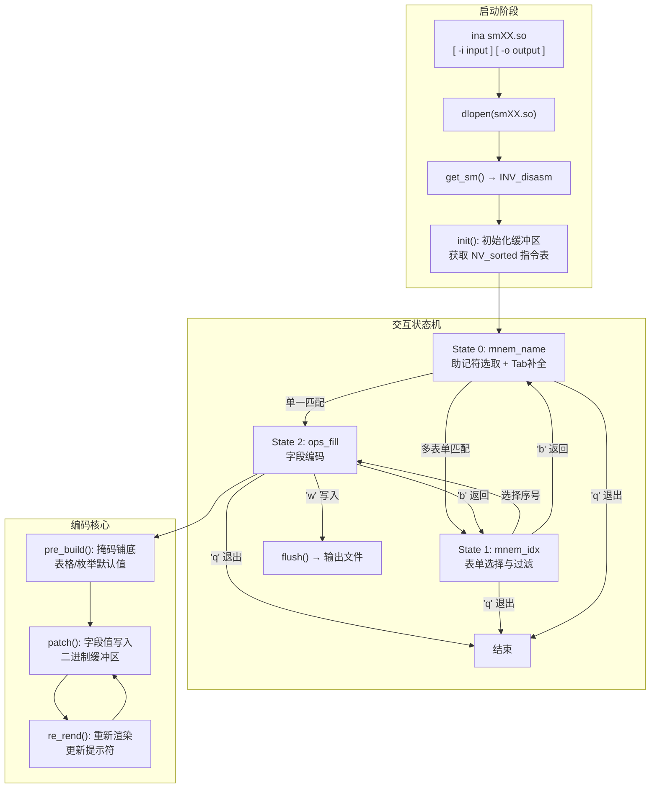
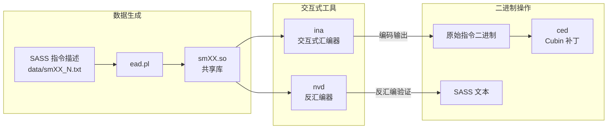

**ina** 是一款基于 GNU Readline 的交互式 SASS（Streaming Assembler）指令编码器，能够以对话式流程完成从助记符选取、指令表单过滤到逐字段编码的完整汇编工作。它通过 `dlopen` 加载由 [ead.pl 指令编码生成器](6-ead-pl-zhi-ling-bian-ma-sheng-cheng-qi-cong-miao-shu-wen-jian-dao-sm_xx-so-gong-xiang-ku) 生成的架构描述共享库（如 `sm75.so`、`sm90.so`），利用其中内嵌的指令元数据、解码二叉树与渲染模板，在运行时完成指令编码位的构造与实时预览。该工具同时具备对已有二进制指令流的反汇编能力，使其成为一个集编码与解码于一体的双向交互环境。

Sources: [ina.cc](test/ina.cc#L1-L11), [nv_rend.cc](test/nv_rend.cc#L550-L573)

## 架构总览与数据流

ina 的核心架构可以概括为三层协作：**加载层**负责通过 `NV_renderer::load()` 动态加载 `smXX.so` 共享库并获取 `INV_disasm` 接口；**状态机层**驱动三个交互阶段（助记符选取 → 表单过滤 → 字段编码）的有序流转；**编码层**在 `pre_build()` 初始化阶段将掩码、表格和枚举默认值铺底到二进制缓冲区，再由 `patch()` 系列方法按字段逐步覆盖编码位。

`NV_sorted` 类型——即 `std::vector<pair<string_view, vector<const nv_instr*>>>`——是整个系统的中枢数据结构。每个元素以指令助记符为键，映射到该助记符在当前架构下所有编码变体的 `nv_instr` 描述符列表。一个助记符对应多个变体是 SASS 指令集的常态：例如 `FADD` 可能存在寄存器-寄存器、寄存器-立即数等不同编码形式，每种形式拥有不同的字段布局与掩码。

Sources: [ina.cc](test/ina.cc#L113-L119), [ina.cc](test/ina.cc#L1152-L1169), [nv_types.h](scripts/include/nv_types.h#L1189-L1189), [nv_rend.h](test/nv_rend.h#L710-L714)

## 编译构建与命令行接口

ina 的构建依赖 `libced.a` 静态库（包含 `nv_rend.o`、`sass_parser.o`、`ced_base.o`、`bf16.o`、`nv_lat.o`）和 `libreadline`，最终链接生成 `ina` 可执行文件。运行时需要搭配一个由 ead.pl 生成的 `smXX.so` 共享库。

| 选项 | 功能 | 说明 |
|------|------|------|
| `smXX.so` | 架构描述库 | 必选参数，指定目标 GPU 架构的指令编码描述 |
| `-i file` | 反汇编输入 | 读取已有二进制指令流并反汇编输出 |
| `-o file` | 汇编输出 | 将编码后的指令写入指定二进制文件 |
| `-m` | 显示未匹配字段 | 在反汇编输出中显示未能匹配的字段名 |
| `-p` | 显示谓词信息 | 输出指令的谓词（predicate）属性详情 |
| `-v` | 详细模式 | 打印内部调试信息（表单行号、表格查找等） |

典型用法：`./ina sm75.so` 进入交互式汇编模式；`./ina -i kernel.bin sm75.so` 反汇编已有二进制文件。

Sources: [ina.cc](test/ina.cc#L1293-L1346), [Makefile](test/Makefile#L40-L41)

## 三阶段交互状态机

ina 的交互逻辑由三个嵌套的 `inapply` 闭包对象组成，每个闭包对应一个状态节点。`Apply` 基类定义了 `next()` 虚方法，状态转换通过返回下一个 `Apply*` 指针实现，返回 `nullptr` 则终止循环。这种设计将状态机从过程式分支逻辑中解放出来，以函数式闭包链的方式实现了清晰的状态转移。

Sources: [ina.cc](test/ina.cc#L247-L299)

### 阶段零：助记符选取（mnem_name）

此阶段使用 `instr_completion` 作为 Readline 的自动补全函数。用户输入助记符前缀后按 Tab，系统在 `NV_sorted`（已按字典序排列的指令列表）上执行二分查找（`std::lower_bound`），定位所有匹配前缀的候选指令并逐一生成补全项。输入完整助记符后，系统通过 `find_il` 查找对应的指令变体列表：若仅有一个变体，直接进入字段编码阶段；若有多个变体，进入表单选择阶段。

关键交互命令：输入 `q` 退出工具。

Sources: [ina.cc](test/ina.cc#L275-L299), [ina.cc](test/ina.cc#L172-L206)

### 阶段一：表单选择与过滤（mnem_idx）

当同一助记符对应多个编码表单时，`dump_irs()` 方法枚举所有表单并显示其渲染后的操作数格式。每个表单以序号标记（1-based），同时计算并显示所有表单的**公共后缀**（Common Suffixes, CS）——即那些在每个表单中都出现的操作数名称，帮助用户快速识别表单间的差异。

| 命令 | 功能 |
|------|------|
| `<数字>` | 选择对应序号的表单进入编码阶段 |
| `+<filter>` | 保留包含指定特征的表单 |
| `-<filter>` | 排除包含指定特征的表单 |
| `!` | 重置所有过滤条件，恢复初始表单列表 |
| `b` | 返回助记符选取阶段 |
| `q` | 退出工具 |

**过滤系统**是此阶段的核心能力，支持以下过滤维度：

| 过滤器 | 含义 |
|--------|------|
| `+f` / `-f` | 浮点立即数（F64/F32/F16/E8M7）的包含/排除 |
| `+i` / `-i` | 整数立即数的包含/排除 |
| `+C` / `-C` | 复合操作数（R_C / R_CX 类型）的包含/排除 |
| `+T` / `-T` | TTU（Texture/Texel) 操作数的包含/排除 |
| `+M` / `-M` | M1 类型操作数的包含/排除 |
| `+d` / `-d` | 描述符操作数的包含/排除 |
| `+m` / `-m` | 内存操作数的包含/排除 |
| `+u` / `-u` | Uniform 寄存器操作数的包含/排除 |
| `+<name>` / `-<name>` | 按操作数名称精确匹配的包含/排除 |

过滤逻辑通过 `apply_sel_filter()` 方法实现：每次过滤操作在当前 `m_irs` 列表上执行 `std::copy_if`，将匹配结果替换原列表，实现增量式过滤。如果过滤后结果为空则拒绝该操作并提示用户。

Sources: [ina.cc](test/ina.cc#L301-L328), [ina.cc](test/ina.cc#L500-L566), [ina.cc](test/ina.cc#L568-L595)

### 阶段二：字段编码（ops_fill）

选定具体表单后，`pre_build()` 方法完成编码缓冲区的初始化工作：应用指令掩码（`set_mask`）、为所有表格字段填入首行默认值、为带默认值的枚举和数值属性填入默认值、建立字段名到 `kv_field` 的映射表（`s_fields`）。此后用户可以在交互式提示符下逐字段编辑编码值。

| 命令 | 功能 |
|------|------|
| `<field> <value>` | 设置指定字段的值 |
| `i <field>` | 查询字段的元信息（掩码长度、格式、枚举值表） |
| `Tab<N> <value>` | 直接设置第 N 个表格的编码键值 |
| `r` | 显示当前表单的渲染模板 |
| `R` | 显示当前表单的扩展渲染模板（含类型信息） |
| `kv` | 转储所有已设置字段的键值对 |
| `w` | 将当前编码写入输出文件 |
| `b` | 返回表单选择阶段 |
| `q` | 退出工具 |

字段值输入支持 `fill_completion` 自动补全：系统维护 `s_fields` 映射表，以字段名为键、`kv_field` 描述符为值，提供基于前缀的 Tab 补全。

Sources: [ina.cc](test/ina.cc#L329-L393), [ina.cc](test/ina.cc#L1022-L1131), [ina.cc](test/ina.cc#L220-L245)

## 字段类型与编码机制

`kv_field` 是 ina 编码层的核心抽象，通过 `kv_type` 枚举区分为四类字段，每类字段对应不同的编码位写入策略。`patch()` 方法根据字段类型分发到不同的位操作逻辑，将用户输入的语义值转化为二进制编码写入缓冲区。

### 字段类型矩阵

| 类型 | kv_type | 掩码结构 | 编码方式 | 典型用途 |
|------|---------|----------|----------|----------|
| **FIELD** | `KV_FIELD` | 单组 mask（位置+长度对） | 直接写入 / 除以 scale | 寄存器编号、立即数 |
| **TAB** | `KV_TAB` | 表格关联 mask | 查表写入编码键值 | 操作码修饰符组合 |
| **CBANK** | `KV_CBANK` | 2-3 组 mask | 分段写入（Hi/Lo） | 常量存储体索引 |
| **CTRL** | `KV_CTRL` | 8-bit 固定长度 | 写入控制字节 | 64-bit 指令调度控制 |

### FIELD 类型

最直接的编码方式。`NV_field` 结构定义了字段名、掩码数组（`pair<short, short>` 的位置-长度对）和可选的缩放因子。`patch` 时若存在 scale，则将用户值除以 scale 后写入掩码指定的位区间。例如某字段的掩码为 `[(28, 8)]`，scale 为 4，则输入 `128` 实际写入 `128/4 = 32` 到 bit[28:35]。

Sources: [ina.cc](test/ina.cc#L23-L31), [ina.cc](test/ina.cc#L76-L99), [nv_types.h](scripts/include/nv_types.h#L166-L171)

### TAB 类型

**表格驱动编码**是 SASS 指令集中最常见的多字段联动机制。`NV_tab_fields` 关联一个编码键值表（`unordered_map<int, unsigned short[]>`）和一组字段名。每个表格行以一个整数为键，映射到一组字段值数组。编码时需要构造一个"模板行"——将除当前编辑字段外的其他字段值从 `m_kv` 缓存中提取出来——然后在表格中查找同时满足当前字段值和模板行的完整行，取得其编码键值写入掩码位。

这种设计确保了表格约束的完整性：任意单字段的修改都必须满足表格中存在对应的合法行。`patch_tab()` 方法在查找失败时会明确报告缺失的行模板，辅助用户定位编码冲突。

Sources: [ina.cc](test/ina.cc#L684-L734), [nv_types.h](scripts/include/nv_types.h#L181-L187)

### CBANK 类型

常量存储体（Const Bank）编码支持两种布局：**双掩码模式**（`mask1` + `mask2`）和**三掩码模式**（`mask1` + `mask2` + `mask3`）。在双掩码模式下，`tab_idx=0` 写入 `mask1`，`tab_idx=1` 写入 `mask2`（应用可选 scale）。三掩码模式用于编码 `BankLo | (BankHi << 4)` 形式的合并字段：`tab_idx=0` 时将值拆分为高4位和低4位分别写入 `mask1`（BankHi）和 `mask2`（BankLo），`tab_idx=1` 时根据掩码数量写入 `mask2` 或 `mask3`。

Sources: [ina.cc](test/ina.cc#L82-L98), [ina.cc](test/ina.cc#L106-L111), [nv_types.h](scripts/include/nv_types.h#L174-L179)

### CTRL 类型

仅用于 64-bit 宽度的指令（如 Fermi/Kepler 架构）。64-bit 编码格式中高 6 位和低 2 位组成操作码，中间 56 位分为 7 个 8-bit 控制码，每个控制码管理后续一条指令的调度参数（停顿周期、屏障依赖等）。`patch()` 通过 `dis->put_ctrl()` 写入该控制字节。

Sources: [ina.cc](test/ina.cc#L101-L105), [ina.cc](test/ina.cc#L1102-L1105), [nv_types.h](scripts/include/nv_types.h#L367-L378)

## 值解析与格式系统

`patch_internal()` 方法是字段值从字符串到 `uint64_t` 的核心转换器。它依据字段关联的 `nv_vattr`（数值属性）和 `nv_eattr`（枚举属性）决定解析策略。系统支持以下值格式（`NV_Format` 枚举）：

| 格式 | 解析方式 | 输入示例 |
|------|----------|----------|
| `BITSET` | `parse_arg()` — 0b/0x/十进制 | `0b1010`, `0xF`, `10` |
| `UImm` | `parse_arg()` — 0b/0x/十进制 | `255`, `0xFF` |
| `SImm` / `SSImm` / `RSImm` | `parse_signed()` — 支持负数 | `-128`, `0x80` |
| `F64Imm` | `atof()` → 64-bit 浮点位模式 | `3.14159265358979` |
| `F32Imm` | `(float)atof()` → 32-bit 浮点位模式 | `1.5` |
| `F16Imm` | `fp16_ieee_from_fp32_value()` | `0.5` |
| `E8M7Imm` | `conv_e8m7()` 自定义 FP8 转换 | `0.25` |

此外，浮点格式还支持特殊值：`nan`（非数）、`inf`（正无穷）、`-inf`（负无穷），分别通过 `s_nan2val()` 和 `s_inf2val()` 转换为对应的位模式。

对于枚举类型字段，系统额外验证输入值是否在枚举映射（`nv_eattr::em`）中存在。若字段同时具有枚举和表格关联（`type == KV_TAB && ea != nullptr`），则先验证枚举合法性，再通过 `patch_tab()` 执行表格查找。

Sources: [ina.cc](test/ina.cc#L798-L869), [nv_types.h](scripts/include/nv_types.h#L74-L84), [nv_types.h](scripts/include/nv_types.h#L115-L129)

## 编码初始化流程（pre_build）

`pre_build()` 是字段编码阶段的初始化核心，它执行以下步骤：

1. **清除状态**：清空 `m_kv` 键值缓存和 `s_fields` 字段映射表
2. **应用指令掩码**：调用 `set_mask(ins->mask)` 将指令的固定编码位铺底到缓冲区
3. **初始化表格字段**：遍历 `ins->tab_fields`，为每个表格的首行（或 `check_1tab()` 找到的默认行）写入编码键值，并将行中各列值存入 `m_kv`
4. **初始化直接字段**：遍历 `ins->fields`，为带 `dval`（默认值）的数值属性和带 `def_value` 的枚举属性写入默认编码
5. **建立常量存储体映射**：若指令有 `cb_field`，创建两个 `kv_field`（`tab_idx=0` 和 `tab_idx=1`）
6. **添加 CTRL 字段**：64-bit 指令时添加 "Ctrl" 字段
7. **验证编码可逆性**：调用 `dis->get()` 反向解码缓冲区，验证当前编码能唯一匹配到目标指令

步骤 7 的可逆性验证至关重要：它确保了默认值的组合不会意外匹配到其他指令或产生歧义，保证了编码的正确性。

Sources: [ina.cc](test/ina.cc#L1022-L1131)

## 字段信息查询（`i` 命令）

`i <field>` 命令通过 `dump_i()` 方法显示字段的完整元信息，是交互式编码的关键辅助手段。输出内容包括：

- **掩码长度**（MaskLen）：该字段占用的编码位数
- **数值格式**（Format）：`NV_Format` 枚举的可读名称（如 `UImm`、`f32`）
- **缩放因子**（scale）：若有，显示除法缩放系数
- **枚举信息**：枚举名称、是否为忽略型（`.Enum` 前缀带点）、默认值、完整枚举值表（过大或寄存器类枚举自动跳过）
- **表格信息**：TAB 类型字段显示关联的表格列布局

Sources: [ina.cc](test/ina.cc#L871-L923)

## 反汇编模式

当使用 `-i` 选项指定输入文件时，ina 进入反汇编模式。`process_binary()` 方法读取整个文件到内存，通过 `m_dis->init()` 初始化解码器，然后 `process_buf()` 循环调用 `m_dis->get()` 逐条解码指令。解码结果经 `render()` 渲染为人类可读的 SASS 文本输出，格式为 `<偏移>: <助记符> <操作数>`。

对于 88-bit 编码（Maxwell 及后续架构），系统还处理**双发射**（dual-issue）检测：`check_dual()` 判断当前指令是否为双发射的第一条，若是则在输出中用 `{` 标记，第二条指令缩进显示并用 `}` 闭合。

Sources: [ina.cc](test/ina.cc#L1182-L1291)

## 与工具链的协作关系

ina 在整体工具链中占据"编码验证"的关键位置。它消费 [ead.pl 指令编码生成器](6-ead-pl-zhi-ling-bian-ma-sheng-cheng-qi-cong-miao-shu-wen-jian-dao-sm_xx-so-gong-xiang-ku) 产出的 `smXX.so` 共享库作为架构描述输入，其编码能力与 [nvd 反汇编器架构与 ELF/CUBIN 解析](8-nvd-fan-hui-bian-qi-jia-gou-yu-elf-cubin-jie-xi) 的解码能力互为镜像——两者共享同一套 `NV_renderer` / `INV_disasm` 基础设施，区别在于 nvd 侧重于从 ELF/CUBIN 容器中提取和反汇编完整内核，而 ina 专注于单条指令的交互式编码验证。编码结果可以通过 [ced 类 sed 的 Cubin 内联补丁工具](13-ced-lei-sed-de-cubin-nei-lian-bu-ding-gong-ju) 嵌入到实际 Cubin 二进制中，完成从编码到部署的闭环。

Sources: [Makefile](test/Makefile#L18-L51), [nv_rend.h](test/nv_rend.h#L311-L318)

## 延伸阅读

- [SASS 指令编码字段与掩码机制](9-sass-zhi-ling-bian-ma-zi-duan-yu-yan-ma-ji-zhi)：深入理解 `NV_field`、`NV_tab_fields`、`NV_cbank` 等编码原语的设计原理
- [nvd 反汇编器架构与 ELF/CUBIN 解析](8-nvd-fan-hui-bian-qi-jia-gou-yu-elf-cubin-jie-xi)：对比 ina 与 nvd 在共享基础设施上的不同使用模式
- [ead.pl 指令编码生成器](6-ead-pl-zhi-ling-bian-ma-sheng-cheng-qi-cong-miao-shu-wen-jian-dao-sm_xx-so-gong-xiang-ku)：了解 `smXX.so` 共享库的生成过程与数据格式
- [GPU 架构演进：从 Fermi 到 Blackwell 的支持矩阵](23-gpu-jia-gou-yan-jin-cong-fermi-sm_2-dao-blackwell-sm_120-de-zhi-chi-ju-zhen)：查看各架构的指令编码宽度与支持范围