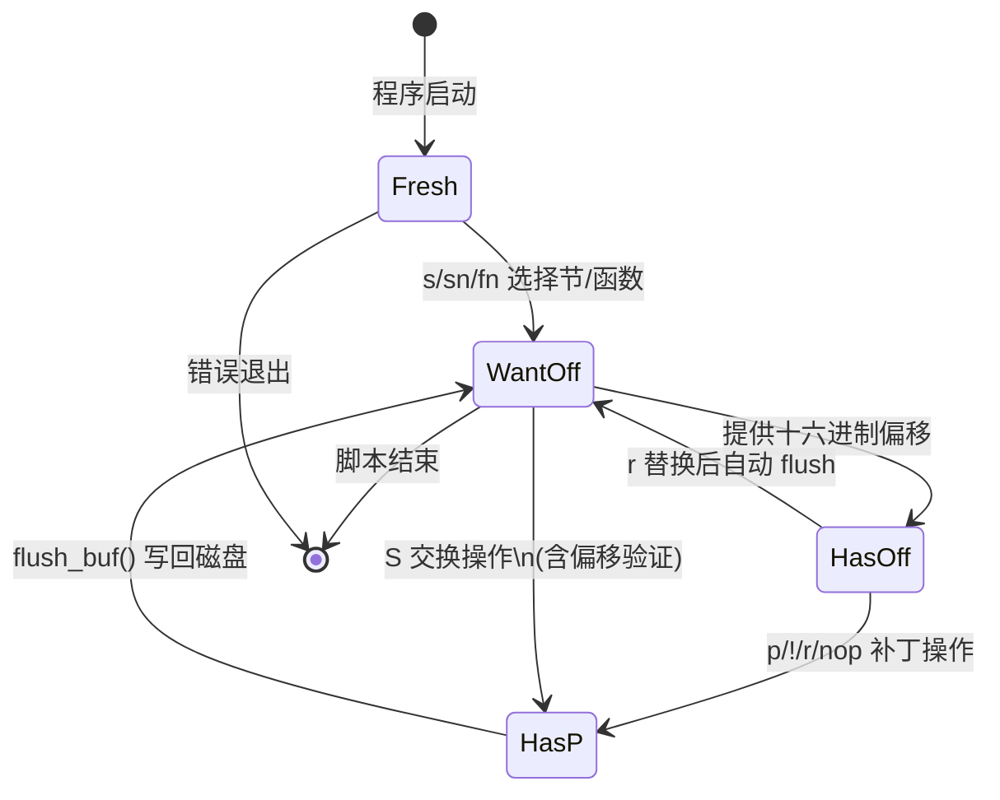

**ced** 是一个面向 NVIDIA Cubin 二进制文件的**内联补丁工具**，其设计灵感源自 Unix 经典工具 `sed`——只不过操作对象从文本行替换为 GPU 指令编码。通过精简的脚本语法，开发者可以直接在 Cubin（CUDA ELF）文件的特定偏移位置执行指令替换、字段修改、谓词补丁和指令交换等操作，而无需重新编译整个 kernel。ced 的核心价值在于：当你只需要微调某几条 SASS 指令时（例如在逆向分析或 CTF 场景中替换 `threadIdx` 读取为 `SR_MACHINE_ID`），它提供了一种比完整反汇编→修改→重汇编流水线远为轻量的替代方案。

Sources: [ced.cc](test/ced.cc#L609-L653), [ced_base.h](test/ced_base.h#L1-L68)

## 整体架构

ced 的实现围绕一个**有限状态机**展开，其类继承体系清晰地分离了 ELF 解析、SASS 指令解码和补丁逻辑三个关注点：

```
ParseSASS (SASS 汇编/解码引擎)
   ↑
CElf<ParseSASS> (ELF 加载 + SM 检测 + 符号表读取)
   ↑
CEd_base (核心补丁逻辑: 缓冲区管理、字段写入、指令生成)
   ↑
CEd (命令行驱动 + 脚本解析器)
```

**CElf** 模板类（定义于 [celf.h](test/celf.h)）负责加载 Cubin 文件，校验 ELF 机器类型是否为 NVIDIA CUDA（machine = 190），从 ELF flags 中提取 SM 版本号，并加载对应的 `sm_XX.so` 共享库。它还提供了符号表遍历、重定位表收集和常量存储段（constant bank）扫描等基础设施。

**CEd_base**（定义于 [ced_base.h](test/ced_base.h) 和 [ced_base.cc](test/ced_base.cc)）承载了所有与缓冲区读写、指令字段补丁和指令编码生成相关的核心逻辑。

**CEd**（定义于 [ced.cc](test/ced.cc)）是最终的命令行工具，解析 `.ced` 脚本并将补丁操作就地写回 Cubin 文件。

Sources: [ced_base.h](test/celf.h#L27-L62), [ced_base.h](test/ced_base.h#L10-L67), [ced.cc](test/ced.cc#L15-L85)

## 状态机与操作流程

ced 的执行遵循一个严格的**四状态有限状态机**，确保补丁操作在语义正确的上下文中执行：



| 状态 | 含义 | 允许的操作 |
|------|------|-----------|
| **Fresh** | 初始状态，尚未选择任何代码段 | `s`、`sn`、`fn` |
| **WantOff** | 已选定节/函数，等待指定偏移 | 十六进制偏移、`S`（交换）、`s`/`sn`/`fn`（重新选择） |
| **HasOff** | 已定位到具体指令，可执行补丁 | `r`、`p`、`nop`、`!@N`/`@N` |
| **HasP** | 字段补丁进行中（可能多字段组合） | 续行（空格开头）追加字段、flush 后回到 WantOff |

状态转换的核心规则是：**所有补丁操作在完成后必须调用 `flush_buf()` 将脏缓冲区写回文件**。对于多字段补丁（`p` 命令），系统进入 `HasP` 状态并推迟验证，直到所有字段就绪后通过 `new_state()` 触发最终写回。

Sources: [ced_base.h](test/ced_base.h#L62-L81), [ced.cc](test/ced.cc#L510-L581)

## 脚本语法参考

ced 脚本采用**行导向**的文本格式，每行一条命令。空行和 `#` 开头的行被忽略。与 Python 类似，**前导空格具有语义含义**——以空格开头的行被视为上一条 `p`（字段补丁）命令的续行。

### 命令完整参考

| 命令 | 语法 | 说明 |
|------|------|------|
| **选择节（按索引）** | `s <section_index>` | 通过 `readelf -S` 获得的节索引选择代码节 |
| **选择节（按名称）** | `sn <.text.xxx>` | 通过节名称（如 `.text._Z11machine_idsPj`）选择 |
| **选择函数** | `fn <function_name>` | 通过 ELF 符号表中的函数名选择，自动定位节的边界 |
| **替换指令** | `<offset> r <SASS 文本>` | 在指定偏移用 SASS 文本替换整条指令 |
| **NOP 擦除** | `<offset> nop` | 将指定偏移处的指令替换为 NOP |
| **字段补丁** | `<offset> p <field> <value>` | 修改指令的单个字段（支持枚举名或数值） |
| **多字段补丁续行** | ` <field> <value>` | 前导空格开头，追加到前一个 `p` 操作 |
| **谓词补丁** | `<offset> @<N>` | 设置谓词寄存器号为 N |
| **否定谓词** | `<offset> !@<N>` | 设置谓词寄存器号为 N 并启用否定标志 |
| **指令交换** | `S <from_off> <to_off>` | 交换两个偏移处的指令编码 |
| **指令过滤** | `if <instruction_name>` | 后续操作仅在当前指令名匹配时生效 |
| **注释** | `# ...` | 注释行，被忽略 |
| **退出** | `q` | 终止脚本处理 |

偏移量始终以**十六进制**表示，**不带** `0x` 前缀——这是为了方便从 [nvd 反汇编器](8-nvd-fan-hui-bian-qi-jia-gou-yu-elf-cubin-jie-xi) 或 `nvdisasm` 的输出中直接复制粘贴。

Sources: [ced.cc](test/ced.cc#L87-L350), [ced_base.h](test/ced_base.h#L26-L60)

## 核心补丁机制详解

### 指令替换（`r` 命令）

`r` 命令复用了 [SASS 解析引擎核心：nv_rend 渲染框架与 sass_parser 模板系统](24-sass-jie-xi-yin-qing-he-xin-nv_rend-xuan-ran-kuang-jia-yu-sass_parser-mo-ban-xi-tong) 中的 `ParseSASS` 解析器。工作流程为：解析 SASS 文本 → 匹配指令模板 → 提取字段值 → 调用 `generic_ins()` 生成完整指令编码 → 写入缓冲区。这意味着 `r` 命令接受的标准 SASS 语法与 nvd/nvdisasm 输出一致。

Sources: [ced.cc](test/ced.cc#L246-L280)

### 字段级补丁（`p` 命令）

`p` 命令是 ced 最精细也最复杂的操作。它需要识别目标字段属于哪种类型，然后选择对应的解析和编码策略：

| 字段类型 | 识别方式 | 值解析 |
|----------|---------|--------|
| **普通字段**（NV_field） | 字段名匹配 | 数值，自动除以 scale |
| **枚举字段**（nv_eattr） | 通过 `find_ea()` 查找 | 支持枚举名称字符串或数值 |
| **值属性字段**（nv_vattr） | 通过 `find()` 查找 | 根据 NV_Format 解析：整数、F16/F32/F64 浮点、E8M7 |
| **表字段**（NV_tab_fields） | 通过 `is_tab_field()` 查找 | 数值 + 表约束验证 |
| **常量存储字段**（NV_cbank） | 通过 `is_cb_field()` 查找 | 双分量（c1 + c2）联合编码 |
| **Ctrl 字段** | 特殊名称 "Ctrl" | 直接写入控制字 |

**表字段的延迟验证**是一个关键设计。SASS 指令中的某些字段构成联合约束表——例如 `value1 + value2` 必须对应表中某个合法行。当用户仅修改其中一个字段时，新值可能与另一个字段的旧值产生非法组合。因此 ced 在 `HasP` 状态下暂存未完成的表字段修改（通过 `m_inc_tabs` 集合跟踪），等待后续续行补全后再执行完整验证。

Sources: [ced.cc](test/ced.cc#L296-L492), [ced_base.h](test/ced_base.h#L176-L230)

### 指令交换（`S` 命令）

`S` 命令实现两条指令的**原位交换**，其流程使用了双缓冲策略：

1. 从当前偏移处保存指令编码到 `swap_buf1`
2. 跳转到目标偏移，保存目标指令到 `swap_buf2`
3. 将 `swap_buf1` 写入目标位置（`swap_load`）
4. flush 后跳回原偏移，将 `swap_buf2` 写入原位置
5. 重新反汇编确认结果

每个交换缓冲区为 16 字节（`swap_buf_size = 16`），足以容纳 128 位指令。

Sources: [ced_base.cc](test/ced_base.cc#L567-L611)

### 谓词补丁（`@` / `!@` 命令）

几乎所有 SASS 指令都带有前导谓词（predicate），形式为 `@P<N>` 或 `!@P<N>`。谓词补丁涉及两个底层字段：谓词寄存器号和否定标志位。`_patch_pred()` 方法通过渲染器查找谓词字段名（如 `P0`），然后分别 patch 寄存器号和 `P0@not` 否定标志。

Sources: [ced_base.cc](test/ced_base.cc#L343-L378)

### 缓冲区管理与指令宽度

ced 根据目标 SM 架构的指令宽度采用不同的缓冲区策略：

| 指令宽度 | SM 范围 | 块大小 | 每块指令数 | mask_size |
|----------|---------|--------|-----------|-----------|
| **64 位** | Fermi ~ Volta | 64 字节 | 7 条（+ 8 字节 Ctrl） | 6 → 3 |
| **88 位** | Turing ~ Ada | 32 字节 | 3 条（+ 8 字节 Ctrl） | 6 → 3 |
| **128 位** | Hopper+ | 16 字节 | 1 条 | 7 → 4 |

缓冲区读取采用**延迟加载**策略：仅当新偏移跨越块边界时才从文件重新读取（`rdr_cnt` 计数器跟踪），写回则在块脏标记（`block_dirty`）置位且离开当前块或完成补丁操作时执行（`flush_cnt` 计数器跟踪）。这种设计最大限度减少了磁盘 I/O 次数。

Sources: [ced_base.cc](test/ced_base.cc#L132-L141), [ced_base.h](test/ced_base.h#L238-L261)

## 安全检查机制

ced 在多个环节插入了安全警告，防止无意破坏 Cubin 结构：

- **偏移边界校验**：验证偏移是否在所选节/函数的 `[m_obj_off, m_obj_off + m_obj_size)` 范围内
- **对齐检查**：确认偏移按指令宽度对齐，未对齐时自动修正并发出警告
- **标签冲突检测**：通过解析 `.nv.info` 属性节中的 `EIATTR_*_INSTR_OFFSETS` 标记，检测补丁位置是否与 coop group 入口、exit 指令、间接分支目标等特殊标签冲突
- **重定位警告**：如果偏移处存在重定位条目，发出警告并记录重定位信息
- **Ctrl Word 修正**：当偏移指向控制字（Ctrl Word）而非指令时，自动修正到下一条指令位置

Sources: [ced_base.cc](test/ced_base.cc#L458-L504), [ced.cc](test/ced.cc#L42-L64)

## 使用示例

### 从脚本文件批量补丁

典型的 ced 工作流需要先从 Cubin 中提取 Fat Binary，再用 ced 补丁后再重新注入：

```bash
# 1. 从可执行文件中提取第一个 Fat Binary 到文件 "53"
../fb/fb -i 1 -o 53 ./a53

# 2. 用 ced 执行补丁脚本
../test/ced -v 53 53.ced

# 3. 将补丁后的 Fat Binary 替换回可执行文件
../fb/fb -i 1 -r 53 ./a53
```

对应的 `53.ced` 脚本（将偏移 0x28 处的指令替换为 `MOV R0, RZ, 0xf`）：
```
s 8
28 r MOV R0, RZ, 0xf
```

Sources: [ctf/Makefile](ctf/Makefile#L8-L12), [ctf/53.ced](ctf/53.ced#L1-L3)

### 按函数名定位并修改字段

`md.ced` 展示了按函数名定位并修改 S2R 指令中系统寄存器属性的用法：

```
sn .text._Z11machine_idsPj
# 将 SR_TID.X (threadIdx.x) 替换为 SR_MACHINE_ID_0
10 p SRa 24
20 r S2R R5, SR_REGALLOC
# 继续替换其他系统寄存器
40 p SRa 25
50 p SRa 26
60 p SRa 27
```

这里 `sn` 通过节名定位，`p SRa 24` 表示将 `SRa` 字段（系统寄存器地址）修改为值 24（对应 `SR_MACHINE_ID_0`）。

Sources: [ctf/md.ced](ctf/md.ced#L1-L8)

### 指令过滤与条件补丁

`1.ced` 展示了 `if` 过滤器的使用——仅当偏移处的指令名为 `SHF` 时才执行替换：

```
# 将 SHF（移位）指令替换为 MOV R0, RZ
s 10
if SHF
40 r MOV R0, RZ
```

Sources: [ctf/1.ced](ctf/1.ced#L1-L4)

### 指令替换与 NOP 擦除混合

`pc.ced` 在同一节中混合使用了指令替换和 NOP 擦除：

```
s 9
40 r LEPC R4
30 r NOP
60 r STG.E.64.SYS [R2], R4
# 60 p sz 5   <-- 被注释掉的备选方案
```

Sources: [ctf/pc.ced](ctf/pc.ced#L1-L5)

## 命令行选项

```
usage: ced [options] cubin [script]
Options:
 -d   调试模式（打印详细的状态转换和字段解析信息）
 -h   十六进制转储（在关键操作前后输出缓冲区内容）
 -k   转储 kv（输出指令的字段键值对）
 -t   转储符号（列出 ELF 符号表内容）
 -v   详细模式（显示加载数据、节信息、补丁警告等）
```

当未指定 `script` 参数时，ced 从标准输入读取命令（交互模式）。脚本文件的典型扩展名为 `.ced`。

Sources: [ced.cc](test/ced.cc#L612-L653)

## 编译构建

ced 依赖以下组件：

- **libced.a**：静态库，包含 `ced_base.o`、`sass_parser.o`、`nv_rend.o`、`nv_lat.o`、`bf16.o`
- **sm_XX.so**：目标 SM 架构的指令描述共享库（由 [ead.pl 指令编码生成器](6-ead-pl-zhi-ling-bian-ma-sheng-cheng-qi-cong-miao-shu-wen-jian-dao-sm_xx-so-gong-xiang-ku) 生成）
- **ELFIO**：第三方 ELF 读写库
- **FP16**：半精度浮点数转换库

```bash
cd test
make ced           # 编译 ced 可执行文件
make libced.a      # 编译静态库
```

编译 ced 时需要提供 ELFIO 头文件路径、FP16 头文件路径和 `scripts/` 目录（包含 `nv_types.h` 等）。

Sources: [test/Makefile](test/Makefile#L18-L50)

## Perl XS 绑定：Cubin::Ced

除命令行工具外，ced 的核心功能还通过 Perl XS 模块 [Cubin::Ced](test/Cubin-Ced/lib/Cubin/Ced.pm) 暴露为编程接口。XS 绑定定义在 [Ced.xs](test/Cubin-Ced/Ced.xs) 中，通过 `Ced_perl` 类（继承 `CEd_base`）桥接 C++ 引擎与 Perl 世界。

该绑定提供了丰富的查询和补丁 API：

| Perl 方法 | 功能 |
|-----------|------|
| `set_f(name)` / `set_s(idx\|name)` | 选择函数或节 |
| `off(offset)` | 定位到指定偏移 |
| `next()` | 移动到下一条指令 |
| `ins_name()` | 获取当前指令名 |
| `render()` | 渲染当前指令为文本 |
| `efields()` | 提取所有已解码字段 |
| `nop()` | 将当前指令替换为 NOP |
| `replace(text)` | 用 SASS 文本替换当前指令 |
| `patch_pred(is_not, v)` | 补丁谓词 |
| `patch_field(name, value)` | 补丁单个字段 |
| `track(RegTrack)` | 寄存器追踪 |

Perl 绑定使得 ced 的补丁能力可以嵌入到更复杂的自动化流程中——例如 [dg.pl Cubin 分析](21-dg-pl-cubin-fen-xi-cfg-gou-jian-zhi-ling-diao-du-you-hua-yu-ji-cun-qi-fu-yong) 中的 CFG 构建和调度优化脚本。

Sources: [Ced.xs](test/Cubin-Ced/Ced.xs#L174-L398), [Cubin-Ced.t](test/Cubin-Ced/t/Cubin-Ced.t#L1-L133)

## 相关页面

- **前置知识**：[nvd 反汇编器架构与 ELF/CUBIN 解析](8-nvd-fan-hui-bian-qi-jia-gou-yu-elf-cubin-jie-xi) — ced 复用了 nvd 的 ELF 加载和 SASS 解码基础设施
- **前置知识**：[SASS 指令编码字段与掩码机制](9-sass-zhi-ling-bian-ma-zi-duan-yu-yan-ma-ji-zhi) — 理解字段补丁需要了解掩码编码原理
- **实践场景**：[CTF 工具与 Cubin 二进制补丁实践](22-ctf-gong-ju-yu-cubin-er-jin-zhi-bu-ding-shi-jian) — ced 在 CTF 中的完整使用案例
- **工具协作**：[Fat Binary 格式解析与解压（fb 工具）](19-fat-binary-ge-shi-jie-xi-yu-jie-ya-fb-gong-ju) — ced 通常需要 fb 配合提取/注入 Cubin
- **底层引擎**：[SASS 解析引擎核心：nv_rend 渲染框架与 sass_parser 模板系统](24-sass-jie-xi-yin-qing-he-xin-nv_rend-xuan-ran-kuang-jia-yu-sass_parser-mo-ban-xi-tong) — ced 的指令解析与编码生成依赖此框架