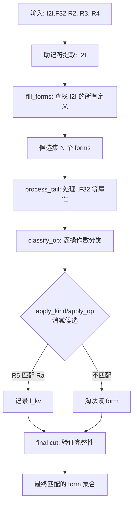
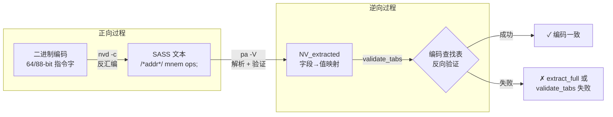

**pa** 是项目中最精巧的验证工具之一——它读取 nvdisasm 风格的 SASS 文本输出，将其重新解析为结构化的指令编码数据，从而实现**反汇编→文本→再解析**的完整闭环验证。这个闭环被作者称为 **"Strange Loop"**：先用 `nvd -c` 生成兼容 nvdisasm 格式的输出，再用 `pa` 消费这些输出，验证每条指令的编码字段是否能够被精确还原。本文将深入解析 pa 的输入处理、SASS 文本解析引擎（sass_parser）、指令候选集消减算法，以及"Strange Loop"验证流程的完整数据流。

Sources: [README.md](README.md#L40-L46), [test/pa.cc](test/pa.cc#L1-L259)

## 整体架构与数据流

pa 工具的定位可以用一张数据流图清晰表达：

```mermaid
flowchart LR
    A["CUBIN/ELF 二进制"] -->|"nvd -c"| B["nvdisasm 兼容文本"]
    B -->|"pa 输入"| C["行扫描器<br/>正则匹配"]
    C -->|"SM 版本"| D["sm_XX.so<br/>动态加载"]
    C -->"指令文本" --> E["ParseSASS<br/>指令解析引擎"]
    D -->|"指令定义<br/>渲染器"| E
    E -->|"候选集"| F["表单消减<br/>apply_kind/apply_op"]
    F -->|"精确匹配"| G{"验证模式<br/>-V ?"}
    G -->|是| H["validate_tabs<br/>表查找验证"]
    G -->|"表单摘要 -s"| I["print_fsummary"]
    G -->|"寄存器追踪 -T"| J["track_regs<br/>reg_pad"]
```

这个架构的核心洞察在于：**解析 SASS 文本本质上是反汇编的逆过程**。反汇编从二进制编码提取字段值并渲染为文本，而 pa 从文本中逆向提取字段值并验证其编码合法性。两者共享同一套 `sm_XX.so` 指令定义和 `NV_renderer` 渲染框架。

Sources: [test/pa.cc](test/pa.cc#L164-L259), [test/nv_rend.cc](test/nv_rend.cc#L550-L573)

## pa 主程序：输入扫描与状态机

pa 的 `main()` 函数实现了一个简洁的三态有限状态机，逐行处理输入：

| 状态 | 含义 | 触发条件 |
|------|------|----------|
| **0** | 初始态，扫描 SM 版本 | `.target sm_XX` 或 `.headerflags ...EF_CUDA_SMXX...` |
| **1** | 已识别架构，扫描段定义 | `.section .text...` |
| **2** | 在代码段内，解析指令 | `/*hex_offset*/ mnemonic operands;` |

状态机的转换逻辑依赖三个关键正则表达式。`.target` 正则匹配新版 nvdisasm 输出格式，`.headerflags` 正则匹配旧版格式中的 `EF_CUDA_SMXX` 标记。代码段识别使用 `/*hex*/` 前缀模式，其中 `matches[1]` 捕获十六进制偏移量，`matches[2]` 捕获指令助记符与操作数的完整文本。

Sources: [test/pa.cc](test/pa.cc#L196-L250)

### 命令行选项

pa 提供了丰富的诊断选项，用于不同层次的验证与分析：

| 选项 | 功能 | 典型场景 |
|------|------|----------|
| `-d` | 调试模式，输出内部状态 | 开发调试 |
| `-e` | 跳过最终裁剪（skip final cut） | 调试 IMAD 等模糊指令 |
| `-k` | 转储键值对（KV dump） | 查看提取的编码字段 |
| `-m` | 转储未匹配字段 | 排查解析失败 |
| `-o` | 跳过操作数解析 | 仅验证助记符 |
| `-s` | 打印表单摘要 | 查看候选指令信息 |
| `-S` | 打印统计信息 | 批量验证成功率 |
| `-T` | 寄存器追踪 | 分析寄存器读写模式 |
| `-v` | 详细模式 | 逐步跟踪解析过程 |
| `-V` | 验证模式（极慢） | Strange Loop 完整验证 |

Sources: [test/pa.cc](test/pa.cc#L147-L162)

### SM 架构加载机制

当状态机从输入中提取到 SM 版本号后，`MyParseSASS::init()` 执行以下流程：将版本号拼合为 `smXX` 字符串，在 `s_sms` 映射表中查找对应的共享库文件名（某些架构如 sm_30 映射到 `sm3`），然后通过 `NV_renderer::load()` 使用 `dlopen` 动态加载 `sm_XX.so`。`SM_DIR` 环境变量允许用户指定非当前目录的搜索路径。加载成功后，`init_guts()` 初始化枚举表（`m_renums`）、排序指令集（`m_sorted`）、虚线枚举（`m_dotted`）等关键数据结构。

Sources: [test/pa.cc](test/pa.cc#L63-L92), [test/nv_rend.cc](test/nv_rend.cc#L550-L573), [test/sass_parser.cc](test/sass_parser.cc#L1633-L1657)

## ParseSASS 解析引擎：候选集消减算法

ParseSASS 是 pa 的核心引擎，继承自 `NV_renderer`。它的解析策略是**候选集消减**（candidate elimination）：为每条输入指令生成所有可能的指令表单（forms），然后通过一系列匹配步骤逐步淘汰不匹配的候选，最终留下精确匹配。



### `one_form`：候选指令的内部表示

每个候选指令被封装为 `one_form` 结构，包含：指向 `nv_instr` 定义（含编码掩码、属性、表引用）的指针，指向渲染列表 `NV_rlist` 的指针，局部键值存储 `l_kv`（保存从文本中提取的字段值），以及操作数列表 `ops` 和当前位置迭代器 `current`。`ops` 列表中的每个 `form_list` 元素对应一个渲染槽位（如谓词、枚举修饰符、操作数等），而 `current` 迭代器标记当前正在匹配的位置。

Sources: [test/sass_parser.h](test/sass_parser.h#L96-L120)

### `fill_forms`：候选集初始化

`fill_forms()` 方法接收助记符对应的 `nv_instr` 定义列表，为每个定义创建一个 `one_form` 候选。它遍历渲染列表，将每个渲染元素包装为 `form_list` 并追加到 `ops` 中。对于带有 `ignore` 标记的枚举属性（如 `LUTOnly`、`USCHED_INFO`），它们被附加到前一个操作数的 `lr` 子列表中而非独立槽位，这确保了它们不会在操作数位置匹配中被独立消费。初始化完成后，所有候选的 `current` 迭代器指向 `ops` 的起始位置。

Sources: [test/sass_parser.cc](test/sass_parser.cc#L1364-L1409)

### `classify_op`：操作数分类分发

`classify_op()` 是操作数解析的核心分发器，被称为"main horror"（主要噩梦）。它通过前缀匹配和字符分类将操作数文本路由到不同的处理路径：

| 输入前缀/模式 | 处理方法 | 说明 |
|---------------|----------|------|
| `c[` / `cx[` | `parse_c_left<render_C>` | 常量存储器引用 |
| `desc[` | `parse_c_left<render_desc>` | 描述符引用 |
| `a[` / `[` | `parse_mem_right<render_mem>` | 内存地址操作数 |
| `ttu[` | `parse_c_left<render_TTU>` | 纹理/张量单元引用 |
| `0x...` | `parse_hex_tail` + `reduce_value` | 十六进制立即数 |
| `(*"BRANCH_TARGETS...` | `reduce_label` | 分支目标标签 |
| `` `(`...`` | `reduce_label` | 代码标号 |
| `@`/`!` | `reduce_pred` | 谓词寄存器 |
| `|...|` | `apply_enum` | 绝对值/枚举 |
| `32@lo(`/`32@hi(` | `reduce_label` | 32 位拆分标签 |
| 数字/浮点 | `reduce_value` | 立即数值 |
| 其他标识符 | `apply_enum` | 枚举值匹配 |

值得注意的是 `classify_op` 是**递归的**（最大深度约 3 层），因为某些操作数内部包含子操作数，例如 `BRX R2 -0x110 (*"INDIRECT_CALL"*)` 需要依次处理枚举值、十六进制偏移和标签注解。

Sources: [test/sass_parser.cc](test/sass_parser.cc#L819-L1018)

### 消减模板方法

ParseSASS 使用一套精巧的 C++ 模板方法实现候选集消减。核心是三个层次的操作：

**`check_kind`** — 仅检查不修改：统计有多少候选的当前操作数位置匹配指定类型（如 `R_value`、`R_C`），用于在提交消减前探测可行性。

**`apply_kind`** — 提交消减：使用 `std::erase_if` 移除不匹配的候选。对于带默认值的枚举/谓词属性（通过 `NV_PE_RPT` 宏），如果候选缺少显式匹配但属性有默认值，则予以保留而非淘汰。

**`apply_op`** — 带副作用的消减：除了类型匹配外，还允许通过闭包将提取的值写入候选的 `l_kv` 存储。它支持单闭包和双闭包版本，后者通过 `skip` 谓词处理需要跳过的特殊操作数（如 BAR 指令的 `Sc` 字段）。

每个模板方法都利用编译期 `get_arity` 特征（从 Lambda 推导参数数量）自动选择单参数或双参数（含 `one_form&`）的回调签名，实现了零运行时开销的接口统一。

Sources: [test/sass_parser.h](test/sass_parser.h#L145-L249)

### `add` 的最终裁剪

在所有操作数匹配完成后，`add()` 方法执行 **final cut**（最终裁剪）。这是候选集消减的最后防线：遍历每个候选的所有已处理和未处理操作数，检查是否所有无默认值的必选枚举都已获得 `l_kv` 赋值。裁剪分两轮——第一轮严格模式，若所有候选均被淘汰则进入宽松模式（relax），后者会忽略仅含单一枚举值的无默认值属性。这种两轮策略解决了 IMAD 等模糊指令因枚举关联不完整导致过度淘汰的问题。

Sources: [test/sass_parser.cc](test/sass_parser.cc#L1443-L1507)

## "Strange Loop"验证流程

"Strange Loop" 是 pa 工具最具哲学意味的设计——它构成了**自验证循环**。核心思想来自 README 的描述："You can run 'strange loop' to consume output of nvd - for this later must use option `-c`"。

### 验证环的数据流



### `_extract_full`：全字段提取

验证的第一步是 `MyParseSASS::verify()` 调用 `_extract_full()`。与普通提取（`_extract`）不同，全字段提取不仅收集文本中显式出现的字段，还会遍历渲染列表中所有**带默认值的枚举和谓词**，将它们的默认值填充到结果映射中。对于复合类型操作数（`R_C`、`R_desc`、`R_TTU`、`R_M1`），它会递归处理左侧和右侧子元素的默认值。这确保了验证时每个编码字段都有确定的数值，即使是文本中未显式写出的隐式属性。

Sources: [test/sass_parser.cc](test/sass_parser.cc#L54-L95), [test/pa.cc](test/pa.cc#L43-L57)

### `validate_tabs`：查找表验证

`NV_renderer::validate_tabs()` 是验证的第二步。许多 SASS 指令的编码字段之间存在约束关系（例如浮点格式、舍入模式和类型修饰符的组合必须合法），这些约束被编码为**查找表**（`NV_tab`）。验证逻辑对指令的每个 `tab_fields` 引用，将提取的字段值组装为行向量，然后在对应的查找表中搜索匹配项。如果查找失败（`check_tab` 返回 false），说明从文本恢复的编码字段组合不合法——这直接暴露了解析或渲染的 bug。

Sources: [test/nv_rend.cc](test/nv_rend.cc#L1059-L1086)

### Strange Loop 的意义

这个自验证循环的价值在于：它不仅验证了 **pa 解析器** 的正确性，更验证了整个 **指令编码知识库**（`sm_XX.so` 中的 `nv_instr` 定义、渲染器、查找表）的自洽性。如果 `nvd -c` 生成的文本能被 `pa -V` 完美回溯，就证明了反汇编→文本→编码这条数据通路是精确可逆的。任何断裂点——缺失的枚举值、错误的默认值、不完整的查找表——都会被 `-V` 模式捕获并报告偏移量。

典型用法如下：

```bash
# 步骤 1: nvd 生成兼容 nvdisasm 的输出
nvd -c -o kernel.asm kernel.cubin

# 步骤 2: pa 消费输出并验证
pa -V -S kernel.asm

# 输出示例:
# total 1234 succ 1230 forms 1230 rate 0.996757 avg 1.000000
# [!] 0x1A30 - extract_full failed    ← 编码不一致处
```

Sources: [README.md](README.md#L40-F46), [test/pa.cc](test/pa.cc#L43-F57)

## 寄存器追踪模式

通过 `-T` 选项，pa 可以在解析每条指令的同时追踪寄存器的读写历史。`MyParseSASS::add_with_rt()` 在成功解析后，调用基类的 `track_regs()` 方法将当前指令的寄存器访问记录到 `reg_pad` 数据结构中。

`reg_pad` 维护四组寄存器集合：通用寄存器（`gpr`）、统一寄存器（`ugpr`）、谓词寄存器（`pred`）和统一谓词（`upred`），每组以寄存器索引为键、`reg_history` 向量为值。每条记录包含指令偏移量和一个 `RH`（register history）位域，编码了读/写方向（0x8000 位）、谓词来源（0x4000 位 + 3 位索引）、复用标记（0x200 位）、宽操作索引（3 位）和操作数角色（低 4 位）。

此外 `cbank_history` 追踪常量存储区访问（偏移量、段号、大小），`track_snap` 提供每条指令的瞬时寄存器访问快照（区分读/写/复用）。每个代码段结束时 `dump_rt()` 输出完整的寄存器生命周期追踪。

Sources: [test/nv_rend.h](test/nv_rend.h#L62-F294), [test/nv_rend.cc](test/nv_rend.cc#L934-F1010), [test/pa.cc](test/pa.cc#L25-F42)

## 表单摘要与键值转储

`-s` 选项触发 `print_fsummary()`，为每条指令输出匹配的表单信息：指令行号、渲染后的助记符文本，以及标签信息（若存在）。`-k` 选项进一步展开键值对数据——包括全局属性（如 `usched_info`、`req_bit_set`）和每个表单的局部字段值。对于带值属性（`nv_vattr`）的字段，它会查找对应的格式化方式（如 `UImm`、`SImm`、`F32Imm`）并以可读形式展示。

Sources: [test/pa.cc](test/pa.cc#L94-F142)

## 与其他工具的关系

pa 在项目工具链中扮演着**质量保证**的角色，与其他工具形成互补关系：

| 工具 | 角色 | 与 pa 的关系 |
|------|------|-------------|
| [nvd 反汇编器](8-nvd-fan-hui-bian-qi-jia-gou-yu-elf-cubin-jie-xi) | 二进制→文本 | `-c` 模式为 pa 提供输入 |
| [ina 交互式汇编器](12-ina-jiao-hu-shi-sass-hui-bian-qi-zhi-ling-biao-dan-guo-lu-yu-bian-ma) | 文本→二进制 | 共享 ParseSASS 解析框架 |
| [ced 补丁工具](13-ced-lei-sed-de-cubin-nei-lian-bu-ding-gong-ju) | 二进制修改 | 使用 pa 验证补丁结果 |
| [dg.pl 分析器](21-dg-pl-cubin-fen-xi-cfg-gou-jian-zhi-ling-diao-du-you-hua-yu-ji-cun-qi-fu-yong) | CFG 与调度优化 | 处理相同的 SASS 文本格式 |
| [SASS 解析引擎](24-sass-jie-xi-yin-qing-he-xin-nv_rend-xuan-ran-kuang-jia-yu-sass_parser-mo-ban-xi-tong) | 基础框架 | pa 基于 ParseSASS/NV_renderer 构建 |

pa 与 ina 共享 `ParseSASS` 基类和 `sass_parser.cc` 实现，但面向不同方向：ina 从用户输入构建编码，pa 从已有文本验证编码。两者共同验证了指令定义知识库的完备性。