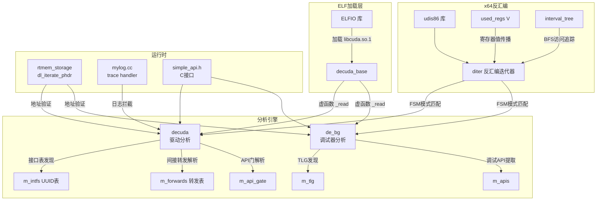
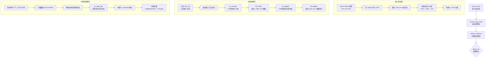

`decuda` 是一套针对 NVIDIA CUDA 驱动共享库（`libcuda.so.1`）进行静态分析与运行时验证的框架。它的核心能力在于：通过**ELF 二进制加载**与 **x64 指令流模式识别**，自动提取驱动内部的调试接口表、间接转发机制、API 入口门以及 TLG（Trace Log Group）配置，并能够在运行时通过地址重定位和内存映射对静态发现的结果进行验证与补丁。该框架还集成了基于 udis86 的 x64 反汇编引擎，采用有限状态机（FSM）驱动的指令序列匹配方法，实现了对高度混淆的驱动代码结构的自动化逆向分析。

Sources: [decuda.h](cudaso/decuda.h#L1-L82), [decuda.cc](cudaso/decuda.cc#L1-L16), [simple_api.h](cudaso/simple_api.h#L1-L27)

## 整体架构

框架围绕一条"**加载 → 枚举 → 发现 → 验证**"的分析流水线构建。`decuda_base` 提供 ELF 加载与段识别基础设施；`decuda` 在此基础上通过 x64 反汇编实现接口表发现与调试基础设施提取；`de_bg` 则专注于 CUDA 调试器（`libcudadebugger.so.1`）的分析与运行时补丁。三者共享由 `diter`（反汇编迭代器）和 `used_regs<V>`（寄存器值追踪）构成的 x64 指令分析工具集。



Sources: [decuda_base.h](cudaso/decuda_base.h#L63-L113), [decuda.h](cudaso/decuda.h#L14-L79), [de_bg.h](cudaso/de_bg.h#L10-L43), [x64arch.h](cudaso/x64arch.h#L156-L198)

## 类层次与职责划分

| 类/结构体 | 继承关系 | 职责 |
|-----------|----------|------|
| `decuda_base` | 无（基类） | ELF 加载、段枚举、符号/重定位读取、Trie 字符串查找（TLG） |
| `decuda` | `decuda_base` | 驱动接口表提取、调试标志/尺寸表解析、间接转发发现、运行时验证 |
| `de_bg` | `decuda_base` | 调试器 API 分析、TLG 发现与补丁、日志处理器注入 |
| `diter` | 无 | udis86 封装、指令解码、x64 指令谓词判断、跳转目标计算 |
| `used_regs<V>` | 无 | 寄存器值传播追踪（支持 mov/lea/add 传播与查询） |
| `rtmem_storage` | 无 | 运行时进程内存映射（基于 `dl_iterate_phdr`），提供地址查询与模块定位 |
| `bm_search` | 无 | Boyer-Moore 字节模式搜索，用于 UUID 定位 |
| `auto_dlclose` | 无 | RAII 封装 `dlopen`/`dlclose`，确保动态库句柄安全释放 |

Sources: [decuda_base.h](cudaso/decuda_base.h#L63-L113), [decuda.h](cudaso/decuda.h#L14-L79), [de_bg.h](cudaso/de_bg.h#L4-L43), [x64arch.h](cudaso/x64arch.h#L156-L248), [rtmem.h](cudaso/rtmem.h#L7-L36)

## decuda_base：ELF 加载基础设施

`decuda_base` 是整个框架的根基。它封装了 ELF 文件的加载流程，并将二进制的段结构映射为可直接访问的 C++ 对象。

**段枚举**在 `read()` 方法中完成。遍历所有 ELF section header，将 `.text`、`.rodata`、`.data`、`.data.rel.ro`、`.bss` 分别存储到对应的 `std::optional<ELFIO::section *>` 字段中。同时收集 `SHT_REL` 和 `SHT_RELA` 重定位段，统一读取后按偏移量排序存入 `m_relocs` 向量，供后续分析使用。符号表（`SHT_SYMTAB` / `SHT_DYNSYM`）则通过 `read_syms()` 提取为 `std::map<std::string, elf_symbol>` 的名称索引映射。

**TLG（Trace Log Group）发现**是 `decuda_base` 提供的重要能力。`process_tlg()` 方法接收一组目标字符串名称，采用两阶段查找策略：第一阶段在 `.rodata` 段中使用 Aho-Corasick Trie 搜索所有目标字符串的偏移地址；第二阶段将这些地址作为 8 字节模式，在 `.data` 段中搜索对应的指针条目。找到的条目地址即为运行时 TLG 配置结构的位置。

Sources: [decuda_base.cc](cudaso/decuda_base.cc#L65-L95), [decuda_base.h](cudaso/decuda_base.h#L97-L113), [decuda_base.cc](cudaso/decuda_base.cc#L97-L142)

## x64 反汇编引擎：diter 与指令模式识别

### diter 反汇编迭代器

`diter` 结构体是框架的 x64 指令分析核心。它封装了 **udis86** 反汇编库，提供了一套面向模式匹配的高级指令谓词 API。其设计理念是：将反汇编过程抽象为"设置起始位置 → 逐条迭代 → 谓词匹配 → 状态推进"的流式处理模型。

初始化时通过 `ud_init` / `ud_set_mode` 配置为 64 位模式（或可选 32 位）。`setup(off)` 方法将输入缓冲区定位到 ELF `.text` 段内的指定偏移，`next()` 执行一条指令的反汇编并返回指令长度。每条反汇编后的指令都可通过一系列谓词方法进行检查。

**跳转指令识别**是控制流分析的基础。`is_jxx_jimm()` 系列方法支持可变参数模板，允许同时检查多个助记符类型（如 `is_jxx_jimm(UD_Ijz, UD_Ijnz)`）。`jmp_tag` 枚举覆盖了全部 x64 条件跳转类型（`jo` 到 `jmp`），并通过 `get_jmp()` 方法根据操作数宽度（8/16/32 位）自动计算跳转目标地址。

**RIP 相对寻址检测**是驱动分析中最关键的谓词。`is_r1()` 检测 `mov reg, [rip + disp]` 形式（操作数 0 为寄存器、操作数 1 为 `[rip+disp]`），`is_r0()` 检测反向形式。`is_mrip()` 系列则支持对任意指令的指定操作数进行 RIP 相对检查。这些谓词配合 `get_jmp(idx)` 方法，可以从反汇编流中直接提取全局地址引用。

Sources: [x64arch.h](cudaso/x64arch.h#L156-L248), [x64arch.h](cudaso/x64arch.h#L596-L717), [x64arch.cc](cudaso/x64arch.cc#L1-L140)

### used_regs：寄存器值传播追踪

`used_regs<V>` 是一个模板化的寄存器值追踪容器，维护从寄存器标识符（`ud_type`）到抽象值 `V` 的映射。在 x64 指令流分析中，它充当简易的**定值分析（def-use analysis）**引擎。

核心操作包括：`add(reg, value)` 记录寄存器当前绑定的值；`add_off(reg_dst, reg_src, value)` 模拟 `add reg_dst, reg_src, imm` 语义，将源寄存器的已知值加上偏移量赋给目标寄存器；`asgn(reg, out_value)` 查询寄存器的当前绑定值；`mov(src, dst)` 模拟寄存器间赋值。当分析 `mov rax, [rip + data_addr]` 后再遇到 `call rax` 时，追踪器就能直接确定调用目标。

`regs_state<S, T>` 扩展了 `used_regs`，附加了一个用户自定义状态 `S`，用于在图搜索算法中同时维护寄存器状态和搜索状态。

Sources: [x64arch.h](cudaso/x64arch.h#L40-L153)

### 指令谓词体系

`diter` 提供了覆盖 x64 指令集主要类别的 50+ 谓词方法。下表按功能分类列出关键谓词：

| 类别 | 谓词方法 | 匹配模式 | 典型用途 |
|------|----------|----------|----------|
| **数据传送** | `is_mov64()` | `mov` + 64位操作数 | 追踪指针加载 |
| | `is_mov32()` | `mov` + 32位操作数 | 追踪标志/ID加载 |
| | `is_lea()` / `is_lea(r)` | `lea reg, [rip+X]` | 提取地址常量 |
| | `is_mov_rr()` | `mov reg, reg` | 寄存器传播 |
| **控制流** | `is_jxx_jimm(op...)` | 条件跳转 + 立即操作数 | 控制流追踪 |
| | `is_call_jimm()` / `is_call_reg()` | 调用指令 | 函数调用发现 |
| | `is_end()` | `ret`/`int3`/`hlt`/`jmp` | 基本块终止 |
| **算术/逻辑** | `is_add_rimm()` / `is_sub_rimm()` | 加减立即数 | 地址计算 |
| | `is_cmp_rimm()` / `is_test_rr()` | 比较与测试 | 条件分支检测 |
| | `is_and_rimm()` / `is_xor_rr()` | 位运算 | 标志位操作 |
| **内存操作** | `is_r1()` / `is_r0()` | `[rip+disp]` 操作数 | 全局数据引用 |
| | `is_rmem()` / `is_memr()` | 寄存器-内存操作 | 栈/堆访问 |
| **RIP相对** | `is_mrip(op, idx)` | 指定操作数的 `[rip+disp]` | 精确地址提取 |

Sources: [x64arch.h](cudaso/x64arch.h#L395-L596), [x64arch.h](cudaso/x64arch.h#L615-L717)

## decuda：驱动分析主流程

### 分析流水线

`decuda::_read()` 按序执行三个核心分析阶段：



Sources: [decuda.cc](cudaso/decuda.cc#L11-L16)

### 接口表发现：find_intf_tab

CUDA 驱动使用 UUID 标识的接口表来组织功能 API。`find_intf_tab()` 通过以下步骤定位并提取这些接口：

1. 使用 **Boyer-Moore 搜索**在 `.rodata` 段中定位一个已知的 UUID（`first_intf`，硬编码为 `2C8E0AD8-0710-AB4E-90DD-5471-9FE5F74B`）
2. 在 `.data.rel.ro` 段的重定位表中搜索指向该 UUID 地址的指针条目
3. 从匹配的重定位位置开始，按连续 8 字节步进读取三元组：{UUID 指针 → 接口函数表地址 → 接口大小}，直到重定位条目不再连续

每个接口描述为 `one_intf` 结构，包含 16 字节 UUID、函数表虚拟地址和入口数量。`find()` 方法支持通过 UUID 快速查找特定接口。

Sources: [decuda.cc](cudaso/decuda.cc#L289-L354), [decuda.h](cudaso/decuda.h#L8-L12), [decuda.h](cudaso/decuda.h#L51-L57), [bm_search.h](cudaso/bm_search.h#L4-L18)

### 调试标志与尺寸表解析

`resolve_flag_sztab()` 在接口函数表中搜索两个特殊方法入口：

**尺寸表提取**（`try_sizetab`）使用 3 状态 FSM 在接口方法入口点反汇编最多 20 条指令。状态机依次匹配：`cmp reg32, imm32`（提取入口数量）→ `ja/jae`（确定是否含等号）→ `lea reg, [rip + rodata_addr]`（定位尺寸表地址）。`fill_sztab()` 随后从 `.rodata` 段读取 `uint32_t` 数组。

**调试表提取**（`try_dbgtab`）在尺寸表所在方法之后的方法入口点运行，搜索 `lea reg, [rip + flag_sztab_addr]`（引用已发现的尺寸表）后紧跟 `lea reg, [rip + data_rel_ro_addr]`（指向调试函数指针表）。`fill_dbgtab()` 从 `.data.rel.ro` 段读取函数指针数组。

Sources: [decuda.cc](cudaso/decuda.cc#L107-L169), [decuda.cc](cudaso/decuda.cc#L264-L287), [decuda.cc](cudaso/decuda.cc#L362-L374)

### 间接转发与 API 门解析

**间接调用发现**（`resolve_indirects`）枚举所有 `STT_FUNC` 类型符号，对每个函数入口点运行 `try_indirect` FSM。该 FSM 搜索一个三步模式：`cmp reg, 0x321CBA00`（魔数常量）→ `jz`（条件跳转）→ `call/jmp [data_addr]`（间接分发）。匹配成功后从 `.data` 段读取目标函数指针，构建 `one_forward` 条目，其中包含数据段偏移、回调地址和调试标志地址。

`try_dbg_flag` 是一个辅助 FSM，在间接调用的实际回调函数中搜索调试标志模式：`mov reg32, [rip + bss_addr]` → `test reg, reg` → `call trace_fn`。成功后提取 `flag_addr`（BSS 段调试开关）和 `trace_fn`（追踪函数地址）。

**API 门解析**（`resolve_api_gate`）专门处理 `cudbgApiDetach` 符号。它采用 **BFS 广度优先搜索**遍历控制流图，使用 `interval_tree` 记录已访问的地址区间以避免重复分析。搜索过程中追踪 `mov reg64, [rip + data/bss]` 指令，在遇到 `jmp reg` 或 `call reg` 时从追踪器中读取目标地址，从而定位驱动的调试 API 入口门和 API 数据指针。

Sources: [decuda.cc](cudaso/decuda.cc#L223-L259), [decuda.cc](cudaso/decuda.cc#L18-L105), [decuda.cc](cudaso/decuda.cc#L171-L221)

## 运行时验证与补丁机制

### 地址重定位

`_verify()` 方法实现了从静态分析到运行时验证的桥梁。它通过以下步骤计算地址重定位增量：

1. 获取 ELF 文件中的第一个符号名称
2. 使用 `dlopen("libcuda.so.1", 2)` 加载运行时驱动
3. 使用 `dlsym()` 查找同一符号的运行时地址
4. 计算 `delta = runtime_addr - elf_addr`

这个 delta 值将所有静态分析发现的虚拟地址转换为当前进程空间中的实际地址。

Sources: [decuda.cc](cudoso/decuda.cc#L543-L560)

### rtmem_storage：进程内存映射

`rtmem_storage` 通过 Linux 的 `dl_iterate_phdr()` 系统调用枚举当前进程的所有加载模块及其内存段。它解决了一个实际问题：`dl_phdr_info` 中的段信息是**未排序且存在重叠**的。实现中先对每个模块的段按地址排序，再使用有序列表合并重叠区间，最终构建一个全局有序、无重叠的内存映射向量。

`check(addr)` 使用二分查找快速定位给定地址所在的内存段；`find(addr)` 返回地址所属模块的名称。这些方法在验证补丁和检测符号是否被第三方库劫持时发挥关键作用。

Sources: [rtmem.cc](cudaso/rtmem.cc#L10-L84), [rtmem.cc](cudaso/rtmem.cc#L86-L120), [rtmem.h](cudaso/rtmem.h#L7-L36)

### BSS 公共变量转储

`dump_bss_publics()` 是一项针对 CUDA 调试器内部状态的诊断功能。它从 `.bss` 段中读取一系列已知命名的全局变量，包括调试器初始化状态（`cudbgDebuggerInitialized`）、会话 ID（`cudbgSessionId`）、客户端 PID（`cudbgApiClientPid`）、RPC 开关（`cudbgRpcEnabled`）等 20+ 个调试器内部变量，以及错误报告相关的字符串字段（函数名、错误信息、错误名称）。这些变量提供了驱动调试子系统的完整运行时快照。

Sources: [decuda.cc](cudaso/decuda.cc#L655-L706)

### 跟踪日志拦截

`mylog.cc` 实现了两种运行时跟踪拦截器：

**驱动内部 trace 拦截**（`my_logger`）替换 `dbg_trace` 函数指针，拦截驱动的内部调试追踪回调。回调签名为 `(void *user_data, int packet_type, int func_num, void *packet, void *ud2)`，拦截器对每种包类型执行不同处理：type 6（API 调用）打印偏移 `0x30` 处的函数名；type 2（初始化）跳过空包；设置了 hex dump 掩码的包类型还会输出完整的十六进制转储。

**调试器日志拦截**（`my_dbg_trace`）替换 `debugger_trace` 函数指针，拦截来自 `libcudadebugger` 的日志输出。它在偏移 `0x28` 处读取日志名称并输出固定的 `0x30` 字节 hexdump。

两种拦截器都使用 `std::mutex` 保证线程安全，并链接原始处理函数形成调用链。`reset_logger()` 负责恢复所有被替换的函数指针。

Sources: [mylog.cc](cudaso/mylog.cc#L1-L149), [trace_fmt.h](cudaso/trace_fmt.h#L1-L12)

## 公共 API 接口

`simple_api.h` 以 C 链接接口暴露框架核心功能，使其他语言或工具可以方便地集成：

| 函数 | 功能 | 关键参数 |
|------|------|----------|
| `check_cuda(fname, fp)` | 静态分析 + 运行时验证 | ELF 文件路径、输出文件 |
| `check_patch(fname, fp, tab, tab_size)` | 验证并应用调试补丁 | `dbg_patch` 数组（名称 + 值） |
| `set_logger(fname, fp, mask, mask_size)` | 安装驱动 trace 日志拦截 | 字节掩码（bit 1 = hexdump） |
| `reset_logger()` | 卸载所有拦截器，恢复原始处理函数 | 无 |
| `check_dbg(fname, fp, hook, tlg_value)` | 调试器分析 + 可选 hook | hook 标志、TLG 补丁值 |
| `check_cudbg(fname, fp, tlg_value)` | 从 cuda-gdb 内部调用 | 自动启用 hook |

`test.cc` 是命令行入口，支持 `-d`（反汇编调试）、`-t`（符号转储）、`-D`（调试器模式）、`-C`（CUPTI 模式）、`-p`（ptxas 模式）等选项。

Sources: [simple_api.h](cudaso/simple_api.h#L1-L27), [decuda.cc](cudaso/decuda.cc#L708-L755), [test.cc](cudaso/test.cc#L1-L73)

## 构建系统与依赖

`Makefile` 定义了两种构建产物：静态库 `libdis.a` / `libde_bg.a` 和共享库 `libdis.so`。外部依赖包括 **ELFIO**（ELF 文件解析）和 **udis86**（x64 反汇编），编译时通过 `-I` 指定头文件搜索路径。链接时需要 `libudis86`、`libstdc++` 和 `libdl`。

```
核心编译单元:
  decuda.cc     → 驱动分析主逻辑
  decuda_base.cc → ELF 加载基础
  x64arch.cc    → 指令谓词实现
  de_bg.cc      → 调试器分析
  rtmem.cc      → 运行时内存映射
  mylog.cc      → 日志拦截器
  bm_search.cc  → Boyer-Moore 搜索
  de_cupti.cc   → CUPTI 分析（页面范围外）
  de_ptx.cc     → PTX 分析（页面范围外）
```

Sources: [Makefile](cudaso/Makefile#L1-L20)

## FSM 模式匹配详解

框架中的所有关键发现逻辑都基于 **有限状态机**驱动的指令序列匹配。每个 FSM 接收一个 `diter` 迭代器，逐条反汇编指令并根据当前状态和指令谓词进行状态转移。下表总结了主要的 FSM 模式：

| FSM 名称 | 状态数 | 目标模式 | 输出 |
|----------|--------|----------|------|
| `try_sizetab` | 3 | `cmp reg, N` → `ja/jae` → `lea [rip+rodata]` | 尺寸表地址 + 入口数 |
| `try_dbgtab` | 1 | `lea [rip+sztab]` → `lea [rip+data.rel.ro]` | 调试表地址 |
| `try_indirect` | 3 | `cmp 0x321CBA00` → `jz` → `call/jmp [data]` | 间接分发表地址 |
| `try_dbg_flag` | 2 | `mov reg32, [rip+bss]` → `test reg,reg` → `call` | 调试标志地址 + 追踪函数 |
| `try_dbg_key` | 1 | `mov reg32, [rip+bss]` (两次匹配) | 追踪标志 + 追踪密钥 |
| `try_one_api` | 2 | `mov reg64, [rip+bss]` → `test` → `jmp/call` | 调试器 API 分发点 |
| `extract_name` | 5 | `mov imm64` → `lea [rip+name]` → `mov [rip+log]` → `test` → `call reg` | API 名称 + 日志地址 |

这些 FSM 共享一致的设计范式：有限步数上限（通常 20-40 条指令）防止失控；`is_end()` 检测终止基本块；`used_regs` 追踪寄存器值以支持跨指令的数据流推理。

Sources: [decuda.cc](cudaso/decuda.cc#L18-L169), [de_bg.cc](cudaso/de_bg.cc#L137-L283)

## 下一步阅读

- [调试追踪注入：de_bg、de_cupti 与 simple_api 接口](16-diao-shi-zhui-zong-zhu-ru-de_bg-de_cupti-yu-simple_api-jie-kou) — 深入了解 `de_bg` 调试器分析和 CUPTI 回调拦截的实现细节
- [ptxas 加密表提取（de_ptx）与 CUPTI 回调分析](17-ptxas-jia-mi-biao-ti-qu-de_ptx-yu-cupti-hui-diao-fen-xi) — PTX 编译器加密数据提取与 CUPTI 集成分析
- [内核追踪器 ELF 与运行时内存检测（rtmem/tracers）](18-nei-he-zhui-zong-qi-elf-yu-yun-xing-shi-nei-cun-jian-ce-rtmem-tracers) — GPU 内核级追踪注入技术与 tracer ELF 架构