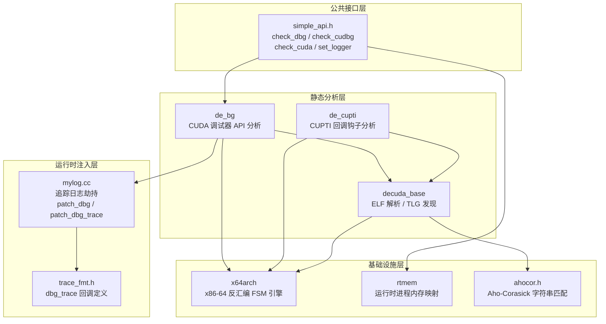
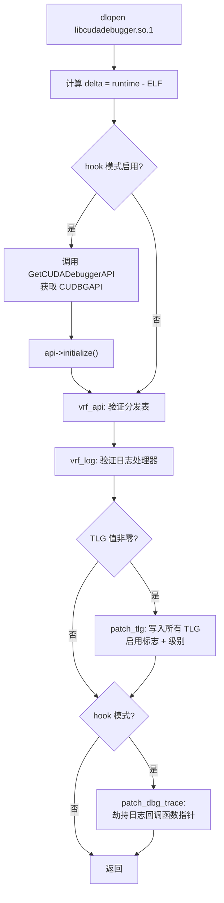
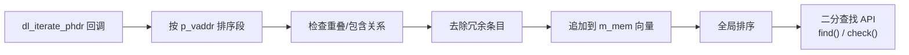

本页深入解析 `cudaso/` 目录下三个紧密关联的调试追踪组件：**de_bg**（CUDA 调试器 API 逆向分析器）、**de_cupti**（CUPTI 回调钩子分析器）和 **simple_api**（面向外部工具的 C 语言公共接口）。三者共同构成了对 CUDA 运行时调试/性能分析基础设施的静态分析与运行时注入能力——从 ELF 二进制中提取调试器分发表结构，到运行时函数指针替换实现追踪日志劫持，形成完整的"分析→验证→注入"流水线。相关背景可参阅 [decuda 驱动分析框架与 x64 反汇编集成](15-decuda-qu-dong-fen-xi-kuang-jia-yu-x64-fan-hui-bian-ji-cheng)。

## 架构总览

这三个组件并非独立运作，而是围绕一个共同的分析目标构建的分层体系。**de_bg** 和 **de_cupti** 作为 `decuda_base` 的派生类，分别针对 CUDA 调试器（libcudadebugger）和 CUPTI 库执行静态 ELF 分析；**simple_api** 则封装了分析结果在运行时的验证与注入逻辑。底层的运行时内存映射（`rtmem_storage`）和追踪日志格式化（`mylog`）模块为三者提供共享的基础设施。



Sources: [simple_api.h](cudaso/simple_api.h#L1-L27), [de_bg.h](cudaso/de_bg.h#L1-L43), [de_cupti.h](cudaso/de_cupti.h#L1-L29), [trace_fmt.h](cudaso/trace_fmt.h#L1-L12)

## decuda_base 公共基类

`de_bg` 和 `de_cupti` 均继承自 `decuda_base`，该基类封装了 ELF 文件解析的全部公共逻辑：节区枚举（`.text`、`.rodata`、`.data`、`.bss`、`.data.rel.ro`）、符号表读取、重定位表处理，以及一套基于 **Aho-Corasick 自动机** 的 TLG（Trace Logging Group）名称发现机制。

### ELF 解析流水线

`decuda_base::read()` 方法执行标准的 ELF 分析初始化流程：遍历所有节区头部，识别重定位节区（`SHT_REL` / `SHT_RELA`）、符号表节区（`SHT_SYMTAB` / `SHT_DYNSYM`），以及关键程序节区。重定位条目被读入 `m_relocs` 向量后按偏移量排序，为后续的二分查找提供有序数据。最终调用派生类的 `_read()` 虚方法执行特定分析。

Sources: [decuda_base.cc](cudaso/decuda_base.cc#L65-L95), [decuda_base.h](cudaso/decuda_base.h#L63-L113)

### TLG 发现机制

TLG 是 NVIDIA 调试基础设施中的**追踪日志组**——每个 TLG 条目对应一个命名的调试通道（如 `dbg_core`、`dbg_da_bp`），由一个全局指针控制其启用状态和日志级别。`process_tlg()` 方法利用两层查找策略自动发现这些通道：

1. **第一层**：使用 Aho-Corasick trie 在 `.rodata` 节区中搜索预定义的 TLG 名称字符串，收集它们的节区偏移
2. **第二层**：将这些偏移作为 64 位指针模式，在 `.data` 节区中进行二进制搜索，定位指向这些字符串的指针地址

找到的每个 TLG 条目被记录为 `{name, addr}` 对，其中 `addr` 是 `.data` 节区中该 TLG 控制块的地址。这个地址在运行时注入中至关重要——控制块偏移 `+0x8` 处为启用标志，`+0xA` 和 `+0xC` 处为日志级别值。

Sources: [decuda_base.cc](cudaso/decuda_base.cc#L97-L152), [ahocor.h](cudoso/ahocor.h#L1-L35)

## de_bg：CUDA 调试器 API 分析器

`de_bg` 专门分析 `libcudadebugger.so`——NVIDIA CUDA 调试器（cuda-gdb）的核心库。它的核心任务是定位 `GetCUDADebuggerAPI` 函数入口，追踪其 API 分发表，并识别调试器的日志回调机制。

### 分析入口：GetCUDADebuggerAPI

NVIDIA 调试器的所有功能都通过 `GetCUDADebuggerAPI` 导出函数获取——它将一个 `CUDBGAPI` 接口指针写入调用者提供的地址。`de_bg::_read()` 的分析流程如下：

1. 通过 TLG 名称列表（包含 40 个 `dbg_*` 通道名称）发现调试日志组
2. 在符号表中查找 `GetCUDADebuggerAPI`，获取其 `.text` 节区地址
3. 调用 `try_api()` 追踪该函数的控制流，定位 `.data` 节区中的 API 分发表基址
4. 调用 `try_hack_api()` 从重定位表中迭代读取分发表中的函数指针，对每个指针调用 `try_one_api()` 提取 API 名称

Sources: [de_bg.cc](cudaso/de_bg.cc#L74-L90), [de_bg.h](cudaso/de_bg.h#L10-L43)

### API 分发表逆向

`GetCUDADebuggerAPI` 内部的控制流使用 **间接跳转 thunk** 模式——每个 API 函数入口先从 `.bss` 节区读取一个状态变量（`dbg_st`），检查其是否为零，非零时跳转到对应的 thunk 函数。`try_one_api()` 实现了一个状态机来匹配这种模式：

| FSM 状态 | 匹配模式 | 含义 |
|----------|---------|------|
| 0 | `mov rax, [rip + bss_addr]` | 从 `.bss` 读取调试状态变量 |
| 1 | `test rax, rax` | 测试状态变量是否非零 |
| 2 | `jmp thunk` 或 `call handler` | 收集跳转目标地址 |

收集到 thunk 地址后，`extract_name()` 进一步分析 thunk 的 prologue，在更深层的 FSM 中（状态 0→5→3→4）提取 API 名称字符串和日志回调指针。它识别两种 prologue 变体：直接 `mov reg, imm64` 后跟 `lea` 加载名称的标准模式，以及 CUDA 13.1 引入的通过 `log_root` 间接寻址的新模式。

Sources: [de_bg.cc](cudaso/de_bg.cc#L137-L283)

### 运行时验证与注入

`de_bg::verify()` 是从静态分析切换到运行时操作的关键方法。它通过 `dlopen("libcudadebugger.so.1")` 加载实际运行时的调试器库，计算**地址增量**（`delta = runtime_addr - elf_addr`），然后使用该增量将静态分析发现的偏移映射到运行时地址空间：



`vrf_api()` 逐一验证分发表中的函数指针是否已被修补（通过与预期地址比较），`vrf_log()` 则遍历 `dbg_root` 结构中的标志字段和处理器指针。`patch_tlg()` 直接写入 TLG 控制块：偏移 `+0x8` 置为 1（启用），`+0xA` 和 `+0xC` 设置为指定的日志级别值。

Sources: [de_bg.cc](cudaso/de_bg.cc#L416-L475), [de_bg.cc](cudaso/de_bg.cc#L329-L414)

## de_cupti：CUPTI 回调钩子分析器

`de_cupti` 分析 CUPTI（CUDA Profiling Tools Interface）库的二进制结构，重点关注其回调订阅机制和日志分派路径。与 `de_bg` 的调试器分析不同，`de_cupti` 处理的是 NVIDIA 性能分析工具链的核心接口。

### 双路径发现策略

`de_cupti::_read()` 实现了优先级回退策略：

1. **主路径**：查找 `InitializeInjectionNvtxExtension` 符号，调用 `try_ext()` 在其前 10 条指令中搜索 `lea` 指令，定位 `.data` 节区中指向 `"Cupti_Public"` 标记字符串的指针，从而找到 `m_cupti_root`——CUPTI 函数指针表的基址
2. **回退路径**：若主路径失败，调用 `try_subscribe()` 分析 `cuptiSubscribe` 函数，追踪其参数传递（`rsi` → 回调函数指针，`rdx` → 用户数据指针），定位存储在 `.bss` 中的 `curr_func` 和 `curr_data`

Sources: [de_cupti.cc](cudaso/de_cupti.cc#L177-L212), [de_cupti.cc](cudaso/de_cupti.cc#L29-L50)

### 日志分派 FSM 分析

找到 `m_cupti_root` 后，`de_cupti` 从重定位表迭代读取后续的函数指针。前两个条目直接记录为 `cupti_item`；从第三个开始，对每个函数指针调用 `fsm_log()` 进行深度分析。这个 4 状态 FSM 匹配 CUPTI 内部的日志分派 prologue：

| FSM 状态 | 指令模式 | 语义 |
|----------|---------|------|
| 0 | `mov eax, [rip + dbg_root]` | 从 `.data` 加载调试根指针（32 位） |
| 1 | `cmp eax, 2` | 检查日志级别阈值 |
| 2 | `jz do_log` | 满足条件则跳转到日志路径 |
| 3 | `mov rax, [rip + func_ptr]; jmp rax` | 通过间接跳转调用实际日志函数 |

匹配成功后，FSM 返回日志函数指针的 `.data` 节区地址，存储在 `cupti_item::ind` 字段中——这是运行时日志注入的关键锚点。

Sources: [de_cupti.cc](cudaso/de_cupti.cc#L52-L111)

### CUPTI 专属 TLG 组

`de_cupti` 使用独立的 TLG 名称列表，覆盖 CUPTI 特有的调试通道：

| TLG 名称 | 作用域 |
|----------|--------|
| `Cupti_Public` | CUPTI 公共接口层 |
| `dbg_sym` / `cuda_sym` | 符号解析 |
| `rmeventbuffer` | 事件缓冲区管理 |
| `drvacc` | 驱动访问层 |
| `dbg_sym_elf` / `cuda_utils` | ELF 符号与工具函数 |

Sources: [de_cupti.cc](cudaso/de_cupti.cc#L166-L175)

## simple_api：公共 C 接口

`simple_api.h` 定义了一组 `extern "C"` 函数，为外部工具（如 GDB 插件、独立分析器）提供即用型的高层 API。这些函数屏蔽了 ELF 加载、静态分析和运行时注入的完整复杂性。

### API 函数清单

| 函数 | 用途 | 关键参数 |
|------|------|---------|
| `check_cuda(fname, fp)` | 加载 CUDA 库 ELF，执行标准 decuda 分析流程 | 文件路径 + 输出流 |
| `check_patch(fname, fp, patches, n)` | 对 CUDA 库应用指定的调试补丁 | 补丁描述数组 |
| `set_logger(fname, fp, mask, size)` | 安装追踪日志拦截器 | 位掩码（bit1=追踪点, bit2=十六进制转储） |
| `check_dbg(fname, fp, hook, tlg_value)` | 完整的调试器分析+注入流程 | hook 级别 + TLG 日志级别 |
| `check_cudbg(fname, fp, tlg_value)` | 从 cuda-gdb 内部调用的调试器初始化 | fp 非 null 表示在 GDB 上下文中 |
| `reset_logger()` | 恢复所有被劫持的函数指针，关闭日志文件 | 无 |

Sources: [simple_api.h](cudaso/simple_api.h#L1-L27)

### check_dbg / check_cudbg 实现路径

`check_dbg()` 和 `check_cudbg()` 是核心入口，它们的实现通过内部函数 `_check_dbg()` 共享：

```
_check_dbg(fname, fp, hook, tlg_value, in_gdb)
  ├── rtmem_storage::read()          // 枚举进程已加载模块
  ├── check_re("libcudadebugger.so") // 验证调试器库已加载
  ├── ELFIO::load(fname)             // 加载目标 ELF
  ├── de_bg::read()                  // 执行静态分析
  └── de_bg::verify(fp, rs, hook, tlg_value, in_gdb)  // 运行时验证+注入
```

两者的关键差异在于 `in_gdb` 标志：`check_dbg()` 始终传入 `in_gdb=0`，而 `check_cudbg()` 根据 `fp` 是否为 null 决定 `hook` 参数——当从 cuda-gdb 的 `cuda_debugapi::initialize` 方法中调用时，`fp` 非 null 表示处于 GDB 上下文，此时不需要独立的 `api->initialize()` 调用。

Sources: [de_bg.cc](cudaso/de_bg.cc#L477-L515)

## mylog：运行时追踪日志基础设施

`mylog.cc` 实现了追踪日志的运行时劫持——通过替换目标库中的函数指针，将调试信息重定向到自定义的日志处理器。它支持两种劫持模式。

### dbg_trace 回调劫持

这是面向 CUPTI 风格追踪的劫持模式。`trace_fmt.h` 定义了追踪回调的类型签名：

```c
typedef void (*dbg_trace)(void *user_data, int packet_type,
                          int func_num, void *packer, void *ud2);
```

`patch_dbg()` 将目标地址处的函数指针替换为 `my_logger`。`my_logger` 根据数据包类型（`packet_type`）执行不同处理——类型 6 提取偏移 `0x30` 处的函数名称字符串，所有类型支持通过 `hex_masks` 位掩码触发十六进制转储。日志输出带时间戳和 PID 标识，并通过 `std::mutex` 保证线程安全。被替换的原始处理器保存在 `old_handler` 中，每次日志处理后仍然调用原始处理器以保持链式回调。

| 数据包类型 | 含义 | 特殊处理 |
|-----------|------|---------|
| 2 | init/finit | packet 可以为 null |
| 6 | API 调用 | 提取 `packet+0x30` 处函数名 |
| 7 | 回调钩子 | UUID `A094798C-2E74...` 接口 |
| 0xC | cudart | CUDA 运行时事件 |
| 0x14 | ctx 操作 | 上下文管理 |

Sources: [mylog.cc](cudaso/mylog.cc#L63-L100), [trace_fmt.h](cudoso/trace_fmt.h#L1-L12)

### debugger_trace 回调劫持

`patch_dbg_trace()` 是面向调试器内部日志的劫持——替换 `bg_log` 地址处的函数指针（类型为 `void (*)(const char *)`）。自定义的 `my_dbg_trace` 处理器从数据包偏移 `0x28` 处提取日志名称，输出时间戳和名称，并对整个 0x30 字节的数据包头部执行十六进制转储。

Sources: [mylog.cc](cudaso/mylog.cc#L103-L133)

### 重置机制

`reset_logger()` 是线程安全的清理函数——在 `std::lock_guard` 保护下将所有被劫持的函数指针恢复为原始值，并将日志文件指针置 null。若日志文件不是 `stdout` 或 `stderr`，则关闭文件句柄。

Sources: [mylog.cc](cudaso/mylog.cc#L135-L149)

## rtmem_storage：运行时内存映射

`rtmem_storage` 通过 Linux 的 `dl_iterate_phdr` 系统调用枚举当前进程加载的所有共享库及其内存段，构建一个按地址排序的 `my_phdr` 向量。它解决了 `dl_iterate_phdr` 返回数据的两个固有问题：段条目未排序，以及存在大量重叠区域。



`check()` 方法使用 `std::lower_bound` 在排序后的段列表中执行 O(log n) 查找，判断给定地址是否落在某个已加载模块的地址范围内。若命中，返回该段的 `my_phdr` 指针（包含模块名称引用），用于后续的地址归属判断——例如在 `de_bg::verify()` 中确定某个被修补的函数指针来自哪个共享库。

Sources: [rtmem.cc](cudaso/rtmem.cc#L1-L121), [rtmem.h](cudaso/rtmem.h#L1-L37)

## x64arch 反汇编 FSM 引擎

`x64arch` 模块封装了 udis86 反汇编库，提供面向 x86-64 指令模式匹配的高层抽象。其核心是 `diter` 结构体——一个带位置追踪的指令迭代器，以及 `used_regs<V>` 模板——一个轻量级的寄存器值跟踪器。这两个工具组合使用，使得 `de_bg` 和 `de_cupti` 中的 FSM 分析代码能够以极简的方式表达复杂的指令序列匹配。

### diter 指令迭代器

`diter` 绑定到一个 ELF 节区，通过 `setup(offset)` 设置起始反汇编位置，然后逐条调用 `next()` 推进。它提供丰富的指令分类谓词（`is_mov64()`、`is_lea()`、`is_test_rr()`、`is_jxx_jimm()` 等）和 RIP 相对地址计算（`get_jmp(idx)`），使得上层代码无需处理底层编码细节。

### used_regs 寄存器跟踪

`used_regs<V>` 模板实现了符号化的寄存器值传播——将寄存器编号映射到抽象值（通常是节区地址偏移）。核心操作包括：`add()` 记录寄存器到值的映射，`asgn()` 在遇到间接调用/跳转时回查寄存器对应的值，`mov()` 在寄存器间传播值。这使得 FSM 能够追踪 `mov rax, [rip+offset]` → `test rax, rax` → `call rax` 这样的间接调用链，精确提取被调用函数的地址。

Sources: [x64arch.h](cudaso/x64arch.h#L40-L198), [x64arch.h](cudaso/x64arch.h#L615-L717)

## 编译与使用

### 构建目标

`Makefile` 定义了三个构建目标：

| 目标 | 组成 | 用途 |
|------|------|------|
| `test` | `test.cc` + `libdis.so` | 独立命令行分析工具 |
| `libde_bg.a` | 核心对象文件 | 静态库（仅 de_bg 子集） |
| `libdis.so` | 全部对象文件 | 共享库（包含 de_bg + de_cupti + decuda + de_ptx） |

命令行工具 `test` 通过参数选择分析模式：`-D` 启用 de_bg 分析，`-C` 启用 de_cupti 分析，`-d` 显示反汇编详情，`-t` 导出符号表。

Sources: [Makefile](cudoso/Makefile#L1-L20), [test.cc](cudaso/test.cc#L1-L73)

### 典型使用场景

**场景 1：离线静态分析 CUDA 调试器库**

```bash
# 分析 libcudadebugger.so 的 API 分发表和 TLG 结构
./test -D /path/to/libcudadebugger.so.1
```

输出将包含 TLG 通道列表、`api` / `state` / `bg_log` / `log_root` 等关键地址，以及每个 API 条目的偏移、目标地址和名称。

**场景 2：离线分析 CUPTI 库**

```bash
# 分析 libcupti.so 的回调订阅机制
./test -C /path/to/libcupti.so
```

**场景 3：运行时追踪注入（通过 simple_api）**

在 GDB 插件或 LD_PRELOAD 库中调用 `check_dbg()` 或 `check_cudbg()`，传入目标库路径和日志文件句柄。这会自动执行完整的"加载→分析→验证→注入"流水线。

Sources: [test.cc](cudaso/test.cc#L28-L72)

## 延伸阅读

- [ptxas 加密表提取（de_ptx）与 CUPTI 回调分析](17-ptxas-jia-mi-biao-ti-qu-de_ptx-yu-cupti-hui-diao-fen-xi) — 同一工具链中与 CUPTI 回调相关的另一分析维度
- [内核追踪器 ELF 与运行时内存检测（rtmem/tracers）](18-nei-he-zhui-zong-qi-elf-yu-yun-xing-shi-nei-cun-jian-ce-rtmem-tracers) — 运行时追踪在 GPU 端的对应实现
- [decuda 驱动分析框架与 x64 反汇编集成](15-decuda-qu-dong-fen-xi-kuang-jia-yu-x64-fan-hui-bian-ji-cheng) — 基础分析框架的完整架构解析