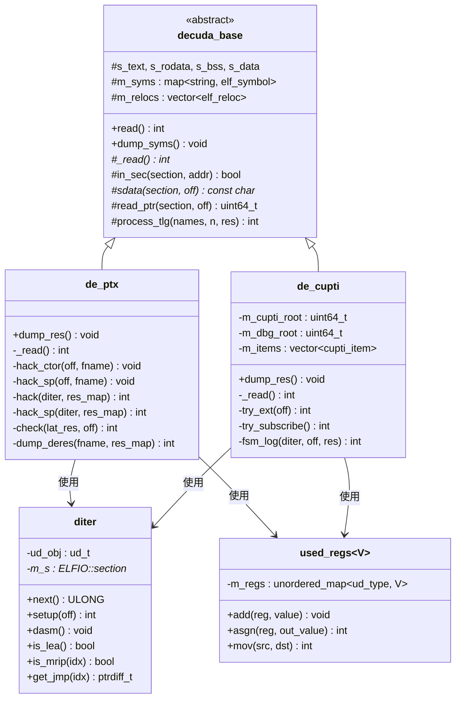
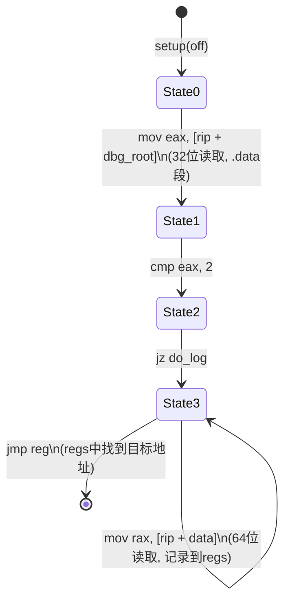

`de_ptx` 和 `de_cupti` 是 `cudaso` 框架中面向 NVIDIA ptxas 编译器内部结构的两个分析模块。`de_ptx` 通过对 ptxas ELF 二进制的 x86-64 反汇编，提取其中经过 **ROT13 变体加密** 的字符串表——这些字符串构成了 SASS 指令助记符、延迟调度参数和编译器控制旋钮的元数据。`de_cupti` 则定位 `libcudart` 中的 CUPTI 回调入口点，解析其函数指针表和调试日志挂钩。两者均继承自 `decuda_base`，共享 ELF 段枚举、符号表读取和 Aho-Corasick 模式匹配基础设施。

Sources: [de_ptx.h](cudaso/de_ptx.h#L1-L26), [de_cupti.h](cudaso/de_cupti.h#L1-L29)

## 架构总览：类继承与协作关系

整个分析框架围绕 `decuda_base` 基类构建，通过虚函数 `_read()` 实现策略模式——不同的子类只需实现自己的读取逻辑，而 ELF 加载、段识别和符号解析由基类统一处理。`diter`（disassembly iterator）是贯穿所有分析器的核心工作马，它封装了 udis86 反汇编引擎，提供丰富的 x86-64 指令谓词方法。`used_regs<V>` 模板实现了一套轻量级的**符号寄存器追踪**机制，在反汇编过程中记录 `lea`/`mov` 指令设置的寄存器值，为后续数据流分析提供基础。



`decuda_base::read()` 方法构成了所有子类的统一入口：首先通过 ELFIO 库枚举 ELF 段（`.text`、`.rodata`、`.bss`、`.data`、`.data.rel.ro`），然后读取符号表和重定位表，最后调用子类的 `_read()` 虚方法。这种设计使得每个分析器只需关注自己的**特定数据提取逻辑**，而无需处理 ELF 解析的通用复杂性。

Sources: [decuda_base.h](cudaso/decuda_base.h#L63-L113), [decuda_base.cc](cudaso/decuda_base.cc#L65-L95), [x64arch.h](cudaso/x64arch.h#L40-L134), [x64arch.h](cudaso/x64arch.h#L156-L198)

## de_ptx：ptxas 加密表提取原理

### 目标：ptxas 的字符串加密机制

ptxas 是 NVIDIA CUDA 工具链中的 PTX 到 SASS 汇编器。其内部维护了若干关键元数据表——SASS 指令助记符、指令延迟/吞吐量参数、编译器控制旋钮名称等。出于知识产权保护，这些字符串在 ptxas 二进制中并非以明文存储，而是经过了一种**ROT13 变体加密**。`de_ptx` 的任务就是从 ptxas 的 ELF 中定位并解密这些表。

`de_ptx` 在头文件中自称是一个 "dirty hack"，这反映了其工作方式：它依赖 ptxas 特定版本中构造函数（constructor）的**硬编码偏移量**，对这些偏移处的 x86-64 代码进行模式匹配，提取写入 `.bss` 段的数据项，并对其中的 `.rodata` 指针执行解密。

Sources: [de_ptx.h](cudaso/de_ptx.h#L4-L5), [de_ptx.h](cudaso/de_ptx.h#L12-L26)

### ROT13 变体解密算法

加密算法的核心在 `de_ptx::check()` 方法中实现，其逻辑简洁而精确。对每个字符 `c`，若 ASCII 值 ≥ `0x41`（即 'A'），先通过 `c & 0xDF` 统一转为大写，然后判断该大写字符落在 A-M（`0x41`~`0x4D`）还是 N-Z（`0x4E`~`0x5A`）区间：A-M 范围内的字符 **+0x0D**，N-Z 范围内的字符 **-0x0D**。这正是标准 ROT13 的实现——大小写保持不变，非字母字符原样保留。解密后的结果存储在 `lat_res` 结构体的 `dec` 字段中。

`lat_res` 结构体定义了三种数据类型：`what == 0` 表示原始数值（`num` 字段），`what == 1` 表示破折号占位符 `'-'`，`what == 2` 表示解密后的字符串（`dec` 字段）。这个三态设计精确反映了 ptxas 内部表的异构性——每张表都是名称和数值的混合序列。

Sources: [de_ptx.cc](cudaso/de_ptx.cc#L41-L69), [de_ptx.h](cudaso/de_ptx.h#L12-L17)

### 构造函数分析：hack() 与 hack_sp()

`de_ptx` 提供了两种分析策略来处理 ptxas 中不同风格的初始化函数，它们对应 ptxas 二进制中两种不同的数据写入模式：

| 方法 | 目标模式 | 写入目标 | 典型用途 |
|------|----------|----------|----------|
| `hack()` | 全局构造函数 | `mov [rip + bss], imm/reg` | 大型静态表（指令表、延迟表） |
| `hack_sp()` | 栈帧初始化 | `mov [rsp + off], imm/reg` | 局部初始化块 |

**`hack()` 方法**的执行流程如下：创建 `diter` 在指定偏移处开始反汇编，维护一个 `used_regs<uint64_t>` 符号寄存器映射。遇到 `lea reg, [rip + rodata]` 时，记录寄存器到 rodata 地址的映射；遇到 `mov [rip + bss], imm` 时，若立即数指向 rodata 则调用 `check()` 尝试解密，否则作为原始数值记录；遇到 `mov [rip + bss], reg` 时，通过 `used_regs::asgn()` 查找寄存器的已知值。分析在遇到 `int3`、`ret`、`jmp` 等终止指令时结束。

**`hack_sp()` 方法**的逻辑类似，但处理的是 `mov [rsp + off], imm/reg` 模式——这是栈帧上的初始化序列。该方法还在遇到 `jz` 条件跳转时提前终止，表明栈初始化块通常嵌入在条件分支中。

Sources: [de_ptx.cc](cudaso/de_ptx.cc#L77-L127), [de_ptx.cc](cudaso/de_ptx.cc#L129-L175)

### 版本特定的偏移量与入口调度

`_read()` 方法中硬编码了 ptxas 特定版本的构造函数偏移量。当前活跃的版本（注释标注为 "12.8 md5 14dc7bbb0bafae1313489c389e9486eb - NPDOHYX"）指定了三个入口点：

```
hack_ctor(0x582500, "c15.txt");   // 指令延迟/调度表
hack_ctor(0x598620, "c17.txt");   // SASS 指令助记符表
hack_ctor(0x59D4A0, "c18.txt");   // ptxas 编译器旋钮表
```

同时保留了 V13.1.80 版本的注释化偏移量，说明该工具需要随 CUDA 工具链版本更新而调整偏移。每个偏移对应 ptxas `.text` 段中一个构造函数的起始地址，该函数负责将一组加密字符串和数值写入 `.bss` 段的全局变量中。

Sources: [de_ptx.cc](cudaso/de_ptx.cc#L177-L192)

### 输出格式与语义

`dump_deres()` 将结果写入文本文件，每行格式为 `<相对偏移>: <值>`。三种值的输出规则为：破折号 `'-'`、解密后的字符串、原始整数。所有偏移量相对于结果映射中的第一个条目做了归一化处理（减去首条目的绝对地址），使其从零开始编号。这种格式便于后续工具直接索引和解析。

以下是三类输出表的语义总结：

| 输出文件 | 行数 | 内容 | 示例条目 |
|----------|------|------|----------|
| c15.txt | 8117 | 延迟调度表 | `0: NONE`, `20: DFMA`, `A0: LDG` |
| c17.txt | 1607 | SASS 指令助记符 | `0: ACQBULK`, `370: DFMA`, `3C0: DMUL` |
| c18.txt | 825 | 编译器旋钮/选项 | `0: AllowWait1EndGroup`, `300: DisableAssume` |

每张表的结构遵循统一模式：解密后的名称字符串后跟若干数值参数（可能是类型标识、默认值、标志位等），以破折号 `'-'` 作为分隔符。以 c18.txt 为例，`AllowWait1EndGroup` 旋钮的结构为：名称（加密）→ 名称长度（18）→ 类型（2）→ 分隔符（-）→ 默认值（1）→ 分隔符（-）→ 值域标记（1）→ 某标志（1）。

Sources: [de_ptx.cc](cudaso/de_ptx.cc#L6-L24), [c15.txt](cicc13/c15.txt#L1-L38), [c17.txt](cicc13/c17.txt#L1-L50), [c18.txt](cicc13/c18.txt#L1-L48)

## de_cupti：CUPTI 回调入口点分析

### CUPTI 符号定位策略

`de_cupti` 的首要目标是在 `libcudart` 共享库中定位 CUPTI（CUDA Profiling Tools Interface）的核心数据结构。它采用**两级回退策略**：首选通过 `InitializeInjectionNvtxExtension` 符号定位，若失败则回退到 `cuptiSubscribe` 符号。

**第一级：扩展入口**。`try_ext()` 方法在 `InitializeInjectionNvtxExtension` 函数的前 10 条指令中搜索 `lea reg, [rip + data]` 模式。找到后，从 `.data` 段读取一个指针，验证它指向 `.rodata` 段中的 `"Cupti_Public"` 字符串。匹配成功时，该 `.data` 段位置即为 `m_cupti_root`——CUPTI 函数指针表的根地址。

**第二级：订阅入口**。若扩展入口不可用，`try_subscribe()` 分析 `cuptiSubscribe` 函数体。它使用 BFS（广度优先搜索）策略追踪 `jz` 条件跳转，在跳转目标处搜索将 `rsi`（回调函数指针）和 `rdx`（用户数据指针）参数存入 `.bss` 段全局变量的模式，从而提取 `curr_func` 和 `curr_data` 地址。

Sources: [de_cupti.cc](cudaso/de_cupti.cc#L29-L50), [de_cupti.cc](cudaso/de_cupti.cc#L113-L164), [de_cupti.cc](cudaso/de_cupti.cc#L177-L211)

### TLG 两级模式匹配

`de_cupti` 和 `de_bg` 都使用了基类提供的 **TLG（Two-Level Grep）** 机制来高效定位运行时日志标识符。TLG 的实现基于 Aho-Corasick 自动机，分两阶段执行：

1. **字符串阶段**：在 `.rodata` 段中搜索预定义的标识符字符串（如 `"Cupti_Public"`、`"dbg_sym"`、`"cuda_utils"`），记录匹配的偏移地址
2. **指针阶段**：将第一阶段找到的地址编码为 8 字节序列，在 `.data` 段中搜索这些字节模式，定位指向这些字符串的指针

`de_cupti` 使用以下 8 个 TLG 标识符：`dbg_sym`、`cuda_sym`、`rmeventbuffer`、`NVIDIA internal`、`cuda_utils`、`dbg_sym_elf`、`drvacc`、`Cupti_Public`。这些标识符覆盖了 CUPTI 运行时的核心日志通道，定位到的 `.data` 段地址可用于后续的调试追踪注入。

Sources: [de_cupti.cc](cudaso/de_cupti.cc#L166-L175), [decuda_base.cc](cudaso/decuda_base.cc#L97-L142)

### CUPTI 函数指针表遍历

定位到 `m_cupti_root` 后，`_read()` 方法遍历 `.data` 段中从该根地址开始的重定位条目。对于每个重定位项，读取其指向的地址值：若该值落在 `.data` 段内则停止（到达表尾）；若落在 `.text` 段内则作为函数指针记录。前两个函数指针直接存入 `m_items`（通常对应 CUPTI 的初始化和去初始化函数），后续指针则通过 `fsm_log()` 进行更深入的分析。

### fsm_log：调试日志挂钩的有限状态机分析

`fsm_log()` 方法实现对 CUPTI 调试日志挂钩的精确定位，它使用一个 4 状态有限状态机来匹配 ptxas 风格的日志桩代码：



**状态 0**：等待 `mov eax/32bit_reg, [rip + .data]` 指令，该指令从 `.data` 段读取 `dbg_root` 标志。**状态 1**：检测 `cmp reg, 2` 比较指令，确认这是一个值为 2 的条件检查。**状态 2**：捕获 `jz` 跳转目标，重定位反汇编器到该地址。**状态 3**：收集 `mov rax, [rip + .data]` 指令中的地址到寄存器映射，直到遇到 `jmp reg`——该寄存器指向的地址就是实际的日志函数入口。

这种 FSM 驱动的分析方法展示了一种优雅的反编译模式：不需要完整的控制流恢复，只需识别**特定的指令序列模板**即可精确定位目标数据结构。

Sources: [de_cupti.cc](cudaso/de_cupti.cc#L52-L111), [de_cupti.cc](cudaso/de_cupti.cc#L192-L211)

## 构建与使用

### 编译

`cudaso` 模块通过 `Makefile` 构建，依赖 ELFIO 库和 udis86 反汇编引擎。最终产出 `libdis.so` 共享库，包含所有分析器对象文件。

```makefile
AR_OBJS = bm_search.o decuda_base.o de_bg.o de_ptx.o de_cupti.o decuda.o x64arch.o rtmem.o mylog.o
```

Sources: [Makefile](cudaso/Makefile#L1-L20)

### 命令行接口

`test.cc` 提供了统一的命令行入口，通过选项标志选择运行哪个分析器：

| 选项 | 模式 | 目标二进制 |
|------|------|-----------|
| `-p` | `de_ptx` | ptxas |
| `-C` | `de_cupti` | libcudart.so |
| `-D` | `de_bg` | libcudart.so |
| (默认) | `decuda` | libcudart.so |

辅助选项：`-d` 启用反汇编调试输出，`-t` 转储符号表，`-v` 详细模式。典型用法如 `test -d -p /path/to/ptxas` 即可对 ptxas 执行加密表提取。

Sources: [test.cc](cudaso/test.cc#L1-L73)

## 关键设计模式总结

| 设计模式 | 实现位置 | 作用 |
|----------|----------|------|
| 策略模式 | `decuda_base::_read()` 虚函数 | 不同分析器共享 ELF 加载，仅差异化读取逻辑 |
| 符号寄存器追踪 | `used_regs<V>` 模板 | 在线性反汇编中模拟 `lea`/`mov` 的数据流 |
| 指令谓词链 | `diter::is_lea()`, `is_mrip()` 等 | 以流式 API 风格精确匹配 x86 指令模式 |
| TLG 两级 grep | `decuda_base::process_tlg()` | Aho-Corasick 自动机实现字符串→指针的反向定位 |
| FSM 反编译 | `de_cupti::fsm_log()`, `de_bg::try_one_api()` | 用有限状态机匹配固定指令序列模板 |
| 硬编码偏移 | `de_ptx::_read()` | 依赖特定 ptxas 版本的二进制特征，需随版本更新 |

这些模式共同构成了一个轻量但强大的**二进制分析工具框架**——不依赖完整反编译器或符号执行引擎，而是通过**针对性模式匹配**和**简化数据流追踪**实现对 NVIDIA 闭源二进制的结构化数据提取。

Sources: [decuda_base.h](cudaso/decuda_base.h#L74-L76), [x64arch.h](cudaso/x64arch.h#L300-L312), [x64arch.h](cudaso/x64arch.h#L609-L614), [decuda_base.cc](cudaso/decuda_base.cc#L97-L142)

## 延伸阅读

- [decuda 驱动分析框架与 x64 反汇编集成](15-decuda-qu-dong-fen-xi-kuang-jia-yu-x64-fan-hui-bian-ji-cheng) — `decuda_base` 的完整架构和 `diter` 反汇编迭代器详解
- [调试追踪注入：de_bg、de_cupti 与 simple_api 接口](16-diao-shi-zhui-zong-zhu-ru-de_bg-de_cupti-yu-simple_api-jie-kou) — `de_bg` 调试 API 提取和 `simple_api` 运行时注入接口
- [SASS 指令编码字段与掩码机制](9-sass-zhi-ling-bian-ma-zi-duan-yu-yan-ma-ji-zhi) — c17.txt 提取的指令助记符如何用于 SASS 反汇编
- [延迟调度表分析与指令谓词系统](10-yan-chi-diao-du-biao-fen-xi-yu-zhi-ling-wei-ci-xi-tong) — c15.txt 延迟表如何服务于指令调度分析