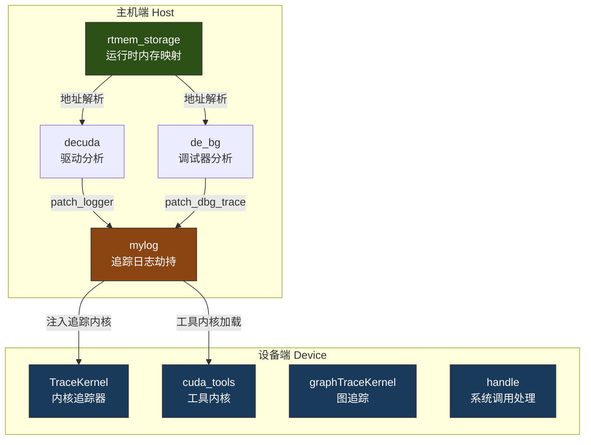
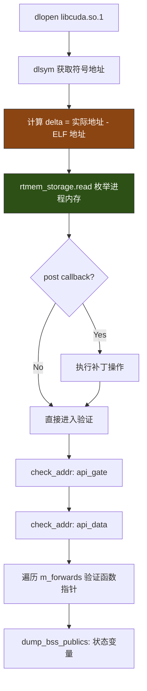

本页深入解析 `cudaso/` 目录下两个紧密关联的子系统：**rtmem**（运行时内存映射与地址解析引擎）和 **tracers**（GPU 端内核追踪 ELF 集合）。前者通过 Linux `dl_iterate_phdr` 系统调用构建进程虚拟地址空间的精确映射表，为驱动分析框架提供运行时地址校验和符号解析的底座；后者则是一组预编译的 NVIDIA CUDA 架构 ELF 内核对象，涵盖从 Turing（sm_75）到 Blackwell（sm_100）多代 GPU 的追踪、内存比较、L2 缓存刷新及图追踪等专用工具内核。两者共同构成了从"主机端地址验证"到"设备端内核注入"的完整追踪链路。相关背景可参阅 [调试追踪注入：de_bg、de_cupti 与 simple_api 接口](16-diao-shi-zhui-zong-zhu-ru-de_bg-de_cupti-yu-simple_api-jie-kou) 和 [decuda 驱动分析框架与 x64 反汇编集成](15-decuda-qu-dong-fen-xi-kuang-jia-yu-x64-fan-hui-bian-ji-cheng)。

Sources: [rtmem.h](cudaso/rtmem.h#L1-L37), [trace_fmt.h](cudaso/trace_fmt.h#L1-L12)

## 架构总览

整个系统由三个层次组成：**运行时内存映射层**（`rtmem_storage`）、**主机端追踪钩子层**（`mylog` / `de_bg`）和**设备端追踪内核层**（`tracers/*.elf`）。`rtmem_storage` 作为共享基础设施，被 `decuda`、`de_bg` 等多个分析模块引用，用于将静态 ELF 分析阶段发现的偏移量与实际运行时加载地址进行匹配。`mylog` 模块通过函数指针替换劫持 CUDA 驱动内部的调试追踪回调，将追踪数据重定向至自定义日志系统。追踪器 ELF 则是直接运行在 GPU 上的 SASS 代码对象，用于在内核执行期间进行内存操作追踪、性能测量和图执行监控。

Sources: [rtmem.cc](cudaso/rtmem.cc#L1-L120), [mylog.cc](cudaso/mylog.cc#L1-L150), [de_bg.cc](cudaso/de_bg.cc#L422-L460)



## rtmem_storage：运行时内存映射引擎

### 核心数据结构与设计约束

`rtmem_storage` 的核心职责是将进程地址空间中的**程序头（Program Header）**信息收集、去重、排序为高效的查找表。设计上需要解决 `dl_iterate_phdr` API 的两个固有缺陷：**段条目未排序**且**存在大量重叠区域**。为此，该模块在回调函数中引入了一个临时有序链表 `ord`，在插入每个 `my_phdr` 条目前先检测与已有条目的包含关系。

Sources: [rtmem.h](cudaso/rtmem.h#L7-L23), [rtmem.cc](cudaso/rtmem.cc#L10-L70)

`my_phdr` 结构体精简至四个关键字段：段类型（`type`）、基地址（`addr`）、内存大小（`memsz`）和指向所属共享库名称的字符串引用（`name_ref`）。其中 `inside()` 方法实现了双向包含检测——判断一个区域是否完全落在另一个区域内部，这是重叠检测的核心逻辑。`name_ref` 使用 `std::string *` 而非值类型，避免了字符串拷贝开销，同时通过 `m_names` 链表持有所有唯一名称的所有权。

Sources: [rtmem.h](cudaso/rtmem.h#L13-L15)

### 迭代回调与重叠消除算法

`iterate_cb` 回调函数是整个内存映射构建的核心。对于每个加载的共享库，它执行以下步骤：

1. **名称去重**：维护 `m_names` 链表，仅在名称与末尾不同时追加
2. **段排序**：将 `dlpi_phdr` 数组中非零长度的段按虚拟地址排序
3. **重叠消除**：对每个段创建候选 `my_phdr`，与 `ord` 链表中已有条目进行包含检测——若候选被已有序条目包含则跳过；若候选包含已有条目则替换之
4. **批量收集**：最终将有序链表整体移动到 `m_mem` 向量

Sources: [rtmem.cc](cudaso/rtmem.cc#L10-L70)

回调返回 0（而非默认的继续迭代），意味着它处理所有已加载模块但不会提前终止迭代。最终 `read()` 方法对 `m_mem` 执行一次全局排序，确保后续的 `find()` 和 `check()` 可以使用二分查找。

Sources: [rtmem.cc](cudaso/rtmem.cc#L72-L84)

### 地址查找接口

`rtmem_storage` 提供三个查询接口，分别服务于不同场景：

| 方法 | 返回值 | 用途 |
|------|--------|------|
| `find(addr)` | `const std::string *` | 查找地址所属的共享库名称，用于补丁归属判断 |
| `check(addr)` | `const my_phdr *` | 获取地址所在段的完整描述，用于后续内存读取 |
| `check_re(regex)` | `bool` | 正则匹配已加载模块名，用于检测特定库是否存在 |

`find()` 和 `check()` 均基于 `std::lower_bound` 实现对数级查找。其关键细节在于自定义比较器 `for_lower_bound`：它判断的是一个段是否"完全在目标地址之前"（`addr + memsz < off`），这使得 `lower_bound` 定位到第一个可能包含目标地址的段，随后只需一次范围校验即可确认。

Sources: [rtmem.cc](cudaso/rtmem.cc#L86-L120)

## 追踪器 ELF 分类体系

`cudaso/tracers/` 目录包含 **75 个** NVIDIA CUDA 架构 ELF 文件，按功能和目标架构分为五大类。所有 ELF 均为 64 位 NVIDIA CUDA 架构可重定位或可执行对象，内含直接运行在 GPU SM（流多处理器）上的 SASS 机器码。

Sources: [tracers/](cudaso/tracers/)

### 架构追踪内核（TraceKernel）

这是最核心的追踪器类别，以 `{arch}TraceKernel` 命名，覆盖从 Turing 到 Blackwell 的五代 GPU 架构。每个追踪内核暴露一个与架构同名的入口函数（如 `ampereTraceKernel`），函数体大小统一为 **384 字节**，末尾带有对应的 `End` 标记符号。这类 ELF 采用可重定位格式（`relocatable`），包含 `.text`、`.note.nv.cuinfo` 和 `.note.nv.tkinfo` 三个核心段。

Sources: [tracers/adaTraceKernel.elf](cudaso/tracers/adaTraceKernel.elf), [tracers/ampereTraceKernel.elf](cudaso/tracers/ampereTraceKernel.elf)

| 架构族 | SM 版本 | cuinfo 编码 | 追踪内核变体 |
|--------|---------|-------------|-------------|
| Turing | sm_75 | 0x4B | turingTraceKernel, turingTraceKernel2, turingTraceKernelCgEntryPatch |
| Ampere | sm_80 | 0x50 | ampereTraceKernel, ampereTraceKernel2/3/4, ampereTraceKernelCgEntryPatch/2 |
| Ada Lovelace | sm_89 | 0x59 | adaTraceKernel, adaTraceKernel2, adaTraceKernelCgEntryPatch |
| Hopper | sm_90 | 0x5A | hopperTraceKernel |
| Blackwell | sm_100 | 0x64 | blackwellTraceKernel, blackwellTraceKernel2/3/4/5 |

其中 `CgEntryPatch` 变体专门用于**调用图入口补丁（Call Graph Entry Patch）**——通过修改 CUDA 图节点的入口代码来注入追踪逻辑。`.note.nv.tkinfo` 段记录了编译工具链信息（如 "Cuda compilation tools, release 13.1, V13.1.0"）和编译参数。

Sources: [tracers/ampereTraceKernelCgEntryPatch.elf](cudaso/tracers/ampereTraceKernelCgEntryPatch.elf)

### CUDA 工具内核（cuda_tools）

`cuda_tools{N}.elf` 文件提供多种 GPU 端工具功能，按编号区间可细分为三类：

| 编号范围 | 入口函数 | 功能描述 | 典型代码量 |
|----------|----------|----------|-----------|
| 1-4 | `__cuda_syscall_O[...]` | CUDA 系统调用桩代码 | 56-120 字节 |
| 6-16 | `tools_memcmp` | GPU 端内存比较工具 | 2048-2560 字节 |
| 17-27 | `tools_dummyInitialize` | 初始化桩（引用 `malloc`/`free`） | 512-896 字节 |
| 28-38 | `tools_l2flush` | L2 缓存刷新工具 | 1664-3456 字节 |

`tools_memcmp` 系列是最复杂的工具内核（最大达 2560 字节），包含内部函数 `$__internal_0_$`，用于在 GPU 端执行内存区域的精确比较。`tools_l2flush` 系列利用 GPU 的 L2 缓存控制指令实现缓存一致性操作。`tools_dummyInitialize` 系列较为特殊——它们通过外部符号引用 `malloc` 和 `free`，表明这些内核需要在主机端内存分配的支持下运行。

Sources: [tracers/cuda_tools1.elf](cudaso/tracers/cuda_tools1.elf), [tracers/cuda_tools10.elf](cudaso/tracers/cuda_tools10.elf), [tracers/cuda_tools17.elf](cudaso/tracers/cuda_tools17.elf)

### 图追踪内核（graphTraceKernel）

`graph{N}.elf` 文件包含 `graphTraceKernel` 入口函数（384-640 字节），用于 CUDA Graph 执行路径的追踪。这类 ELF 采用可执行格式（`executable`），结构最为丰富——包含 `.debug_frame`（调试帧信息）、`.nv.callgraph`（调用图）、`.nv.rel.action`（重定位动作）、`.nv.constant0`（常量内存）等段。`graphTraceKernel` 通过 `.nv.rel.action` 段注册其在图执行管线中的回调行为，通过 `.nv.callgraph` 段声明调用关系以帮助驱动优化调度。

Sources: [tracers/graph1.elf](cudaso/tracers/graph1.elf)

部分图追踪 ELF（如 `graph8.elf`、`graph11.elf`）使用 `__cuda_syscall_O` 入口而非 `graphTraceKernel`，代码量达 3968 字节，说明它们执行更复杂的系统调用级操作。

Sources: [tracers/graph8.elf](cudaso/tracers/graph8.elf)

### 句柄追踪内核（handle）

`handle{N}.elf` 是最大的追踪器类别（2816-4224 字节），全部以 `__cuda_syscall_O` 为入口函数，包含多达 5 个独立 `.text` 段的代码节。这类 ELF 的 `handle1.elf` 拥有 37 个段头，包括 `.nv.shared`（共享内存）、多个 `.nv.capmerc`（能力声明）和 `.nv.merc`（Mercular 调试扩展）段——这表明它们与 NVIDIA 的硬件级调试接口深度集成。

Sources: [tracers/handle1.elf](cudaso/tracers/handle1.elf)

## 运行时内存检测工作流

### 主流程：decuda 验证路径

`decuda` 类的 `_verify` 方法展示了 `rtmem_storage` 在运行时验证中的核心作用。整个流程分为四个阶段：



1. **Delta 计算**：通过 `dlopen`/`dlsym` 获取 `libcuda.so.1` 中第一个导出符号的运行时地址，减去 ELF 文件中的静态偏移，得到 ASLR 偏移量 `delta`
2. **内存枚举**：`rtmem_storage::read()` 调用 `dl_iterate_phdr` 构建完整的段映射表
3. **地址验证**：对每个静态分析发现的关键地址（`api_gate`、`api_data`、转发函数表），加上 `delta` 后通过 `rs.check()` 确认落在已知段内，再通过 `read_mem` 直接解引用读取实际值
4. **补丁检测**：比较读取到的函数指针值与预期值——若不匹配，通过 `rs.find()` 查找新指针所属的共享库，判断是否被第三方工具（如 CUPTI 或调试器）拦截

Sources: [decuda.cc](cudaso/decuda.cc#L543-L610)

### de_bg 调试器追踪路径

`de_bg` 专用于 `libcudadebugger.so` 的分析，其 `verify` 方法在 `decuda` 的基础上增加了调试器特有的操作：

- 通过 `dlopen("libcudadebugger.so.1")` 加载调试器库，获取 `GetCUDADebuggerAPI` 的运行时地址
- 调用 `vrf_api` 验证 API 分发表中的每个回调函数指针是否被修改
- 调用 `vrf_log` 验证日志系统的根结构——遍历偏移 0x28 至 0x230 范围内的所有处理函数指针，逐个通过 `rs.check()` 确认其来源
- 当 `hook` 参数启用时，通过 `patch_dbg_trace` 将调试器的日志回调替换为自定义的 `my_dbg_trace` 函数

Sources: [de_bg.cc](cudaso/de_bg.cc#L329-L460)

### 追踪点激活机制

`decuda::patch_tracepoints` 实现了批量追踪点激活。它利用静态分析阶段提取的 **flag_sztab**（标志/大小表）和 **dbgtab**（调试表），根据调用方提供的位掩码逐项将追踪标志设置为 1：

```cpp
for (size_t i = 0; i < size; ++i) {
    if (!mask[i] || !m_flag_sztab[i] || !m_dbgtab[i]) continue;
    int32_t *tab = (int32_t *)(delta + m_dbgtab[i]);
    for (uint32_t idx = 0; idx < m_flag_sztab[i]; ++idx) tab[idx] = 1;
}
```

这段代码揭示了 CUDA 驱动内部追踪系统的一个关键架构特征：追踪点以**分层结构**组织——`m_dbgtab[i]` 指向一组追踪标志数组，`m_flag_sztab[i]` 记录该数组的大小，掩码的第 `i` 位决定是否激活对应组的所有追踪点。

Sources: [decuda.cc](cudaso/decuda.cc#L487-L496)

## mylog：追踪日志劫持系统

### 双通道劫持架构

`mylog.cc` 实现了两个独立的函数指针劫持通道，分别对应 CUDA 驱动中两种不同的追踪接口：

**通道一：`dbg_trace` 接口**——签名 `(void *user_data, int packet_type, int func_num, void *packet, void *ud2)`。替换后，自定义的 `my_logger` 函数会按 `packet_type` 分类处理追踪数据。对于 type 6（API 调用），它在 packet 偏移 0x30 处提取函数名称；对于启用了 hexdump 标志的类型，它调用 `HexDump` 输出完整的包内容。关键的掩码机制通过 `patch_dbg` 的 `mask` 参数控制：掩码的 **bit 1** 激活追踪点，**bit 2** 启用 hexdump。

Sources: [mylog.cc](cudaso/mylog.cc#L63-L100), [trace_fmt.h](cudaso/trace_fmt.h#L1-L12)

**通道二：`debugger_trace` 接口**——签名 `void (*)(const char *)`。`my_dbg_trace` 函数处理的是 CUDA 调试器内部的日志回调，它在 packet 偏移 0x28 处提取日志名称字符串，并固定输出 0x30 字节的十六进制转储。

Sources: [mylog.cc](cudaso/mylog.cc#L102-L133)

### 追踪包类型体系

`trace_fmt.h` 注释揭示了 CUDA 驱动内部追踪系统的包类型分类：

| packet_type | 含义 | 特殊字段 |
|-------------|------|----------|
| 2 | init/finit | packet 可为 null |
| 6 | API 调用 | 偏移 0x30 为函数名字符串指针 |
| 7 | 回调钩子 | UUID: A094798C-2E74-2E74-93F2-0800200C0A66 |
| 0xC | cudart 运行时 | — |
| 0x14 | 上下文操作 | — |

Sources: [trace_fmt.h](cudaso/trace_fmt.h#L1-L12)

### 线程安全与资源清理

`mylog` 使用 `std::mutex` 保护所有对共享文件指针 `s_fp` 的访问，确保多线程环境下的安全输出。`reset_logger()` 函数（以 `extern "C"` 导出）提供安全的资源回收——先在锁内将文件指针置空、恢复原始函数指针，再在锁外关闭文件。这种"复制后释放"的模式避免了在持锁期间执行可能阻塞的 I/O 操作。

Sources: [mylog.cc](cudaso/mylog.cc#L135-L149)

## de_bg 与 TLG 日志组控制

### TLG 日志级别机制

`de_bg` 通过 `patch_tlg` 方法实现了对 **Trace Log Group（TLG）** 的运行时控制。`s_tlg` 数组定义了 CUDA 调试器中的 40 个日志组名称（从 `dbg_toolsapi` 到 `dbg_da`），涵盖调试器的所有子系统。静态分析阶段通过 Aho-Corasick 模式匹配在 `.rodata` 和 `.data` 段中定位这些名称对应的数据结构地址。

Sources: [de_bg.cc](cudaso/de_bg.cc#L31-L70), [decuda_base.cc](cudaso/decuda_base.cc#L97-L142)

`patch_tlg` 的补丁逻辑极其简洁——对每个 TLG 条目，设置偏移 +0x8 为 1（激活标志），偏移 +0xa 和 +0xc 为指定的日志级别值：

```cpp
*(addr + 8) = 1;                    // 激活
*(addr + 0xa) = *(addr + 0xc) = value;  // 设置级别
```

这揭示了 CUDA 调试器内部 TLG 的内存布局：每个 TLG 条目是一个至少 13 字节的结构，其中 +0x0 为名称指针，+0x8 为激活开关，+0xa/+0xc 为日志级别。通过修改这些字段，可以在不重新编译的情况下精确控制调试器子系统的日志输出粒度。

Sources: [de_bg.cc](cudaso/de_bg.cc#L462-L475)

### 调试器 API 分发表逆向

`de_bg::_read` 从 `GetCUDADebuggerAPI` 符号出发，通过 BFS 遍历 x64 指令流中的跳转和调用链，定位到 `.data` 段中的 API 分发表基地址。然后 `try_hack_api` 读取该表中连续的函数指针，对每个指针通过 `try_one_api` 的五状态 FSM 识别其对应的 API 名称：

- **State 0**：等待 `mov reg, imm64` 指令（magic number 加载）
- **State 1**：等待 `lea reg, [rip + rodata]`（API 名称字符串加载）
- **State 2**：等待 `mov reg64, [rip + data]` 或 `lea reg, [rip + data]`（日志函数指针加载）
- **State 3**：等待 `test reg, reg`（空指针检查）
- **State 4**：等待 `call reg`（间接调用日志函数）

成功匹配后，`m_bg_log` 记录日志函数指针的地址，`m_log_root` 记录日志根结构地址（用于 CUDA 13.1 及更高版本的两级间接引用模式）。

Sources: [de_bg.cc](cudaso/de_bg.cc#L74-L283)

## 构建与集成

`cudaso/Makefile` 定义了两个主要构建产物：

| 目标 | 组成 | 用途 |
|------|------|------|
| `libdis.so` | 全部对象文件（含 de_cupti、decuda、de_ptx、rtmem、mylog） | 共享库，供外部工具动态加载 |
| `libde_bg.a` | 核心对象（bm_search、decuda_base、de_bg、x64arch、rtmem、mylog） | 静态归档，供 GDB 插件等集成 |

`rtmem.o` 和 `mylog.o` 被包含在所有构建产物中，验证了它们作为共享基础设施的定位。编译依赖包括 ELFIO（ELF 解析库）和 udis86（x86/x64 反汇编库），运行时依赖 `libdl`（动态加载）。

Sources: [Makefile](cudaso/Makefile#L1-L20), [test.cc](cudaso/test.cc#L1-L73)

## 延伸阅读

- [decuda 驱动分析框架与 x64 反汇编集成](15-decuda-qu-dong-fen-xi-kuang-jia-yu-x64-fan-hui-bian-ji-cheng)：理解 `rtmem_storage` 所服务的完整驱动分析管线
- [调试追踪注入：de_bg、de_cupti 与 simple_api 接口](16-diao-shi-zhui-zong-zhu-ru-de_bg-de_cupti-yu-simple_api-jie-kou)：`de_bg` 和 `simple_api` 如何利用 `rtmem` 实现运行时注入
- [ptxas 加密表提取（de_ptx）与 CUPTI 回调分析](17-ptxas-jia-mi-biao-ti-qu-de_ptx-yu-cupti-hui-diao-fen-xi)：CUPTI 层面的追踪回调分析
- [GPU 架构演进：从 Fermi（sm_2）到 Blackwell（sm_120）的支持矩阵](23-gpu-jia-gou-yan-jin-cong-fermi-sm_2-dao-blackwell-sm_120-de-zhi-chi-ju-zhen)：追踪器 ELF 所覆盖的 GPU 架构版本全貌