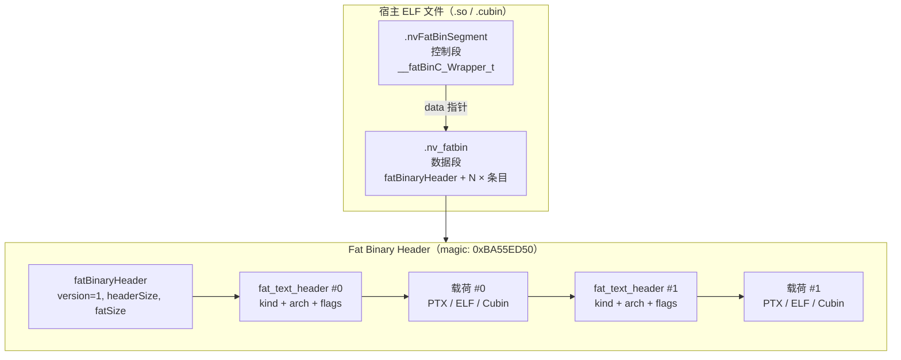
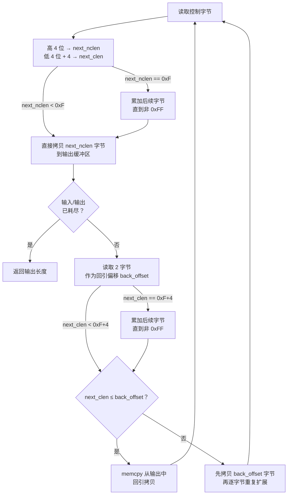

**fb 工具**是 denvdis 项目中专用于解析 NVIDIA Fat Binary 容器格式的实用程序，提供 Fat Binary 内嵌条目的**列举、提取、替换**三项核心操作。该工具以 C++（`fb.cc`）和 Perl（`fb.pl`）两种实现并存，前者直接内嵌了自定义 LZ77 解压缩算法与 zstd 解压支持，后者则依赖外部 Perl 模块 `Elf::FatBinary` 实现相同功能。对于需要理解 CUDA 编译产物内部结构、或对 Fat Binary 进行二进制级别操作的开发者而言，fb 是不可或缺的基础工具。

Sources: [fb.cc](fb/fb.cc#L1-L7), [fb.pl](fb/fb.pl#L1-L11)

## Fat Binary 容器格式总览

NVIDIA 的 Fat Binary 是一种**多层嵌套的容器格式**，用于在单个 ELF 文件中打包面向多个 GPU 架构的编译产物（PTX 源码或 CUBIN/ELF 二进制）。fb 工具解析的完整数据层次如下：宿主 ELF → 控制段（`.nvFatBinSegment`）→ 数据段（`.nv_fatbin`）→ Fat Binary Header → 多个 Text Header + 载荷。



控制段通过 `__fatBinC_Wrapper_t` 结构（magic `0x466243B1`）记录版本和指向数据段的指针；数据段以 `fatBinaryHeader`（magic `0xBA55ED50`）为起始，内部依次排列多个 `fat_text_header` 及其对应的载荷数据。每个条目通过 `kind` 字段区分类型，通过 `flags` 字段标识压缩方式。

Sources: [fb.cc](fb/fb.cc#L53-L99)

## 关键数据结构

fb 工具定义了三组核心数据结构，分别对应 Fat Binary 容器的三个解析层次：

| 结构体 | 魔数 | 所在 ELF 段 | 职责 |
|---|---|---|---|
| `__fatBinC_Wrapper_t` | `0x466243B1` | `.nvFatBinSegment` | 控制段头，记录版本与数据段地址 |
| `fatBinaryHeader` | `0xBA55ED50` | `.nv_fatbin` | Fat Binary 容器头，记录版本、头大小与总载荷大小 |
| `fat_text_header` | — | `.nv_fatbin`（紧跟容器头） | 单个编译产物条目头，记录类型、架构、压缩标志等 |

**`__fatBinC_Wrapper_t`** 是控制段的入口结构，包含 `magic`、`version`、`data`（指向 `.nv_fatbin` 段的地址指针）和 `filename_or_fatbins`（版本 1 为离线文件名，版本 2 为预链接 fatbin 数组）。fb 工具在解析时首先遍历 ELF 所有 section 查找名称为 `.nvFatBinSegment` 的段，验证其 magic 值后，再通过 `data` 指针定位到实际的 `.nv_fatbin` 数据段。

Sources: [fb.cc](fb/fb.cc#L53-L68)

**`fatBinaryHeader`** 是 Fat Binary 容器的顶层头，使用 `__attribute__((aligned(8)))` 保证 8 字节对齐。字段 `fatSize` 记录了整个容器内所有 `fat_text_header` 及其载荷的总大小（不含 `fatBinaryHeader` 自身）。fb 工具要求 `version` 必须为 1 且 `headerSize` 必须等于 `sizeof(fatBinaryHeader)`，否则拒绝解析。

Sources: [fb.cc](fb/fb.cc#L71-L77)

**`fat_text_header`** 是每个编译产物条目的描述头，使用 `__attribute__((__packed__))` 消除填充。其完整字段布局如下：

| 字段 | 大小 | 含义 |
|---|---|---|
| `kind` | uint16_t | 条目类型：`0x0001`=PTX, `0x0002`=ELF, `0x0004`=OLDCUBIN |
| `unknown1` | uint16_t | 保留 |
| `header_size` | uint32_t | 本头结构大小（含可能的扩展字段） |
| `size` | uint64_t | 载荷大小（压缩前或未压缩时为实际大小） |
| `compressed_size` | uint32_t | 压缩后数据大小 |
| `unknown2` | uint32_t | 疑似 PTX 地址空间大小 |
| `minor` / `major` | uint16_t × 2 | 架构版本号（如 sm_75 对应 major=7, minor=5） |
| `arch` | uint32_t | 完整架构标识（如 `0x75`） |
| `obj_name_offset` | uint32_t | 对象名称偏移 |
| `obj_name_len` | uint32_t | 对象名称长度 |
| `flags` | uint64_t | 特征标志位（含压缩方式） |
| `zero` | uint64_t | 对齐字段 |
| `decompressed_size` | uint64_t | 解压后数据大小 |

解析循环中，fb 工具从 `fatBinaryHeader` 之后开始，按照 `header_size + size` 的步进逐个读取 `fat_text_header`，直到到达 `fatBinaryHeader + headerSize + fatSize` 所标识的边界。

Sources: [fb.cc](fb/fb.cc#L102-L118), [fb.cc](fb/fb.cc#L290-L319)

## 条目类型与标志位体系

`fat_text_header` 的 `kind` 字段标识了载荷的二进制格式，这决定了提取后的文件扩展名和使用场景：

| kind 值 | 常量名 | 含义 | 典型扩展名 |
|---|---|---|---|
| `0x0001` | `FATBIN_KIND_PTX` | PTX 中间表示文本 | `.ptx` |
| `0x0002` | `FATBIN_KIND_ELF` | CUBIN/ELF 格式的 SASS 二进制 | `.cubin` |
| `0x0004` | `FATBIN_KIND_OLDCUBIN` | 旧版 Cubin 格式 | `.cubin` |

`flags` 字段是 64 位标志位掩码，fb 工具特别关注其中的**压缩相关标志**：

| 掩码 | 常量名 | 含义 |
|---|---|---|
| `0x0001` | `FATBIN_FLAG_64BIT` | 64 位目标 |
| `0x0004` | `FATBIN_FLAG_CUDA` | CUDA 源码编译产物 |
| `0x0010` | `FATBIN_FLAG_LINUX` | Linux 平台 |
| `0x1000` | `FATBIN_FLAG_COMPRESS` | 自定义 LZ77 压缩 |
| `0x2000` | `FATBIN_FLAG_COMPRESS2` | 自定义 LZ77 压缩（变体） |
| `0x8000` | `FATBIN_FLAG_ZCOMPRESS` | Zstandard (zstd) 压缩 |

fb 工具通过 `compressed()` 方法检查三个压缩标志的并集，通过 `z_compressed()` 方法单独检查 zstd 标志。提取时，zstd 压缩的条目使用 `ZSTD_decompress` 解压，而 COMPRESS/COMPRESS2 则使用自定义的 `decompress()` 函数。

Sources: [fb.cc](fb/fb.cc#L81-L99), [fb.cc](fb/fb.cc#L133-L138)

## 自定义 LZ77 解压缩算法

fb 工具中最具逆向工程价值的部分是其内嵌的 **自定义 LZ77 变体解压缩算法**。该算法并非使用标准的 gzip/zlib，而是 NVIDIA 私有的轻量级压缩方案，核心思想是交替排列**非压缩段**（literal）和**回引压缩段**（back-reference）。

算法从输入流中逐个读取控制字节，每个控制字节编码了一对段信息：**高 4 位**为非压缩段长度，**低 4 位加 4**为压缩段长度。当长度字段达到最大值（`0xF`）时，后续字节以 `0xFF` 为续接标记累加扩展长度。



**回引拷贝**是算法的核心操作：从当前输出位置向前偏移 `back_offset` 处复制 `next_clen` 字节。当 `next_clen ≤ back_offset` 时可直接整块拷贝；当 `next_clen > back_offset` 时（即回引区域小于要输出的长度），先拷贝 `back_offset` 字节的基础数据，再逐字节按周期重复填充——这与经典 LZ77 中处理重叠回引的方式一致。

Sources: [fb.cc](fb/fb.cc#L147-L207)

## ELF 段定位与解析流程

fb 工具的 `CFatBin::open()` 方法实现了完整的 Fat Binary 发现与解析流程，分为三个阶段：

**阶段一：控制段发现。** 遍历 ELF 所有 section，查找名称为 `.nvFatBinSegment` 的段。验证段大小不小于 `sizeof(__fatBinC_Wrapper_t)`，并检查 magic 为 `0x466243B1`。从控制段中提取 `data` 指针，该指针指向实际 Fat Binary 数据所在的段地址。

**阶段二：数据段定位。** 再次遍历 ELF section，将每个段的虚拟地址与控制段中的 `data` 指针比较。匹配条件为：段起始地址等于 `data`，或段地址范围覆盖 `data`。定位到的段即为 `.nv_fatbin` 数据段。

**阶段三：条目枚举。** 在 `.nv_fatbin` 段内，首先验证 `fatBinaryHeader` 的 magic（`0xBA55ED50`）、version（必须为 1）、headerSize（必须等于结构体大小）。然后按 `header_size + size` 步进遍历所有 `fat_text_header` 条目，将每个条目的偏移量和完整头信息存入 `m_map`（以索引为键的哈希表），供后续的提取和替换操作使用。

Sources: [fb.cc](fb/fb.cc#L209-L325)

## 命令行接口与操作模式

### C++ 版本（fb.cc）

C++ 版本通过 `getopt` 解析命令行参数，支持以下选项：

| 选项 | 参数 | 功能 |
|---|---|---|
| `-v` | 无 | 详细模式：列举所有条目的元数据 |
| `-h` | 无 | 十六进制转储：HexDump 每个条目头 |
| `-i <idx>` | 条目索引 | 指定要操作的条目索引 |
| `-o <file>` | 输出文件名 | 提取指定索引的条目到文件 |
| `-r <file>` | 替换文件名 | 用指定文件原地替换目标条目 |

**列举模式**（仅 `-v`）：打印所有条目的 kind、flag、header_size、size、arch、major、minor，对压缩条目额外显示 compressed_size 和 decompressed_size。

**提取模式**（`-i <idx> -o <file>`）：定位到目标条目的载荷数据。若条目已压缩，根据压缩类型调用 `ZSTD_decompress` 或自定义 `decompress()` 解压后写入输出文件；若未压缩，直接写入原始数据。

**替换模式**（`-i <idx> -r <file>`）：**仅支持未压缩条目**。验证替换文件大小与原始载荷大小一致后，以 `r+b` 模式打开原始 Fat Binary 文件，fseek 到目标偏移位置并覆盖写入。这确保了不破坏文件的其他结构。

Sources: [fb.cc](fb/fb.cc#L455-L499), [fb.cc](fb/fb.cc#L327-L397)

### Perl 版本（fb.pl）

Perl 版本提供了等效但语法更简洁的接口，依赖两个外部 CPAN 风格模块：

- `Elf::Reader`（来自 [dwarfdump 仓库](https://github.com/redplait/dwarfdump/tree/main/perl/Elf-Reader)）：ELF 文件解析
- `Elf::FatBinary`（来自同仓库）：Fat Binary 格式的高层封装

| 选项 | 功能 |
|---|---|
| `-a <arch>` | 按架构过滤（十六进制，如 `-a 75`） |
| `-i <idx>` | 指定条目索引 |
| `-p` | 仅过滤 PTX 条目 |
| `-r <file>` | 替换指定索引的条目 |
| `-v` | 详细列举模式 |

Perl 版本的提取逻辑会自动根据 `kind` 字段生成文件名：`<index>_<arch>.ptx`（PTX 类型）或 `<index>_<arch>.cubin`（ELF/Cubin 类型）。替换操作通过 `Elf::FatBinary` 模块的 `replace()` 方法完成，并在替换前后计算并打印文件的 MD5 校验和。

Sources: [fb.pl](fb/fb.pl#L28-L39), [fb.pl](fb/fb.pl#L41-L96), [fb.pl](fb/fb.pl#L98-L133)

## 编译与使用示例

fb 工具的编译依赖 **ELFIO** 库（ELF 文件解析）和 **libzstd**（zstd 解压），Makefile 中硬编码了 ELFIO 的相对路径 `-I ../../../../../ELFIO/`。如需编译，需确保 ELFIO 库位于该相对路径，或修改 Makefile 中的 `ELFIO` 变量。

```bash
# 编译
cd fb && make

# 列举 Fat Binary 中所有条目（详细模式）
./fb -v path/to/cuda_kernels.so

# 提取第 3 个条目到文件
./fb -v path/to/cuda_kernels.so    # 先查看索引
./fb -i 3 -o extracted.cubin path/to/cuda_kernels.so

# 替换第 3 个条目（仅限未压缩条目，大小必须匹配）
./fb -i 3 -r modified.cubin path/to/cuda_kernels.so

# Perl 版本：按架构过滤并提取
perl fb.pl -a 75 path/to/cuda_kernels.so

# Perl 版本：仅提取 PTX 条目
perl fb.pl -p -v path/to/cuda_kernels.so
```

Sources: [Makefile](fb/Makefile#L1-L14)

## HexDump 辅助工具

fb 工具内嵌了一个紧凑的十六进制转储函数 `HexDump()`，用于调试时可视化二进制数据。该函数按经典 hexdump 格式输出：左侧为偏移地址，中间为每 16 字节一行的十六进制表示（每 4 字节用空格分隔，每 8 字节用竖线 `|` 分隔），右侧为 ASCII 字符表示（非可打印字符显示为 `.`）。在 `-h` 模式下，fb 会为每个 `fatBinaryHeader` 和 `fat_text_header` 调用此函数，便于验证解析结果的正确性。

Sources: [fb.cc](fb/fb.cc#L8-L48)

## 架构定位与工具链关联

fb 工具在 denvdis 项目中处于**第五层（二进制操作工具）**，是连接 Fat Binary 容器与下游分析工具的关键桥梁。通过 fb 提取出的 `.cubin` 文件可直接供 [nvd 反汇编器](8-nvd-fan-hui-bian-qi-jia-gou-yu-elf-cubin-jie-xi) 进行 SASS 反汇编，或供 [ced 补丁工具](13-ced-lei-sed-de-cubin-nei-lian-bu-ding-gong-ju) 进行二进制级别修改。fb 的替换功能也常与 [CTF 工具与 Cubin 二进制补丁实践](22-ctf-gong-ju-yu-cubin-er-jin-zhi-bu-ding-shi-jian) 配合使用，实现修改后内核的回注。

对于希望深入了解 CUDA 编译产物内部结构的开发者，建议按以下顺序阅读：先通过本文理解 Fat Binary 的容器层次，再通过 [nvd 反汇编器架构与 ELF/CUBIN 解析](8-nvd-fan-hui-bian-qi-jia-gou-yu-elf-cubin-jie-xi) 了解 `.cubin` 内部的 SASS 指令编码，最后通过 [CTF 工具与 Cubin 二进制补丁实践](22-ctf-gong-ju-yu-cubin-er-jin-zhi-bu-ding-shi-jian) 掌握端到端的补丁工作流。