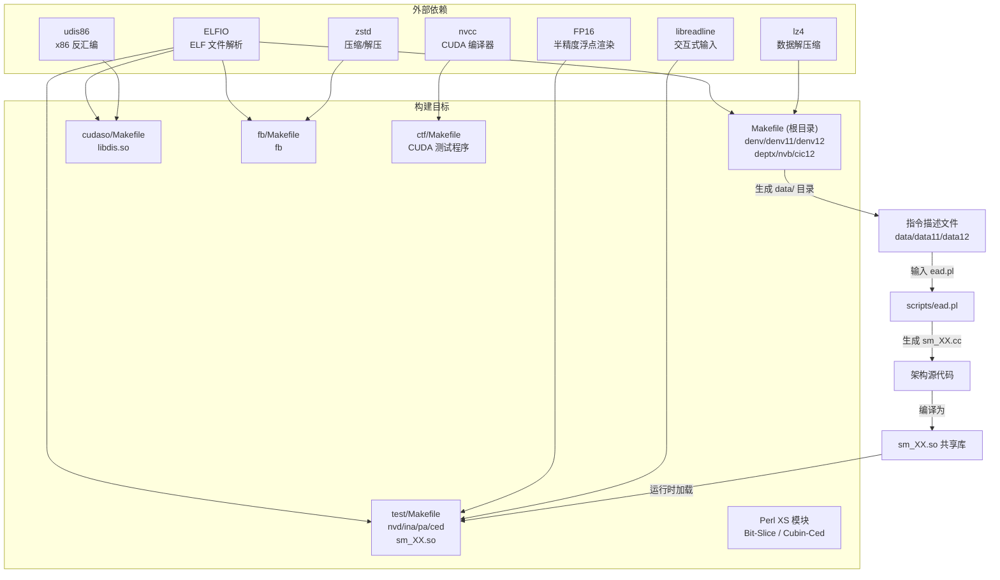
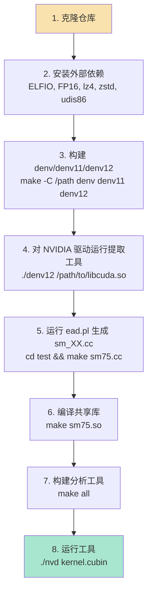

本页系统性地介绍 denvdis 工具集的完整编译流程、外部依赖安装、环境变量配置以及各构建目标的职责划分。项目采用**多级 Makefile 架构**，由分布在各子目录中的独立 Makefile 协同驱动，覆盖从 NVIDIA 驱动加密数据提取到 SASS 反汇编的全链路工具构建。

## 构建系统全景

denvdis 项目并非由单一顶层 Makefile 统一管理所有目标，而是按功能模块拆分为多个**独立的构建单元**，每个子目录拥有自己的 Makefile。这种设计反映了项目渐进式生长的特征——各工具在逆向工程过程中逐步独立开发而成。



Sources: [Makefile](Makefile#L1-L29), [test/Makefile](test/Makefile#L1-L162), [cudaso/Makefile](cudaso/Makefile#L1-L20), [fb/Makefile](fb/Makefile#L1-L14), [README.md](README.md#L1-L46)

## 外部依赖安装

项目依赖以下外部库和工具链，需在编译前逐一就绪：

| 依赖项 | 用途 | 安装方式 | 被谁使用 |
|--------|------|----------|----------|
| **ELFIO** | ELF/CUBIN 文件解析 | 从 [GitHub](https://github.com/serge1/ELFIO) 克隆，需放置于相对路径 `../../../../ELFIO`（根 Makefile）或 `../../../../../ELFIO/`（test/cudaso/fb） | denv, denv11, denv12, deptx, nvd, pa, ced, fb, cudaso |
| **FP16** | 半精度浮点值渲染 | 从 [GitHub](https://github.com/Maratyszcza/FP16) 克隆，放置于 `../../FP16/include` | ina, nvd, pa, ced |
| **lz4** | 加密数据解压缩 | 需构建静态库 `liblz4.a`，路径 `../lz4/lib/liblz4.a` | denv11, denv12 |
| **zstd** | Fat Binary 压缩格式解压 | 系统包管理器安装 `-lzstd` | fb |
| **udis86** | x86/x64 反汇编引擎 | cudaso 需要的 x64 指令解析库 | cudaso |
| **libreadline** | 交互式命令行输入 | 系统包管理器安装 | ina |
| **Perl 5.30+** | 脚本运行时与 XS 模块构建 | 系统包管理器安装 | ead.pl, dg.pl, Bit-Slice, Cubin-Ced |
| **nvcc** (CUDA Toolkit) | CUDA 内核编译 | 安装 NVIDIA CUDA Toolkit | ctf 子项目 |
| **clang++** | sm_XX.so 共享库编译 | Makefile 中指定 `clang++-21` | sm_XX.so |

**关键注意**：项目使用 GCC 内建类型 `__uint128_t`，这是 x86-64 平台特有的扩展。在 ARM 或其他非 x86 架构上编译时，需替换为如 abseil Numeric 等替代方案。[README.md](README.md#L7-L8)

Sources: [Makefile](Makefile#L1-L4), [test/Makefile](test/Makefile#L1-L16), [fb/Makefile](fb/Makefile#L1-L4), [cudaso/Makefile](cudaso/Makefile#L1-L5), [README.md](README.md#L3-L8)

## 核心构建目标详解

### 根目录 Makefile —— 驱动数据提取工具

根目录 [Makefile](Makefile) 负责构建**驱动加密表提取**工具链的核心程序。每个工具对应一个 `.cc` 源文件，直接由 gcc 编译为可执行文件：

| 目标 | 源文件 | 输出目录 | 说明 |
|------|--------|----------|------|
| `denv` | denv.cc | data/ | CUDA v10 及更早版本的驱动指令描述提取 |
| `denv11` | denv11.cc | data11/ | CUDA v11 驱动的指令描述提取（使用 lz4 解压） |
| `denv12` | denv12.cc | data12/ | CUDA v12+ 驱动的指令描述提取（使用 lz4 解压） |
| `deptx` | ptxas.cc | macros/ | ptxas 加密表提取，生成 PTX 宏模板 |
| `cic12` | cic12.cc | — | CUDA v12 编译器内部信息提取 |
| `nvb` | nvb.cc | — | NVRTC 内置字节码提取（从 libnvrtc-builtins.so） |

编译命令示例：

```bash
# 构建 denv11（需要 ELFIO 和 lz4）
make denv11

# 构建 nvb（需要 libdl）
make nvb
```

其中 denv11 和 denv12 需要额外的 lz4 静态库支持，编译时会链接 `../lz4/lib/liblz4.a` 并添加包含路径 `-I ../lz4/lib`。这三个提取工具的内部结构高度相似——都使用相同的 `seeds[64]` 解密种子表和 `decr_ctx` 解密上下文，区别仅在于输出子目录和压缩算法差异。

Sources: [Makefile](Makefile#L1-L29), [denv.cc](denv.cc#L1-L12), [denv11.cc](denv11.cc#L1-L11), [denv12.cc](denv12.cc#L1-L11), [ptxas.cc](ptxas.cc#L1-L11)

### test/Makefile —— 反汇编工具与架构共享库

[test/Makefile](test/Makefile) 是项目中最复杂的构建文件，负责构建四个核心分析工具和所有 GPU 架构的共享库。

**工具链构建**采用 `libced.a` 静态库模式，将公共组件打包后链接到各工具：

| 目标 | 源文件 | 依赖 | 链接库 |
|------|--------|------|--------|
| `ina` | ina.cc | libced.a | readline, dl |
| `nvd` | nvd.cc | libced.a | dl |
| `pa` | pa.cc | libced.a | dl |
| `ced` | ced.cc | libced.a | dl |

**libced.a** 由以下组件构建：

| 组件 | 文件 | 编译标志 | 说明 |
|------|------|----------|------|
| bf16.o | bf16.cc | -fpic | BF16 浮点支持 |
| ced_base.o | ced_base.cc | -fpic + ELFIO + FP16 | Cubin 编辑基础设施 |
| nv_lat.o | nv_lat.cc + lat.inc | -fpic | 延迟调度表 |
| nv_rend.o | nv_rend.cc | -fpic + FP16 | SASS 渲染引擎 |
| sass_parser.o | sass_parser.cc | -fpic + FP16 | SASS 汇编解析器 |

编译标志方面，`CFLAGS` 设定为 `-Wall -Wno-missing-braces -std=c++20 -gdwarf-4`（含调试信息），`CC` 默认使用 `gcc -mavx2`，而 sm_XX.so 专门使用 `clang++-21 -mavx2` 编译以获得更好的共享库兼容性。[test/Makefile](test/Makefile#L1-L18)

Sources: [test/Makefile](test/Makefile#L1-L50)

## sm_XX.so 架构共享库生成流水线

这是整个构建系统中**最关键的自动化环节**。共享库 `sm_XX.so` 封装了特定 GPU 架构的 SASS 指令编码/解码表，由运行时工具通过 `dlopen` 动态加载。其生成流程跨越了数据提取、代码生成和编译三个阶段：


**ead.pl 代码生成器**是流水线的核心，它解析 nvdisasm 风格的指令描述文件，生成包含编码掩码、枚举映射、调度表和指令谓词的 C++ 共享库源码。其关键命令行选项如下：

| 选项 | 功能 |
|------|------|
| `-B` | 构建解码决策树 |
| `-F` | 按枚举值过滤 |
| `-E` | 生成直接枚举映射 |
| `-m` | 生成编码掩码 |
| `-g` | 解析并生成调度表 |
| `-a` | 添加替代指令形式 |
| `-r` | 反序填充掩码 |
| `-i` | 转储指令格式 |
| `-z` | 移除完全填充的表模式 |
| `-p` | 解析指令谓词 |
| `-C <suffix>` | 指定输出文件名后缀（如 sm75） |
| `-u <file>` | 保存属性到文件 |
| `-U <file>` | 加载并复用属性 |

各架构的生成命令可在 test/Makefile 中查看。例如 sm75 的生成命令为：

```bash
# 生成 sm75.cc
perl -d:Confess ../scripts/ead.pl -BFEmgarizp -C sm75 ../data11/sm75_1.txt

# 编译为共享库
clang++-21 -Wall -Wno-missing-braces -Wno-unused-const-variable -shared -fpic \
  -gdwarf-4 -pthread -I ../scripts -o sm75.so sm75.cc -lstdc++ -lpthread
```

对于 sm90 及更新架构（sm100-sm120），ead.pl 支持属性复用机制：先从 sm90 生成 `90.props` 属性文件（`-u 90.props`），然后在生成后续架构时加载该属性（`-U 90.props`），以弥补较新架构数据中属性信息被裁剪的问题。

Sources: [test/Makefile](test/Makefile#L106-L162), [scripts/ead.pl](scripts/ead.pl#L1-L50)

## cudaso 驱动分析框架构建

[cudaso/Makefile](cudaso/Makefile) 构建 CUDA 驱动二进制的深度分析框架，生成可被其他工具链接的静态库和共享库：

| 目标 | 输出 | 组件 |
|------|------|------|
| `libde_bg.a` | 静态库（调试追踪） | bm_search, decuda_base, de_bg, x64arch, rtmem, mylog |
| `libdis.a` | 静态库（完整分析） | libde_bg.a 组件 + de_cupti, decuda, de_ptx |
| `libdis.so` | 共享库 | 同 libdis.a，额外链接 udis86 |

所有 `.cc` 文件以 `gcc -g -fpic -I$(UDIS_PATH) -I$(ELFIO_PATH)` 编译为目标文件。最终共享库 `libdis.so` 通过 `gcc -shared` 生成，链接 udis86 和 libdl。此共享库被 ctf 工具通过 nvcc 直接链接使用。

Sources: [cudaso/Makefile](cudaso/Makefile#L1-L20)

## fb Fat Binary 工具构建

[fb/Makefile](fb/Makefile) 构建单一工具 `fb`，用于解析和解压 NVIDIA Fat Binary 格式：

```bash
gcc -I ../../../../../ELFIO/ -Wall -std=c++20 -o fb fb.cc -lzstd -lstdc++
```

fb 工具是 ctf 子项目的前置依赖，ctf 的 Makefile 中调用 `../fb/fb -i 1 -o <id> <executable>` 来提取 CUDA 内核。

Sources: [fb/Makefile](fb/Makefile#L1-L4), [fb/fb.cc](fb/fb.cc#L1-L7)

## Perl XS 模块构建

项目包含两个 Perl XS 模块，需要通过标准的 Perl 模块构建流程安装：

**Bit::Slice**（[Bit-Slice/](Bit-Slice/)）：位操作工具模块，为 ead.pl 等脚本提供底层位切片操作支持。

```bash
cd Bit-Slice
perl Makefile.PL
make
```

**Cubin::Ced**（[test/Cubin-Ced/](test/Cubin-Ced/)）：Cubin 内联编辑的 Perl 绑定，构建时会自动下载依赖文件 `elf.inc` 和测试用 cubin 文件。此模块依赖 `Elf::Reader` Perl 模块和 `libced.a` 静态库。

```bash
cd test/Cubin-Ced
perl Makefile.PL   # 自动下载 elf.inc 和 cudatest.6.sm_61.cubin
make
```

Sources: [Bit-Slice/Makefile.PL](Bit-Slice/Makefile.PL#L1-L21), [test/Cubin-Ced/Makefile.PL](test/Cubin-Ced/Makefile.PL#L1-L39)

## 环境变量配置

### SM_DIR —— 架构共享库搜索路径

`SM_DIR` 是项目中最关键的环境变量，控制 nvd、ina、pa、ced 四个工具在运行时去哪个目录查找 `sm_XX.so` 共享库。

- **默认行为**：从当前工作目录（`./`）加载 `sm_XX.so`
- **自定义路径**：设置 `SM_DIR` 环境变量指向 sm_XX.so 所在目录

```bash
# 示例：指定共享库目录
export SM_DIR=/path/to/sm_libraries

# 或者在运行时指定
SM_DIR=./test nvd some_kernel.cubin
```

共享库的加载逻辑由 [celf.h](test/celf.h#L47-L60) 中的 `CElf::open` 方法实现：它首先从 ELF 文件的 flags 字段提取 SM 版本号（如 0x4b = sm75），然后在 `NV_renderer::s_sms` 映射表中查找对应的库名（某些架构共享相同库，如 sm87 复用 sm86.so），最后拼接 `SM_DIR` 路径和 `.so` 后缀通过 `dlopen` 加载。

Sources: [test/celf.h](test/celf.h#L29-L60), [test/nv_rend.cc](test/nv_rend.cc#L56-L82), [README.md](README.md#L45-L46)

## 完整构建流程：从零开始

以下是将项目从源码构建到可运行状态的完整步骤：



**步骤详解**：

```bash
# 1. 安装系统依赖
sudo apt install gcc g++ clang-21 perl libreadline-dev zlib1g-dev

# 2. 克隆外部依赖（按需调整路径）
git clone https://github.com/serge1/ELFIO.git /path/to/ELFIO
git clone https://github.com/Maratyszcza/FP16.git /path/to/FP16

# 3. 构建根目录提取工具（按需调整 ELFIO 路径）
# 编辑 Makefile 中 ELFIO 变量指向实际路径
make denv denv11 denv12 deptx nvb

# 4. 对 NVIDIA 驱动运行提取工具（生成 data/ 目录）
./denv /path/to/libcuda.so.OLDER_VERSION
./denv11 /path/to/libcuda.so.CUDA_11_VERSION
./denv12 /path/to/libcuda.so.CUDA_12_VERSION

# 5. 构建分析工具和架构共享库
cd test
# 编辑 Makefile 中 ELFIO 和 FP16 路径
make all          # 构建 ina, nvd, pa, ced
make sm75.so      # 构建特定架构共享库
# 或构建所有支持的架构
make sm2.so sm3.so sm4.so sm5.so sm52.so sm55.so sm57.so \
     sm70.so sm72.so sm75.so sm80.so sm86.so sm89.so sm90.so \
     sm100.so sm101.so sm103.so sm120.so

# 6. 运行
./nvd -c kernel.cubin
```

Sources: [Makefile](Makefile#L1-L29), [test/Makefile](test/Makefile#L1-L105), [README.md](README.md#L1-L46)

## 常见构建问题排查

| 问题 | 原因 | 解决方案 |
|------|------|----------|
| `elfio/elfio.hpp: No such file` | ELFIO 路径未正确配置 | 检查 Makefile 中 `ELFIO` 变量是否指向实际安装路径 |
| `fp16.h: No such file` | FP16 头文件路径错误 | 检查 test/Makefile 中 `FP16` 变量，确保指向 `FP16/include` |
| `cannot load sm_XX.so` | 共享库不在当前目录 | 设置 `SM_DIR` 环境变量指向 sm_XX.so 所在目录 |
| `unknown SM XX` | 工具未识别该 GPU 架构 | 确认 s_sms 映射表中包含该架构，或需要新增条目 |
| `__uint128_t` 编译错误 | 在非 x86-64 平台编译 | 替换为 abseil Numeric 或其他 128 位整数实现 |
| `lz4.h: No such file` | lz4 开发文件未安装 | 安装 liblz4-dev 或从源码构建 liblz4.a |
| `clang++-21: not found` | 未安装指定版本 clang | 安装 clang-21 或修改 test/Makefile 中 `CLANG` 变量 |
| `perl Bit::Slice not found` | Bit-Slice 模块未安装 | 进入 Bit-Slice 目录执行 `perl Makefile.PL && make && make install` |

Sources: [README.md](README.md#L3-L8), [test/Makefile](test/Makefile#L5-L6), [test/celf.h](test/celf.h#L43-L45)

## 推荐阅读顺序

完成环境配置后，建议按以下路径深入学习项目各模块：

1. **[工具链全览：从驱动提取到二进制分析](3-gong-ju-lian-quan-lan-cong-qu-dong-ti-qu-dao-er-jin-zhi-fen-xi)** — 理解各工具在整个逆向工程流水线中的定位
2. **[NVIDIA 驱动中的加密指令描述表提取](4-nvidia-qu-dong-zhong-de-jia-mi-zhi-ling-miao-shu-biao-ti-qu-denv-denv11-denv12)** — 深入理解 denv 系列工具的工作原理
3. **[ead.pl 指令编码生成器](6-ead-pl-zhi-ling-bian-ma-sheng-cheng-qi-cong-miao-shu-wen-jian-dao-sm_xx-so-gong-xiang-ku)** — 掌握从描述文件到共享库的代码生成机制
4. **[nvd 反汇编器架构](8-nvd-fan-hui-bian-qi-jia-gou-yu-elf-cubin-jie-xi)** — 开始使用核心反汇编工具