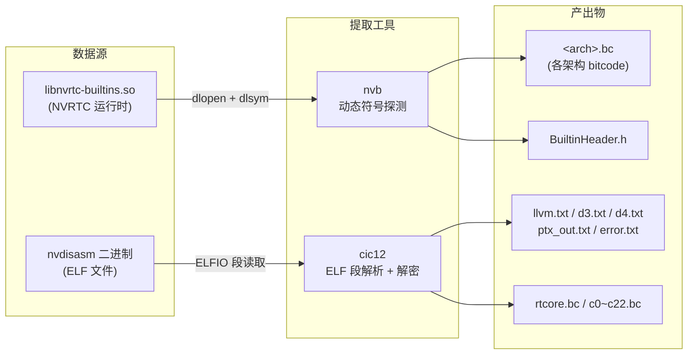
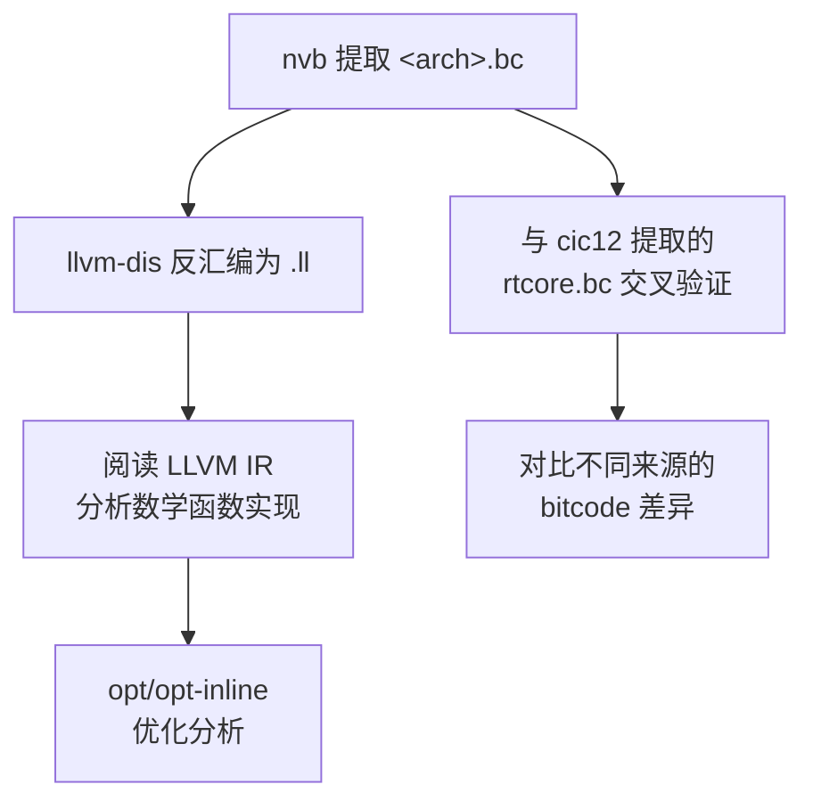

**nvb** 是一个轻量级的动态链接库探测工具，专门用于从 NVIDIA NVRTC 运行时共享库 `libnvrtc-builtins.so` 中提取内置的 **LLVM bitcode** 和 **内置头文件**。NVRTC（NVIDIA Runtime Compiler）在 JIT 编译 CUDA 设备代码时，需要一组预编译的数学函数实现（除法、平方根、倒数等）作为底层支持——这些实现以 LLVM bitcode 形式嵌入在共享库中，按 GPU 架构分片存储。nvb 通过动态加载和符号解析的方式，暴力枚举所有架构的 bitcode 数据并逐一落盘，为后续的逆向分析和编译器内部机制研究提供原始素材。

Sources: [nvb.cc](nvb.cc#L1-L71)

## 工具定位与架构上下文

在项目的整体工具链中，nvb 处于**编译器内部数据提取层**。它与其他几个工具形成互补关系：`cic12`（`cic12.cc`）从 `nvdisasm` 二进制文件中提取加密的机器描述表和 bitcode，而 nvb 则直接利用 NVRTC 共享库的公开符号接口提取数据——无需破解任何加密或混淆机制。两者的输出在语义上高度重叠（均包含 LLVM 内建函数表、PTX 指令描述等），但来源路径不同，互为验证。



上述流程图展示了 nvb 与 cic12 的数据来源和产出差异：nvb 通过合法的动态链接 API 访问数据，而 cic12 需要从 ELF 文件中手动定位并解密数据段。仓库中的 `cicc12/` 目录存放的正是 cic12 从 `nvdisasm` 中提取的样本输出，其中 `rtcore.bc`（41KB LLVM bitcode）和 `rtcore.ll`（反汇编后的 LLVM IR，4322 行）可作为 nvb 输出物特征的参照。

Sources: [nvb.cc](nvb.cc#L1-L8), [cic12.cc](cic12.cc#L1-L10), [cicc12/rtcore.ll](cicc12/rtcore.ll#L1-L4)

## 核心实现：动态符号探测

nvb 的核心逻辑极其精简——整个工具仅 72 行 C++ 代码，其工作原理建立在 NVRTC 共享库的两个导出符号之上：

| 导出符号 | 函数签名 | 功能 | 输出文件 |
|---|---|---|---|
| `getBuiltinHeader` | `const char* (*)(size_t*)` | 获取 NVRTC 内置 CUDA 头文件 | `BuiltinHeader.h` |
| `getArchBuiltins` | `const unsigned char* (*)(size_t*, int)` | 获取指定架构的 LLVM bitcode | `<arch>.bc` |

**动态加载阶段**使用 `dlopen(argv[1], RTLD_NOW)` 加载用户指定的 `libnvrtc-builtins.so` 路径，随后通过 `dlsym` 解析上述两个符号地址。值得注意的是，`getBuiltinHeader` 是可选的——即使该符号不存在，程序也不会终止，只是跳过头文件提取。而 `getArchBuiltins` 是必需的，缺失时直接退出。

**暴力枚举阶段**是工具的精髓所在。由于没有公开的 API 可以查询支持哪些架构，nvb 采用最直接的方式：对架构编号从 `1` 到 `0x80`（即 1~128）逐一调用 `getArchBuiltins(&sz, arch)`。如果该架构存在对应的 bitcode，函数返回非空指针并通过 `sz` 输出数据大小；否则返回 `NULL`，程序静默跳过。每次成功获取的 bitcode 数据直接写入 `<arch>.bc` 文件——文件名即架构编号本身。

Sources: [nvb.cc](nvb.cc#L38-L71), [nvb.cc](nvb.cc#L8-L9)

## 编译与使用方法

编译极为简单，仅需链接 `libdl`（动态加载）和 `libstdc++`：

```bash
# 编译（在项目根目录的 Makefile 中已配置）
make nvb
# 等效于: gcc -o nvb nvb.cc -ldl -lstdc++
```

使用时，唯一参数是 `libnvrtc-builtins.so` 的完整路径：

```bash
# 典型用法：指向 CUDA Toolkit 中的 NVRTC 内置库
./nvb /usr/local/cuda/lib64/libnvrtc-builtins.so.12.6.85
```

工具执行后会在当前目录生成以下文件：

| 文件名 | 内容说明 |
|---|---|
| `BuiltinHeader.h` | NVRTC 内置头文件，包含 CUDA 设备端内建宏和类型声明 |
| `1.bc` ~ `N.bc` | 各 GPU 架构对应的 LLVM bitcode，编号对应 SM 架构值 |

Sources: [Makefile](Makefile#L24-L25), [nvb.cc](nvb.cc#L11-L23), [nvb.cc](nvb.cc#L38-L42)

## Bitcode 内容分析

提取出的 bitcode 文件本质上是 **LLVM IR 的二进制编码格式**，可通过 `llvm-dis` 工具反汇编为可读的 `.ll` 文本。根据仓库中 `cicc12/rtcore.ll` 样本（该文件来自 cic12 对 nvdisasm 的提取，与 nvb 的产出物具有相同的内部结构），可以确认 bitcode 包含以下内容：

**目标三元组**为 `nvptx64-nvidia-libdevice`，数据布局为 `e-i64:64-i128:128-v16:16-v32:32-n16:32:64`，表明这是针对 NVIDIA PTX 64 位目标的 libdevice 库。模块内包含 **41 个函数定义**，全部是 CUDA 设备端数学运算的软件实现：

| 函数族 | 典型函数名 | 功能说明 |
|---|---|---|
| 除法 (div) | `__cuda_sm20_div_rd_f32`, `__cuda_sm20_div_rz_f64` | IEEE 754 各种舍入模式的浮点除法 |
| 倒数 (rcp) | `__cuda_sm20_rcp_rn_f32_slowpath` | 浮点倒数快速/慢速路径 |
| 平方根 (sqrt) | `__cuda_sm20_sqrt_rn_f32_slowpath` | 浮点平方根 |
| 整数除法 | `__cuda_sm20_div_s64`, `__cuda_sm20_rem_u64` | 64 位有符号/无符号整数除法和取余 |
| 双精度辅助 | `__cuda_sm20_dsqrt_rn_f64_mediumpath_v1` | 双精度平方根中等精度路径 |

函数命名遵循 `__cuda_sm<XX>_<op>_<round>_<type>[_<variant>]` 的统一模式。其中 `sm20` 前缀表示基准实现（兼容 SM 2.0 Fermi 架构），`rd/ru/rz/rn` 表示舍入模式（向负无穷/向正无穷/向零/最近），`ftz` 后缀表示 flush-to-zero（非正规数刷新为零）模式。这些函数直接使用 LLVM 内建函数如 `llvm.nvvm.fabs.ftz.f32`、`llvm.nvvm.add.ftz.f32` 等 NVPTX 特有的底层指令，绕过标准 PTX 运算以获得精确的舍入行为控制。

Sources: [cicc12/rtcore.ll](cicc12/rtcore.ll#L1-L20), [cicc12/rtcore.ll](cicc12/rtcore.ll#L3-L4)

## 辅助数据提取：cic12 工具

与 nvb 形成互补的 **cic12** 工具（源码 `cic12.cc`）从不同的数据源——`nvdisasm` 可执行文件——中提取更为丰富的编译器内部数据。cic12 通过 ELFIO 库解析 ELF 段结构，从 `.data` 和 `.rodata` 段中定位并提取两类数据：

**加密的机器描述表**（存储在 `.data` 段），通过自定义的 XOR 解密算法还原。该算法使用 64 个 32 位种子值构成的盐表，以线性同余生成器（`0x41C64E6D * state + 0x3039`）驱动逐字节解密，以 0x3DC 字节为分块单位。解密后的数据包括：

| 产出文件 | 行数 | 内容 |
|---|---|---|
| `llvm.txt` | 23,588 | LLVM 内建函数符号映射表（llvm.* → 内建函数名） |
| `d3.txt` | 12,583 | LLVM 内建函数扩展映射（含平台特定内建） |
| `d4.txt` | 2,119 | PTX 指令助记符表（and.b32、xor.b64 等） |
| `ptx_out.txt` | 3,225 | PTX 输出指令完整列表（含 atom、ld.global 等） |
| `error.txt` | 3,757 | NVRTC 编译器错误消息表 |

**原始 bitcode 段**（存储在 `.rodata` 段），无需解密，直接按偏移量提取为独立的 `.bc` 文件。cic12 定义了 23 个 bitcode 段（c0~c22），覆盖了不同的编译器功能模块。

Sources: [cic12.cc](cic12.cc#L30-L108), [cic12.cc](cic12.cc#L38-L83), [cic12.cc](cic12.cc#L194-L239)

## 实践建议与关联阅读

nvb 工具的使用场景主要集中在编译器研究和逆向工程领域。提取出的 bitcode 可用于：理解 NVIDIA 如何在软件层面实现 IEEE 754 精确舍入除法（PTX 硬件指令只提供近似精度）；分析 libdevice 库的内部函数调用关系；为自定义 CUDA 编译器提供参考实现。

典型的后续操作流程：



通过 nvb 和 cic12 的双路径提取，研究人员可以从两个独立来源获取同一套编译器内部数据，从而验证提取结果的完整性。`cicc12/` 目录中的样本文件即为这种交叉验证提供了基准参照——例如 `llvm.txt`（LLVM 内建函数表）和 `d4.txt`（PTX 指令表）中的内容应与 nvb 提取出的 bitcode 中引用的符号保持一致。

Sources: [nvb.cc](nvb.cc#L63-L68)

### 关联文档

- [Fat Binary 格式解析与解压（fb 工具）](19-fat-binary-ge-shi-jie-xi-yu-jie-ya-fb-gong-ju) — Fat Binary 是 CUDA 编译产物的另一类容器格式，fb 工具负责其解析与解压
- [PTX 宏模板系统与内置函数（macros/ 目录）](7-ptx-hong-mo-ban-xi-tong-yu-nei-zhi-han-shu-macros-mu-lu) — 宏模板定义了 PTX 内置函数的编译期展开规则，与 bitcode 中的 libdevice 函数互为补充
- [nvd 反汇编器架构与 ELF/CUBIN 解析](8-nvd-fan-hui-bian-qi-jia-gou-yu-elf-cubin-jie-xi) — nvd 是本项目核心的 SASS 反汇编器，也是 cic12 提取操作的目标 ELF 文件