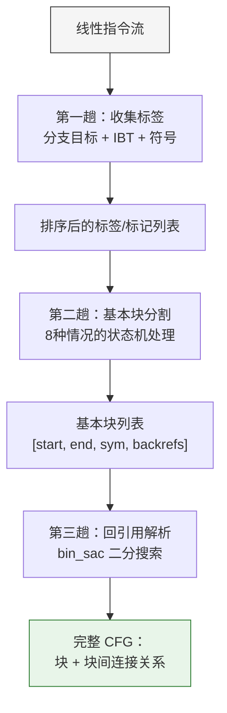
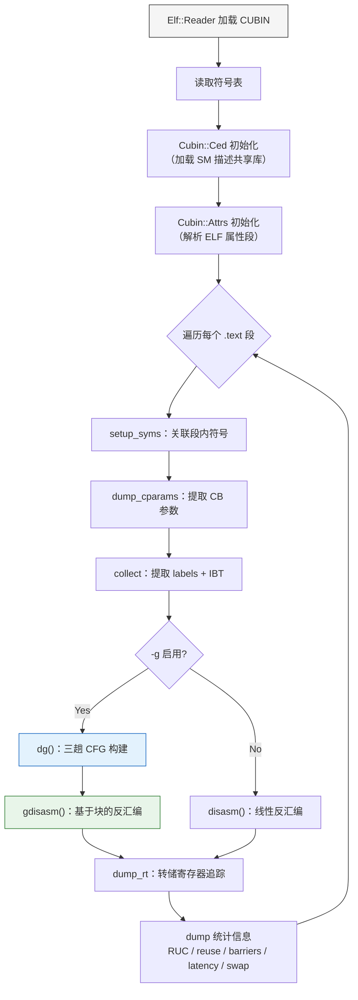

**dg.pl** 是 denvdis 工具集中最复杂的分析脚本之一，定位为 CUDA CUBIN 二进制的多维度分析引擎——它不仅能构建 **控制流图（CFG）**、追踪**指令调度**（stall count / dependency barriers），还能检测 **寄存器复用（Register Reuse Cache）** 机会，并通过 `-P` 选项直接对 CUBIN 文件执行**内联二进制补丁**。该脚本依赖底层 XS 模块 `Cubin::Ced`（SASS 反汇编引擎）和 `Cubin::Attrs`（属性段解析器）完成实际的指令解码与 ELF 段操作。

Sources: [dg.pl](scripts/dg.pl#L1-L37), [Ced.pm](test/Cubin-Ced/lib/Cubin/Ced.pm#L1-L30)

## 命令行接口与选项体系

dg.pl 的功能通过一组互有依赖的命令行开关控制，形成了从"纯分析"到"实际补丁"的渐进能力链：

| 选项 | 功能描述 | 前置依赖 |
|:-----|:---------|:---------|
| `-g` | 构建 CFG 并基于基本块反汇编 | 无 |
| `-b` | 追踪 read/write 依赖屏障（dependency barriers） | 无 |
| `-t` | 追踪寄存器与谓词的读写历史 | `-g` |
| `-u` | 检测寄存器复用缓存（RUC）峰值 | `-g` + `-t` |
| `-U` | 分析潜在的寄存器复用机会并尝试插入 `reuse` 属性 | `-g` + `-t` |
| `-s` | 贪心搜索可交换指令对以降低 stall count | `-g` + `-t` + `-b` |
| `-P` | **实际执行补丁**（指令交换 + reuse 插入 + usched_info 修改） | 需配合 `-s` 或 `-U` |
| `-l` | 转储延迟表（latency tables）交叉信息 | 无 |
| `-r` | 转储重定位段（REL/RELA） | 无 |
| `-p` | 转储指令属性（Properties + Predicates） | 无 |
| `-C file` | 指定配置文件限定补丁区域 | 无 |
| `-G` | 生成初始配置文件模板后退出 | 无 |
| `-z` | 禁止修补 usched_info（调试用） | `-s` |
| `-d` / `-v` | 调试模式 / 详细输出 | 无 |

选项间的依赖关系在入口处通过 `croak` 强制校验——例如 `-s`（指令交换）必须同时启用 `-g`（CFG）、`-t`（寄存器追踪）和 `-b`（屏障追踪），因为交换可行性需要三方面的数据才能判定。

Sources: [dg.pl](scripts/dg.pl#L13-L37), [dg.pl](scripts/dg.pl#L2348-L2366)

## 配置文件系统：限定补丁作用域

当使用 `-P` 执行实际补丁时，dg.pl 提供了一套精细的作用域控制机制。通过 `-C config_file` 可以将补丁操作限制在特定的代码段甚至地址区间内，避免对整个 CUBIN 产生意外修改。配置文件的格式为纯文本：

```
# 注释行
section_name                    # 仅对该段生效
another_section 0-100 200-300   # 对该段内的指定地址范围生效
```

不提供配置文件时，补丁操作默认作用于所有代码段；使用 `-C -` 则显式排除一切区域（等价于空配置）。这一机制在内部通过 `filter_gcd` 函数生成闭包实现——每个地址查询调用闭包函数 `dummy_yes`（全允许）、`dummy_no`（全拒绝）或一个带范围检查的匿名子程序，避免了热路径上的条件分支开销。

Sources: [dg.pl](scripts/dg.pl#L179-L289)

## CFG 构建：三趟扫描算法

**控制流图（CFG）** 的构建是 dg.pl 所有高级分析的基础。`dg()` 函数实现了自定义的三趟扫描算法，将线性 SASS 指令流分割为基本块并建立块间连接关系。

### 第一趟：标签与分支收集

算法扫描整个代码段，收集所有分支目标地址和符号位置到统一的 `%br` 哈希表中。具体而言，对于每条非空指令，算法检查其**分支类型（BRT）**：

- **BRT_BRANCH**：提取 `ins_clabs()` 获得的分支目标地址，建立从当前偏移到目标地址的映射
- **BRT_RETURN / BRT_BRANCHOUT**：标记为无后续连接的终止点
- **IBT（Indirect Branch Table）**：从 ELF 属性段中的 `EATTR_IBT`（属性 ID `0x34`）提取间接分支表，将多目标分支展开为多个标签
- **符号位置**：将符号出现的位置记录为潜在的基本块边界
- **死循环检测**：当分支目标等于自身地址时（如 `BRA .L_x_4`），标记为 `-1` 哨兵值以排除该块

对于条件分支（带有谓词 `@PX`），当前指令不标记为无条件终止，允许与前一条指令建立 fall-through 连接。对于无条件分支，则设置 `$has_prev` 为 `undef`，切断与下一条指令的 fall-through 链接。

Sources: [dg.pl](scripts/dg.pl#L1940-L2158)

### 第二趟：基本块分割

将收集到的标签、符号、回引用、标记按照地址排序后，通过状态机逐一处理，决定何时关闭当前块、何时开启新块。共有 8 种情况需要处理：

```
有当前块?   当前操作类型    动作
   N        符号           创建新块并关联符号
   Y        符号           关闭当前块，创建新块并关联符号
   N        死循环标记      跳过
   Y        死循环标记      关闭当前块
   N        回引用          创建新块并记录回引用
   Y        回引用          将回引用添加到当前块
   N        标记           创建新块（边界情况）
   Y        标记           关闭当前块
```

每个基本块用数组表示，关键字段包括：`[0]` 起始地址、`[1]` 结束地址、`[2]` 符号索引、`[3]` 回引用映射。额外字段 `[4]`-`[16]` 用于后续的屏障追踪、寄存器快照、延迟表和交换分析。

Sources: [dg.pl](scripts/dg.pl#L2220-L2308)

### 第三趟：回引用解析

所有记录在块的 `[3]` 字段中的回引用仍是原始地址偏移量，需要通过二分搜索（`bin_sac`）将其映射到对应的目标块。这一步的复杂度为 O(M²·log(M))，其中 M 是基本块数量——虽然不是最优，但在实际 CUBIN 中基本块数量通常有限。



Sources: [dg.pl](scripts/dg.pl#L2309-L2333)

## 调度上下文与屏障追踪

**调度上下文（scheduling context）** 是 dg.pl 分析 GPU 指令调度的核心数据结构。它通过 `make_sctx()` 创建，维护以下状态：

| 字段 | 含义 |
|:-----|:-----|
| `dual` | 双发射状态（仅 64/88 位宽度 SM） |
| `roll` | 滚动 stall 计数总和 |
| `curr` | 当前指令 stall 值 |
| `prev` | 前一条指令 stall 值 |
| `c` | 每个屏障设置点的 stall 快照（键为偏移量） |
| `0..5` | 屏障索引到 `[offset, R/W]` 的映射 |

`process_sched()` 函数在每个基本块的反汇编循环中被调用，根据指令宽度（`$g_w`：64/88/128 位）采用不同的解析策略：

- **64 位（Maxwell/Pascal）**：从 `ctrl` 字段的低 4 位提取 stall count，`0x04` 表示双发射模式
- **88 位（Volta/Turing）**：从 `cword` 提取 stall（低 5 位）、write barrier（bits 5-7）、read barrier（bits 8-10）、wait mask（bits 11-16）
- **128 位（Ampere+）**：调度信息编码方式不同，仅提取 stall 值

屏障追踪的核心逻辑在 `check_wait()` 中实现——当一条指令的 wait mask 中某个位被设置时，查找该屏障索引对应的先前 R/W 操作，计算 stall 差值并报告。`add_barstat()` 则统计每种指令类型触发 wait/read/write 的频次。

Sources: [dg.pl](scripts/dg.pl#L800-L916), [dg.pl](scripts/dg.pl#L1192-L1292)

## 延迟表分析

通过 `-l` 选项启用的延迟表分析是 dg.pl 最精密的诊断功能之一。`Cubin::Ced` 的 `lcols()` 和 `lrows()` 方法返回当前指令在延迟调度表中的列索引和行索引，`l2map()` 将其按表名分组，`intersect_lat()` 计算列与行的交叉查找以获取预测的 stall 值。

dg.pl 同时计算三种交叉变体，分别存入三组统计：

| 统计组 | 交叉方式 | 含义 |
|:-------|:---------|:-----|
| `gl_stat` | 当前列 × 当前行 | 自身指令的延迟预测 |
| `gl_pcols_stat` | 前一条指令的列 × 当前行 | 跨指令列复用 |
| `gl_prows_stat` | 当前列 × 前一条指令的行 | 跨指令行复用 |

`update_lstat()` 将预测值与实际 stall count 对比，分类为"Missed latency"（无法预测）和"Mismatched latency"（预测偏差 > 1），并记录对应指令名的频率统计。这一机制帮助理解不同 GPU 架构下延迟调度表的语义差异。

Sources: [dg.pl](scripts/dg.pl#L692-L798)

## 指令交换优化

`-s` 选项启用的指令交换优化是 dg.pl 最具实用价值的功能——它在基本块内搜索相邻的独立指令对，通过交换它们的执行顺序来减少总的 stall cycle。

### 独立性判定

两条相邻指令可以交换的前提是它们之间**没有任何数据依赖**。dg.pl 通过多层次的检查来实现这一点：

1. **屏障依赖**（`sched_check`）：检查两条指令是否共享相同的依赖屏障——如果前一条设置（read/write）的屏障恰好是后一条等待的屏障，则不可交换
2. **寄存器/谓词交织**（`is_interleaved`）：通过 `RegTrack` 的快照（snap）对比，检查是否存在 RAW（Read-After-Write）或 WAR 依赖
3. **结构性禁止**（`denied_swap`）：某些指令类型天然不可交换，包括屏障指令（`BAR`）、warp 内操作（`VOTE`、`SHFL`、`ELECT`）、以及总是产生 stall 的指令（`LEA`、`MUFU`、`SHF`）
4. **控制流指令**：所有分支类指令（`BRA`、`JMP`、`RET`、`EXIT`、`SSY` 等）不可交换
5. **同类型 LD/ST**：两条相同类型的 Load/Store 指令不可交换（依据论文 [arXiv:2501.08071](https://arxiv.org/html/2501.08071v1) §3.5 的结论）
6. **Virtual Queue**：属于同一虚拟队列的指令不可交换（ptxas 已做优化）
7. **Relocation**：带有重定位入口的指令不可交换
8. **CC（Condition Code）**：在旧架构上共享 CC 的指令不可交换

Sources: [dg.pl](scripts/dg.pl#L930-L1067)

### 贪心选择算法

独立指令对的搜索采用**贪心策略**：当发现两条相邻指令独立且交换后有 stall 增益时，将其记录为候选。如果下一个候选对与当前对重叠（共享同一条指令），则比较两者的增益，保留增益更大的一方。

脚本作者在注释中给出了这一贪心策略正确性的概率分析：假设相邻指令独立的概率为 0.5、下一对增益更大的概率也为 0.5，则连续 7 步贪心失败（错过全局最优）的概率仅为 (0.5 × 0.5)⁷ ≈ 0.006%，验证了贪心策略在实际场景中的充分性。

`can_swap()` 中的增益计算使用 `stall_gain()` 函数，限制单次最大增益为 `GAIN_LIMIT`（常量 2），防止极端情况下的过度优化。交换后新的 usched_info 值通过 `curr_stall - gain` 计算，并通过 `check_tab()` 验证该值是否在当前指令的合法枚举范围内。

Sources: [dg.pl](scripts/dg.pl#L1091-L1172)

### 补丁后处理

当使用 `-P` 选项时，`post_process_swaps()` 负责执行实际的二进制修改。每对交换涉及多个层面的协调：

1. **指令字节交换**：通过 `$g_ced->off()` 定位到前一条指令，调用 `$g_ced->swap()` 交换两条指令的二进制编码
2. **usched_info 补丁**：计算新的 stall 值并调用 `$g_ced->patch(USCHED, new_stall)` 修改调度字
3. **重定位修正**：如果被交换的指令含有重定位，需要更新 REL/RELA 段中的偏移量
4. **INSTR_OFFSET 属性修正**：如果交换涉及带有 `INSTR_OFFSET` 属性的指令，需要更新属性值列表
5. **IBT 属性修正**：如果交换涉及间接分支表入口，需要通过 `patch_ib_addr()` 更新间接分支地址
6. **同一块内多条交换的属性批量修正**：使用 `%ah` 哈希收集所有需要修改的属性，最后通过 `patch_alist()` 一次性更新

当基本块包含无条件 `EXIT` 或 `BRT_RETURN` 时，跳过该块的交换处理——因为这些终止指令的位置不应被移动。

Sources: [dg.pl](scripts/dg.pl#L291-L468)

## 寄存器复用分析

### reuse 属性的语义

SASS 指令中的 `.reuse` 属性是 ptxas 生成的一种调度提示——当某个源操作数被标记为 `reuse` 时，GPU 的寄存器分配器可以复用已分配给该操作数的物理寄存器，避免完整的寄存器分配流程，从而降低寄存器压力。典型的 ptxas 生成的复用模式如下：

```
1a0: LOP3.LUT PT,R6,RZ,R15,RZ, 0x33,!PT  ; R6 被赋值
1d0: SHF.R.S32.HI R7,RZ, 0x1F,R6.reuse   ; R6 作为源操作数被标记 reuse
1f0: IMAD.WIDE R6,PT,R4, 0x2,R6           ; R6 实际被复用
```

Sources: [dg.pl](scripts/dg.pl#L1460-L1532)

### FSM 检测算法

dg.pl 实现了一个三状态有限状态机来遍历寄存器追踪历史，检测 ptxas 可能遗漏的 reuse 插入机会：

```
状态 0（初始）──读操作──→ 状态 1（单次读）
状态 1（单次读）──读操作──→ 检查距离 ≤ 0x70 → 状态 2（记录 reuse 候选）→ 状态 1
状态 1/2 ──写操作/wide/有谓词──→ 状态 0（重置）
```

转移条件包括：连续两次读操作的距离不超过 `MAX_SWAP_DIST`（常量 `0x70`，即 112 字节 ≈ 14 条 128 位指令）、寄存器不是 wide 操作、指令不带有条件谓词、且该读操作尚未被 ptxas 标记为 reuse。

Sources: [dg.pl](scripts/dg.pl#L1533-L1564)

### reuse 补丁执行

`resolve_rusage()` 函数负责验证检测到的 reuse 候选是否真的可以补丁。它的工作流程是：首先将 `RegTrack` 快照中的 mask 反向解析为操作数位置（通过 `rh_ops`），然后调用 `$g_ced->get(rkey)` 验证该位置的寄存器编号确实匹配目标寄存器。接下来检查对应的 `reuse_src_X` 属性是否存在于当前指令的表字段或扩展字段中，且当前值是否为 0（尚未设置 reuse）。

当所有条件满足且使用 `-P` 选项时，调用 `$g_ced->patch(reuse_attr_name, 1)` 将 reuse 位设置为 1。如果该操作导致待处理表（`ptabs`）不为空，则记入 `$gU_bad_tabs`——这表示 patch 虽然成功但可能产生了不一致的表状态。

Sources: [dg.pl](scripts/dg.pl#L1605-L1648), [dg.pl](scripts/dg.pl#L1726-L1750)

## 主处理流水线

dg.pl 的 `main` 入口实现了完整的处理流水线，对 CUBIN ELF 中的每个 `.text` 段执行以下步骤：



`gdisasm()` 是基于 CFG 的反汇编核心。它遍历每个基本块，在块内维护独立的调度上下文和寄存器追踪器。每条指令经过 `dump_ins()` 处理后，快照（snap）被存入块的 `[8]`（当前）和 `[9]`（前一条）字段，供 `is_interleaved()` 检查数据依赖。如果启用了 `-s`，则 `can_swap()` 和 `greedy_add_swap()` 在块内逐步构建交换候选列表，最终在块末尾由 `post_process_swaps()` 统一执行。

Sources: [dg.pl](scripts/dg.pl#L2348-L2436), [dg.pl](scripts/dg.pl#L1857-L1938)

## 基本块内部数据布局

基本块使用 Perl 数组实现，具有精心设计的索引布局，承载了 CFG、调度、追踪和优化所需的全部状态：

| 索引 | 内容 | 用途 |
|:-----|:-----|:-----|
| `[0]` | 起始地址 | CFG 基本块边界 |
| `[1]` | 结束地址 | CFG 基本块边界 |
| `[2]` | 符号索引 | 函数入口标记 |
| `[3]` | 回引用映射 `{addr → block}` | CFG 边 |
| `[4]` | 当前指令 wait 数组 | 屏障追踪 |
| `[5]` | 当前指令 R/W 屏障映射 | 屏障追踪 |
| `[6]` | 前一条指令 wait 数组 | 屏障追踪 |
| `[7]` | 前一条指令 R/W 屏障映射 | 屏障追踪 |
| `[8]` | 当前指令寄存器/谓词快照 | 依赖检测 |
| `[9]` | 前一条指令寄存器/谓词快照 | 依赖检测 |
| `[10]` | 当前 RUC 映射 | `-u` 寄存器复用缓存 |
| `[11]` | 前一条指令延迟表列索引 | `-l` 延迟分析 |
| `[12]` | 前一条指令延迟表行索引 | `-l` 延迟分析 |
| `[13]` | 当前指令属性数组 | `-s` 交换分析 |
| `[14]` | 前一条指令属性数组 | `-s` 交换分析 |
| `[15]` | 交换候选对列表 `[[prev, curr], ...]` | `-s` 优化 |
| `[16]` | 无条件 EXIT 标志 | 块终止判定 |

Sources: [dg.pl](scripts/dg.pl#L2178-L2221)

## 统计输出解读

dg.pl 在处理完成后输出多种统计报告，帮助评估分析结果和优化效果：

**屏障统计**（`-b`，由 `dump_barstat` 输出）：显示每种指令类型的 wait/read/write 频次，格式为 `指令名: wait_count read_count write_count`。

**延迟统计**（`-l`，由 `dump_lat_stat` 输出）：三组数据分别对应三种交叉方式，每组包含 Missed latency（无法预测的比例）和 Mismatched latency（预测偏差的比例），配合 `-v` 还会列出导致失败的具体指令名及其频次。

**指令交换统计**（`-s`，由 `dump_swap_stat` 输出）：包括总指令数、可交换对数及其比例、总增益 stall 数、平均增益和增益/原始 stall 比值。启用 `-P` 时额外报告跳过数、补丁成功数、失败数和属性修正失败数。

**寄存器复用统计**（`-U`，由 `dump_rU` 输出）：报告发现的潜在复用案例数、已解决数、未找到寄存器/掩码数、反汇编失败数，以及启用 `-P` 时的补丁成功数和待处理表冲突数。

**RUC 峰值**（`-u`，由 `dump_ruc` 输出）：报告运行过程中检测到的最大复用缓存大小及其所在地址，列出缓存中的所有寄存器。

Sources: [dg.pl](scripts/dg.pl#L86-L177)

## 与工具集其他组件的关系

dg.pl 在 denvdis 工具链中处于**分析层**的顶端，它依赖多个底层模块的协作：

- [nvd 反汇编器架构与 ELF/CUBIN 解析](8-nvd-fan-hui-bian-qi-jia-gou-yu-elf-cubin-jie-xi)：`Cubin::Ced` 的 XS 层封装了与 nvd 共享的 SASS 反汇编引擎，`Ced_perl` 类继承自 `CEd_base`
- [SASS 指令编码字段与掩码机制](9-sass-zhi-ling-bian-ma-zi-duan-yu-yan-ma-ji-zhi)：dg.pl 通过 `Cubin::Ced` 的 `get()`、`patch()`、`check_tab()` 等方法直接操作指令编码字段
- [寄存器追踪与 LUT 操作解码](11-ji-cun-qi-zhui-zong-yu-lut-cao-zuo-jie-ma)：`RegTrack` 类提供寄存器追踪的基础设施，dg.pl 通过 `snap()` / `snap_clear()` 接口获取每条指令的寄存器使用快照
- [ced 类 sed 的 Cubin 内联补丁工具](13-ced-lei-sed-de-cubin-nei-lian-bu-ding-gong-ju)：ced 是交互式的指令级补丁工具，而 dg.pl 则是批量自动化的分析与补丁引擎，两者共享 `Cubin::Ced` 的底层补丁能力
- [CTF 工具与 Cubin 二进制补丁实践](22-ctf-gong-ju-yu-cubin-er-jin-zhi-bu-ding-shi-jian)：dg.pl 的 `-P` 补丁能力可作为 CTF 场景中自动化修改 CUBIN 的基础