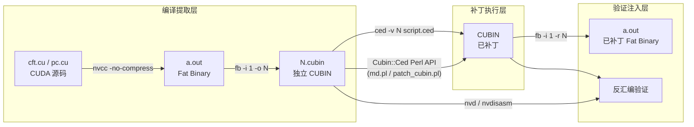

本页深入解析 `ctf/` 目录下的工具集——一套围绕 **CED（Cubin Editor）** 构建的 CUDA 内核二进制补丁系统。这套工具能够直接在编译后的 CUBIN 二进制层面上精确修改 SASS 指令，实现从单字段值替换到整条指令重写的全粒度补丁操作。核心价值在于：无需重新编译 CUDA 源码即可修改已部署内核的行为，是 GPU 逆向工程与安全分析的关键能力。

## 工具架构总览

CTF 工具集围绕三个核心层构建：**编译提取层**（nvcc + fb 工具解包 fat binary）、**补丁执行层**（ced 命令行工具 / Cubin::Ced Perl API）、**验证分析层**（dg.pl CFG 分析、nvd 反汇编）。数据流从 CUDA 源码出发，经编译提取为独立 cubin 文件后，通过 CED 脚本或 Perl 编程接口实施补丁，最终将修改后的 cubin 重新注入 fat binary。



Sources: [Makefile](ctf/Makefile#L1-L21), [cft.cu](ctf/cft.cu#L1-L5)

## CED 命令行工具：语法与状态机

CED（`test/ced`）是整个补丁工作流的核心引擎。它以类 sed 的方式工作：读取 CUBIN 文件和补丁脚本，按脚本指令逐条修改二进制中的 SASS 指令编码，然后原地写回文件。工具内部维护一个有限状态机来管理补丁上下文。

### 状态机模型

CED 的解析器状态机包含四个状态，决定了每条脚本命令的合法性：

| 状态 | 含义 | 可接受的命令 |
|------|------|-------------|
| **Fresh** | 初始状态，尚未选择目标 | `s`, `sn`, `fn` |
| **WantOff** | 已选定节/函数，等待偏移 | 十六进制偏移, `s`, `sn`, `fn` |
| **HasOff** | 已定位到具体指令 | `r`, `p`, `nop`, `!@` / `@` |
| **HasP** | 字段补丁进行中（表字段未完成） | 续行字段值 |

Sources: [ced_base.h](test/ced_base.h#L61-L67)

### 脚本命令参考

| 命令 | 语法 | 说明 |
|------|------|------|
| `s INDEX` | `s 10` | 按节索引选择代码节 |
| `sn NAME` | `sn .text._Z11machine_idsPj` | 按节名称选择代码节 |
| `fn NAME` | `fn machine_ids` | 按函数名选择目标函数 |
| `if INSTR` | `if SHF` | 条件过滤：仅当当前指令名称匹配时才执行后续补丁 |
| `OFFSET r SASS_TEXT` | `40 r MOV R0, RZ` | 整条指令替换：将偏移处的指令替换为指定的 SASS 文本 |
| `OFFSET nop` | `20 nop` | 将偏移处指令替换为 NOP |
| `OFFSET p FIELD VALUE` | `10 p SRa 24` | 单字段补丁：修改指定字段的值 |
| `OFFSET !@N` / `OFFSET @N` | `30 !@3` | 谓词补丁：修改指令的谓词寄存器，`!` 表示取反 |
| `S FROM TO` | `S 100 200` | 交换两个偏移处的指令 |
| `q` | `q` | 退出脚本处理 |
| `#...` | `# comment` | 注释行 |

Sources: [ced.cc](test/ced.cc#L510-L581), [ced_base.h](test/ced_base.h#L26-L60)

### 块级 I/O 与指令宽度处理

CED 在修改指令时以 **块（block）** 为单位读写 CUBIN 文件，而非逐字节操作。不同 GPU 架构的指令宽度决定了块大小和块内索引策略：

| 指令宽度 | 架构 | 块大小（字节） | 块内指令数 |
|----------|------|---------------|-----------|
| 64-bit | Fermi/Kepler (sm_2x ~ sm_3x) | 64 | 8 |
| 88-bit | Maxwell ~ Volta (sm_5x ~ sm_7x) | 32 | 约 2.9 |
| 128-bit | Turing+ (sm_75+) | 16 | 1 |

`prepare()` 方法在初始化时确定块大小，每次读写操作都以整块为单位进行。`flush_buf()` 在块被标记为脏（`block_dirty`）时才真正写回文件，避免了不必要的磁盘 I/O。

Sources: [ced_base.cc](test/ced_base.cc#L95-L174)

## .ced 补丁脚本实践

### 场景一：消除移位指令（1.ced）

```text
# replace shift right of r0 to mov r0, rz
s 10
if SHF
40 r MOV R0, RZ
```

这个脚本展示了 CED 的条件补丁能力：首先选择第 10 个代码节，然后设置条件过滤器 `if SHF`，仅当偏移 0x40 处的指令是 SHF（Shift）类型时才执行替换操作，将其改为 `MOV R0, RZ`（将 R0 清零）。这在修复 nvcc 生成的冗余移位操作时非常有用。

Sources: [1.ced](ctf/1.ced#L1-L5)

### 场景二：跨架构的 MOV 指令清除（3.ced / 53.ced）

```text
# sm_30 版本 (3.ced)
s 8
28 r MOV R0, RZ, 0xf

# sm_53 版本 (53.ced)
s 8
38 r MOV R0, RZ, 0xf
```

同一逻辑在不同架构上的指令偏移不同（sm_30 在 0x28，sm_53 在 0x38），这体现了 **指令编码布局的架构差异性**：不同 SM 版本的代码节中相同功能的指令可能位于不同偏移。`0xf` 是 MOV 指令的位掩码参数，表示操作影响 R0 的全部 4 个字节。

Sources: [3.ced](ctf/3.ced#L1-L3), [53.ced](ctf/53.ced#L1-L3)

### 场景三：S2R 操作数补丁——读取 GPU 硬件 ID（md.ced）

```text
sn .text._Z11machine_idsPj
# replace S2R R0, SR_TID.X to SR_MACHINE_ID_0 - 24
10 p SRa 25
20 r S2R R5, SR_REGALLOC
# SR_MACHINE_ID_1 - 25 etc
40 p SRa 25
50 p SRa 26
60 p SRa 27
```

这是最典型的 CTF 安全分析场景：`machine_ids` 内核原意通过 `S2R R0, SR_TID.X` 读取线程 ID，补丁脚本将 `SRa`（Special Register Address）字段从 `SR_TID.X` 修改为 `SR_MACHINE_ID_0`（编码值 24），从而让内核读取 GPU 的硬件机器标识而非线程索引。偏移 0x20 处则整条替换为 `S2R R5, SR_REGALLOC`，用于读取寄存器分配信息。

Sources: [md.ced](ctf/md.ced#L1-L8)

### 场景四：PC 地址获取补丁（pc.ced）

```text
s 9
40 r LEPC R4
30 r NOP
60 r STG.E.64.SYS [R2], R4
```

这个补丁将 `fetch` 内核改造为返回程序计数器地址的工具：在偏移 0x40 插入 `LEPC R4`（Load Effective Program Counter）指令，在 0x30 插入 NOP 填充，在 0x60 用 64 位全局存储将 R4（PC 值）写入输出缓冲区。这是 GPU 安全分析中获取内核运行时地址信息的常用手法。

Sources: [pc.ced](ctf/pc.ced#L1-L5)

### 场景五：输出缓冲区地址泄露（myaddr/pc.ced）

```text
# patch to return address of output buffer in R2
s 9
60 r STG.E._64.SYS [R2], R2
```

这个极简补丁修改了存储指令的操作数：将 `STG.E.64.SYS [R2], R4`（存储 R4 到 R2 指向的地址）改为 `STG.E._64.SYS [R2], R2`（将 R2 本身的地址值写入 R2 指向的位置），从而泄露了设备端缓冲区的实际地址。

Sources: [myaddr/pc.ced](ctf/myaddr/pc.ced#L1-L4)

## Cubin::Ced Perl API 编程补丁

当 .ced 脚本的声明式语法不足以表达复杂逻辑时，可以通过 `Cubin::Ced` Perl XS 模块进行编程式补丁。`md.pl` 是此模式的典型范例。

### md.pl：条件补丁与重定位修复

`md.pl` 展示了比 .ced 脚本更精细的控制能力：它在 Perl 层面验证指令类型（确保偏移处确实是 S2R 指令），然后使用 `patch()` 方法精确修改 `SRa` 字段。更关键的是，它还处理了 `dirty_hack` 函数的重定位条目——将 reloc 类型从 `R_CUDA_ABS32_LO_32`（0x38）和 `R_CUDA_ABS32_LO_64`（0x39）进行修改，确保函数指针引用在补丁后仍然正确解析。

```text
工作流程：
1. Elf::Reader 加载 cubin → 定位 machine_ids 代码节
2. Cubin::Ced 创建编辑器实例 → 设置目标节
3. patch_s2r() 验证指令类型 → patch('SRa', value) 修改字段
4. 定位 dirty_hack 节 → Cubin::Attrs 修复重定位类型
```

| Perl API 方法 | 功能 |
|---------------|------|
| `Cubin::Ced->new($elf)` | 创建编辑器，绑定 ELF 对象 |
| `set_s(name_or_index)` | 选择代码节 |
| `off(offset)` | 定位到指定偏移 |
| `ins_name()` | 获取当前指令名称 |
| `patch(field, value)` | 修改单个字段值 |
| `replace('SASS text')` | 整条指令替换 |
| `Cubin::Attrs->new($elf)` | 创建属性编辑器 |
| `try_rel(section_index)` | 查找节的重定位表 |
| `patch_ft(rel_idx, entry, type)` | 修改重定位条目类型 |

Sources: [md.pl](ctf/md.pl#L1-L51)

### patch_cubin.pl：ELF 段/节标志补丁

`patch_cubin.pl` 解决的是另一个层面的问题：某些 ELF 段的权限标志（flags）需要修改才能允许写入。它遍历所有 `PT_LOAD` 段和类型为 `SHT_PROGBITS` 的节，将可执行段的标志从 `5`（Read+Execute）修改为 `7`（Read+Write+Execute），并将特定节的 `SHF_WRITE` 标志置位。这是二进制补丁的前提条件——如果目标段不可写，CED 无法执行原地修改。

Sources: [patch_cubin.pl](ctf/patch_cubin.pl#L1-L27)

## Makefile 驱动的自动化补丁流程

`ctf/Makefile` 展示了完整的自动化补丁流水线，以 sm_75 目标为例：

```text
make a.out 的完整流程：
1. nvcc -no-compress -arch sm_75 cft.cu → 编译生成 a.out
2. fb -i 1 -o 12 ./a.out          → 从 fat binary 提取第 1 个 cubin，保存为文件 "12"
3. perl md.pl 12                   → 使用 Perl API 执行机器 ID 补丁
4. fb -i 1 -r 12 ./a.out          → 将补丁后的 cubin 重新注入 fat binary
```

`-no-compress` 标志至关重要——它阻止 nvcc 对 fat binary 中的 cubin 数据进行压缩，使得 `fb` 工具和 CED 能直接操作原始二进制数据。对于 sm_53 和 sm_30 目标，则使用 `.ced` 脚本通过 `ced` 命令行工具执行补丁。

| Make 目标 | 架构 | 补丁方式 | 补丁工具 |
|-----------|------|---------|---------|
| `a.out` | sm_75 | Perl API | `md.pl` |
| `a53` | sm_53 | 脚本 | `ced -v 53 53.ced` |
| `a3` | sm_30 | 脚本 | `ced -v 3 3.ced` |

Sources: [Makefile](ctf/Makefile#L1-L21)

## CUDA 测试内核解析

### cft.cu：多层补丁验证平台

`cft.cu` 是一个综合性的测试程序，集成了多个内核来验证不同类型的补丁效果：

| 内核 | 功能 | 补丁用途 |
|------|------|---------|
| `machine_ids` | 通过 `threadIdx` 和 `SMID` 读取线程/SM 标识 | 补丁为读取硬件 Machine ID |
| `calc_hash` | 使用 `seed[]` 常量数组和 XOR 运算验证输入字符串 | CTF 字符串匹配验证 |
| `dirty_hack` | 运行时获取 `calc_hash` 的设备端地址 | 函数指针地址泄露 |

`machine_ids` 内核中 `out_buf[4] = 0x15` 的硬编码值是补丁验证的**金丝雀**（canary）——补丁后如果该值仍然正确，说明补丁没有破坏非目标指令。程序还集成了 `simple_api` 的日志注入功能（`set_logger`），可以追踪 CUDA 驱动的 API 调用行为。

`calc_hash` 内核中 `XSED` 常量（0x2f）与 `seed[]` 数组共同构成 XOR 三重校验：`s[x] ^ seed[x] ^ XSED`。当输入字符串与种子完全匹配时结果为 0，经 `warp_reduce_min` 聚合后返回匹配状态。这是一种典型的 CTF 挑战模式——通过逆向补丁可以绕过此校验逻辑。

Sources: [cft.cu](ctf/cft.cu#L1-L207)

### tp.cu：设备函数指针探测

`tp.cu` 解决了 CUDA 编程中一个经典难题：**如何获取 `__device__` 函数的地址**。程序通过 `cudaMemcpyFromSymbol` 和 `cudaGetSymbolAddress` 两种 API 尝试获取 `p_add_func` / `p_mul_func` 的地址，并在内核中打印指针值。这是理解 CUBIN 中函数指针重定位机制的实验基础——补丁 `dirty_hack` 的重定位修复正是为了处理这类地址引用。

Sources: [tp.cu](ctf/tp.cu#L1-L85)

## TLA 性能基准测试与分析

`tla/` 子目录包含了一套完整的 **Thread-Level Accumulation（TLA）** 性能基准测试工具链，用于评估不同线程配置下的 CUDA 内核性能。

### 工作流程

```text
tla2.cu → nvcc → a.out → fb.pl 提取 → dg.pl CFG 分析 → 1_75.cubin
                                                    ↓
                                              csv.pl 提取数据 → plot.R 生成图表
```

`gpu_sin_tla_whileloop` 内核以可变 stride 遍历计算正弦级数求和（sinsum），通过 `warp_reduce_sum` 进行 warp 级归约。主程序以 2 的幂次递增 scale 参数，从 1 到 `maxThreadsPerBlock`，对每个配置测量执行时间。

`csv.pl` 从程序的 stdout 输出中提取 `scale` 和 `time` 数据对，转换为 CSV 格式。`plot.R` / `batch_plot.R` 使用 ggplot2 生成以 log2 为 X 轴的柱状图，直观展示不同线程缩放因子下的性能表现。`1.cfg` 文件包含 thrust 内部模板函数的修饰名，用于 `dg.pl` 的 CFG 构建过滤。

Sources: [tla2.cu](ctf/tla/tla2.cu#L1-L117), [Makefile](ctf/tla/Makefile#L1-L8), [csv.pl](ctf/tla/csv.pl#L1-L18)

## bad_ml.pl：机器学习测试数据生成器

`bad_ml.pl` 生成带有已知统计特征的二分类数据集，用于验证数据分析流程。数据包含 100 个参数维度，前 2 个维度作为分类标签（p1 XOR p2 == 1 为正类），其余维度通过可控偏斜度（`g_skew = 0.501`）生成。数据集中仅约 0.1% 为正样本（`g_good`），其余均为负样本——这种极度不平衡的分布在安全分析场景中很常见，可用于验证异常检测算法的有效性。

Sources: [bad_ml.pl](ctf/bad_ml.pl#L1-L38)

## 延伸阅读

- [ced 类 sed 的 Cubin 内联补丁工具](13-ced-lei-sed-de-cubin-nei-lian-bu-ding-gong-ju) — CED 工具的完整架构与 API 详解
- [Fat Binary 格式解析与解压（fb 工具）](19-fat-binary-ge-shi-jie-xi-yu-jie-ya-fb-gong-ju) — fat binary 提取/注入机制
- [dg.pl Cubin 分析：CFG 构建、指令调度优化与寄存器复用](21-dg-pl-cubin-fen-xi-cfg-gou-jian-zhi-ling-diao-du-you-hua-yu-ji-cun-qi-fu-yong) — CFG 分析与指令调度
- [SASS 指令编码字段与掩码机制](9-sass-zhi-ling-bian-ma-zi-duan-yu-yan-ma-ji-zhi) — 指令编码结构基础