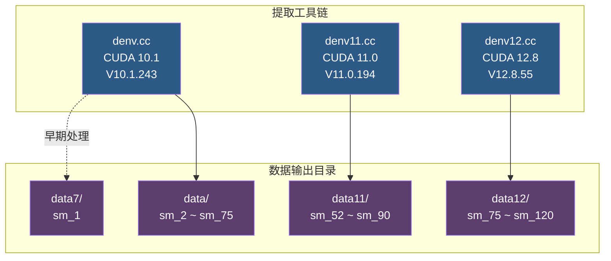

本页系统梳理 denvdis 项目所覆盖的 NVIDIA GPU 微架构全貌。从最早的 Tesla（sm_1x）到最新的 Blackwell（sm_120），每一代架构在 SASS 指令描述层面都有其独特的加密密钥、数据格式和家族继承关系。理解这张支持矩阵，是正确使用 [denv/denv11/denv12 提取工具](4-nvidia-qu-dong-zhong-de-jia-mi-zhi-ling-miao-shu-biao-ti-qu-denv-denv11-denv12) 以及 [SASS 反汇编器 nvd](8-nvd-fan-hui-bian-qi-jia-gou-yu-elf-cubin-jie-xi) 的前提条件。

Sources: [sm_version.txt](sm_version.txt#L1-L28), [predefs.txt](predefs.txt#L1-L100)

## 架构总览：SM 编码与代际映射

NVIDIA 的每款 GPU 都有一个 **SM（Streaming Multiprocessor）版本号**，它在 ELF 二进制的 `e_machine` 字段中以十六进制编码存储。下表汇总了项目已覆盖的全部架构，从十六进制 SM 编码到市场代际名称的完整映射。

| 十六进制编码 | SM 版本 | `__CUDA_ARCH__` | 市场名称 | 内部 PROCESSOR_ID | 首次引入 |
|:---:|:---:|:---:|:---:|:---:|:---:|
| `0x0A` | sm_10 | — | Tesla | Tesla | CUDA 1.0 |
| `0x0B` | sm_11 | — | Tesla | Tesla | CUDA 1.1 |
| `0x0C` | sm_12 | — | Tesla | Tesla | CUDA 1.2 |
| `0x0D` | sm_13 | — | Tesla | Tesla | CUDA 1.3 |
| `0x14` | sm_20 | 200 | Fermi | Fermi | CUDA 2.0 |
| `0x15` | sm_21 | 210 | Fermi | Fermi | CUDA 2.1 |
| `0x1E` | sm_30 | 300 | Kepler | Kepler | CUDA 3.0 |
| `0x20` | sm_32 | 320 | Kepler | Kepler | CUDA 3.2 |
| `0x23` | sm_35 | 350 | Kepler | Kepler | CUDA 3.5 |
| `0x25` | sm_37 | 370 | Kepler | Kepler | CUDA 3.7 |
| `0x32` | sm_50 | 500 | Maxwell | Maxwell | CUDA 5.0 |
| `0x34` | sm_52 | 520 | Maxwell | Maxwell | CUDA 5.2 |
| `0x35` | sm_53 | 530 | Maxwell | Maxwell | CUDA 5.3 |
| `0x3C` | sm_60 | 600 | Pascal | Maxwell | CUDA 6.0 |
| `0x3D` | sm_61 | 610 | Pascal | Maxwell | CUDA 6.1 |
| `0x3E` | sm_62 | 620 | Pascal | Maxwell | CUDA 6.2 |
| `0x46` | sm_70 | 700 | Volta | Volta | CUDA 7.0 |
| `0x48` | sm_72 | 720 | Volta | Volta | CUDA 7.2 |
| `0x4B` | sm_75 | 750 | Turing | Volta | CUDA 7.5 |
| `0x50` | sm_80 | 800 | Ampere | Volta | CUDA 8.0 |
| `0x56` | sm_86 | 860 | Ampere | Volta | CUDA 8.6 |
| `0x57` | sm_87 | 870 | Ampere | Volta | CUDA 8.7 |
| `0x59` | sm_89 | 890 | Ada | Volta | CUDA 8.9 |
| `0x5A` | sm_90 | 900 | Hopper | Volta | CUDA 9.0 |
| `0x64` | sm_100 | 1000 | Blackwell | Volta | CUDA 10.0 |
| `0x65` | sm_101 | 1010 | Blackwell | Volta | CUDA 10.1 |
| `0x67` | sm_103 | 1030 | Blackwell | Volta | CUDA 10.3 |
| `0x6E` | sm_110 | 1100 | Blackwell | Volta | CUDA 11.0 |
| `0x78` | sm_120 | 1200 | Blackwell | Volta | CUDA 12.0 |
| `0x79` | sm_121 | 1210 | Blackwell | Volta | CUDA 12.1 |

一个值得注意的细节：从 Volta（sm_70）开始，所有后续架构在 SASS 机器描述文件中的 `PROCESSOR_ID` 均统一标记为 `"Volta"`，`ARCHITECTURE` 字段也均为 `"Volta"`。这意味着 NVIDIA 在编译器基础设施层面将 Volta 之后的所有架构视为同一基础指令集的增量扩展，而非全新设计。

Sources: [sm_version.txt](sm_version.txt#L1-L28), [predefs.txt](predefs.txt#L1-L100), [data/sm2_1.txt](data/sm2_1.txt#L1-L9), [data/sm3_1.txt](data/sm3_1.txt#L1-L4), [data/sm70_1.txt](data/sm70_1.txt#L1-L4), [data12/sm120_1.txt](data12/sm120_1.txt#L1-L9), [test/nv_rend.cc](test/nv_rend.cc#L56-L82)

## 数据目录与工具版本对应关系

项目使用三个独立的提取工具（`denv`、`denv11`、`denv12`），分别对应不同版本的 `nvdisasm` 二进制文件。每个工具将解密后的指令描述输出到对应的 `data` 子目录。

| 工具 | 目标 nvdisasm 版本 | 输出目录 | 覆盖架构 | LZ4 解压 |
|:---:|:---:|:---:|:---:|:---:|
| `denv` | CUDA 10.1 (V10.1.243) | `data/` | sm_2 ~ sm_75 | ✗ |
| `denv11` | CUDA 11.0 (V11.0.194) | `data11/` | sm_52 ~ sm_90 | ✓ |
| `denv12` | CUDA 12.8 (V12.8.55) | `data12/` | sm_75 ~ sm_120 | ✓ |

**关键差异**：`denv11` 和 `denv12` 在解密后增加了 LZ4 解压缩步骤——如果解密后首字节的高 4 位为 `0xF`，则触发 `LZ4_decompress_safe` 调用。这是因为从 CUDA 11 开始，NVIDIA 对机器描述数据额外施加了 LZ4 压缩，使得原始偏移处的数据量显著小于解压后的实际描述表尺寸。

Sources: [denv.cc](denv.cc#L92-L122), [denv11.cc](denv11.cc#L92-L134), [denv12.cc](denv12.cc#L92-L124), [denv11.cc](denv11.cc#L166-L177)

## 加密密钥与架构家族分组

NVIDIA 在驱动中对 SASS 机器描述数据施加了 **自定义流密码**加密。解密的初始化种子（`init` 字段）按架构家族分组——同一家族的变体共享相同的密钥。这是理解数据提取中 `one_md` 结构体的核心。

| init 密钥 | 架构家族 | 覆盖 SM 版本 | 首次出现 |
|:---:|:---:|:---:|:---:|
| `0x4816` | Kepler (sm_3x) | sm_30 | denv |
| `0x1486` | Kepler (sm_35/37) | sm_32, sm_35, sm_37 | denv |
| `0x1648` | Maxwell (sm_50) | sm_50 | denv |
| `0x6C9E` | Maxwell (sm_52/53) | sm_52, sm_53 | denv/denv11 |
| `0xC401` | Maxwell (sm_55+) / Volta | sm_55, sm_70, sm_72, sm_75 | denv |
| `0xE44` | Maxwell (sm_57) / Pascal | sm_57, sm_60, sm_61, sm_62 | denv |
| `0xB4A` | Volta / Turing | sm_70, sm_72, sm_75 | denv11/denv12 |
| `0x8416` | Ampere | sm_80, sm_86, sm_87 | denv11/denv12 |
| `0x1684` | Ada | sm_89 | denv11/denv12 |
| `0x3927` | Hopper | sm_90 | denv11/denv12 |
| `0x9327` | Blackwell | sm_100, sm_101, sm_103, sm_120 | denv12 |

**架构密钥重用**是一个重要现象：`sm_55` 和 `sm_70/sm_72/sm_75` 在 denv（CUDA 10.1）中共享 `0xC401` 密钥，但在 denv11（CUDA 11.0）中 `sm_70/sm_72/sm_75` 被重新分配了独立的 `0xB4A` 密钥。这说明 NVIDIA 在不同驱动版本间调整了密钥分配策略。

Sources: [denv.cc](denv.cc#L93-L122), [denv11.cc](denv11.cc#L93-L134), [denv12.cc](denv12.cc#L93-L124)

## 三件套数据文件结构

每个 SM 版本最多由三个数据文件完整描述。以 `sm_75` 在 `data12/` 目录中为例：`sm75_1.txt`、`sm75_2.txt`、`sm75_3.txt`。

| 文件后缀 | 内容 | 典型大小 |
|:---:|:---|:---:|
| `_1.txt` | **主指令描述表**：ARCHITECTURE 头、RELOCATORS 重定位器、CONSTANTS 常量定义、FORMAT 指令格式模板、OPCODES 操作码定义、INSTRUCTION 指令综合定义、ENCODING 编码位域描述 | 数 MB ~ 12 MB |
| `_2.txt` | **流水线操作集**：OPERATION SETS 定义，将指令按执行管道（pipe）分组，如 `int_pipe`、`fmai_pipe`、`mio_pipe` 等，用于指令调度 | 数 KB ~ 35 KB |
| `_3.txt` | **无条件跳转模板**：`JUMP_UNCOND` 宏定义，通常仅 1~2 行（`BRA (DUMMY);`） | 32 字节 |

`_3.txt` 在多数架构中仅包含 32 字节的固定内容。而 `_1.txt` 才是真正的核心——它包含了该架构下每条 SASS 指令的完整编码位域、操作数约束和格式模板。

Sources: [data/sm75_1.txt](data/sm75_1.txt#L1-L10), [data/sm75_2.txt](data/sm75_2.txt#L1-L30), [data/sm75_3.txt](data/sm75_3.txt#L1-L4)

## ELF_VERSION 版本演进与指令编码宽度

`ELF_VERSION` 是 SASS 描述表中一个关键的元数据字段，它标识了该架构所使用的 ELF 目标文件格式版本。不同 CUDA 工具链版本对同一架构可能使用不同的 ELF_VERSION。

| ELF_VERSION | 架构 | CUDA 工具链 | 指令编码宽度 |
|:---:|:---:|:---:|:---:|
| 75 | Tesla, Fermi | CUDA 7, 10.1 | 64-bit |
| 101 | Kepler, Maxwell, Volta | CUDA 10.1 | 64-bit |
| 110 | Volta, Turing, Ampere | CUDA 11.0 | 64/128-bit |
| 118 | Ampere, Ada, Hopper | CUDA 11.0 | 64/128-bit |
| 128 | Blackwell (sm_100/101/120) | CUDA 12.8 | 64/128-bit |
| 131 | Blackwell (sm_103) | CUDA 12.8 | 64/128-bit |

编码宽度的变化在 `nv_rend` 渲染框架中直接反映：当 `m_width == 88` 时使用 32 条目 block mask（对应 128-bit 指令），当 `m_width == 64` 时使用 64 条目 block mask。这一分支逻辑解释了为何从 Volta 开始，SASS 指令从固定 64-bit 编码转向了可变长度编码（64-bit 或 128-bit，后者也称为"双发射"格式）。

Sources: [test/nv_rend.cc](test/nv_rend.cc#L568-L571), [data/sm2_1.txt](data/sm2_1.txt#L12), [data/sm75_1.txt](data/sm75_1.txt#L12), [data11/sm80_1.txt](data11/sm80_1.txt#L12), [data11/sm86_1.txt](data11/sm86_1.txt#L12), [data12/sm100_1.txt](data12/sm100_1.txt#L12), [data12/sm103_1.txt](data12/sm103_1.txt#L12)

## 架构家族继承与降级映射

并非每个 SM 变体都有独立的指令描述表。NVIDIA 在编译器内部建立了**家族继承**（fallback）机制——当某个 SM 版本没有独立描述时，会降级到其基础架构的描述表。`nv_rend` 渲染器中的 `s_sms` 映射表精确定义了这些继承关系。

```mermaid
graph TD
    SM120["sm_120"] 
    SM121["sm_121 → sm_120"]
    SM110["sm_110 → sm_103"]
    SM103["sm_103"]
    SM101["sm_101"]
    SM100["sm_100"]
    SM90["sm_90"]
    SM89["sm_89"]
    SM87["sm_87 → sm_86"]
    SM86["sm_86"]
    SM80["sm_80"]
    SM75["sm_75"]
    SM72["sm_72"]
    SM70["sm_70"]
    SM62["sm_62 → sm_57"]
    SM61["sm_61 → sm_57"]
    SM60["sm_60 → sm_55"]
    SM57["sm_57"]
    SM55["sm_55"]
    SM53["sm_53 → sm_52"]
    SM52["sm_52"]
    SM50["sm_50"]
    SM37["sm_37 → sm_4"]
    SM35["sm_35 → sm_4"]
    SM32["sm_32 → sm_4"]
    SM30["sm_30 → sm_3"]
    
    SM121 --> SM120
    SM110 --> SM103
    SM87 --> SM86
    SM62 --> SM57
    SM61 --> SM57
    SM60 --> SM55
    SM53 --> SM52
    
    style SM120 fill:#1a1a2e,color:#fff
    style SM100 fill:#1a1a2e,color:#fff
    style SM90 fill:#16213e,color:#fff
    style SM89 fill:#16213e,color:#fff
    style SM80 fill:#0f3460,color:#fff
    style SM75 fill:#0f3460,color:#fff
    style SM70 fill:#0f3460,color:#fff
    style SM52 fill:#533483,color:#fff
```

箭头表示"继承自"关系。映射表中 `pair` 的第二个元素就是降级目标（`nullptr` 表示该架构拥有独立的完整描述）。例如，`sm_87` 在加载时实际使用 `sm_86` 的 `.so` 共享库，`sm_53` 使用 `sm_52` 的描述。

Sources: [test/nv_rend.cc](test/nv_rend.cc#L56-L82)

## 指令集复杂度增长趋势

SASS 描述表的规模直接反映了每代架构的指令集复杂度。以下数据基于 `FORMAT` 和 `OPCODES` 关键字的出现次数统计。

| 架构 | SM 版本 | 数据来源 | FORMAT+OPCODES 数 | 描述表行数 |
|:---:|:---:|:---:|:---:|:---:|
| Tesla | sm_10 | data7 | 798 | 13,380 |
| Fermi | sm_20 | data | 1,136 | 18,772 |
| Kepler | sm_30 | data | 993 | 20,537 |
| Kepler | sm_35 | data | 1,067 | 24,545 |
| Maxwell | sm_50 | data | 1,188 | 65,617 |
| Maxwell | sm_52 | data | 1,264 | 70,187 |
| Maxwell | sm_55 | data | 1,264 | 70,458 |
| Maxwell | sm_57 | data | 1,276 | 71,072 |
| Volta | sm_70 | data | 1,301 | 65,939 |
| Turing | sm_75 | data | 2,463 | 120,303 |
| Ampere | sm_80 | data11 | 2,440 | 128,567 |
| Ampere | sm_86 | data11 | 2,550 | 136,559 |
| Ada | sm_89 | data11 | 2,688 | 148,132 |
| Hopper | sm_90 | data11 | 3,186 | 179,175 |
| Blackwell | sm_100 | data12 | 2,766 | 128,990 |
| Blackwell | sm_101 | data12 | 2,602 | 121,344 |
| Blackwell | sm_103 | data12 | 2,742 | 124,194 |
| Blackwell | sm_120 | data12 | 2,838 | 150,176 |

从 Maxwell（sm_50）开始出现显著跳跃——描述表行数从约 2 万行暴增至 6.5 万行，这与 Maxwell 引入的大量新指令格式（特别是整数和半精度浮点操作）直接相关。Turing（sm_75）是另一个拐点，FORMAT+OPCODES 数从 1,300 跃升至 2,463，反映了 Tensor Core 和统一数据路径（Uniform Data Path）的引入。Hopper（sm_90）以 3,186 个 FORMAT+OPCODES 定义和近 18 万行描述表达到峰值。

Sources: [data7/sm1_1.txt](data7/sm1_1.txt#L1), [data/sm2_1.txt](data/sm2_1.txt#L1), [data/sm75_1.txt](data/sm75_1.txt#L1), [data11/sm90_1.txt](data11/sm90_1.txt#L1), [data12/sm120_1.txt](data12/sm120_1.txt#L1)

## ISSUE_SLOTS 与发射策略变迁

SASS 描述表中的 `ISSUE_SLOTS` 字段标记了该架构每个时钟周期的指令发射能力。这一参数直接影响延迟调度表的构建策略。

| ISSUE_SLOTS | 架构 | 含义 |
|:---:|:---:|:---|
| 1 | Tesla, Fermi, Volta+ | 单发射策略 |
| 2 | Kepler, Maxwell, Pascal | 双发射策略 |

从 Volta（sm_70）开始，NVIDIA 回归了 `ISSUE_SLOTS 1` 的设计。这不是性能倒退——Volta 及后续架构通过更宽的指令编码（128-bit）和更复杂的内部调度机制实现了更高的实际吞吐量。在描述表中，`ISSUE_SLOTS 0` 出现于独立的子架构定义块中，表示该变体使用默认值或从父架构继承。

Sources: [data/sm2_1.txt](data/sm2_1.txt#L4), [data/sm3_1.txt](data/sm3_1.txt#L4), [data/sm5_1.txt](data/sm5_1.txt#L4), [data/sm70_1.txt](data/sm70_1.txt#L4)

## 追踪器 ELF 的架构覆盖

`cudaso/tracers/` 目录下存放了按架构分类的内核追踪器 ELF 文件，用于在运行时注入追踪代码以捕获内核执行行为。追踪器按架构族命名。

| 追踪器前缀 | 架构族 | 文件数 |
|:---:|:---:|:---:|
| `turingTraceKernel` | Turing (sm_75) | 3 |
| `ampereTraceKernel` | Ampere (sm_80/86) | 6 |
| `adaTraceKernel` | Ada (sm_89) | 2 |
| `hopperTraceKernel` | Hopper (sm_90) | 1 |
| `blackwellTraceKernel` | Blackwell (sm_100/120) | 5 |

值得注意的是，Volta（sm_70/72）没有专属的追踪器 ELF。这是因为 Volta 在追踪框架中的行为模式与 Turing 高度重叠，实践中可以使用 Turing 追踪器进行兼容操作。`CgEntryPatch` 后缀的文件包含针对 Cooperative Group 入口点的补丁代码，反映了从 Ampere 开始 NVIDIA 对协作组启动协议的调整。

Sources: [cudaso/tracers/](cudaso/tracers/)

## 流水线架构演进：操作集对比

`_2.txt` 文件中的 `OPERATION SETS` 定义揭示了每代架构的执行管道组织方式。以下是三代典型架构的管道结构对比。

| 管道名称 | Fermi (sm_20) | Maxwell sm_52 | Turing (sm_75) | 含义 |
|:---:|:---:|:---:|:---:|:---|
| `fxu_pipe` / `int_pipe` | ✓ | ✓ | ✓ | 整数 ALU 操作 |
| `fmai_pipe` / `fmalighter_pipe` | ✓ | ✓ | ✓ | 浮点乘加管道 |
| `mio_pipe` | ✓ | ✓ | ✓ | 内存/IO/杂项管道 |
| `fp16g0_pipe` / `fp16_pipe` | ✗ | ✓ | ✓ | 半精度浮点 |
| `fma64lite_pipe` | ✓ | ✓ | ✓ | 双精度浮点 |
| `bru_pipe` / `cbu_pipe` | ✓ | ✓ | ✓ | 分支控制单元 |
| `ttu_pipe` | ✗ | ✗ | ✓ | Texture/Tensor 单元 |
| `udp_pipe` | ✗ | ✗ | ✓ | 统一数据路径 |
| `coupled_fe_pipe` / `fe_pipe` | ✓ | ✓ | ✓ | 前端控制 |
| `mixed_pipe` | ✗ | ✓ | ✓ | 混合操作 |

从 Turing 开始新增的 `ttu_pipe`（Texture/Tensor Unit）和 `udp_pipe`（Uniform Data Path）标志着 GPU 架构的重大转型：Tensor Core 从独立加速器升级为与标准执行管道并列的一等公民，而统一数据路径则为 warp 级别的标量操作提供了专用硬件支持。

Sources: [data/sm52_2.txt](data/sm52_2.txt#L1-L30), [data/sm75_2.txt](data/sm75_2.txt#L1-L30)

## 扩展属性（EIATTR）的架构相关性

Cubin ELF 文件中的 `EIATTR_*` 扩展属性标记了内核与特定架构特性之间的依赖关系。项目在 [ei_attrs.txt](ei_attrs.txt) 和 [test/eiattrs.inc](test/eiattrs.inc) 中维护了完整的属性枚举表，共 91 个属性。

以下标记反映了特定架构引入的新功能：

| 属性 | 架构引入 | 功能 |
|:---|:---:|:---|
| `EIATTR_SYNC_STACK` | Fermi+ | 同步栈管理 |
| `EIATTR_WMMA_USED` | Volta (sm_70) | Warp Matrix Multiply-Accumulate |
| `EIATTR_COOP_GROUP_*` | Volta (sm_70) | 协作组 |
| `EIATTR_ATOMF16_EMUL_*` | Turing (sm_75) | 半精度原子操作仿真 |
| `EIATTR_NUM_MBARRIERS` | Hopper (sm_90) | 内存屏障数量 |
| `EIATTR_CTA_PER_CLUSTER` | Hopper (sm_90) | 线程块集群 |
| `EIATTR_EXPLICIT_CLUSTER` | Hopper (sm_90) | 显式集群操作 |
| `EIATTR_TCGEN05_1CTA_USED` | Hopper (sm_90) | Tensor Memory Controller（单 CTA） |
| `EIATTR_TCGEN05_2CTA_USED` | Hopper (sm_90) | Tensor Memory Controller（双 CTA） |
| `EIATTR_SPARSE_MMA_MASK` | Ada/Hopper+ | 稀疏 MMA 掩码 |
| `EIATTR_PERF_STATISTICS` | Blackwell+ | 性能统计 |
| `EIATTR_REG_RECONFIG` | Blackwell+ | 寄存器重配置 |
| `EIATTR_ANNOTATIONS` | Blackwell+ | 代码注解 |
| `EIATTR_SANITIZE` | Blackwell+ | Sanitizer 支持 |

Sources: [ei_attrs.txt](ei_attrs.txt#L1-L91), [test/eiattrs.inc](test/eiattrs.inc#L1-L90)

## 后续阅读

- 如需了解提取工具的解密算法实现细节，请参考 [NVIDIA 驱动中的加密指令描述表提取](4-nvidia-qu-dong-zhong-de-jia-mi-zhi-ling-miao-shu-biao-ti-qu-denv-denv11-denv12)
- 如需了解描述表文件内部的 FORMAT/OPCODES 语法，请参考 [SASS 指令描述文件格式与架构数据目录](5-sass-zhi-ling-miao-shu-wen-jian-ge-shi-yu-jia-gou-shu-ju-mu-lu-data-data11-data12)
- 如需了解渲染器如何动态加载架构特定的 `.so` 共享库，请参考 [SASS 解析引擎核心：nv_rend 渲染框架与 sass_parser 模板系统](24-sass-jie-xi-yin-qing-he-xin-nv_rend-xuan-ran-kuang-jia-yu-sass_parser-mo-ban-xi-tong)