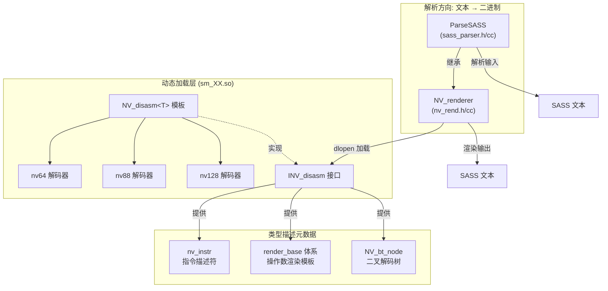
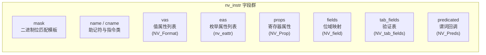
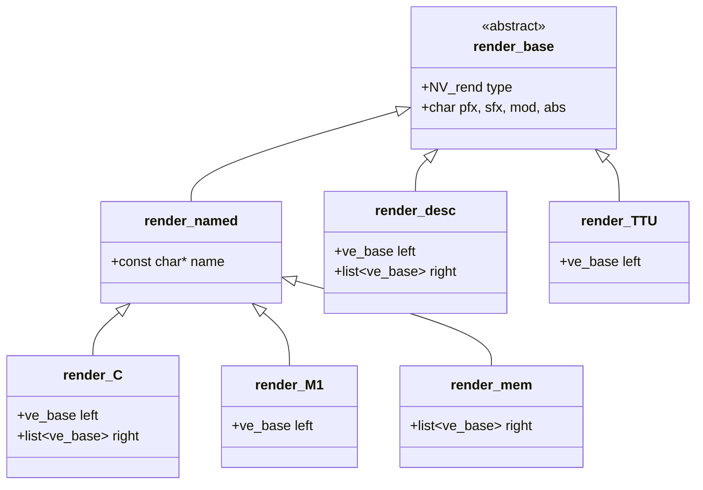
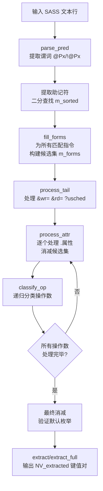

SASS 解析引擎是本项目工具链中最精密的子系统，承担着 SASS 指令的双向转换职责——既将原始二进制码反汇编为人类可读文本，也将 SASS 汇编源码解析并编码回机器码。这一能力由两大支柱构成：**nv_rend** 提供渲染基础设施与指令描述元数据框架，**sass_parser** 在此基础上实现了基于候选集消减的文本解析引擎。本文将深入解析这两个模块的类型体系、设计模式与协作机制。

Sources: [nv_rend.h](test/nv_rend.h#L1-L11), [sass_parser.h](test/sass_parser.h#L1-L8), [nv_types.h](scripts/include/nv_types.h#L1-L15)

## 整体架构概览

nv_rend 与 sass_parser 并非两个独立模块，而是通过继承和模板组合形成**层次化的指令处理流水线**。`NV_renderer` 是渲染层基类，通过 `dlopen` 动态加载架构特定的 `sm_XX.so` 共享库，获得完整的指令描述表与解码器接口。`ParseSASS` 继承 `NV_renderer`，注入文本解析能力，使其既能"读"也能"写"SASS 指令。`NV_disasm<T>` 模板类则桥接了二进制解码与元数据查询，通过 CRTP 模式将不同指令宽度（64/88/128 位）的解码逻辑统一到同一接口之下。



Sources: [nv_rend.h](test/nv_rend.h#L311-L319), [sass_parser.h](test/sass_parser.h#L28-L33), [nv_types.h](scripts/include/nv_types.h#L1230-L1241)

## 指令宽度解码器：nv64 / nv88 / nv128

NVIDIA GPU 的 SASS 指令并非固定宽度。从 Fermi 到 Blackwell，指令编码经历了 64 位、88 位和 128 位三种格式。`nv_types.h` 中定义了三个对应的解码器结构体，它们共同继承自 `NV_base_decoder`，通过模板参数注入 `NV_disasm<T>` 统一暴露给上层。

| 解码器 | 指令宽度 | 控制字格式 | 适用架构范围 |
|--------|---------|-----------|-------------|
| **nv64** | 64 位 | 8 条指令共享 1 个 64 位控制字 | sm_2x ~ sm_75（Maxwell ~ Turing） |
| **nv88** | 88 位 | 3 条指令共享 1 个 64 位控制字（每条 21 位） | sm_80 ~ sm_90（Ampere ~ Hopper） |
| **nv128** | 128 位 | 内嵌于 128 位指令字中（高 23 位） | sm_100+（Blackwell 起） |

控制字（control word）编码了指令调度的关键信息：stall 周期数、yield 标志、读写依赖屏障。以 `nv64` 为例，控制字按 8 位粒度分配给连续 7 条指令，最高 6 位与最低 2 位组合为 opcode。

Sources: [nv_types.h](scripts/include/nv_types.h#L367-L428), [nv_types.h](scripts/include/nv_types.h#L430-L546), [nv_types.h](scripts/include/nv_types.h#L548-L748), [nv_types.h](scripts/include/nv_types.h#L751-L797)

### 二叉解码树与指令匹配

指令识别并非通过线性扫描，而是采用**二叉决策树**（Binary Decision Tree）。`NV_bt_node` 构成树的节点，叶节点承载 `nv_instr` 指令描述符列表，非叶节点 `NV_non_leaf` 持有 `left`/`right` 子节点指针。解码时，`rec_find` 递归遍历树：在每个节点检测当前指令字的特定位（`check_bit`），根据 0/1 走左/右分支，同时在每个节点用 `check_mask` 验证固定位模式。这一设计的核心优势在于：对于大型指令集，查找复杂度从 O(n) 降至 O(log n)。

Sources: [nv_types.h](scripts/include/nv_types.h#L287-L299), [nv_types.h](scripts/include/nv_types.h#L1348-L1357)

## 指令描述元数据体系：nv_instr

`nv_instr` 是整个解析引擎的**元数据核心**，每条 SASS 指令变体都对应一个 `nv_instr` 实例。它由 `ead.pl` 从驱动描述文件中提取并编译为 `sm_XX.so` 共享库中的静态数据。其字段设计精确反映了 SASS 指令编码的每一个侧面：



| 字段类别 | 核心字段 | 作用 |
|---------|---------|------|
| **匹配** | `mask` | 64/88/128 位二进制模板，`X` 位为通配，`0`/`1` 为固定位 |
| **命名** | `name`, `cname`, `line` | 助记符、指令类名、源描述文件行号 |
| **值编码** | `vas` (`nv_vattr`) | 立即数字段：格式（UImm/SImm/F32Imm 等）、默认值 |
| **枚举编码** | `eas` (`nv_eattr`) | 枚举字段：映射表、是否忽略、默认值 |
| **寄存器语义** | `props` (`NV_Prop`) | 标记操作数角色（IDEST/ISRC_A 等）与类型 |
| **二进制布局** | `fields` (`NV_field`) | 字段名 → 位掩码/偏移量/缩放的映射 |
| **合法性验证** | `tab_fields` | 约束表：字段组合必须匹配预定义表项 |
| **谓词计算** | `predicated` | 动态计算寄存器宽度的回调函数集 |
| **控制属性** | `brt`, `scbd`, `itype` | 分支类型、调度屏障类型、指令类型 |

Sources: [nv_types.h](scripts/include/nv_types.h#L216-L285), [nv_types.h](scripts/include/nv_types.h#L115-L162)

### 值格式（NV_Format）与浮点处理

SASS 指令中的立即数支持多种编码格式。`NV_Format` 枚举定义了 9 种格式，`NV_renderer` 提供了完整的双向转换能力：

| 格式 | 说明 | 典型用途 |
|-----|------|---------|
| `NV_BITSET` | 位集合 | DEPBAR 的依赖位 |
| `NV_UImm` | 无符号整数 | 寄存器索引、偏移量 |
| `NV_SImm` | 有符号整数 | 分支偏移 |
| `NV_SSImm` / `NV_RSImm` | 特殊有符号/相对有符号 | 短立即数编码 |
| `NV_F64Imm` | 双精度浮点 | FADD/FMUL 的 64 位常量 |
| `NV_F32Imm` | 单精度浮点 | 浮点运算立即数 |
| `NV_F16Imm` | 半精度浮点 | FP16 SIMD 操作 |
| `NV_E8M7Imm` | 8 位浮点（E8M7） | FP8 操作（Blackwell 起） |

NaN/Inf 的处理是浮点转换中的关键细节。`s_nan2val` 和 `s_inf2val` 静态方法为每种浮点格式硬编码了特殊值的位模式。例如 `NV_F16Imm` 的 NaN 为 `0x7E00`，Inf 正值为 `0x7C00`、负值为 `0xFC00`。

Sources: [nv_types.h](scripts/include/nv_types.h#L74-L84), [nv_rend.cc](test/nv_rend.cc#L334-L380)

## 渲染模板体系：render_base 层次结构

渲染模板（render template）是描述 SASS 指令操作数布局的**声明式元结构**。每条指令变体通过 `NV_rlist`（即 `std::list<render_base *>`）定义其操作数序列。`render_base` 是虚基类，其派生类覆盖了 SASS 语法中的全部操作数形态：



| 渲染类型 | `NV_rend` 枚举 | 语法形式 | 典型示例 |
|---------|---------------|---------|---------|
| `R_value` | 值操作数 | `Ra`, `imm8` | `IMAD R1, R2, R3, 0x10` |
| `R_enum` | 枚举操作数 | `.FTZ`, `.RN` | `FADD.FTZ R1, R2, R3` |
| `R_predicate` | 谓词操作数 | `@P0`, `@!P1` | `@P0 IADD R1, R2, R3` |
| `R_opcode` | 操作码标记 | 指令助记符 | `IMAD`, `FADD` |
| `R_C` / `R_CX` | 常量存储器 | `c[0x0][0x8]` | `LDG R1, c[0x2][R2+0x40]` |
| `R_desc` | 描述符 | `desc[0x8][R2]` | TMA 描述符操作 |
| `R_TTU` | Tensor 单元 | `ttu[0x8]` | TMA 加载指令 |
| `R_M1` | 1 参数内存 | `gdesc[R2]` | TMA 相关 |
| `R_mem` | 通用内存 | `[R2+0x50]` | `STG [R2], R1` |

`ve_base` 是渲染模板中的**原子元素**，它携带 `type`（R_value 或 R_enum）和 `arg`（字段名称字符串）。复合渲染类型（如 `render_C`）通过 `left` + `right` 两个 `ve_base` 序列描述 `c[左][右]` 形式的操作数。这种设计使得渲染逻辑可以从纯粹的声明式数据驱动，无需为每种操作数编写特殊代码。

Sources: [nv_types.h](scripts/include/nv_types.h#L1011-L1057), [nv_types.h](scripts/include/nv_types.h#L1067-L1146)

## NV_renderer：渲染引擎核心

`NV_renderer` 是渲染引擎的核心类，负责将 `nv_instr` + `NV_extracted`（提取的键值对数据）转换为 SASS 文本。其核心工作流如下：

1. **加载阶段**：`load(sm_name)` 通过 `dlopen` 加载架构特定的 `sm_XX.so`，获取 `get_sm` 工厂函数和 `get_vq_name` 辅助函数
2. **解码阶段**：通过 `INV_disasm::get()` 获取 `NV_res`（即 `vector<pair<const nv_instr*, NV_extracted>>`），其中每个匹配结果包含指令描述符和提取的字段值
3. **消歧阶段**：`calc_index()` 在多个匹配结果中选择最佳候选——通过 `calc_miss()` 计算每个候选的"未命中枚举数"，选择最少未命中的非备用结果
4. **渲染阶段**：遍历 `NV_rlist` 中的渲染模板，依次渲染谓词、操作码、各操作数

### 重定位处理

`NV_renderer` 内建了完整的重定位类型支持，覆盖 **MERCURY** 和 **CUDA** 两套重定位命名体系（共 100+ 种类型）。`render_rel` 方法根据重定位类型将符号引用渲染为反引号引用（`` `symbol ``）、`32@lo(symbol)` 或 `32@hi(symbol)` 等形式。

Sources: [nv_rend.cc](test/nv_rend.cc#L115-L316), [nv_rend.cc](test/nv_rend.cc#L385-L403), [nv_rend.cc](test/nv_rend.cc#L405-L450), [nv_rend.cc](test/nv_rend.cc#L550-L573), [nv_rend.cc](test/nv_rend.cc#L727-L776)

## 寄存器追踪系统：reg_pad

`reg_pad` 是一个**指令级寄存器活动记录器**，它追踪每条指令对四类寄存器的读写行为：

| 寄存器类别 | `reg_pad` 字段 | 追踪方法 | 前缀约定 |
|-----------|---------------|---------|---------|
| 通用寄存器 | `gpr` (TRSet) | `rgpr`/`wgpr` | 无前缀 |
| Uniform 通用寄存器 | `ugpr` (TRSet) | `rugpr`/`wugpr` | 0x8000 |
| 谓词寄存器 | `pred` (RSet) | `rpred`/`wpred` | 无前缀 |
| Uniform 谓词寄存器 | `upred` (RSet) | `rupred`/`wupred` | 0x8000 |
| Constant Bank | `cbs` (vector) | `add_cb` | — |

`reg_history::RH`（unsigned short）是一个**紧凑的位域标记**，编码了读写方向（bit 15）、谓词信息（bit 14 + bit 11-13）、reuse 标志（bit 9）、compound 标志（bit 8）、list 标志（bit 7）、宽操作索引（bit 4-6）和 NVP_ops（bit 0-2）。`track_snap` 进一步提供了单指令级别的寄存器访问快照，用于补丁工具判断哪些字段需要修改。

`track_regs` 方法是寄存器追踪的核心入口。它遍历指令的渲染模板，利用 `nv_instr` 的 `props`（寄存器角色标注）和 `predicated`（动态宽度计算回调）来确定每个寄存器操作数的语义角色（目的/源）和数据类型。对于宽操作（如 64 位寄存器对），它会自动拆分为多个 32 位条目。

Sources: [nv_rend.h](test/nv_rend.h#L62-L136), [nv_rend.h](test/nv_rend.h#L138-L164), [nv_rend.h](test/nv_rend.h#L166-L294), [nv_rend.cc](test/nv_rend.cc#L903-L932), [nv_rend.cc](test/nv_rend.cc#L1223-L1308)

## ParseSASS：候选集消减解析引擎

`ParseSASS` 是 SASS 汇编器（将文本转换为二进制编码）的核心引擎。它继承 `NV_renderer`，复用了渲染基础设施中的类型查询能力，但核心数据流方向相反。其设计采用了一种精巧的**候选集消减**（Candidate Set Reduction）策略：



### one_form 与 form_list：候选状态管理

`one_form` 代表一个**候选指令实例**，它持有：指向 `nv_instr` 的指针、对应的 `NV_rlist` 渲染模板、本地键值存储 `l_kv`、操作数列表 `ops`（`list<form_list*>`），以及当前处理位置迭代器 `current`。`form_list` 封装了单个渲染模板节点及其附带的隐式枚举列表 `lr`（`LTuple` 列表，包含渲染指针、枚举属性和反向枚举映射）。

在 `fill_forms` 阶段，系统为所有匹配助记符的指令变体创建 `one_form`，并将渲染模板中连续的隐式枚举（`ea->ignore == true` 的枚举属性）折叠到前一个显式操作数的 `lr` 中。这一优化显著减少了后续消减的迭代次数。

Sources: [sass_parser.h](test/sass_parser.h#L81-L127), [sass_parser.cc](test/sass_parser.cc#L1364-L1409)

### 模板化消减原语

ParseSASS 的消减引擎基于四个核心模板方法，它们是整个解析流程的"齿轮"：

| 方法 | 作用 | 消减策略 |
|------|------|---------|
| `check_kind` | 检查当前操作数是否匹配指定类型 | 仅计数，不修改候选集 |
| `apply_kind` | 按类型过滤，推进匹配候选的 current 迭代器 | 删除不匹配的候选 |
| `check_op` | 按自定义谓词检查当前操作数 | 仅计数 |
| `apply_op` | 按自定义谓词过滤并推进 | 删除不匹配的候选 |

这些方法共享一套精巧的**枚举默认值穿透逻辑**（`NV_PE_RPT` 宏）：当遇到 `R_predicate` 或 `R_enum` 类型的操作数时，如果它有默认值且当前未被显式指定，则跳过（`continue`）而非拒绝。这使得解析器能优雅处理 SASS 语法中大量可选的隐式枚举修饰符。

Sources: [sass_parser.h](test/sass_parser.h#L143-L250)

### classify_op：递归操作数分类器

`classify_op` 是整个解析引擎中**最复杂的方法**，它实现了 SASS 操作数的递归分类。由于 SASS 语法并非纯粹的正则文法——某些操作数之间用空格分隔（如标签 `(*"BRANCH_TARGETS"*)`），且操作数可以带有递归嵌套的属性——该方法设计为**可递归调用**，最大深度约为 3 层。

其分类决策链如下：

```
1. INF/nan/QNAN → 特殊浮点值
2. desc[...]/gdesc[...]/ttu[...]/c[...]/cx[...]/a[...]/[...] → 复合操作数
3. 0x... → 十六进制数值 + 可能的递归尾部分类
4. (*"BRANCH_TARGETS"...) → 分支标签
5. `(...) → 普通标签
6. !... → 否定谓词
7. |...| → 绝对值操作数（含内部枚举）
8. {...} → 位集合
9. 32@lo(...)/32@hi(...) → 32 位拆分标签
10. 纯数字 → 十进制/浮点值
11. 默认 → 枚举匹配 (apply_enum)
```

对于复合操作数（如 `c[0x2][R3+0x40].CG`），解析器调用 `parse_c_left` 处理左方括号内的枚举/数值，然后 `parse_mem_right` 处理右方括号内的寄存器+偏移量组合，最后 `process_tail_attr` 处理尾部属性（如缓存修饰符 `.CG`）。

Sources: [sass_parser.cc](test/sass_parser.cc#L831-L1018)

### 点分枚举匹配（dotted enum）

SASS 中存在大量包含点号的复合枚举修饰符，如 `F32.FTZ.RN`、`I2F.F32`. `try_dotted` 方法实现了一种**贪心最长匹配**策略：从当前点号位置开始，逐段扩展匹配范围，在 `NV_dotted`（`set<string_view>`）中查找最长的已知点分枚举。如果找到匹配，则将整个点分序列作为一个枚举单元处理，否则退回处理单段。

Sources: [sass_parser.cc](test/sass_parser.cc#L1114-L1172), [sass_parser.cc](test/sass_parser.cc#L1174-L1258)

### 最终消减与歧义消除

在所有操作数处理完毕后，`add` 方法执行**最终消减**（final cut）。这一步骤解决了由 IMAD 等高频指令带来的歧义问题——这些指令有大量变体，仅通过显式操作数无法完全区分。最终消减逻辑遍历每个候选的 `ops` 列表，检查所有非默认枚举是否都已在 `l_kv` 中被赋值。如果严格模式下无候选存活，则切换到**宽松模式**，允许单值枚举（`em->size() == 1`）不被显式匹配。

Sources: [sass_parser.cc](test/sass_parser.cc#L1443-L1507)

## extract/extract_full：键值对输出

成功解析后，`extract` 和 `extract_full` 两个方法从 `one_form` 中提取编码所需的键值对。`extract` 仅收集显式指定的字段；`extract_full` 额外填充所有默认值不为零的枚举和谓词字段。提取过程将谓词名称映射为枚举值（通过 `NV_Renums` 反向查找），合并全局 `m_kv`（如 `usched_info`、`batch_t`）和本地 `l_kv`（如立即数值、枚举值），最终输出一个完整的 `NV_extracted` 映射，供后续的位域编码（`nv_instr::fields`）和表验证（`validate_tabs`）使用。

Sources: [sass_parser.cc](test/sass_parser.cc#L54-L137), [sass_parser.cc](test/sass_parser.cc#L105-L137)

## 架构版本支持矩阵

`NV_renderer::s_sms` 映射表定义了从 GPU 架构编码到 SM 名称的转换关系。以下是解析引擎当前支持的架构范围：

| 架构编码 | SM 名称 | 别名 | 指令宽度 |
|---------|---------|------|---------|
| 0x14 | sm2 (Fermi) | — | 64 位 |
| 0x1E | sm30 (Kepler) | sm3 | 64 位 |
| 0x20-0x25 | sm32-sm37 | sm4 | 64 位 |
| 0x32-0x3E | sm50-sm62 | sm5/sm52/sm55/sm57 | 64 位 |
| 0x46-0x4B | sm70-sm75 | — | 64 位 |
| 0x50-0x5A | sm80-sm90 | — | 88 位 |
| 0x64-0x6E | sm100-sm110 | sm103 | 128 位 |
| 0x78-0x79 | sm120-sm121 | sm120 | 128 位 |

Sources: [nv_rend.cc](test/nv_rend.cc#L56-L82)

## 延伸阅读

理解了渲染框架与解析引擎的核心机制后，可以进一步探索以下主题：

- **指令编码字段与掩码机制**：[SASS 指令编码字段与掩码机制](9-sass-zhi-ling-bian-ma-zi-duan-yu-yan-ma-ji-zhi) 详细说明了 `NV_field` 和位掩码如何驱动二进制编码
- **寄存器追踪与 LUT 解码**：[寄存器追踪与 LUT 操作解码](11-ji-cun-qi-zhui-zong-yu-lut-cao-zuo-jie-ma) 深入分析了 `reg_pad` 在数据流分析中的应用
- **驱动描述文件提取**：[ead.pl 指令编码生成器](6-ead-pl-zhi-ling-bian-ma-sheng-cheng-qi-cong-miao-shu-wen-jian-dao-sm_xx-so-gong-xiang-ku) 揭示了 `nv_instr` 和 `render_base` 数据的源头
- **GPU 架构演进**：[GPU 架构演进：从 Fermi 到 Blackwell 的支持矩阵](23-gpu-jia-gou-yan-jin-cong-fermi-sm_2-dao-blackwell-sm_120-de-zhi-chi-ju-zhen) 提供了完整的架构上下文