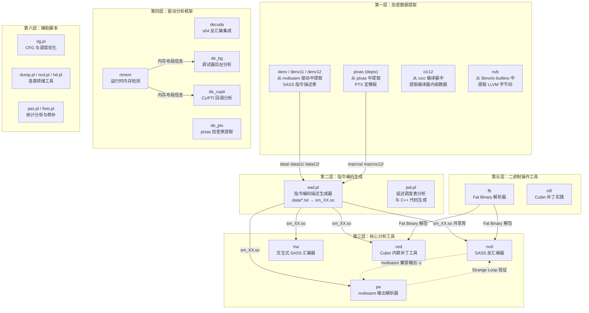
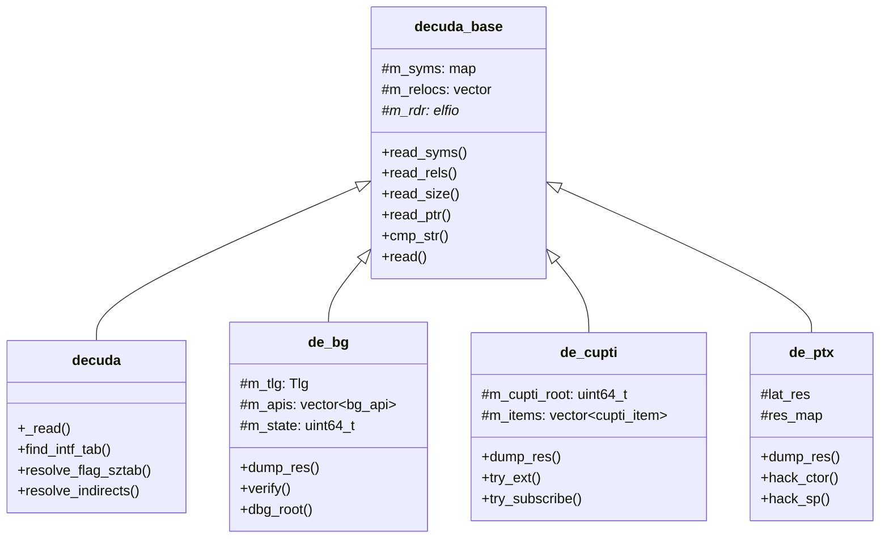

本文是 denvdis 项目工具链的**全景导航**，从数据源头（NVIDIA 驱动加密表）到最终产物（SASS 反汇编、Cubin 补丁、运行时追踪），系统梳理每一个环节的工具角色、数据流向与协作关系。阅读完本文后，你将对整个项目的**六大功能分层**建立清晰的心智模型，并能根据实际需求定位到对应的详细文档。

Sources: [README.md](README.md#L1-L46), [Makefile](Makefile#L1-L29)

## 全局架构：六层工具流水线

项目的核心设计思想可以用一句话概括：**从 NVIDIA 闭源二进制中逆向提取 SASS 指令编码知识，并构建完整的分析与操作工具链**。整个工具链按数据流方向可划分为六个层次，每层承担独立职责，通过标准化的文本描述文件和共享库接口衔接。

**关键设计原则**：所有核心分析工具（nvd、ina、ced、pa）通过 `dlopen` 动态加载架构相关的 `sm_XX.so` 共享库，实现指令编码知识与工具逻辑的解耦。环境变量 `SM_DIR` 可覆盖默认的共享库搜索路径。

Sources: [test/Makefile](test/Makefile#L1-L18), [README.md](README.md#L45-L46)

## 第一层：加密数据提取工具

NVIDIA 在其闭源二进制（nvdisasm、ptxas、cicc、libnvrtc）中存储了 SASS 指令集的完整编码描述。这些描述经过自定义流密码加密，是所有后续工具的数据源头。

### denv / denv11 / denv12 — 驱动指令描述提取器

这三个工具是同一家族的三个版本，分别对应 CUDA 10.x、11.x 和 12.x 驱动中的 nvdisasm 二进制。它们的核心工作流程完全一致：加载 ELF 格式的 nvdisasm，定位 `.data` 段中按偏移量和大小描述的加密数据块，使用种子密钥和流密码算法逐一解密，并将结果写入对应的文本文件。

**解密算法**基于一个 256 字节的 salt 表（由 64 个 32 位种子值构成）和一个线性同余伪随机数生成器（`v3 = 1103515245 * ctx->wtf + 0x3039`）。每次解密前，从硬编码的偏移表中取出该架构块的初始种子值（如 `0x4816`、`0x1486`、`0xC401` 等），与 salt 表配合逐字节异或解密。denv11 和 denv12 在 denv 基础上增加了 LZ4 压缩数据的处理能力。

Sources: [denv.cc](denv.cc#L1-L188), [denv11.cc](denv11.cc#L1-L50), [denv12.cc](denv12.cc#L1-L50)

### ptxas (deptx) — PTX 宏模板提取器

从 NVIDIA 的 `ptxas` 汇编器二进制中提取 PTX 宏模板。这些模板定义了 PTX 内置函数的展开规则，例如视频操作（video emulation）的标量提取与符号扩展逻辑。提取结果存放在 `macros/` 目录下，每个文件对应一个 PTX 宏模板，其中使用 `${变量名}` 占位符语法。

Sources: [ptxas.cc](ptxas.cc#L1-L50)

### cic12 — CUDA 编译器内部数据提取

从 CUDA 12.x 的 `cicc` 编译器中提取内部数据。cicc 是 NVIDIA 的 CUDA 前端编译器，内部嵌入了 LLVM 字节码形式的运行时核心（rtcore）以及相关的编译器内部描述信息。cic12 使用与 denv 系列不同的密钥表，但解密算法结构类似。提取结果包括 `rtcore.bc`（LLVM 字节码）和 `rtcore.ll`（LLVM IR 文本）。

Sources: [cic12.cc](cic12.cc#L1-L30)

### nvb — NVRTC 内置字节码提取

`nvb` 通过 `dlopen` 动态加载 `libnvrtc-builtins.so`，调用其导出的 `getBuiltinHeader` 和（以架构号为参数的）字节码获取函数，将 NVRTC（NVIDIA Runtime Compiler）的内置头文件和 LLVM 字节码转储到磁盘。这是唯一不涉及解密的数据提取工具——它利用的是 NVRTC 共享库的标准导出接口。

Sources: [nvb.cc](nvb.cc#L1-L72)

## 第二层：指令编码代码生成

提取出的明文描述文件需要被转换为 C++ 共享库，才能被第三层的核心工具动态加载使用。这一层由两个 Perl 脚本承担。

### ead.pl — 指令编码描述生成器（6000+ 行核心脚本）

`ead.pl` 是整个工具链中**最关键的中间环节**，它读取第一层提取的指令描述文件（如 `data/sm75_1.txt`），解析其中的指令格式定义、操作数编码字段、掩码布局、枚举值表和谓词规则，最终生成 `sm_XX.cc` 源文件。编译后成为 `sm_XX.so` 共享库，供 nvd、ina、ced、pa 通过 `dlopen` 动态加载。

该脚本支持丰富的选项组合（`-BFEmgarizp`），每个字母控制一个生成阶段：`-B` 构建决策树用于解码、`-F` 过滤枚举、`-E` 生成枚举映射、`-m` 生成掩码、`-g` 解析分组调度表、`-a` 添加替代形式、`-r` 填充逆序、`-i` 转储指令格式、`-z` 移除完全填充的模式、`-p` 解析谓词。

在 test/Makefile 中可以看到完整的生成链路：例如 `sm75.cc` 由 `ead.pl` 处理 `data11/sm75_1.txt` 生成，再编译为 `sm75.so`。对于更新的架构（sm100-sm120），还引入了属性继承机制（`-u`/`-U` 选项），允许从 sm90 的属性文件推断新架构的编码特性。

Sources: [scripts/ead.pl](scripts/ead.pl#L1-L50), [test/Makefile](test/Makefile#L106-L162)

### pal.pl — 延迟调度表分析

分析 ead.pl 生成的延迟调度数据，并可生成对应的 C++ 代码。延迟调度表记录了不同 SASS 指令在各种操作数组合下的执行延迟，是 nvd 的 `-S` 选项和 dg.pl 调度优化的数据基础。

Sources: [scripts/pal.pl](scripts/pal.pl#L1-L30)

## 第三层：核心分析工具

这一层的四个工具是项目最常使用的交互式命令行程序，它们共享 `libced.a` 静态库（由 `nv_rend.o`、`sass_parser.o`、`ced_base.o`、`nv_lat.o`、`bf16.o` 组成）。

| 工具 | 功能定位 | 关键选项 | 依赖 |
|------|----------|----------|------|
| **nvd** | SASS 反汇编器 | `-c` nvdisasm 兼容模式、`-O` 编码字段、`-S` 调度表、`-p` 谓词、`-T` 寄存器追踪 | sm_XX.so + libced.a |
| **ina** | 交互式 SASS 汇编器 | 支持操作数类型过滤（f/i/C/m/d/u）、`-o` 保存二进制 | sm_XX.so + libced.a + readline |
| **ced** | 类 sed 的 Cubin 补丁器 | `-v` 详细模式、`-k` 核函数过滤、指令级替换 | sm_XX.so + libced.a |
| **pa** | nvdisasm 输出解析器 | `-T` 寄存器追踪、支持 "Strange Loop" 双向验证 | sm_XX.so + libced.a |

### nvd — SASS 反汇编器

nvd 的核心能力远超标准 nvdisasm。除了基本反汇编外，它可以通过 `-O` 选项展示每条指令的**全部编码字段**的值和名称（例如操作码、谓词寄存器、目标/源操作数等），通过 `-S` 展示延迟调度表，通过 `-p` 展示谓词关系图，通过 `-T` 追踪寄存器的读写链路。`-c` 选项可生成与 nvdisasm 语法兼容的输出，用于与 pa 配合完成"Strange Loop"交叉验证。

Sources: [test/nvd.cc](test/nvd.cc#L1-L60), [README.md](README.md#L15-L23)

### ina — 交互式 SASS 汇编器

ina 提供了类似 readline 的交互式命令行界面，允许用户输入 SASS 指令助记符和操作数，实时查看其编码结果。由于单条指令可能有多达数十种编码形式（例如 LDG 有 14 种、F2FP 有 60 种），ina 引入了过滤系统：用户可以用 `+f`/`-f` 等语法按操作数类型（浮点立即数、整数立即数、常量存储区、内存引用、描述符引用、Uniform 寄存器）筛选指令形式。

Sources: [test/ina.cc](test/ina.cc#L1-L60), [README.md](README.md#L25-L38)

### ced — Cubin 内联补丁工具

ced 的设计灵感来自 Unix 的 `sed` 流编辑器，但操作对象是 CUDA Cubin（ELF 格式）中的 SASS 指令。它读取 Cubin 文件，定位可执行段中的 SASS 代码，允许用户逐条查看指令编码并执行原地替换。ced 维护了完整的 ELF section header 表和重定位信息，在补丁过程中会检测并警告涉及重定位条目的偏移量，防止意外破坏二进制结构。

Sources: [test/ced.cc](test/ced.cc#L1-L60), [README.md](README.md#L10-L13)

### pa — nvdisasm 输出解析器

pa 将 nvdisasm 的文本输出反向解析为结构化的指令表示，然后利用 sm_XX.so 中的编码知识进行**正向编码**，将结果与原始 Cubin 中的二进制编码逐字节对比，实现"Strange Loop"闭环验证。这一机制既验证了 ead.pl 生成编码描述的正确性，也验证了 pa 自身解析逻辑的完整性。

Sources: [test/pa.cc](test/pa.cc#L1-L60), [README.md](README.md#L40-L43)

## 第四层：CUDA 驱动分析框架（cudaso）

cudaso 是一个独立的子项目，专注于对 CUDA 驱动本身的 x86_64 二进制进行逆向分析。它构建为一个共享库 `libdis.so`，可供外部程序（如 test.cc 或 cudbg 钩子）动态加载使用。

框架的类层次结构如下：

`decuda_base` 提供了 ELF 解析的基础设施（符号表、重定位表、段读写），四个派生类各自负责一个分析维度：`decuda` 定位接口函数表和间接调用表；`de_bg` 追踪 CUDA 调试器的后台日志系统（TLG 组件树）；`de_cupti` 定位 CUPTI 的订阅和注入扩展点；`de_ptx` 从 ptxas 中提取加密的延迟/调度字符串表并解密。`rtmem` 组件通过 `dl_iterate_phdr` 构建运行时进程的内存映射区间树，为其他组件的地址解析提供基地址服务。

Sources: [cudaso/decuda_base.cc](cudaso/decuda_base.cc#L1-L80), [cudaso/decuda.cc](cudaso/decuda.cc#L1-L80), [cudoso/de_bg.h](cudaso/de_bg.h#L1-L30), [cudaso/de_cupti.h](cudaso/de_cupti.h#L1-L29), [cudaso/de_ptx.h](cudaso/de_ptx.h#L1-L26)

内核追踪器 ELF 文件存放在 `cudaso/tracers/` 目录下，覆盖了 Turing、Ampere、Ada、Hopper、Blackwell 等全部现代架构，以及多种 CUDA Graph 和句柄操作变体。这些 ELF 文件通过 `simple_api.h` 定义的接口注入到 CUDA 运行时中，实现无侵入式的内核执行追踪。

Sources: [cudaso/simple_api.h](cudaso/simple_api.h#L1-L27)

## 第五层：二进制操作工具

### fb — Fat Binary 解析器

NVIDIA 的 Fat Binary 是一种容器格式，内部可包含针对多个 GPU 架构的多个 Cubin，并支持 Zstandard 压缩。fb 工具解析这种容器格式（基于 `FATBINC_MAGIC = 0x466243B1` 标识），列出或提取其中的各个 Cubin 成员，并支持对指定成员进行替换后重新打包。在 ctf/Makefile 的典型工作流中，fb 先从编译产物中提取 Cubin（`fb -i 1 -o 12`），然后使用 ced 或 md.pl 完成补丁后替换回去（`fb -i 1 -r 12`）。

Sources: [fb/fb.cc](fb/fb.cc#L1-L60), [fb/Makefile](fb/Makefile#L1-L14)

### ctf/ — CTF 实践工具集

ctf 目录包含了一系列 Cubin 二进制补丁的实践案例。`patch_cubin.pl` 演示了如何将 Cubin 的 PT_LOAD 段和 PROGBITS 节的权限标志修改为可写，从而允许运行时补丁。`md.pl` 则展示了使用 Perl 模块 `Cubin::Ced` 进行精确的指令级替换：例如定位 `S2R` 指令并修改其 `SRa` 操作数为特定的 SR_MACHINE_ID 寄存器编号。

Sources: [ctf/patch_cubin.pl](ctf/patch_cubin.pl#L1-L27), [ctf/md.pl](ctf/md.pl#L1-L40), [ctf/Makefile](ctf/Makefile#L1-L21)

## 第六层：辅助脚本集

scripts/ 目录包含了一批辅助性 Perl 脚本，服务于数据分析、调试和后处理。

| 脚本 | 功能 | 行数 |
|------|------|------|
| **ead.pl** | 指令编码生成器（详见第二层） | 6060 |
| **dg.pl** | Cubin 分析：CFG 构建、指令调度优化、寄存器复用分析 | 2435 |
| **pal.pl** | 延迟表分析与 C++ 代码生成 | 340 |
| **ncd.pl** | NVIDIA 代码转储文件（.nvcudmp）解析器 | 613 |
| **dump.pl** | 简易 Cubin section 转储工具 | 80 |
| **hd.pl** | ELF section 按 N 字节行十六进制转储 | 41 |
| **pas.pl** | pa -Ss 输出的统计分析 | 25 |
| **fixio.pl** | 为 nvdisasm 输出中的 EIATTR 指令偏移标签补丁 | 82 |

其中 **dg.pl** 是最复杂的辅助脚本（2400+ 行），它构建 Cubin 中指令的控制流图（CFG），分析寄存器的读写依赖，并尝试通过指令重排来减少流水线停顿（stall count）。它还支持 `-P` 选项直接执行补丁操作（需谨慎使用并提前备份）。

Sources: [scripts/dg.pl](scripts/dg.pl#L1-L30), [scripts/ncd.pl](scripts/ncd.pl#L1-L30), [scripts/dump.pl](scripts/dump.pl#L1-L30), [scripts/pal.pl](scripts/pal.pl#L1-L30), [scripts/hd.pl](scripts/hd.pl#L1-L30), [scripts/pas.pl](scripts/pas.pl#L1-L25), [scripts/fixio.pl](scripts/fixio.pl#L1-L30)

## 架构支持矩阵

项目通过三个数据目录覆盖从 Fermi 到 Blackwell 的完整 GPU 架构谱系。`sm_version.txt` 记录了架构代号到 SM 版本的映射关系。

| 数据目录 | CUDA 版本 | 覆盖架构 | 指令描述格式 |
|----------|-----------|----------|-------------|
| `data/` | CUDA 10.x | sm_2 ~ sm_75 (Fermi → Turing) | 纯文本（自定义 DSL） |
| `data11/` | CUDA 11.x | sm_52 ~ sm_90 (Maxwell → Hopper) | 纯文本 + LZ4 压缩 |
| `data12/` | CUDA 12.x | sm_75 ~ sm_120 (Turing → Blackwell) | 纯文本 + LZ4 压缩 |

注意 data12 目录中 sm_100、sm_101、sm_103、sm_120 的描述文件是通过 `-U` 选项从 sm_90 的属性文件继承和推断生成的，这体现了项目对新架构的前瞻性支持策略。

Sources: [sm_version.txt](sm_version.txt#L1-L28)

## 数据流向总览

下表展示了从源文件到最终产物的完整数据转换链路：

| 步骤 | 输入 | 工具 | 输出 |
|------|------|------|------|
| 1 | nvdisasm (ELF 二进制) | denv/denv11/denv12 | `data*/sm_XX_*.txt` |
| 2 | ptxas (ELF 二进制) | deptx | `macros/*.txt` |
| 3 | cicc (ELF 二进制) | cic12 | `cicc12/rtcore.bc` 等 |
| 4 | libnvrtc-builtins.so | nvb | `<arch>.bc`, `BuiltinHeader.h` |
| 5 | `data*/sm_XX_1.txt` | ead.pl | `sm_XX.cc` |
| 6 | `sm_XX.cc` | clang/gcc | `sm_XX.so` |
| 7 | Cubin + `sm_XX.so` | nvd | SASS 反汇编输出 |
| 8 | Cubin + `sm_XX.so` | ced | 补丁后的 Cubin |
| 9 | CUDA 应用 (Fat Binary) | fb | 提取的 Cubin |
| 10 | libcuda.so (ELF) | decuda 框架 | 驱动内部结构 |

Sources: [test/Makefile](test/Makefile#L18-L162), [Makefile](Makefile#L1-L29)

## 推荐阅读路径

根据你的兴趣方向，建议按以下顺序深入：

1. **理解数据源头** → [NVIDIA 驱动中的加密指令描述表提取（denv/denv11/denv12）](4-nvidia-qu-dong-zhong-de-jia-mi-zhi-ling-miao-shu-biao-ti-qu-denv-denv11-denv12)
2. **认识描述文件格式** → [SASS 指令描述文件格式与架构数据目录（data/data11/data12）](5-sass-zhi-ling-miao-shu-wen-jian-ge-shi-yu-jia-gou-shu-ju-mu-lu-data-data11-data12)
3. **掌握编码生成** → [ead.pl 指令编码生成器：从描述文件到 sm_XX.so 共享库](6-ead-pl-zhi-ling-bian-ma-sheng-cheng-qi-cong-miao-shu-wen-jian-dao-sm_xx-so-gong-xiang-ku)
4. **使用核心工具** → [nvd 反汇编器架构与 ELF/CUBIN 解析](8-nvd-fan-hui-bian-qi-jia-gou-yu-elf-cubin-jie-xi) → [ina 交互式 SASS 汇编器：指令表单过滤与编码](12-ina-jiao-hu-shi-sass-hui-bian-qi-zhi-ling-biao-dan-guo-lu-yu-bian-ma) → [ced 类 sed 的 Cubin 内联补丁工具](13-ced-lei-sed-de-cubin-nei-lian-bu-ding-gong-ju)
5. **探索驱动分析** → [decuda 驱动分析框架与 x64 反汇编集成](15-decuda-qu-dong-fen-xi-kuang-jia-yu-x64-fan-hui-bian-ji-cheng)
6. **架构全景视角** → [GPU 架构演进：从 Fermi（sm_2）到 Blackwell（sm_120）的支持矩阵](23-gpu-jia-gou-yan-jin-cong-fermi-sm_2-dao-blackwell-sm_120-de-zhi-chi-ju-zhen)