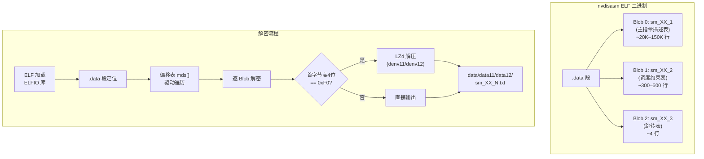
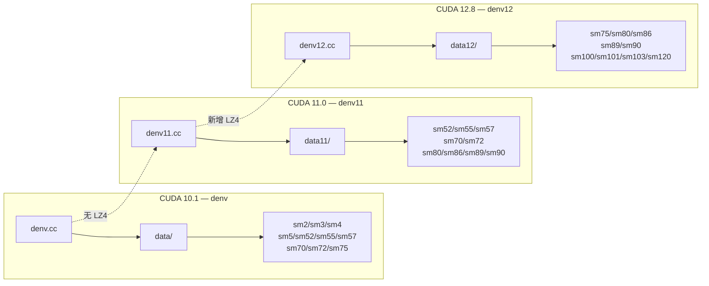

NVIDIA 的 `nvdisasm` 二进制文件中嵌入了经过混淆加密的 GPU 指令描述表（Machine Description, MD），这些表定义了每一代 GPU 架构的指令编码、调度约束、流水线资源和寄存器分配规则。`denv`、`denv11`、`denv12` 是三组针对不同 CUDA Toolkit 版本的 **加密表解密与提取工具**，分别对应 CUDA 10.1、11.0 和 12.8 的 `nvdisasm` 二进制。它们共享同一套基于 LCG（线性同余生成器）的流密码解密算法和 64 个 32 位常量构成的盐值表，但在输出目录、LZ4 解压支持以及所覆盖的 GPU 架构范围上存在代际差异。

Sources: [denv.cc](denv.cc#L1-L188), [denv11.cc](denv11.cc#L1-L217), [denv12.cc](denv12.cc#L1-L206)

## 加密表在 nvdisasm 中的存储结构

NVIDIA 将所有 GPU 架构的指令描述表打包后嵌入 `nvdisasm` ELF 二进制的 **`.data` 段**中。每个架构的描述由最多三个独立 Blob 组成，通过固定偏移表（`mds[]` 数组）定位。每个 Blob 使用相同的流密码进行逐字节混淆加密，密钥由架构特定的 `init` 种子值派生。



`mds[]` 数组中每个条目的结构体 `one_md` 包含五个字段：`off`（Blob 在 `.data` 段中的起始偏移）、`size`（加密 Blob 的字节长度）、`cont`（内容类型标识，0/1/2 对应 `_1`/`_2`/`_3` 后缀）、`init`（加密种子值）和 `name`（输出文件名前缀）。`cont` 字段的三个值代表不同层次的描述数据：**0 为主指令集描述**（包含指令编码、操作码定义、寄存器约束等，文件可达 15 万行以上），**1 为调度约束表**（包含操作集合定义、流水线分配和延迟/吞吐量矩阵，数百行规模），**2 为无条件跳转表**（极简文件，通常仅含 `JUMP_UNCOND: BRA` 声明）。

Sources: [denv.cc](denv.cc#L86-L122), [denv12.cc](denv12.cc#L86-L124)

## 核心解密算法：LCG 流密码

三个工具共享完全相同的解密引擎。其核心是一个基于 **线性同余生成器（LCG）** 的流密码，结合一个 256 字节的盐值查找表进行逐字节解密。算法的关键数据结构 `decr_ctx` 维护四个状态变量：

| 字段 | 类型 | 作用 |
|------|------|------|
| `wtf` | `uint32_t` | LCG 状态变量，由 `init` 种子初始化 |
| `seed` | `uint32_t` | 当前 LCG 输出的字节序列缓存 |
| `res` | `uint32_t` | 剩余字节数，每 4 字节消耗一个 LCG 输出 |
| `l` | `uint8_t` | 前一个密文字节，作为反馈参与 XOR |

解密过程对每个密文字节执行三步操作：（1）消耗 `seed` 的当前最低字节（当 `res` 递减至 0 时，通过 `v3 = 1103515245 * ctx->wtf + 0x3039` 生成新的 4 字节随机序列）；（2）以 `密文字节 ^ 前一密文字节` 作为索引在盐值表 `seeds[]`（被解释为 256 字节的字节数组 `salt`）中查找；（3）将查找结果与 `seed` 当前最低字节 XOR 得到明文字节。这种设计实现了 **密文反馈（CTB）+ LCG 密钥流** 的双重混淆机制。

Sources: [denv.cc](denv.cc#L12-L81)

### 初始化参数与加密种子映射

解密上下文的初始化直接决定了整个解密过程的正确性。初始化逻辑如下：

```
ctx.wtf = init        // LCG 初始种子
ctx.seed = 0          // 密钥流缓存初始化为零
ctx.res  = 1          // 强制第一个字节就触发 LCG 更新
ctx.l    = ~(init & 0xFF)  // 反馈字节取 init 最低字节的反码
```

代码注释中的 `// via assign to mdObfuscation_ptr` 揭示了 NVIDIA 内部的命名：这些混淆数据在驱动中被称为 **`mdObfuscation`**。不同 GPU 架构使用不同的 `init` 种子值，形成了以下映射关系：

| init 种子 | 架构族 | 首次出现版本 | 说明 |
|-----------|--------|-------------|------|
| `0x4816` | sm3 (Kepler) | CUDA 10 | 最早支持 |
| `0x1486` | sm4 (Kepler 2) | CUDA 10 | |
| `0x1648` | sm5 (Maxwell) | CUDA 10 | |
| `0x6C9E` | sm52 (Maxwell 2) | CUDA 10 | |
| `0xC401` | sm55/sm70/sm72/sm75 | CUDA 10 | Pascal/Volta/Turing 共用 |
| `0xE44` | sm57 (Pascal GP100) | CUDA 10 | |
| `0xB4A` | sm70/sm72/sm75 | CUDA 11+ | 新种子分配 |
| `0x8416` | sm80/sm86 (Ampere) | CUDA 11+ | |
| `0x1684` | sm89 (Ada Lovelace) | CUDA 11+ | |
| `0x3927` | sm90 (Hopper) | CUDA 11+ | |
| `0x9327` | sm100/sm101/sm103/sm120 (Blackwell) | CUDA 12.8 | 全新种子 |

值得注意的是，同一 `init` 值在早期版本（如 `0xC401`）覆盖了 Pascal、Volta 和 Turing 多个微架构，而后期版本中 NVIDIA 为不同架构分配了独立的种子（如 Ampere `0x8416`、Hopper `0x3927`），反映出安全策略的逐步强化。

Sources: [denv.cc](denv.cc#L29-L34), [denv.cc](denv.cc#L136-L143), [denv12.cc](denv12.cc#L93-L124)

## 三个工具的代际差异



### denv（CUDA 10.1）：基础流式解密

`denv` 是最早的提取工具，针对 CUDA 10.1（V10.1.243）版本的 `nvdisasm` 二进制。其核心特征是 **固定缓冲区流式处理**：使用 0x3DC（996）字节的静态 `copy_buf` 数组分块读取、解密并写入输出文件。这种设计意味着解密过程不需要分配与 Blob 等大的内存，但也不支持对解密后数据的后处理（如解压）。该版本覆盖了从 Fermi（sm2）到 Turing（sm75）共 9 个微架构，每个架构输出 3 个文件（`_1`/`_2`/`_3`）。

Sources: [denv.cc](denv.cc#L83-L152)

### denv11（CUDA 11.0）：引入 LZ4 解压

`denv11` 针对 CUDA 11.0（V11.0.194），引入了两项关键改进。首先，**一次性缓冲区分配**取代了固定大小分块：通过 `malloc(mds[idx].size)` 分配完整 Blob 大小的缓冲区，在解密完成后检查首字节高 4 位是否为 `0xF0`——若是，则调用 `LZ4_decompress_safe()` 进行 LZ4 解压，将解压后的数据写入输出文件。这表明从 CUDA 11 开始，NVIDIA 在混淆加密之上叠加了 LZ4 压缩层以减小 `nvdisasm` 二进制的体积。16 MB 的 `decompress_buf` 提供了充足的解压空间。其次，架构覆盖范围更新至 Ampere（sm80/sm86）、Ada（sm89）和 Hopper（sm90），但注释掉了 sm75 及更新架构的条目（可能是预留或需要单独处理）。此版本不再覆盖 Fermi（sm2）和 Kepler（sm3/sm4）。

Sources: [denv11.cc](denv11.cc#L84-L181)

### denv12（CUDA 12.8）：Blackwell 全覆盖

`denv12` 针对 CUDA 12.8（V12.8.55），在 `denv11` 的解密+LZ4 流程基础上，将架构覆盖范围扩展到 **Blackwell 架构**（sm100/sm101/sm103/sm120）。这是目前覆盖架构范围最广的版本，从 Turing（sm75）一直支持到 Blackwell（sm120），共 9 个微架构。每个架构的 `_1` 文件（主指令描述）从约 12.9 万行（sm100）增长到约 15 万行（sm120），反映了 Blackwell 架构指令集的显著扩展。值得注意的是，sm103 架构的 `ELF_VERSION` 为 131，而 sm100/sm120 仍为 128，表明 sm103 可能代表 Blackwell 架构的特定变体。

Sources: [denv12.cc](denv12.cc#L92-L170), [data12/sm103_1.txt](data12/sm103_1.txt#L12-L12)

## 编译与使用

三个工具的编译依赖略有不同。`denv` 仅需 ELFIO 头文件路径和 `libstdc++`，而 `denv11` 和 `denv12` 额外需要 **LZ4 静态库**（`liblz4.a`）及其头文件路径：

| 工具 | 编译命令 | 额外依赖 |
|------|---------|----------|
| `denv` | `gcc -o denv -I$ELFIO denv.cc -lstdc++` | ELFIO |
| `denv11` | `gcc -o denv11 -I$ELFIO -I../lz4/lib denv11.cc ../lz4/lib/liblz4.a -lstdc++` | ELFIO + LZ4 |
| `denv12` | `gcc -o denv12 -I$ELFIO -I../lz4/lib denv12.cc ../lz4/lib/liblz4.a -lstdc++` | ELFIO + LZ4 |

运行时，三个工具均接受一个可选参数指定 `nvdisasm` 二进制路径（默认为当前目录下的 `./nvdisasm`）。工具自动创建输出子目录（`data/`、`data11/`、`data12/`），然后遍历硬编码的偏移表逐一解密并输出文件。

Sources: [Makefile](Makefile#L1-L29), [denv.cc](denv.cc#L154-L188)

## 解密输出格式分析

解密后的 `.txt` 文件采用 NVIDIA 内部的 **Machine Description (MD) 描述语言**，这是一种类汇编的声明式 DSL。以 `sm_XX_1.txt`（主描述文件）为例，其结构层次为：

1. **架构头**（`ARCHITECTURE "Volta"`）：声明目标架构名称、处理期标识、字长、ELF 版本等元信息
2. **重定位器表**（`RELOCATORS`）：定义所有 `R_CUDA_*` 重定位类型的位域和掩码
3. **条件类型**（`CONDITION TYPES`）：定义指令解码时的错误/警告/信息级别
4. **常量定义**（`CONSTANTS`）：定义指令类型（`ITYPE_*`）、分支类型（`BRT_*`）、流水线队列（`VQ_*`）等枚举常量
5. **指令编码表**：大量以位域模式定义的指令操作码和操作数编码

`sm_XX_2.txt`（调度约束文件）定义了操作集合（`OPERATION SETS`）、硬件资源（`HARD RESOURCE`）、连接器（`CONNECTOR`）和延迟/吞吐量表（`TABLE_TRUE`/`TABLE_OUTPUT`/`TABLE_ANTI`）。这些数据直接驱动 `nvdisasm` 的指令解码和调度验证逻辑。

Sources: [data/sm75_1.txt](data/sm75_1.txt#L1-L200), [data/sm75_2.txt](data/sm75_2.txt#L1-L200), [data12/sm90_1.txt](data12/sm90_1.txt#L1-L200)

## 导航

- **下游工具**：提取出的描述文件由 [ead.pl 指令编码生成器](6-ead-pl-zhi-ling-bian-ma-sheng-cheng-qi-cong-miao-shu-wen-jian-dao-sm_xx-so-gong-xiang-ku) 消费，生成 `sm_XX.so` 共享库供 SASS 反汇编器使用
- **数据目录详解**：各架构数据文件的内容格式和字段语义参见 [SASS 指令描述文件格式与架构数据目录](5-sass-zhi-ling-miao-shu-wen-jian-ge-shi-yu-jia-gou-shu-ju-mu-lu-data-data11-data12)
- **相关工具**：`ptxas` 中的加密表提取流程参见 [ptxas 加密表提取（de_ptx）](17-ptxas-jia-mi-biao-ti-qu-de_ptx-yu-cupti-hui-diao-fen-xi)