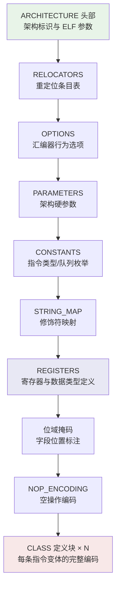
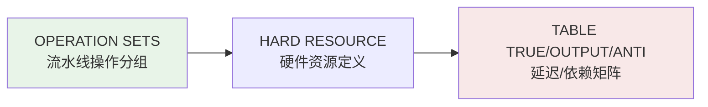

本页深入解析项目中 `data/`、`data7/`、`data11/`、`data12/` 四个目录下的 SASS 指令描述文件——这些文件是整个工具链的核心知识库，完整定义了 NVIDIA GPU 从 Tesla（sm_1）到 Blackwell（sm_120）每一代架构的指令集编码、寄存器模型、流水线调度规则与指令等价关系。它们由 [NVIDIA 驱动中的加密指令描述表提取](4-nvidia-qu-dong-zhong-de-jia-mi-zhi-ling-miao-shu-biao-ti-qu-denv-denv11-denv12) 页描述的 denv 工具从驱动中解密提取而来，并被 [ead.pl 指令编码生成器](6-ead-pl-zhi-ling-bian-ma-sheng-cheng-qi-cong-miao-shu-wen-jian-dao-sm_xx-so-gong-xiang-ku) 消费以生成可加载的共享库。

Sources: [denv.cc](denv.cc#L1-L30), [data/sm75_1.txt](data/sm75_1.txt#L1-L15), [data12/sm90_1.txt](data12/sm90_1.txt#L1-L15)

## 目录体系与架构覆盖矩阵

四个数据目录按 **CUDA 工具链版本** 和 **架构代际** 组织，对应不同版本的 NVIDIA 驱动中嵌入的 ptxas 汇编器内建描述表。

```
data/          ← 早期 CUDA 工具链（约 CUDA 6~10），覆盖 sm_2 ~ sm_75
data7/         ← CUDA 7 工具链，仅覆盖 sm_1（Tesla 架构）
data11/        ← CUDA 11 工具链，覆盖 sm_52 ~ sm_90（Ampere/Hopper）
data12/        ← CUDA 12 工具链，覆盖 sm_75 ~ sm_120（Ada Lovelace/Hopper/Blackwell）
```

Sources: [data/](data), [data7/](data7), [data11/](data11), [data12/](data12)

### 完整架构覆盖矩阵

| 目录 | 覆盖架构 | 文件数量 | 最大单文件行数 | 典型 _1.txt 行数 |
|------|----------|----------|---------------|-----------------|
| `data7/` | Tesla (sm_1) | 1 | 13,381 | ~13K |
| `data/` | Fermi→Turing (sm_2~sm_75) | 28 | 120,303 | 18K(sm_2) ~ 120K(sm_75) |
| `data11/` | Maxwell→Hopper (sm_52~sm_90) | 20 | 179,175 | 70K(sm_52) ~ 179K(sm_90) |
| `data12/` | Turing→Blackwell (sm_75~sm_120) | 27 | 153,092 | 105K(sm_75) ~ 153K(sm_90) |

**关键观察**：`data11/` 和 `data12/` 存在大量架构重叠（如 sm_75、sm_80 等在两个目录中均有出现），这是因为同一架构在不同 CUDA 版本的 ptxas 中可能具有不同的描述细节——新版本通常包含更多的指令变体和调度优化参数。

Sources: [data7/sm1_1.txt](data7/sm1_1.txt#L1-L12), [data/sm2_1.txt](data/sm2_1.txt#L1-L12), [data/sm75_1.txt](data/sm75_1.txt#L1-L12), [data11/sm90_1.txt](data11/sm90_1.txt#L1-L12), [data12/sm120_1.txt](data12/sm120_1.txt#L1-L12)

### 文件命名与分卷结构

每个架构由 **2~3 个分卷文件** 描述，命名模式为 `sm{XX}_{N}.txt`：

| 文件后缀 | 内容角色 | 何时存在 |
|----------|---------|---------|
| `_1.txt` | **主描述文件**：架构头、重定位表、寄存器/关键字定义、位域掩码、全部指令 CLASS 编码 | 始终存在 |
| `_2.txt` | **调度描述文件**：流水线操作集（OPERATION SETS）、硬件资源（HARD RESOURCE）、记分牌（SCOREBOARD）、延迟表（TABLE_TRUE/OUTPUT/ANTI） | 始终存在 |
| `_3.txt` | **等价关系文件**：指令等价变换规则（EQUIV_*）与无条件跳转模板 | sm_3+ 存在；sm_70+ 仅含跳转模板 |

Sources: [data/sm75_1.txt](data/sm75_1.txt#L1), [data/sm75_2.txt](data/sm75_2.txt#L1), [data/sm75_3.txt](data/sm75_3.txt#L1-L4), [data/sm3_3.txt](data/sm3_3.txt#L1-L10)

## 主描述文件（_1.txt）格式深度解析

主描述文件是整个 ISA 描述体系中体量最大、信息密度最高的部分。以 `data/sm75_1.txt` 为例（120,304 行），其结构可分解为以下逻辑段落：



Sources: [data/sm75_1.txt](data/sm75_1.txt#L1-L200)

### ARCHITECTURE 头部

文件开头声明架构标识和 ELF 元数据，这些字段直接映射到 CUDA CUBIN 的 ELF 头部：

```
ARCHITECTURE "Volta"
   PROCESSOR_ID Volta;
   ISSUE_SLOTS 1;
   WORD_SIZE 64;
   BRANCH_DELAY 0;
   ELF_ID 190;
   ELF_ABI 0x33;
   ELF_ABI_VERSION 7;
   ELF_VERSION 101;
```

**架构代际差异对比**：

| 字段 | sm_1 (Tesla) | sm_2 (Fermi) | sm_3 (Kepler) | sm_75 (Turing) | sm_90 (Hopper) | sm_120 (Blackwell) |
|------|-------------|-------------|--------------|----------------|----------------|-------------------|
| `ARCHITECTURE` | "NVIDIA Tesla GPU" | "Fermi" | "Kepler" | "Volta" | "Volta" | "Volta" |
| `ISSUE_SLOTS` | 1 | 1 | **2** | 1 | 1 | 1 |
| `ELF_VERSION` | 75 | 75 | 101 | 101 | 128 | 128 |
| `ELF_ABI_VERSION` | 7 | 7 | 7 | 7 | **7U** | **7U** |
| `MAX_REG_COUNT` | 127 | 63 | 63 | 254 | 254 | 254 |
| `MAX_UNIFORM_REG` | — | — | — | 63 | 63 | **80** |

Sources: [data7/sm1_1.txt](data7/sm1_1.txt#L1-L9), [data/sm2_1.txt](data/sm2_1.txt#L1-L12), [data/sm3_1.txt](data/sm3_1.txt#L1-L12), [data/sm75_1.txt](data/sm75_1.txt#L1-L12), [data12/sm90_1.txt](data12/sm90_1.txt#L1-L12), [data12/sm120_1.txt](data12/sm120_1.txt#L1-L176)

### RELOCATORS 重定位表

定义指令编码中需要链接器填充的重定位类型。每种重定位条目包含名称、掩码、是否 PC 相对、以及 **{起始位, 位宽}** 的字段描述。例如：

```
{ "R_CUDA_ABS32_26", 0xffffffffffffffff, False, False, 0,0, { { 26, 32} } }
{ "R_CUDA_PCREL_IMM24_26", 0xffffffffffffffff, True, False, 0,0, { { 26, 24} } }
```

这意味着 `R_CUDA_ABS32_26` 在指令编码的 **第 26 位起** 填充一个 32 位绝对地址，而 `R_CUDA_PCREL_IMM24_26` 是一个 24 位 PC 相对偏移。从 Hopper（sm_90）开始新增了 `R_CUDA_UNIFIED` 系列重定位和按字节粒度的 `R_CUDA_8_*` 重定位，反映出统一内存和更细粒度编码的需求。

Sources: [data/sm75_1.txt](data/sm75_1.txt#L14-L91), [data12/sm90_1.txt](data12/sm90_1.txt#L91-L131)

### PARAMETERS 与 CONSTANTS 架构参数

`PARAMETERS` 段定义架构硬限制（最大寄存器数、常量存储区数量等），`CONSTANTS` 段定义指令类型分类枚举：

| 常量类别 | 作用 | 示例 |
|----------|------|------|
| `ITYPE_*` | 指令操作数类型编码 | `ITYPE_ABC_REG=1`（寄存器型三操作数） |
| `BRT_*` | 分支类型 | `BRT_CALL=1`, `BRT_RETURN=2`, `BRT_BRANCH=3` |
| `VQ_*` | 虚拟执行队列标识 | `VQ_FMA64=1`, `VQ_HMMA=18`, `VQ_DMMA=26` |
| `INST_TYPE_*` | 指令调度类型 | `INST_TYPE_MATH=0`, `INST_TYPE_DECOUPLED_RD_WR_SCBD=2` |
| `IERROR_*` | 指令错误码 | `IERROR_ILLEGAL_INSTR_DECODING=0`, `IERROR_MISALIGNED_REG=1` |

虚拟执行队列（`VQ_*`）的数量随架构增长显著：sm_75 定义了 25 个队列，sm_80 新增 `VQ_DMMA`/`VQ_REDUX` 等，sm_90 进一步增加了 `VQ_SR2UR`/`VQ_FP16_MMA` 等，sm_120 则将 `VQ_REDIRECTABLE` 替换为 `VQ_FP64`，反映了硬件流水线设计的代际演进。

Sources: [data/sm75_1.txt](data/sm75_1.txt#L130-L260), [data11/sm80_1.txt](data11/sm80_1.txt#L137-L181), [data12/sm120_1.txt](data12/sm120_1.txt#L178-L200)

### REGISTERS 与数据类型定义

`REGISTERS` 段是整个描述文件中最具架构特征差异的部分。它定义了指令可引用的所有寄存器文件和操作数数据类型：

**Tesla (sm_1)** — 最原始的模型：128 个通用寄存器 `R(0..127)`，带高低半字寻址 `R(0..63)L/H`，以及 8 位地址寄存器和条件码。无谓词寄存器。
Sources: [data7/sm1_1.txt](data7/sm1_1.txt#L87-L106)

**Fermi (sm_2)** — 引入谓词寄存器 `P(0..7), PT=7`，通用寄存器缩减为 64 个 `R(0..63), RZ=63`，新增完整的特殊寄存器集（`SR_TID`, `SR_CLOCKLO` 等）。
Sources: [data/sm2_1.txt](data/sm2_1.txt#L87-L132)

**Kepler (sm_3)** — 与 Fermi 类似但引入双发射 (`ISSUE_SLOTS 2`)，寄存器模型基本延续，增加了 `VABSDIFF`, `F2F/F2I` 格式等新数据类型转换描述。
Sources: [data/sm3_1.txt](data/sm3_1.txt#L87-L200)

**Maxwell+ (sm_5x+)** — 统一寄存器编号空间 `R(0..255)`（实际可用 `0..254`），`RZ=255` 作为零寄存器，谓词扩展为 `P(0..6)` 加 `PT=7`，新增大量 `CXb` 常量组立即数编码类型。从 Volta (sm_70) 起引入 **Uniform 寄存器** `UR(0..63), URZ=63` 用于 warp 级统一值传递。
Sources: [data/sm75_1.txt](data/sm75_1.txt#L268-L275)

**Hopper/Blackwell (sm_90/120)** — Uniform 寄存器扩展到 80 个 `UR(0..79)`，新增 `GMMA_GPR` 连接器用于 warpgroup MMA 操作，以及 `CONNECTOR SETS` 条件化连接器集合。
Sources: [data12/sm90_2.txt](data12/sm90_2.txt#L89-L106)

### 位域掩码与指令 CLASS 编码

在 `REGISTERS` 段之后、`NOP_ENCODING` 之前，文件包含大量形如 `SrcB_70 '...XXXX...'` 的 **128 位位域掩码**。每个掩码用 `X` 标记对应字段在 128 位指令字中的占位，用于指令解码时的字段提取定位。

`NOP_ENCODING` 之后是文件的核心——数百个 `CLASS` 块，每个块完整描述一种指令变体的：

1. **FORMAT**：汇编语法模板（谓词、操作码、修饰符、操作数列表）
2. **CONDITIONS**：合法性检查规则（寄存器范围、对齐、操作码-数据类型组合约束）
3. **PROPERTIES**：指令属性（调度类型 `INSTRUCTION_TYPE`、错误掩码 `IERRORS`、操作数映射 `IDEST/ISRC_OPERAND_*`）
4. **PREDICATES**：动态计算的属性（操作数位宽 `IDEST_SIZE`、虚拟队列 `VIRTUAL_QUEUE`）
5. **OPCODES**：二进制操作码值
6. **ENCODING**：完整的 **位到字段映射**（`BITS_width_position_name=value`），如 `BITS_8_23_16_Rd=Rd` 表示目标寄存器占据第 16~23 位

以 ATOM 指令为例，其编码映射展示了完整的 128 位指令字布局：
```
BITS_3_14_12_Pg = Pg;              // 谓词位 [12:14], 3 位
BITS_1_72_72_e = e;                 // 扩展标志位 [72], 1 位
BITS_4_90_87_op = *op;              // 原子操作码 [87:90], 4 位
BITS_8_23_16_Rd = Rd;               // 目标寄存器 [16:23], 8 位
BITS_8_31_24_Ra = *Ra;              // 源地址寄存器 [24:31], 8 位
BITS_24_63_40_Ra_offset = Ra_offset; // 地址偏移 [40:63], 24 位
```

Sources: [data/sm75_1.txt](data/sm75_1.txt#L8550-L8700)

## 调度描述文件（_2.txt）格式解析

`_2.txt` 文件定义硬件调度模型，核心由三段组成：



### OPERATION SETS 流水线分组

指令按执行单元被划分为若干 **流水线管道**，每个管道以 `_pipe` 后缀命名。以 sm_75 (Turing) 为例：

| 管道名 | 功能 | 典型指令 |
|--------|------|---------|
| `int_pipe` | 整数 ALU | IADD3, SHF, BFE, IMMA |
| `fmalighter_pipe` | 浮点 FMA | FFMA, FADD, FMUL, IMAD |
| `fp16_pipe` | 半精度运算 | HFMA2, HADD2, HMMA |
| `mio_pipe` | 多功能 I/O | MUFU, F2F, F2I, IPA, LDTRAM |
| `cbu_pipe` | 分支控制 | BRA, CALL, RET, EXIT, BSYNC |
| `fma64lite_pipe` | 双精度 | DFMA, DADD, DMUL, DSETP |
| `udp_pipe` | Uniform 数据路径 | UMOV, R2UR, S2UR, UIADD3 |
| `ttu_pipe` | Texture/Tensor | TTUOPEN, TTULD, TTUST |

这些管道进一步组合为 **调度域**（`FXU_OPS`, `MATH_OPS`, `MIO_SLOW_OPS`, `ALL_OPS` 等），用于延迟表的索引。

Sources: [data/sm75_2.txt](data/sm75_2.txt#L1-L69)

### 延迟表（TABLE_TRUE / TABLE_OUTPUT / TABLE_ANTI）

这是调度器最核心的数据——三维矩阵描述了指令间的 **真依赖延迟**、**输出延迟** 和 **反依赖延迟**（单位：时钟周期）：

```
TABLE_TRUE(GPR) : FXU_OPS`{Ra,Rb,Rc} ... =
{
    FXU_OPS`{Rd,Rd2} : 6 6 6 6 6 8 6 6 6 8 6
    FMAI_WITHOUT_IMAD`{Rd,Rd2} : 5 4 4 6 6 8 6 6 6 8 6
    HMMA_OP`{Rd,Rd2} : 22 22 22 22 22 22 22 22 22 22 22
    IMMA_OP`{Rd,Rd2} : 10 10 10 10 10 10 10 10 10 10 10
};
```

矩阵左侧是 **源操作数管道**，右侧每个数值对应 **目标操作数的不同寄存器跨度**（由 `RdRange`/`Rd2Range` 索引）。例如 HMMA（半精度矩阵乘累加）的真依赖延迟高达 22 周期，远超普通 ALU 操作的 5~6 周期，这直接反映了张量核心的流水线深度。

从 Ampere (sm_80) 开始，延迟表引入了 `Re`（第四源操作数）维度，HMMA 延迟升至 27 周期；Hopper (sm_90) 的 DMMA 延迟被统一为 1（表示特殊的 warpgroup 调度模型）。

Sources: [data/sm75_2.txt](data/sm75_2.txt#L70-L141), [data11/sm80_2.txt](data11/sm80_2.txt#L89-L168), [data12/sm90_2.txt](data12/sm90_2.txt#L127-L165)

### 硬件资源与记分牌

`HARD RESOURCE` 定义两类关键资源：
- **GPR（通用寄存器）**：`R(0..254), RZ`，带 `DEFAULT_ANTI=ORDERED_ZERO` 和 `DEFAULT_OUTPUT=ORDERED_ZERO` 策略
- **UGPR（Uniform 寄存器）**：`UR(0..62), URZ`（sm_75）/ `UR(0..79), URZ`（sm_120）
- **SCOREBOARD（记分牌）**：`SB(0..5)` 六路记分牌，用于指令间依赖跟踪

Sources: [data/sm75_2.txt](data/sm75_2.txt#L71-L74), [data/sm75_2.txt](data/sm75_2.txt#L198-L200)

## 等价关系文件（_3.txt）格式解析

`_3.txt` 文件定义 **指令等价变换规则**（EQUIV rules），用于汇编器在不同流水线分配间自动选择等价指令编码。每条规则声明同一语义指令在多个管道上的等价编码：

```
EQUIV_FFMA_FFMA: .annotate EQUIV_FFMA_FFMA,"EQUIV_ALLOW_SIDE_EFFECTS"
    @ %%Predicate (A)  FFMA . ... %%Register (G) ... (*"EQUIV_IGNORE","EQUIV_MATCH_NEG"*);
    @ %%Predicate (A)  FFMAfau_pipe . ... %%Register (G) ... (*"EQUIV_MATCH_NEG"*);
    @ %%Predicate (A)  FFMAfmaliteW_pipe . ... %%Register (G) ... (*"EQUIV_MATCH_NEG"*);
    @ %%Predicate (A)  FFMAfmaX_pipe . ... %%Register (G) ... (*"EQUIV_MATCH_NEG"*);
```

这表示 `FFMA` 指令可以在 `fau_pipe`（FAU 单元）、`fmaliteW_pipe`（轻量 FMA 单元）、`fmaX_pipe`（扩展 FMA 单元）三种管道上编码。汇编器根据当前调度压力选择最优管道。标注 `EQUIV_IGNORE` 表示首行是规范形式（可忽略），`EQUIV_MATCH_NEG` 表示后续行需要匹配否定谓词。

从 Volta (sm_70) 开始，`_3.txt` 大幅简化为仅包含 `JUMP_UNCOND` 无条件跳转模板：
```
JUMP_UNCOND:
    BRA `(DUMMY);
```
这反映了调度器架构的根本性变化——Volta 之后的 GPU 不再需要显式的等价规则，因为指令编码中已内嵌管道分配信息（通过 `opex` 扩展字段）。

Sources: [data/sm3_3.txt](data/sm3_3.txt#L1-L30), [data/sm4_3.txt](data/sm4_3.txt#L1-L30), [data/sm75_3.txt](data/sm75_3.txt#L1-L4), [data12/sm90_3.txt](data12/sm90_3.txt#L1-L4)

## 架构演进中的关键格式变迁

纵观从 sm_1 到 sm_120 的描述文件，可以提炼出几条清晰的格式演进脉络：

**1. 重定位表的代际扩展**。Fermi/Tesla 使用 `R_CUDA_INSTRUCTION8`（8 位指令字），Kepler+ 统一为 `R_CUDA_INSTRUCTION64`（64 位）+ `R_CUDA_INSTRUCTION128`（128 位），Hopper+ 新增 `R_CUDA_UNIFIED` 系列（统一地址空间）和按字节粒度的 `R_CUDA_8_*` 重定位。

**2. 调度模型的简化**。Kepler (sm_3) 的 `_2.txt` 有 753 行，包含详尽的宽/窄操作数分类；Turing (sm_75) 的 `_2.txt` 仅 368 行但延迟矩阵更密集；Hopper (sm_90) 的 `_2.txt` 有 565 行，增加了 `CONNECTOR SETS` 和 `MODE_ARV` 条件化调度。这一变化体现了从 **编译器驱动调度** 向 **硬件自主调度** 的范式迁移。

**3. 指令 CLASS 爆炸式增长**。sm_2 (Fermi) 的 `_1.txt` 仅 18,773 行，sm_75 (Turing) 达到 120,304 行，sm_90 (Hopper) 在 data12 目录中为 153,093 行。增长主要来自 MMA（矩阵乘累加）指令族——Hopper 引入 HGMMA/IGMMA/BGMMA/QGMMA 四种子类型，每种都有数十个 CLASS 变体。

**4. Uniform 寄存器的扩展**。从 Volta 引入 `UR(0..62)` 开始，到 Blackwell 扩展到 `UR(0..79)`，Uniform 数据路径（UDP）逐渐成为独立于主整数/浮点管道的完整执行子系统，拥有自己的 `udp_pipe` 操作集和独立的延迟表。

Sources: [data/sm2_1.txt](data/sm2_1.txt#L1), [data/sm75_1.txt](data/sm75_1.txt#L1), [data12/sm90_1.txt](data12/sm90_1.txt#L1), [data12/sm120_1.txt](data12/sm120_1.txt#L1)

## 下游消费与阅读建议

这些描述文件的消费者是项目中的多个工具——[ead.pl 指令编码生成器](6-ead-pl-zhi-ling-bian-ma-sheng-cheng-qi-cong-miao-shu-wen-jian-dao-sm_xx-so-gong-xiang-ku) 将它们编译为 `.so` 共享库供 [nvd 反汇编器](8-nvd-fan-hui-bian-qi-jia-gou-yu-elf-cubin-jie-xi) 加载，[ina 交互式汇编器](12-ina-jiao-hu-shi-sass-hui-bian-qi-zhi-ling-biao-dan-guo-lu-yu-bian-ma) 利用其中的 CLASS/FORMAT 定义构建指令编码表单。建议按以下顺序深入阅读：

1. [NVIDIA 驱动中的加密指令描述表提取](4-nvidia-qu-dong-zhong-de-jia-mi-zhi-ling-miao-shu-biao-ti-qu-denv-denv11-denv12) — 理解这些文件如何从驱动中解密产生
2. 本页 — 掌握文件格式语义
3. [ead.pl 指令编码生成器](6-ead-pl-zhi-ling-bian-ma-sheng-cheng-qi-cong-miao-shu-wen-jian-dao-sm_xx-so-gong-xiang-ku) — 理解文件如何被解析和编译
4. [SASS 指令编码字段与掩码机制](9-sass-zhi-ling-bian-ma-zi-duan-yu-yan-ma-ji-zhi) — 深入指令位编码的细节
5. [延迟调度表分析与指令谓词系统](10-yan-chi-tiao-du-biao-fen-xi-yu-zhi-ling-wei-ci-xi-tong) — 深入延迟矩阵的调度语义