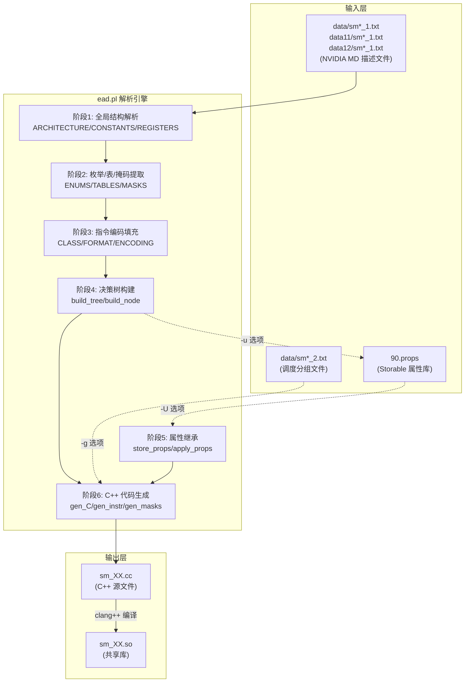
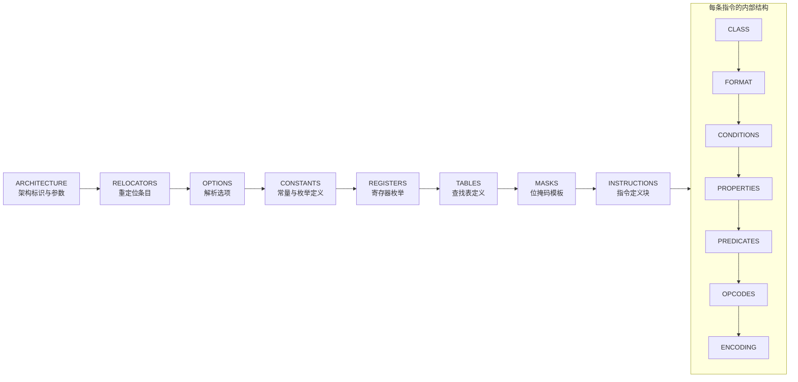
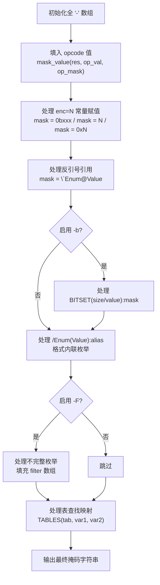
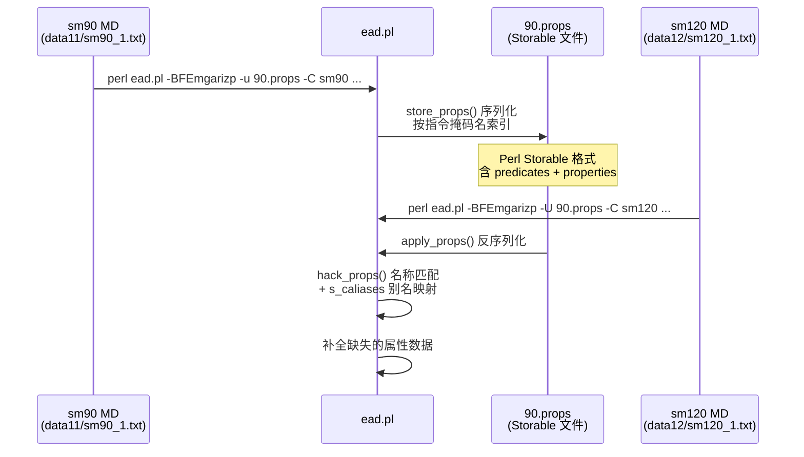

**ead.pl** 是整个 denvdis 工具链中的核心代码生成引擎——它读取 NVIDIA SASS 指令描述文件（MD 格式），通过多层语义解析与决策树构建，最终输出可直接编译为共享库的 C++ 源文件。生成的 `sm_XX.so` 为下游反汇编器 `nvd`、交互式汇编器 `ina` 等工具提供架构特定的指令解码能力。

## 架构全景：从描述文件到共享库的编译流水线

ead.pl 的核心任务是将 NVIDIA 驱动中提取的指令描述文本转化为可在运行时高效解码指令的二叉决策树。这一过程涉及六大阶段：**文件解析 → 枚举/掩码提取 → 指令编码生成 → 决策树构建 → 属性继承 → C++ 代码输出**。



Sources: [ead.pl](scripts/ead.pl#L1-L7), [Makefile](test/Makefile#L13-L17)

## 命令行接口与选项体系

ead.pl 使用 Perl 的 `Getopt::Std` 模块管理选项，各选项控制不同的处理管线阶段。以下表格列出最关键的选项组合及其用途：

| 选项 | 功能 | 影响阶段 |
|------|------|---------|
| `-C <suffix>` | 指定输出 C++ 文件后缀名（如 `sm75`），**启用代码生成模式** | 代码生成 |
| `-B` | 构建二叉决策树（与 `-m` 联合使用） | 决策树构建 |
| `-F` | 启用枚举过滤器（filter），处理不完整的枚举映射 | 编码填充 |
| `-E` | 生成双向枚举映射（正向 + 反向），供汇编解析使用 | 枚举导出 |
| `-m` | 生成编码掩码（mask），区分不同指令的位模式 | 掩码生成 |
| `-g` | 解析并生成调度分组表（scheduling groups） | 调度信息 |
| `-r` | 掩码值按逆序填充（从右到最低有效位） | 编码填充 |
| `-i` | 转储指令格式信息 | 调试输出 |
| `-a` | 添加指令别名（alternate） | 指令收集 |
| `-z` | 移除已完全填充的表模式 | 掩码去重 |
| `-p` | 解析谓词表达式 | 属性提取 |
| `-u <file>` | 将属性数据存储到文件（用于跨架构继承） | 属性存储 |
| `-U <file>` | 从文件加载属性并应用到当前架构 | 属性继承 |
| `-T <file>` | 测试模式：用二进制文件验证决策树 | 测试验证 |
| `-N` | 测试单个位掩码（从命令行） | 测试验证 |

在 `test/Makefile` 中，生产模式的典型调用组合为 `-BFEmgarizp`：

Sources: [ead.pl](scripts/ead.pl#L20-L49), [Makefile](test/Makefile#L13-L17)

## 输入格式：NVIDIA 指令描述文件结构

ead.pl 解析的输入文件（`sm_XX_1.txt`）源自 NVIDIA 驱动中的 SASS 指令定义，采用一种类似微架构描述语言（MD）的结构化文本格式。文件按固定顺序组织为多个段落：



### 全局头信息

文件开头的 `ARCHITECTURE` 块定义了架构名称、编码宽度等关键参数。ead.pl 通过 `ENCODING WIDTH` 字段确定指令编码的位宽（64 位或 128 位），该值决定了后续掩码解析的位串长度。`CONSTANTS` 段定义了全局枚举常量（如 `VQ_*` 虚拟队列标识），ead.pl 将其收集到内部哈希表中供后续引用。

Sources: [ead.pl](scripts/ead.pl#L5660-L5665), [sm75_1.txt](data/sm75_1.txt#L1-L10)

### MASKS 段：位掩码模板

MASKS 段定义了指令编码中各字段的位位置模板。每行格式为 `Name 'bit_pattern'`，其中 `bit_pattern` 是由 `0`、`1`、`.` 组成的定长字符串。`.` 表示该位是字段的有效位（variable），`0`/`1` 表示固定值。以 sm75 的 128 位编码为例：

```
Pred '.............................................................................................................XXX................'
Dest '........................................................................................................................XXXXXXXX'
RegA '................................................................................................................XXXXXXXX........'
```

ead.pl 的 `parse_mask` 函数将此模板解析为 `g_mnames` 和 `g_mmasks` 两个哈希表——前者以名称为键，后者以位模式字符串为键，两者共享同一个数组引用 `[name, pattern, bit_count, decode_list]`。其中 `decode_list` 是一个交替存储 `[start_index, length]` 的数组，描述了所有不连续的有效位段。

Sources: [ead.pl](scripts/ead.pl#L496-L548), [sm75_1.txt](data/sm75_1.txt#L8584-L8600)

### 指令定义块：CLASS → ENCODING

每个指令定义块以 `CLASS "name"` 开头，按状态机方式依次解析 FORMAT、CONDITIONS、PROPERTIES、PREDICATES、OPCODES 和 ENCODING 段。ead.pl 的主解析循环（`while($str = <$fh>)`）使用 `$state` 变量追踪当前所处段落，状态转移如下表：

| state 值 | 当前段落 | 触发条件 |
|-----------|---------|---------|
| 0 | 全局枚举/表解析 | 初始状态 |
| 1 | MASKS 解析 | `ENCODING WIDTH` 之后 |
| 2 | FORMAT 解析 | `CLASS` 之后 |
| 3 | OPCODES 解析 | `OPCODES` 关键字 |
| 4 | ENCODING 解析 | `ENCODING` 关键字 |
| 6 | 多行 FORMAT | FORMAT 行不以 `;` 结尾 |
| 7 | PROPERTIES | `PROPERTIES` 关键字 |
| 8 | PREDICATES | `PREDICATES` 关键字 |

Sources: [ead.pl](scripts/ead.pl#L5657-L5903)

### ENCODING 段的语义

ENCODING 段是每个指令块中最关键的部分，定义了指令各字段的实际编码规则。ead.pl 支持以下编码类型：

- **`!mask_name`**：否定编码（nenc），表示该掩码字段在此指令中不使用
- **`mask = Opcode`**：将该掩码标记为 opcode 字段
- **`mask = \`EnumName@Value`**：引用枚举常量，如 `` `Register@RZ ``
- **`mask = 0bxxx`**：直接二进制值填充
- **`mask = *EnumName`**：通配符引用，表示该字段值由 EnumName 枚举决定
- **`mask = Table(var1, var2)`**：查找表映射，字段值由表和变量组合决定
- **`mask = ConstBankAddress(...)`**：常量银行地址编码

Sources: [ead.pl](scripts/ead.pl#L5900-L5960)

## 核心算法：编码掩码生成与指令去重

`gen_inst_mask` 函数是编码生成的核心——它为每条指令构建完整的位模式字符串。算法从全 `-`（不确定位）数组开始，依次填充 opcode 值、枚举常量值、查找表映射值和直接二进制值：



### 指令去重策略

ead.pl 通过 `%g_masks` 哈希表实现指令去重——键为完整的位模式掩码字符串，值为共享相同掩码的指令数组。在 `insert_mask` 函数中，如果新指令的掩码已存在，则追加到同一数组；同时统计 `g_dups`（重复数）和 `g_diff_names`（不同名称数）。这一设计允许将多个语义不同但编码结构相同的指令（如同一操作码的不同管道版本）合并到决策树的同一叶节点。

Sources: [ead.pl](scripts/ead.pl#L965-L1136), [ead.pl](scripts/ead.pl#L2215-L2265)

## 二叉决策树：快速指令解码

当使用 `-B` 选项时，ead.pl 构建一棵**二叉决策树**用于运行时指令解码。树的每个内部节点测试指令编码中的一个特定位，叶节点包含匹配该路径的所有指令列表。

### 树构建算法

`build_tree` 函数首先统计所有掩码中每个位位置的 `0`/`1`/`X`（变量位）分布，排除所有掩码共享相同值的位（全 0、全 1 或全 X），得到初始掩码。然后调用 `build_node` 递归构建：

**`build_node` 算法核心逻辑**：

1. 对剩余掩码集合中每个未使用的位位置，统计 0/1 计数
2. 选择**区分度最优**的位——即 min(count_0, count_1) / total 最大的位置
3. 按该位将掩码分为三组：`left`（该位=0）、`right`（该位=1）、`both`（该位=X）
4. 将 `both` 组分别合并到 `left` 和 `right`，递归构建子树
5. 如果当前掩码已与累积模式完全匹配（`cmpa_mask` 返回真），放入节点自身列表
6. 如果无法找到有效分割位，将所有剩余掩码作为叶节点

决策树的生成策略确保了**最佳的位级区分**——每次分割优先选择将掩码集合划分得最均匀的位，从而最小化树深度。最终树的统计信息（节点数、叶节点数、最大深度）在标准错误输出中报告。

Sources: [ead.pl](scripts/ead.pl#L2296-L2443)

### 树遍历与指令匹配

运行时解码使用 `find_in_dectree` 函数：从根节点开始，按当前指令编码字的对应位值选择左/右分支，沿途收集节点自身列表中的掩码名，最终到达叶节点后合并候选指令集。在 C++ 生成代码中，该树被编码为 `NV_non_leaf` / `NV_bt_node` 结构的静态常量链。

Sources: [ead.pl](scripts/ead.pl#L2446-L2466), [nv_types.h](scripts/include/nv_types.h#L287-L298)

## C++ 代码生成架构

`gen_C` 函数是代码生成的总调度器。它将所有解析结果输出为一个自包含的 `.cc` 文件，该文件 `#include "include/nv_types.h"` 并通过 `get_sm()` 导出 C 链接接口。

### 生成文件结构

```cpp
// sm75.cc 的逻辑结构（示意）
#include "include/nv_types.h"

// 1. 虚拟队列枚举与名称表
enum sm75_vq { VQ_ADU = 0, VQ_FMA64 = 1, ... };
static const char *vq_names[] = { ... };
const char *get_vq_name(int idx) { ... }

// 2. 掩码定义 - 位位置对 (start, length)
NV_MASK(sm75_mask_Dest, 1) = { {120, 8} };
NV_MASK(sm75_mask_RegA, 1) = { {112, 8} };

// 3. 枚举映射 - 值到名称
NV_ENUM(sm75_enum_AtomsOp) = { {0, "ADD"}, {1, "MIN"}, ... };
// 反向映射 - 名称到值（-E 选项）
NV_RENUM(sm75_renum_AtomsOp) = { {"ADD", 0}, {"MIN", 1}, ... };

// 4. 查找表
static const unsigned short s_0_CIntSize[] = { 1, 8 };
NV_TAB(sm75_tab_CIntSize) = { {0, s_0_CIntSize}, ... };

// 5. 指令结构
static const struct nv_instr sm75_0 = {
  "mask_string",          // 位模式掩码
  "atom__RaRZ",           // CLASS 名称
  "ATOM",                 // 操作码名称
  8650,                   // 行号（调试用）
  0,                      // 序号
  0, 0,                   // alt, setp
  88,                     // 有效位数
  ...                     // 属性/过滤器/提取器/字段
};

// 6. 渲染函数表
NV_one_render ins_render[1118] = { { fill_rend_0 }, { fill_rend_1 }, ... };

// 7. 二叉决策树
static const NV_bt_node leaf_0 = { 0x10000, { &sm75_0, &sm75_1, } };
static const NV_non_leaf node_1 = { 56, { &sm75_42, }, &leaf_0, &leaf_2 };

// 8. 按名称排序的指令索引
static const NV_sorted sm75_sorted = { {"ATOM", {&sm75_0,}}, ... };

// 9. 导出接口
INV_disasm *get_sm() {
  return new NV_disasm<nv128>(&node_N, 255, 1118, &sm75_sorted, renums, dotted);
}
```

### 关键生成子函数

| 函数 | 职责 | 输出内容 |
|------|------|---------|
| `gen_vq` | 虚拟队列数据 | `enum` + 名称数组 + `get_vq_name()` |
| `gen_masks` | 位掩码定义 | `NV_MASK` 静态常量 |
| `gen_enums` | 枚举映射 | `NV_ENUM` / `NV_RENUM` 哈希表 |
| `gen_tabs` | 查找表 | `NV_TAB` 静态数组 |
| `gen_instr` | 指令结构体 | `nv_instr` 完整定义 |
| `gen_ae` | 枚举属性描述 | `nv_eattr` 结构 |
| `gen_filter` | 指令过滤器 | C++ lambda 函数 |
| `gen_extr` | 字段提取器 | C++ lambda 函数 |
| `gen_render` | 渲染函数 | 格式化输出回调 |
| `gen_preds` | 谓词函数 | C++ 谓词表达式 |
| `gen_prop` | 属性表 | `NV_Props` 列表 |
| `traverse_btree` | 决策树序列化 | `NV_non_leaf` / `NV_bt_node` |

每个指令（`nv_instr`）结构包含完整的解码元数据：掩码字符串、CLASS 名、操作码名、行号、过滤器函数指针、字段提取函数指针、枚举属性列表、渲染回调以及用于二进制补丁的字段定义。过滤器函数用于区分共享相同掩码前缀但具体字段值不同的指令——它通过 `nv_filter` 类型（一个接受位提取回调的函数指针）实现运行时多态匹配。

Sources: [ead.pl](scripts/ead.pl#L3392-L3572), [nv_types.h](scripts/include/nv_types.h#L216-L285)

## 属性继承机制：跨架构知识迁移

NVIDIA 从 CUDA 12.7-12.8 开始在 MD 文件中移除了 `OPERATION PROPERTIES` 段，导致 sm90 之后的架构（sm100-sm120）缺少完整的操作属性数据。ead.pl 通过 `-u`/`-U` 选项实现了属性跨架构继承：



### `store_props` 函数

当使用 `-u file` 选项时，`store_props` 在决策树构建完成后被调用。它遍历 `%g_masks` 中所有指令，以指令掩码名（即填充后的位模式字符串）为键，将每条指令的谓词和属性数据存储为 Perl Storable 格式文件。

### `apply_props` 函数

当使用 `-U file` 选项时，`apply_props` 加载之前存储的属性文件，并通过 `hack_props` 函数尝试将属性映射到当前架构的指令。由于不同 SM 版本的指令 CLASS 名称可能存在差异（如 `fadd2_imm__RRI` → `fadd__RRI_RI`），`hack_props` 使用 `%s_caliases` 别名映射表和一系列启发式规则（去除 `_64`、`_nopred`、`_reliability` 等后缀）进行模糊匹配。

Sources: [ead.pl](scripts/ead.pl#L4611-L4638), [ead.pl](scripts/ead.pl#L4640-L4668), [ead.pl](scripts/ead.pl#L4980-L5060), [Makefile](test/Makefile#L146-L161)

## 构建系统集成

`test/Makefile` 定义了完整的构建管线。每个 SM 架构的构建分两步：

1. **代码生成**：通过 `perl ead.pl` 从 MD 文件生成 `.cc` 源文件
2. **编译链接**：通过 `clang++` 编译为位置无关的共享库 `.so`

### 架构与数据源的映射

| 数据目录 | 覆盖架构 | 特殊处理 |
|---------|---------|---------|
| `data/` | sm2, sm3, sm4, sm5 | sm2 使用 `-BFEmrizp`（不含 `-a` 和 `-g`） |
| `data11/` | sm52, sm55, sm57, sm70, sm72, sm75, sm80, sm86, sm89, sm90 | sm90 额外生成 `90.props` |
| `data12/` | sm75, sm80, sm86, sm89, sm90, sm100, sm101, sm103, sm120 | sm100+ 通过 `-U 90.props` 继承属性 |

共享库使用 `-shared -fpic -pthread` 编译，导出 `get_sm()` C 函数接口，返回 `INV_disasm*` 多态指针。下游工具通过 `dlopen` 动态加载对应架构的 `.so` 文件来获取解码能力。

Sources: [Makefile](test/Makefile#L52-L161)

## 编码宽度与特殊格式处理

ead.pl 通过 `WORD_SIZE` 参数（在 MD 文件的 `ARCHITECTURE` 段中）确定基本字宽，再通过 `ENCODING WIDTH` 确定指令编码总位宽。两种主要编码格式为：

**64 位编码**（sm2-sm5）：每条指令占 8 字节，使用 `bit_array` 函数将原始字节序转换为位数组。

**128 位编码**（sm52+）：每条指令占 16 字节，使用 `conv2a` 函数处理双 quad-word 的端序转换。对于 sm5 的 **88 位编码**，使用 `martian88` 函数处理一种特殊格式——前 64 位是 3 条指令共享的控制字，包含 3 个 17 位的调度信息（`usched_info`），每 3 条指令为一组复用该控制字。

Sources: [ead.pl](scripts/ead.pl#L718-L787), [ead.pl](scripts/ead.pl#L789-L813)

## 决策树统计与演进

ead.pl 在源代码注释中保留了不同 SM 架构上决策树构建的统计演进数据，反映了编码填充策略的逐步优化：

```
#                          sm3  sm4  sm5  sm57  sm72  sm75  sm100  sm101  sm120
# total(初始)              279  261  321   363   365   681
# + encoded=* const       330  310  374   415   538  1010    992    927  1016
# + enums                 340  364  369   405   535  1024   1007    935  1054
# + ZeroRegister(RZ)      359  383  393   430   570  1064   1036    964  1083
# + single enums(-F)      365  389  422   464   602  1110   1118   1041  1165
# duplicated(最终)          84   86  125   124     7    19     20     20    27
```

这些数据揭示了关键趋势：随着架构演进，指令总数从 sm3 的 279 条增长到 sm120 的 1165 条，但通过逐层去重（从 113 降到 27），最终决策树的冗余叶节点被有效压缩。

Sources: [ead.pl](scripts/ead.pl#L5886-L5910)

## 下一步阅读

- [SASS 指令描述文件格式与架构数据目录（data/data11/data12）](5-sass-zhi-ling-miao-shu-wen-jian-ge-shi-yu-jia-gou-shu-ju-mu-lu-data-data11-data12) — 了解 ead.pl 输入文件的完整格式规范
- [nvd 反汇编器架构与 ELF/CUBIN 解析](8-nvd-fan-hui-bian-qi-jia-gou-yu-elf-cubin-jie-xi) — 了解 `sm_XX.so` 共享库如何被下游反汇编器消费
- [GPU 架构演进：从 Fermi（sm_2）到 Blackwell（sm_120）的支持矩阵](23-gpu-jia-gou-yan-jin-cong-fermi-sm_2-dao-blackwell-sm_120-de-zhi-chi-ju-zhen) — 全架构支持矩阵与属性继承的上下文
- [ina 交互式 SASS 汇编器：指令表单过滤与编码](12-ina-jiao-hu-shi-sass-hui-bian-qi-zhi-ling-biao-dan-guo-lu-yu-bian-ma) — 了解生成的共享库在交互式环境中的使用方式