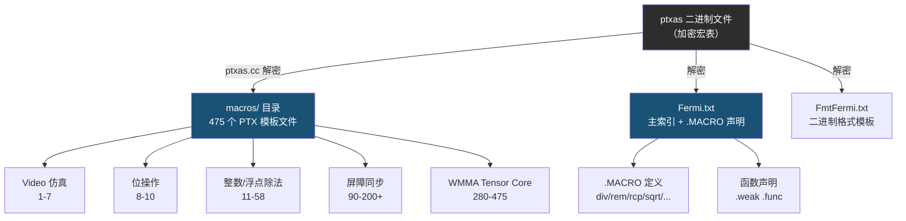

`macros/` 目录是整个项目中信息密度最高的数据集之一——它包含了从 NVIDIA **ptxas** 汇编器二进制中解密提取的 **475 个独立 PTX 宏模板文件**，以及一份 1424 行的主索引文件和一份二进制格式模板。这些文件以 `.version ${PTX_MAJOR_VERSION}.${PTX_MINOR_VERSION}` / `.target ${GPU_ARCH}` 为通用头部，使用 `${VARIABLE}` 占位符和 `.IF/.ELIF/.ELSE/.ENDIF` 条件编译伪指令，构成了 CUDA 编译器在 PTX→SASS 代码生成阶段所依赖的**全部内置函数（intrinsic）实现**。

Sources: [1.txt](macros/1.txt#L1-L30), [Fermi.txt](macros/Fermi.txt#L1-L10)

## 提取原理：ptxas 加密宏表的解密

`macros/` 目录的内容并非来自 CUDA 官方文档，而是通过 [ptxas.cc](ptxas.cc) 工具从 ptxas 二进制中**逆向提取**获得。ptxas 内部使用了一种自定义流密码对宏模板库进行混淆保护——工具中的 `decrypt()` 函数实现了解密逻辑：以 64 个 32 位种子值为盐表（salt），结合线性同余伪随机数生成器（`v3 = 1103515245 * ctx->wtf + 0x3039`），对密文逐字节执行 `salt[plaintext ^ feedback] ^ prng_output` 的异或运算。每个宏模板在 ptxas ELF 中都有独立的偏移和大小记录，通过 `one_md` 结构体表定位并批量解密输出。

Sources: [ptxas.cc](ptxas.cc#L1-L81), [ptxas.cc](ptxas.cc#L86-L113)

```
// 解密上下文与核心算法
struct decr_ctx {
    _DWORD wtf;    // PRNG 状态
    _DWORD seed;   // 移位寄存器
    _DWORD res;    // 字节计数器
    _BYTE l;       // 反馈字节
};

// each macro's location in ptxas binary
struct one_md {
    size_t off, size;
    const char *name;   // → "1", "2", ... "475", "Fermi", "FmtFermi"
};
```

Sources: [ptxas.cc](ptxas.cc#L29-L89), [ptxas.cc](ptxas.cc#L570-L598)

## 目录结构与文件分类

`macros/` 包含 477 个文件，按功能可划分为以下六大类别。下表总结了各类别的文件编号范围、典型函数命名模式和核心用途：

| 类别 | 文件编号 | 函数命名模式 | 核心用途 |
|------|----------|-------------|----------|
| **Video 指令仿真** | 1–7 | `__cuda_scalar_video_emulation_*` | `vadd`/`vsub`/`vmin`/`vmax` 等 SIMD 视频 instruction 的 PTX 软件仿真 |
| **位操作内置函数** | 8–10 | `__cuda_sm20_bfe/bfi_*` | 64 位 `bfe`（位域提取）、`bfi`（位域插入）在 32 位架构上的仿真 |
| **整数除法/取余** | 11–31, 60 | `__cuda_sm20_div/rem_*` | `s16`/`u16`/`s64`/`u64` 的软件除法与取余，含 `f32`/`f64` 多种舍入模式 |
| **浮点倒数与平方根** | 40–58 | `__cuda_sm20_rcp/sqrt_*` | IEEE 754 合规的 `rcp`（倒数）、`sqrt`（平方根），含 `rn`/`rd`/`ru`/`rz` 及 `ftz` 变体 |
| **屏障同步原语** | 90–200+ | `__cuda_sm70_barrier_*` | Volta 架构引入的 `barrier.sync`/`arrive`/`red` 操作，含 0–15 编号的特化版本 |
| **WMMA 矩阵乘加速** | 280–475 | `__cuda_sm70_wmma_*` | `wmma m16n16k16`/`m32n8k16`/`m8n32k16` 的 `load`/`store`/`mma` 全套 PTX 封装 |

Sources: [1.txt](macros/1.txt#L1-L3), [8.txt](macros/8.txt#L1-L8), [30.txt](macros/30.txt#L1-L10), [40.txt](macros/40.txt#L1-L10), [100.txt](macros/100.txt#L1-L4), [300.txt](macros/300.txt#L1-L4)

## Video 指令仿真模板（文件 1–7）

PTX 的 video 指令（如 `vadd`、`vsub`、`vabsdiff` 等）允许在 32 位寄存器上执行并行的子字 SIMD 运算。当目标架构不支持这些指令时，ptxas 通过一组仿真函数实现相同语义。文件 1–4 实现了**操作数提取与符号扩展**（`operandExtractAndSignExtend`），通过 `prmt.b32` 置换指令和 `.IF` 条件编译，根据 `%{VIDEOSELECTORij}` 占位符的值（`.b0`–`.b3` 选字节、`.h0`–`.h1` 选半字）决定 `cvt` 转换路径；文件 5 实现**可选合并**（`optionalMerge32`），文件 6 实现**饱和截断**（`saturate64`），文件 7 实现**后处理操作**（`secondOp64`，支持 `.add`/`.min`/`.max`）。

```ptx
// 文件 1: 操作数提取 — 根据 VIDEOSELECTOR 决定符号扩展路径
.IF "%{TYPES0}" == ".s32"
    .IF "%{VIDEOSELECTOR11}" == ".b0" || "%{VIDEOSELECTOR11}" == ".b1"
        cvt.s64.s8 res, op;          // 字节 → 64 位有符号
    .ELIF "%{VIDEOSELECTOR11}" == ".h0" || "%{VIDEOSELECTOR11}" == ".h1"
        cvt.s64.s16 res, op;         // 半字 → 64 位有符号
    .ELSE
        cvt.s64.s32 res, op;         // 整字 → 64 位有符号
    .ENDIF
.ELSE
    // 无符号路径，使用 cvt.s64.u8/u16/u32
.ENDIF
```

Sources: [1.txt](macros/1.txt#L1-L30), [5.txt](macros/5.txt#L1-L14), [6.txt](macros/6.txt#L1-L36), [7.txt](macros/7.txt#L1-L27)

## 软件浮点除法与 IEEE 754 合规（文件 11–25）

CUDA 硬件的 `div.f32`/`div.f64` 仅提供近似精度。要达到 IEEE 754 标准的**四种舍入模式**（`rn` 向偶、`rd` 向负无穷、`ru` 向正无穷、`rz` 向零），ptxas 依赖一套复杂的多路径软件实现。每个除法函数通常包含：**快速路径**（利用 `rcp.approx` + Newton-Raphson 迭代链，约 4–5 轮 `fma.rn`），以及**慢速路径**（slowpath，处理非规格化数、NaN、Inf 等边界条件，长达 150–220 条指令）。文件 20 是典型的 `div.rn.noftz.f32` 慢速路径实现——通过位操作提取指数域，检测异常值，执行尺度化后再做精确迭代。

Sources: [20.txt](macros/20.txt#L1-L42), [15.txt](macros/15.txt#L1-L34), [13.txt](macros/13.txt#L1-L66)

SM3x 架构引入了更高效的 `div.rn.f32` 快速路径（文件 80），其核心是 `_checkfp.divide.f32` 谓词检测：当操作数落入正常范围时直接执行精简的 4 轮迭代，仅当谓词为真时才 `call` 到慢速路径，大幅减少了常见情况的开销。

Sources: [80.txt](macros/80.txt#L1-L34)

## 整数 64 位除法的纯 PTX 实现（文件 30）

文件 30 的 `__cuda_sm20_div_u64` 是一个完整的 64 位无符号整数除法 PTX 实现。由于早期 GPU 缺少 64 位硬件除法指令，该函数通过**32 位分块乘法**（将 64 位操作拆为 `{alo,ahi}` × `{blo,bhi}` 的四个 `mul.lo/mul.hi` + `mad.lo/mad.cc` 操作）计算商的近似值，再通过两轮 Newton-Raphson 精化与余数修正得到精确结果。这种实现方式也是理解 GPU 指令集如何用 32 位运算构建 64 位算术的绝佳范例。

Sources: [30.txt](macros/30.txt#L1-L135)

## 屏障同步原语的模板展开（文件 90–200+）

从 Volta（sm_70）架构开始，CUDA 引入了 `barrier.sync`、`barrier.arrive`、`barrier.red` 等新型屏障原语。ptxas 为每个屏障编号（0–15）和每个操作组合**预生成了特化的 PTX 函数**，形成一个庞大的函数族。以文件 100 为例：

```ptx
.weak .func (.reg .b32 dst) __cuda_sm70_barrier_arrive_2 ()
    { _warpsync 0xffffffff; \barrier.arrive 2; mov.b32 dst, 0; ret; }
```

这类函数体极短（通常 3–4 行），核心操作就是 `_warpsync 0xffffffff` 加一条 `\barrier` 伪指令。但为 16 个屏障编号 × `sync`/`arrive`/`red.popc`/`red.or`/`red.and` × 有无 `count` 参数 = **数百个排列组合**，ptxas 将它们全部预编译为独立函数。这种展开策略消除了运行时的屏障编号分发开销。

Sources: [100.txt](macros/100.txt#L1-L4), [200.txt](macros/200.txt#L1-L4), [Fermi.txt](macros/Fermi.txt#L436-L580)

## WMMA 矩阵乘加速的 PTX 封装（文件 280–475）

WMMA（Warp Matrix Multiply-Accumulate）是 Volta 架构引入的 Tensor Core 编程接口。文件 280–475 覆盖了三种矩阵维度（`m16n16k16`、`m32n8k16`、`m8n32k16`）的完整操作链：**矩阵加载**（`load_a`/`load_b`/`load_c`，支持 `row`/`col` 布局和 `global`/`shared` 内存空间）、**矩阵乘累加**（`mma`，支持 `f16`/`f32` 累加数据类型）、**结果存储**（`store_d`）。每个函数都以 `_warpsync 0xFFFFFFFF` 开头，确保 warp 内所有线程同步执行 Tensor Core 操作。

Sources: [300.txt](macros/300.txt#L1-L4), [350.txt](macros/350.txt#L1-L4), [400.txt](macros/400.txt#L1-L4), [475.txt](macros/475.txt#L1-L4)

## 主索引文件：Fermi.txt 的双层结构

[Fermi.txt](macros/Fermi.txt)（1424 行）是宏模板系统的**主索引与声明文件**，它由两个逻辑层组成：

**第一层：函数声明区**（第 1–208 行）。以 `.IF "${GPU_ARCH}" .in "sm_20 sm_21 ... sm_75 sm_82"` 架构守卫开头，按功能分组列出所有 `.weak .func` 声明。每组函数之后紧跟对应的 `.MACRO` 定义（空宏体，仅用于在 PTX 源码中作为指令别名识别）。关键宏包括 `div`、`rem`、`rcp`、`sqrt`、`rsqrt`、`ex2`、`lg2`、`bfe`、`bfi`、`clz`、`popc`、`shfl`、`vote`、`match`，以及 video 指令族（`vadd`/`vsub`/`vmin`/`vmax`/`vabsdiff`/`vshl`/`vshr`/`vset`/`vmad` 及其 `vadd2`/`vadd4` 分组变体）。

**第二层：WMMA 函数声明区**（第 715–1424 行）。以 `.FORCE_INLINE .func` 声明了所有 WMMA `update_ptr` 辅助函数和完整的 `load`/`mma`/`store` 操作签名，覆盖了 sub-byte（`m8n8k32`、`m8n8k128`）和标准维度（`m16n16k16`、`m32n8k16`、`m8n32k16`）的 row/col × global/shared 全排列。

Sources: [Fermi.txt](macros/Fermi.txt#L1-L100), [Fermi.txt](macros/Fermi.txt#L208-L280), [Fermi.txt](macros/Fermi.txt#L715-L800)

## macros12/ 目录：CUDA 12 汇编器元数据

与 `macros/` 平行的 [macros12/](macros12/) 目录包含 4 个从 **CUDA 12 版本 ptxas** 中提取的元数据文件，它们记录了新一代架构的汇编器配置信息：

| 文件 | 内容 | 行数 | 说明 |
|------|------|------|------|
| `c1.txt` | SASS 操作码表 | 645 | 以十六进制偏移为键，记录每个 SASS 指令的助记符和子操作数数量 |
| `c2.txt` | 扩展操作码表 | 1511 | 更细粒度的指令变体表，含 BMMA/DMMA/WMMA 等张量指令的多维编码 |
| `c4.txt` | 调度器参数表 | 7605 | 名为 `AdvancedSB*` 的调度启发式参数，控制指令调度器的行为 |
| `c5.txt` | 编译器标志表 | 753 | ptxas 内部编译选项（如 `BuildCFG`、`DisableDepbar`、`DumpIR`）的名称、长度和默认值 |

`c1.txt` 的条目格式为 `offset: MNEMONIC` 后跟 `offset+8: subop_count`，例如 `0: ERRBAR` / `8: 6` 表示 `ERRBAR` 指令在偏移 0x00 处，有 6 个子操作数定义。`c4.txt` 的调度参数（如 `AdvancedSBCrossBlock`、`AdvancedSBDepbarBackedge`）揭示了 ptxas 内部指令调度算法的 knobs 体系——这些参数名称本身就是理解 GPU 指令调度器设计哲学的宝贵线索。

Sources: [c1.txt](macros12/c1.txt#L1-L40), [c2.txt](macros12/c2.txt#L1-L40), [c4.txt](macros12/c4.txt#L1-L50), [c5.txt](macros12/c5.txt#L1-L40)

## 宏模板系统的架构意义



宏模板系统揭示了 CUDA 编译流程中一个关键事实：**PTX 并非纯粹的目标无关中间表示**。当 ptxas 将 PTX 编译为 SASS 时，它会根据目标架构的硬件能力，将 PTX 中的高级操作（如 `div.rn.f64`）展开为对应的软件实现序列。宏模板正是这个展开过程的"源码模板"——通过 `${VARIABLE}` 替换和条件编译，同一套模板可以适配从 Fermi（sm_20）到 Blackwell（sm_120）的全部架构。对于逆向工程而言，这些模板提供了一个精确的 PTX→SASS 映射参考，使得从 SASS 二进制反推原始 PTX 语义成为可能。

Sources: [ptxas.cc](ptxas.cc#L570-L598), [Fermi.txt](macros/Fermi.txt#L1-L10)

## 阅读建议

- 若需理解 **ptxas 加密解密的完整技术细节**，参阅 [ptxas 加密表提取（de_ptx）与 CUPTI 回调分析](17-ptxas-jia-mi-biao-ti-qu-de_ptx-yu-cupti-hui-diao-fen-xi)
- 若需探索 **SASS 指令编码与操作码表**的关系，参阅 [SASS 指令编码字段与掩码机制](9-sass-zhi-ling-bian-ma-zi-duan-yu-yan-ma-ji-zhi) 和 [SASS 指令描述文件格式与架构数据目录（data/data11/data12）](5-sass-zhi-ling-miao-shu-wen-jian-ge-shi-yu-jia-gou-shu-ju-mu-lu-data-data11-data12)
- 若需了解这些宏模板生成的 **SASS 代码如何在反汇编器中呈现**，参阅 [nvd 反汇编器架构与 ELF/CUBIN 解析](8-nvd-fan-hui-bian-qi-jia-gou-yu-elf-cubin-jie-xi)