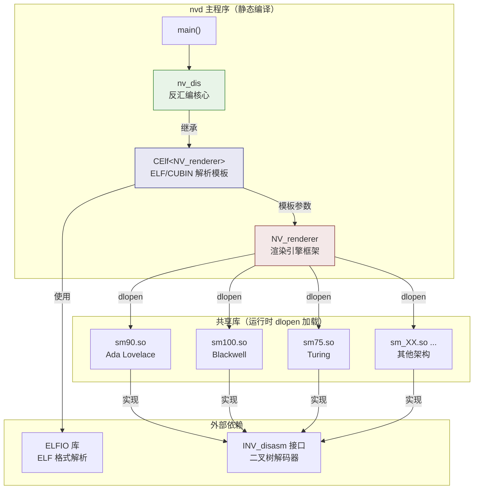
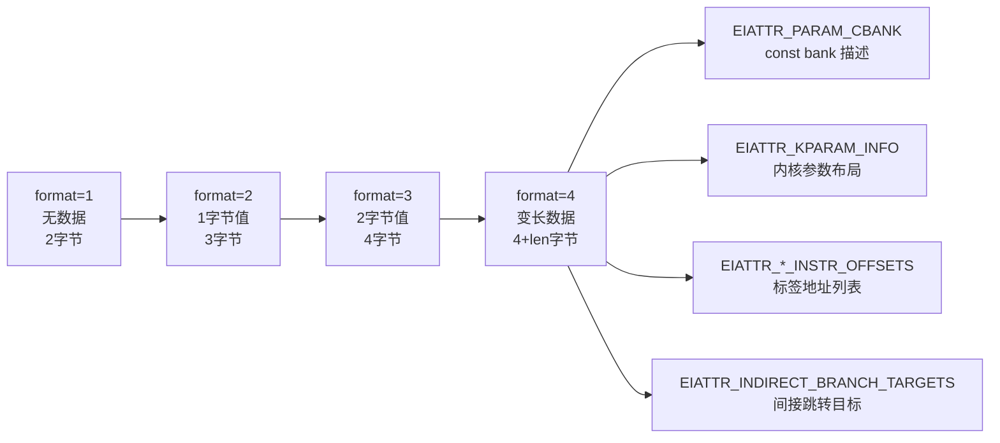
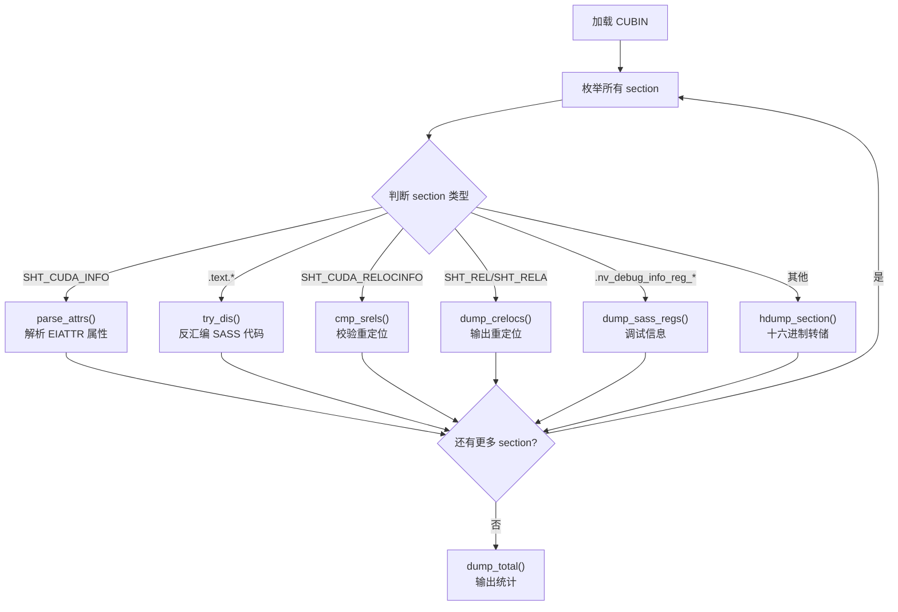

**nvd** 是本工具集中最核心的 SASS（Streaming Assembler）反汇编器，负责将 NVIDIA CUBIN 二进制文件中的机器码还原为人类可读的指令文本。它集成了 ELF 容器解析、GPU 架构自动检测、指令掩码匹配与渲染模板系统，形成一个从二进制到结构化 SASS 输出的完整流水线。本文将从顶层架构到关键实现细节，逐层剖析 nvd 的设计哲学与运作机制。

## 整体架构概览

nvd 的代码组织采用 **模板组合 + 动态加载** 的混合策略：静态编译的框架代码通过 CRTP（Curiously Recurring Template Pattern）继承体系构建核心逻辑，而每代 GPU 架构的指令表和编码规则则以 `sm_XX.so` 共享库的形式在运行时按需加载。这种设计使得新增架构支持时只需生成新的 `.so` 文件，无需重新编译 nvd 本体。

Sources: [nvd.cc](test/nvd.cc#L902-L951), [celf.h](test/celf.h#L26-L62), [nv_rend.cc](test/nv_rend.cc#L550-L573)

## 核心类继承体系

nvd 的类层次结构体现了精巧的职责分离：**`nv_dis`** 作为最终实现类，通过模板 **`CElf<NV_renderer>`** 同时获得 ELF 解析能力和渲染引擎功能。这个设计让 ELF 处理逻辑完全保持在模板基类中，而 `nv_dis` 专注于反汇编流程的控制和输出格式化。

| 类名 | 角色 | 关键职责 |
|------|------|----------|
| `nv_dis` | 反汇编器主类 | 控制反汇编流程、管理符号表/分支/const bank、格式化输出 |
| `CElf<NV_renderer>` | ELF 桥接模板 | CUBIN 文件加载、section 遍历、重定位处理、符号读取 |
| `NV_renderer` | 渲染引擎基类 | 加载 sm_XX.so、指令渲染、延迟计算、寄存器追踪 |
| `INV_disasm` | 解码器接口（纯虚） | 指令解码、位操作、控制字管理 |
| `NV_disasm<T>` | 解码器模板实现 | 二叉树遍历解码、字段提取、mask 校验 |

Sources: [nvd.cc](test/nvd.cc#L116-L232), [celf.h](test/celf.h#L26-L62), [nv_rend.h](test/nv_rend.h#L311-L319), [nv_types.h](scripts/include/nv_types.h#L1192-L1218)

## CUBIN 文件加载与 SM 架构检测

### ELF 验证流程

CUBIN 文件本质上是 NVIDIA 定制的 ELF 格式。`CElf::open()` 方法通过三重校验确认文件合法性：首先调用 `elfio::load()` 加载文件内容，然后验证 ELF machine 字段是否为 `190`（NVIDIA GPU 标识），最后从 ELF flags 中提取目标 SM 版本号。

SM 版本的提取逻辑采用了**双位移回退策略**——先尝试从 flags 的高 8 位（`>> 0x10`）读取，若为零则回退到次高 8 位（`>> 8`）。这一设计兼容了不同 CUDA 版本的 CUBIN 格式差异。

Sources: [celf.h](test/celf.h#L29-L46)

### SM 版本映射表

提取到 SM 编号后，nvd 在内置的 `s_sms` 映射表中查找对应的共享库名称。该映射表覆盖了从 Fermi（sm_2）到 Blackwell（sm_120）的完整 GPU 架构谱系，每条记录包含主名称和可选的兼容回退名称：

| SM 编码 | 架构名称 | 共享库 | 回退库 |
|---------|----------|--------|--------|
| 0x14 | sm_2 (Fermi) | sm2 | — |
| 0x32 | sm_50 (Maxwell) | sm50 | — |
| 0x4b | sm_75 (Turing) | sm75 | — |
| 0x50 | sm_80 (Ampere) | sm80 | — |
| 0x5a | sm_90 (Ada/Hopper) | sm90 | — |
| 0x64 | sm_100 (Blackwell) | sm100 | — |
| 0x78 | sm_120 (下一代) | sm120 | — |

回退机制意味着当某架构缺少独立的共享库时，可以复用相近架构的指令编码表。例如 sm_87 可以回退到 sm86，sm_35 回退到 sm4。

Sources: [nv_rend.cc](test/nv_rend.cc#L56-L82)

### 动态库加载

确定库名后，`NV_renderer::load()` 通过 `dlopen()` 加载对应的 `sm_XX.so`，然后解析两个关键符号：**`get_sm()`** 返回 `INV_disasm` 解码器实例（包含该架构的完整指令树和编码规则），**`get_vq_name()`** 返回枚举值名称查询函数。加载成功后，渲染引擎自动根据解码器的 `width()` 值设置块掩码（block_mask），用于后续指令对齐处理。

Sources: [nv_rend.cc](test/nv_rend.cc#L550-L573)

## CUBIN Section 类型与属性解析

### CUDA 专用 Section 类型

NVIDIA 在标准 ELF 基础上扩展了大量 CUDA 专用 section 类型，nvd 内置了完整的类型名称映射表。下表列出主要的 section 类型及其用途：

| Section 类型 | 名称 | 用途 |
|-------------|------|------|
| 0x70000000 | SHT_CUDA_INFO | 内核属性信息（寄存器数、栈大小等） |
| 0x70000004 | SHT_CUDA_METADATA | 元数据 |
| 0x70000006 | SHT_CUDA_CONSTANT | 常量内存 bank 0 |
| 0x7000000A | SHT_CUDA_SHARED | 共享内存 |
| 0x7000000B | SHT_CUDA_RELOCINFO | 重定位校验信息 |
| 0x7000000E | SHT_CUDA_UFT | 统一函数表 |
| 0x70000016 | SHT_CUDA_CAPMERC | Mercury 能力描述 |

对于 `.text.*` 前缀的 section，nvd 将其识别为 SASS 代码段并启动反汇编流程；对于 `SHT_CUDA_INFO` 类型，则解析其中的 EIATTR 属性记录。

Sources: [nvd.cc](test/nvd.cc#L25-L74), [nvd.cc](test/nvd.cc#L813-L877)

### EIATTR 属性解析

`_parse_attrs()` 方法是 nvd 理解 CUBIN 元数据的核心。它逐条读取属性记录，每条记录由**格式字节**和**属性字节**组成，支持四种格式变体：

**关键属性解析逻辑**：

- **EIATTR_PARAM_CBANK (0x0A)**：解析常量内存 bank 的 section 索引、偏移和大小，构建 `cbank_per_section` 结构用于后续指令中的 `c[bank][offset]` 解析。
- **EIATTR_KPARAM_INFO (0x17)**：解析内核参数的索引、序号、偏移、对齐和大小信息，识别参数是否属于 const bank。
- **EIATTR_INDIRECT_BRANCH_TARGETS (0x34)**：解析间接跳转目标表，每条记录包含跳转源地址和目标标签列表，这些信息用于在反汇编输出中标注分支目标。

其余 `EIATTR_*_INSTR_OFFSETS` 类属性（如 `EXIT_INSTR_OFFSETS`、`COOP_GROUP_INSTR_OFFSETS` 等）则以统一的 4 字节偏移列表形式解析，填充到 `NV_labels` 映射中，为每条指令标记其语义类别。

Sources: [nvd.cc](test/nvd.cc#L597-L720)

## 反汇编主流程

### process()：Section 枚举与分发

`nv_dis::process()` 是整个反汇编的入口。它首先读取所有 section 的元信息，按需加载符号表和重定位信息，然后逐一遍历每个 section：

对于 `.text.*` section，nvd 调用 `m_dis->init()` 初始化解码器的缓冲区指针，然后进入 `try_dis()` 执行逐条指令的反汇编循环。

Sources: [nvd.cc](test/nvd.cc#L813-L877)

### try_dis()：逐指令解码循环

`try_dis()` 是反汇编的核心循环。每次迭代调用 `m_dis->get()` 获取一条（或多条候选）指令的解码结果，然后执行一系列后处理：

1. **标签检查**：在已收集的 `NV_labels` 中查找当前偏移是否对应某个语义标签（如 `WARP_WIDE_INSTR`、`EXIT_INSTR` 等），若是则输出标签行。
2. **间接跳转目标**：从 `bt_per_section` 中查找当前指令是否为间接跳转源，若是则将首个目标作为分支标签。
3. **候选指令选择**：当解码器返回多条匹配指令时（mask 匹配的多义性），通过 `calc_index()` 选择最佳匹配。
4. **指令渲染**：调用 `dump_ins()` 将指令结构化数据渲染为文本输出。
5. **Const Bank 解析**：检查指令是否涉及常量内存引用，解析 `c[bank][offset]` 并关联参数信息。
6. **寄存器追踪**（`-T` 选项）：记录每条指令的寄存器读写操作，构建完整的寄存器生命周期视图。

循环持续进行直到解码器报告到达缓冲区末尾（`get()` 返回 -1）。

Sources: [nvd.cc](test/nvd.cc#L434-L581)

### 指令渲染管线

`dump_ins()` 方法负责将一条已解码的指令渲染为最终输出。它首先通过 `render()` 函数将结构化渲染列表（`NV_rlist`）和提取的字段值（`NV_extracted`）转换为指令文本字符串，然后根据命令行选项附加额外信息：

| 选项 | 附加信息 |
|------|----------|
| `-c` | nvdisasm 兼容格式，包含偏移地址 |
| `-l` | 延迟信息（来自 ptxas 编码） |
| `-O` | 操作数属性（类型、角色） |
| `-p` | 谓词分析结果 |
| `-S` | 调度信息（依赖/屏障分析） |

对于 88 位宽的架构（sm_75 及以后），还支持**双发射指令对**的检测：当 `usched_info` 字段值为 `0x10` 时，标记当前指令为双发射对的第一条，下一条作为第二条合并输出。

Sources: [nvd.cc](test/nvd.cc#L378-L432)

## 指令解码机制

### 二叉树解码器

每个 `sm_XX.so` 共享库导出的 `INV_disasm` 实例内部维护一棵**二叉决策树**。这棵树的每个非叶节点包含一个位索引和一个掩码列表，叶节点则挂载具体的 `nv_instr` 指令描述。解码时，`NV_disasm::rec_find()` 从根节点出发，在每一位索引处根据指令编码的 0/1 值选择左/右子树，到达叶节点后用 `check_mask()` 做精确匹配验证。

Sources: [nv_types.h](scripts/include/nv_types.h#L1348-L1357)

### 三种指令宽度

nvd 支持三种不同位宽的指令编码格式，对应三代 GPU 架构的演进：

| 宽度 | 结构体 | 架构范围 | 指令组织方式 |
|------|--------|----------|-------------|
| 64 位 | `nv64` | Fermi–Pascal (sm_2–sm_62) | 8 条指令一组，共享 64 位控制字 |
| 88 位 | `nv88` | Turing–Ada (sm_75–sm_90) | 3 条指令一组，88=64+24 位控制字 |
| 128 位 | `nv128` | Blackwell+ (sm_100+) | 单条 128 位指令，内嵌 21 位控制字 |

64 位模式中，控制字（cqword）的最高 6 位和最低 2 位组成 opcode，中间 56 位以每 8 位为单位控制后续 7 条指令的调度（stall cycle、依赖屏障等）。88 位模式将控制字拆分为独立字段，每条指令拥有 21 位的调度信息和 64 位的操作编码。128 位模式将两者融合为单一的 128 位字。

Sources: [nv_types.h](scripts/include/nv_types.h#L430-L546), [nv_types.h](scripts/include/nv_types.h#L548-L749), [nv_types.h](scripts/include/nv_types.h#L751-L1008)

### 字段提取与掩码系统

每条指令的编码字段通过**掩码对数组**（`std::pair<short, short>`）描述，每个掩码对指定一个连续位段的起始位置和长度。`extract()` 方法依次从指令编码中提取各段并拼接为目标值。对于跨越控制字和操作码边界的字段（常见于 88 位和 128 位格式），提取逻辑会自动处理分段拼接。

`nv_instr` 结构体是每条指令的完整描述蓝图，包含 mask 字符串（用于二叉树匹配）、编码/解码的渲染模板、字段定义、常量 bank 关联、表格引用等关键元数据。

Sources: [nv_types.h](scripts/include/nv_types.h#L216-L285), [nv_types.h](scripts/include/nv_types.h#L529-L535)

## 符号表与重定位处理

### 符号读取

`CElf::_read_symbols()` 通过 ELFIO 库的 `symbol_section_accessor` 遍历 SHT_SYMTAB section，将每个符号的名称、地址、大小、绑定类型等信息保存为 `asymbol` 结构体。同时，它会识别 `.nv.constantN` 格式的 section 名，将属于常量内存 bank 的符号单独索引到 `m_cb_syms` 中，用于反汇编时解析 `c[N][offset]` 引用。

Sources: [celf.h](test/celf.h#L117-L154), [nvd.cc](test/nvd.cc#L315-L345)

### 重定位处理

当启用 `-r` 选项时，`fill_rels()` 遍历所有 SHT_REL/SHT_RELA section，仅处理链接到 `.text.*` section 的重定位条目。重定位按偏移排序存储在 `m_srels` 映射中（key 为 section 索引，value 为偏移到重定位的映射）。反汇编过程中，`next_reloc()` 按偏移顺序逐个返回重定位信息，渲染器据此将符号名称嵌入指令输出。

nvd 识别两套重定位类型体系：标准 CUDA 重定位（`R_CUDA_*`）和 Mercury 重定位（`R_MERCURY_*`），后者用于更新的统一函数表和着色器链接机制。

Sources: [celf.h](test/celf.h#L155-L197), [nv_rend.cc](test/nv_rend.cc#L116-L190)

## 命令行选项与使用方式

nvd 通过丰富的命令行选项控制输出粒度，支持从简洁的指令列表到详尽的分析报告多种模式：

| 选项 | 功能 | 典型用途 |
|------|------|----------|
| `-c` | nvdisasm 兼容格式 | 与官方工具输出对比验证 |
| `-e` | 解析 EIATTR 属性 | 理解内核元数据（寄存器数、参数布局） |
| `-h` | 十六进制转储 section | 原始数据检查 |
| `-l` | 输出延迟信息 | 指令调度分析 |
| `-m` | 显示未匹配字段 | 调试编码规则 |
| `-M` | 显示控制字掩码 | 控制码研究 |
| `-N` | 显示未识别指令的掩码 | 新架构探索 |
| `-O` | 显示操作数属性 | 操作数类型分析 |
| `-p` | 显示谓词信息 | 条件执行分析 |
| `-P` | 显示缺少属性的指令 | 编码完整性验证 |
| `-r` | 显示重定位信息 | 链接器行为研究 |
| `-s idx` | 仅反汇编指定 section | 定向分析 |
| `-S` | 显示调度信息 | 指令调度优化研究 |
| `-t` | 显示符号表 | 符号解析 |
| `-T` | 寄存器追踪 | 寄存器生命周期分析 |
| `-o file` | 输出到文件 | 批量处理 |

Sources: [nvd.cc](test/nvd.cc#L879-L951)

## 架构设计的工程洞察

nvd 的设计体现了几个值得注意的工程决策：

**插件式架构解耦**。指令编码数据与反汇编框架完全分离——`sm_XX.so` 由 [ead.pl 指令编码生成器](6-ead-pl-zhi-ling-bian-ma-sheng-cheng-qi-cong-miao-shu-wen-jian-dao-sm_xx-so-gong-xiang-ku) 从 [SASS 指令描述文件](5-sass-zhi-ling-miao-shu-wen-jian-ge-shi-yu-jia-gou-shu-ju-mu-lu-data-data11-data12) 自动生成，nvd 本体仅包含框架逻辑。这意味着添加新架构支持时，只需将新的描述文件喂给 ead.pl 生成 `.so`，无需触碰 nvd 代码。

**CRTP 模板的妙用**。`CElf<NV_renderer>` 通过模板参数将渲染引擎注入 ELF 解析逻辑，而 `NV_disasm<T>` 将具体的解码器宽度（nv64/nv88/nv128）注入统一的 `INV_disasm` 接口。这种零开销抽象在保持代码复用的同时避免了虚函数调用的性能开销。

**属性驱动的语义增强**。ELF 属性不仅仅是元数据——`EIATTR_PARAM_CBANK` 和 `EIATTR_KPARAM_INFO` 被用于解析指令中的常量内存引用，`EIATTR_*_INSTR_OFFSETS` 被用于标注指令的语义类别，`EIATTR_INDIRECT_BRANCH_TARGETS` 被用于构建控制流图的基础信息。这种"元数据驱动反汇编质量"的设计理念贯穿整个工具链。

**接下来可以深入了解**：[SASS 指令编码字段与掩码机制](9-sass-zhi-ling-bian-ma-zi-duan-yu-yan-ma-ji-zhi) 将详细解释掩码对的工作原理和字段提取的具体实现；[延迟调度表分析与指令谓词系统](10-yan-chi-diao-du-biao-fen-xi-yu-zhi-ling-wei-ci-xi-tong) 将深入控制字的编码方式和调度约束模型；[寄存器追踪与 LUT 操作解码](11-ji-cun-qi-zhui-zong-yu-lut-cao-zuo-jie-ma) 将展示 `-T` 选项背后的寄存器生命周期分析机制。