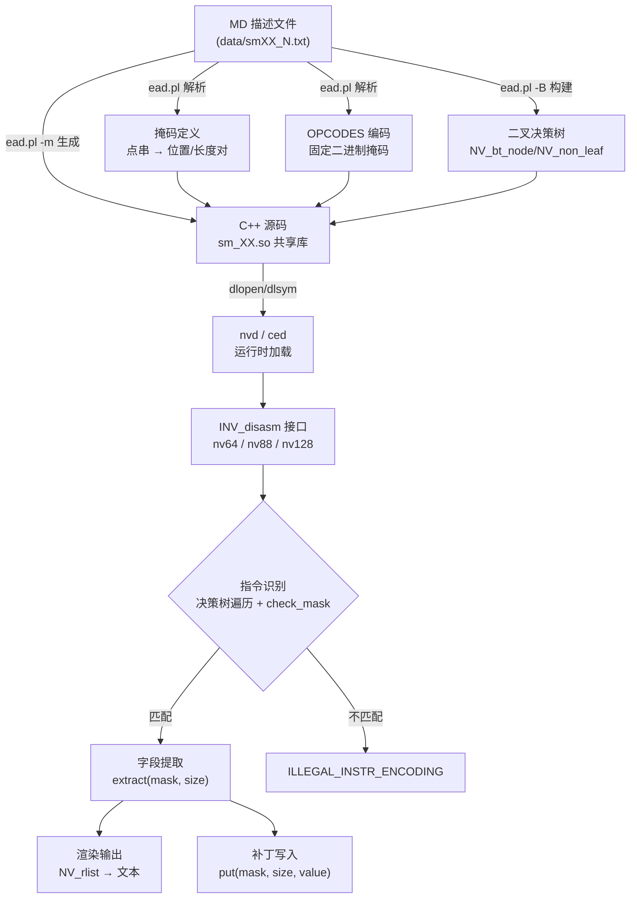

本文深入剖析 NVIDIA SASS（Streaming Assembly）指令的二进制编码结构——从**掩码（Mask）的声明格式**到**字段的提取与回写机制**，再到跨 GPU 架构的编码宽度演进。理解这些底层机制是使用 nvd 反汇编器、ced 补丁工具以及 [ina 交互式汇编器](12-ina-jiao-hu-shi-sass-hui-bian-qi-zhi-ling-biao-dan-guo-lu-yu-bian-ma) 进行底层开发的前提。

Sources: [nv_types.h](scripts/include/nv_types.h#L166-L171), [nv_rend.h](test/nv_rend.h#L311-L315)

## 架构演进与编码宽度

SASS 指令的编码宽度并非一成不变——它随 GPU 架构的迭代发生了两次关键跃迁。每次跃迁都深刻影响了字段布局、控制码存储和指令块的分组策略。

| 架构代际 | 代表 SM 版本 | 编码宽度 | 控制码结构 | 指令分组 |
|---------|------------|---------|-----------|---------|
| Fermi | sm_2 | **64 位** | 8 位嵌入 opcode | 8 条指令/块 |
| Maxwell/Pascal | sm_5x ~ sm_6x | **88 位** | 21 位 cword | 3 条指令/块 |
| Volta 及以后 | sm_70 ~ sm_120 | **128 位** | 23 位 cword | 独立编码 |

这三种宽度分别对应 C++ 解码器中的三个核心结构体：`nv64`、`nv88` 和 `nv128`，它们均继承自 `NV_base_decoder` 基类。

Sources: [nv_types.h](scripts/include/nv_types.h#L430-L546), [nv_types.h](scripts/include/nv_types.h#L548-L748), [nv_types.h](scripts/include/nv_types.h#L751-L1008)

### 编码宽度在 MD 文件中的声明

每份架构描述文件（如 `data/sm75_1.txt`）都在 `FUNIT` 节中声明其编码宽度。例如 Volta 及以后架构统一使用 128 位：

```
FUNIT uC
   ISSUE_SLOTS 0;
   ENCODING WIDTH 128;
```

而 Maxwell（sm_5x）使用 88 位，Fermi（sm_2）使用 64 位。`ead.pl` 脚本解析此声明，据此决定生成哪种解码器类型。

Sources: [sm75_1.txt](data/sm75_1.txt#L5102-L5104), [ead.pl](scripts/ead.pl#L17-L18)

## 掩码系统：从声明到解码

**掩码（Mask）** 是整个 SASS 编码系统的核心抽象——它定义了指令二进制流中哪些位属于哪个逻辑字段。掩码贯穿于指令识别、字段提取和二进制补丁三个关键流程。

### 点串掩码格式

在 MD 描述文件中，掩码以**点串（dot-string）** 形式声明。每个字符代表一个比特位，从高位（MSB）到低位（LSB）排列：

| 字符 | 含义 |
|------|------|
| `.` | 忽略位（don't care），不参与匹配 |
| `x` | 字段位（variable），用于提取或填充值 |
| `0` | 必须为 0 的固定位 |
| `1` | 必须为 1 的固定位 |

以下是 sm_75 描述文件中几个典型掩码的实例：

```
Dest    '........................................................................................................................XXXXXXXX'
Pred    '.............................................................................................................XXX................'
RegA    '................................................................................................................XXXXXXXX........'
Imm32   '............................................................................XXXXXXXXXXXXXXXXXXXXXXXXXXXXXXXX....................'
```

`Dest` 掩码中最后 8 个 `x` 表示目标寄存器占据最低 8 位；`Pred` 的 3 个 `x` 位于 bit 109~111 表示谓词寄存器索引；`Imm32` 的 32 个 `x` 则覆盖一个完整的 32 位立即数字段。

Sources: [sm75_1.txt](data/sm75_1.txt#L5109-L5117), [ead.pl](scripts/ead.pl#L496-L548)

### 掩码到位置/长度对的转换

`ead.pl` 中的 `parse_mask` 函数将点串转换为更高效的 **位置/长度对** 数组。连续的 `x` 段被记录为 `[起始位, 长度]` 对。例如 `Imm32` 的 `XXXXXXXXXXXXXXXXXXXXXXXXXXXXXXXX` 被解析为单个对 `[88, 32]`（起始位 88，长度 32 位）。

对于**不连续字段**（同义字段在二进制中被拆分到多个位置），这种表示法尤为关键。例如一个跨越 bit 2~5 和 bit 58~61 的 8 位字段会被编码为两个对：`[2, 4]` 和 `[58, 4]`。

在 C++ 运行时中，这些位置/长度对就是 `std::pair<short, short>` 数组，通过 `NV_MASK` 宏声明：

```cpp
#define NV_MASK(name, size) static const std::pair<short, short> name[size]
```

Sources: [nv_types.h](scripts/include/nv_types.h#L16), [ead.pl](scripts/ead.pl#L525-L547)

### 掩码在指令匹配中的工作原理

指令识别的核心是 `check_mask` 方法。每条指令的 `nv_instr` 结构体中保存着一个固定掩码字符串（如 `"0b1110001010"` 展开），`check_mask` 将其与当前指令二进制逐位比较：

```cpp
int check_mask(const char *mask) const {
    uint64_t m = 1L;
    for (int i = 63; i >= 0; i--) {
        if ('1' == mask[i] && !(*value & m)) return 0;  // 期望1但实际0
        if ('0' == mask[i] && (*value & m)) return 0;   // 期望0但实际1
        m <<= 1;
    }
    return 1;
}
```

这里的 `mask` 来自 OPCODES 节中的编码声明。例如 ATOM 指令的 opcode 编码为 `0b1110001010`，展开为 64 位/88 位/128 位二进制字符串后用于匹配。只有 `0` 和 `1` 字符参与比较——`.` 位被跳过。

Sources: [nv_types.h](scripts/include/nv_types.h#L441-L450), [sm75_1.txt](data/sm75_1.txt#L8675-L8678)

### 决策树加速解码

遍历所有指令逐一 `check_mask` 效率极低。`ead.pl` 的 `-B` 选项会构建一棵**二叉决策树**，运行时通过 `rec_find` 递归遍历：

```cpp
void rec_find(const NV_bt_node *curr, std::list<const nv_instr *> &res) {
    std::copy_if(curr->ins.begin(), curr->ins.end(), 
                 std::back_inserter(res),
                 [&](const nv_instr *ins){ return T::check_mask(ins->mask); });
    if (curr->is_leaf()) return;
    const NV_non_leaf *b2 = (const NV_non_leaf *)curr;
    if (T::check_bit(b2->bit())) rec_find(b2->right, res);
    else rec_find(b2->left, res);
}
```

决策树的每个非叶节点选择一个**判别位**——在该位上为 0 走左子树、为 1 走右子树——从而将搜索空间指数级压缩。

Sources: [nv_types.h](scripts/include/nv_types.h#L1348-L1357), [nv_types.h](scripts/include/nv_types.h#L287-L298), [ead.pl](scripts/ead.pl#L2393-L2440)

## 字段提取机制

一旦指令被识别，系统需要从二进制中提取各字段的值。这个过程由 `extract` 方法完成，它遍历位置/长度对，逐段拼接出完整的字段值：

```cpp
uint64_t extract(const std::pair<short, short> *mask, size_t mask_size) const {
    uint64_t res = 0L;
    for (size_t m = 0; m < mask_size; m++)
        res = (res << mask[m].second) | _extract(*value, mask[m].first, mask[m].second);
    return res;
}
```

`_extract` 是基础的位操作：`(v >> pos) & s_masks[len - 1]`，其中 `s_masks` 是预计算的 64 个单比特递增掩码（`0x1, 0x3, 0x7, ...`）。对于不连续字段，多段值通过左移拼接恢复为单一逻辑值。

Sources: [nv_types.h](scripts/include/nv_types.h#L300-L365), [nv_types.h](scripts/include/nv_types.h#L529-L535)

### 88 位与 128 位的跨段提取

对于 88 位编码（`nv88`），字段可能跨越 `value`（64 位）和 `cword`（24 位）两个存储区域。当字段的起始位 + 长度超过 64 位时，`extract` 自动切换到 `cword` 读取；如果字段恰好跨越两段边界，则逐比特处理：

```cpp
// 跨段处理逻辑（nv88::extract 简化）
if (mask[m].first + mask[m].second <= 64) {
    res = (res << len) | _extract(*value, pos, len);      // 纯 value 段
} else if (mask[m].first > 63) {
    res = (res << len) | _extract(cword, pos - 64, len);  // 纯 cword 段
} else {
    // 跨段：逐比特处理
    for (int i = 0; i < len; i++) {
        if (check_bit(pos + i)) tmp |= 1L << i;
    }
    res = (res << len) | tmp;
}
```

128 位编码（`nv128`）在支持 `__uint128_t` 的编译器上直接使用 128 位整数操作，避免了跨段拼接的复杂性。

Sources: [nv_types.h](scripts/include/nv_types.h#L727-L748), [nv_types.h](scripts/include/nv_types.h#L983-L1007)

## 字段写入与补丁机制

字段写入（`put`）是 `extract` 的逆操作——将逻辑值按掩码拆分写入指令二进制。这是 [ced 补丁工具](13-ced-lei-sed-de-cubin-nei-lian-bu-ding-gong-ju) 的核心能力。

```cpp
int put(const std::pair<short, short> *mask, size_t mask_size, uint64_t v) {
    for (int m = (int)mask_size - 1; m >= 0; --m) {
        *value = _put(v, *value, mask[m].first, mask[m].second);
        v >>= mask[m].second;
    }
    return 1;
}
```

`_put` 先清除目标位的旧值，再写入新值：`what = what & (~(s_masks[len-1] << pos)); v &= s_masks[len-1]; return what | (v << pos)`。多段掩码从**最后一段**开始逆序处理，每次右移 `v` 以消耗已写入的低位。

Sources: [nv_types.h](scripts/include/nv_types.h#L394-L398), [nv_types.h](scripts/include/nv_types.h#L536-L545)

### 三类可补丁字段

系统定义了三种粒度的可补丁字段，满足不同场景的修改需求：

| 字段类型 | C++ 结构 | 用途 |
|---------|---------|------|
| **直接字段** `NV_field` | `{name, mask, mask_size, scale}` | 单一掩码的值替换（如寄存器号） |
| **表字段** `NV_tab_fields` | `{mask, mask_size, tab, fields}` | 多字段联合查表编码（如调度控制码） |
| **Const Bank** `NV_cbank` | `{mask1, mask2, mask3, f1, f2}` | 常量存储区的复合地址编码 |

`ced_base.h` 中的 `patch` 方法封装了不同字段类型的写入逻辑，通过调用 `m_dis->put(mask, mask_size, v)` 完成实际位操作。直接字段和表字段共享同一个底层 `put`，区别在于表字段需要先通过查表验证字段组合的合法性。

Sources: [nv_types.h](scripts/include/nv_types.h#L166-L187), [ced_base.h](test/ced_base.h#L136-L163)

### ENCODING 节中的字段声明

MD 文件中每条指令的 ENCODING 节以 `BITS_N_P_L_Name=Mapping` 格式声明字段到掩码的映射。例如 ATOM 指令：

```
BITS_8_23_16_Rd=Rd;
BITS_8_31_24_Ra=*Ra;
BITS_24_63_40_Ra_offset=Ra_offset;
BITS_3_83_81_Pu=Pu;
```

其中 `BITS_N_P_L_Name` 表示：N 位宽度、从位 P 到位 L、字段名为 Name。`ead.pl` 解析这些声明，将它们转换为 `NV_field` 结构中的 `mask`（位置/长度对数组）和 `mask_size`。前缀 `*` 标记默认值（如 `*Ra` 表示 Ra 字段有默认值），`*255` 表示硬编码常量。

Sources: [sm75_1.txt](data/sm75_1.txt#L8681-L8700), [ead.pl](scripts/ead.pl#L857-L904)

## 控制码：调度与依赖屏障

控制码（Control Word）与指令操作码分离存储，承载调度信息。`render_cword` 方法将其解码为人类可读格式：

```
B--:R-:W-:Y:S0
```

格式为 `B{wait}:R{read_bar}:W{write_bar}:{yield}:S{stall}`，各字段含义：

| 字段 | 位数 | 含义 |
|------|------|------|
| Stall (S) | bit 0~3 | 发射下一条指令前的等待周期数 |
| Yield (Y) | bit 4 | 是否让出调度槽（Y=让出，-=不让出） |
| Write Barrier (W) | bit 5~7 | 写依赖屏障编号（7=未使用） |
| Read Barrier (R) | bit 8~10 | 读依赖屏障编号（7=未使用） |
| Wait (B) | bit 11~15 | 等待的屏障位掩码 |

控制码的存储方式因编码宽度而异：**64 位编码**将 7 条指令的控制码打包进一个 64 位 cqword（每条 8 位）；**88 位编码**将 3 条指令的控制码打包进一个 21 位 cqword（每条指令占 7 位）；**128 位编码**则将控制码直接嵌入 23 位 cword 中，与指令操作码连续存放。

Sources: [nv_rend.cc](test/nv_rend.cc#L385-L403), [nv_types.h](scripts/include/nv_types.h#L367-L378)

## 编码流程全景

以下流程图展示了从 MD 描述文件到运行时指令解码的完整数据流：



Sources: [nv_rend.cc](test/nv_rend.cc#L550-L573), [nv_types.h](scripts/include/nv_types.h#L1230-L1362)

## 关键数据结构一览

| 结构体 | 文件 | 职责 |
|--------|------|------|
| `nv_instr` | nv_types.h | 单条指令的完整描述：掩码、字段、属性、渲染器索引 |
| `NV_field` | nv_types.h | 可补丁字段：名称 + 掩码对 + 缩放因子 |
| `NV_tab_fields` | nv_types.h | 表驱动字段：多字段联合编码 + 查表验证 |
| `NV_cbank` | nv_types.h | 常量存储区：最多 3 组掩码 + 2 个逻辑字段 |
| `NV_extracted` | nv_types.h | `unordered_map<sv, uint64_t>`：字段名到提取值的映射 |
| `nv64` / `nv88` / `nv128` | nv_types.h | 架构相关的二进制解码器 |
| `NV_disasm<T>` | nv_types.h | 模板化的反汇编器，组合解码器与决策树 |

Sources: [nv_types.h](scripts/include/nv_types.h#L166-L285), [nv_types.h](scripts/include/nv_types.h#L1230-L1242)

## 延伸阅读

- **[SASS 指令描述文件格式与架构数据目录](5-sass-zhi-ling-miao-shu-wen-jian-ge-shi-yu-jia-gou-shu-ju-mu-lu-data-data11-data12)**：了解 MD 描述文件的完整格式
- **[ead.pl 指令编码生成器](6-ead-pl-zhi-ling-bian-ma-sheng-cheng-qi-cong-miao-shu-wen-jian-dao-sm_xx-so-gong-xiang-ku)**：深入掩码解析和 C++ 代码生成逻辑
- **[延迟调度表分析与指令谓词系统](10-yan-chi-diao-du-biao-fen-xi-yu-zhi-ling-wei-ci-xi-tong)**：控制码中的调度信息如何影响指令执行时序
- **[ced 类 sed 的 Cubin 内联补丁工具](13-ced-lei-sed-de-cubin-nei-lian-bu-ding-gong-ju)**：基于字段补丁机制的实际应用